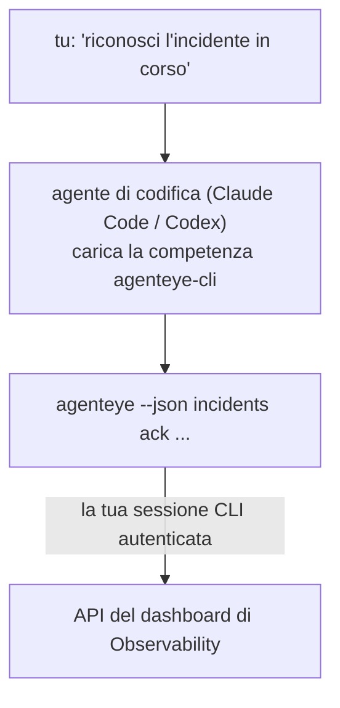

---
---
title: "Competenza CLI Agent per Failproof AI Observability"
description: "Chiedi al tuo agente di codifica \"c'è qualcosa di rotto oggi?\" e lascia che risponda dai tuoi dati live di Failproof AI Observability, senza comandi da memorizzare."
---


Chiedi al tuo agente di codifica *"c'è qualcosa di rotto oggi?"* e lascia che risponda dai tuoi dati live di Failproof AI Observability, senza comandi da memorizzare. La **competenza CLI Failproof AI Observability** (`agenteye-cli`) è un *Agent Skill*: una piccola cartella di istruzioni che un agente di codifica come Claude Code o Codex carica on demand. Insegna all'agente a gestire il tuo deployment di Observability tramite la [`agenteye` CLI](/it/agenteye/cli) a partire da richieste in inglese naturale come *"fornisci a CI una chiave che può solo pushare eventi"* o *"riconosci l'incidente in corso e assegnalo a me."*

**Non** è un servizio o un binario separato; non c'è nulla da deployare. Funziona su top della CLI che hai già installato: l'agente esegue `agenteye --json …`, analizza il JSON pulito, e ti risponde in prosa. Tutto ciò che può fare, potresti farlo tu stesso digitando gli stessi comandi.

---

## Come si relaziona alle altre interfacce di Failproof AI Observability

Failproof AI Observability ti fornisce quattro modi per raggiungere gli stessi dati e controlli. Si completano a vicenda:

| Interfaccia | Cos'è | Dove viene eseguita | Usala quando |
|---|---|---|---|
| **[CLI](/it/agenteye/cli)** | Il riferimento comando/flag per `agenteye` | Il tuo terminale | Vuoi eseguire o scriptare un comando specifico |
| **[CLI recipes](/it/agenteye/cli-recipes)** | Pattern `jq`/pipeline copia-incolla | Il tuo terminale / script | Stai integrando la CLI nell'automazione |
| **CLI skill** (questo doc) | Una porta d'accesso in linguaggio naturale alla CLI | Il tuo agente di codifica, sulla tua workstation | Vuoi semplicemente chiedere e lasciare che l'agente scelga il comando |
| **[Evaluator skill](/it/agenteye/evaluator-skill)** | Una competenza gemella che progetta e costruisce il tuo servizio di scoring | Il tuo agente di codifica, sulla tua workstation | Vuoi *produrre* punteggi di valutazione piuttosto che leggerli |
| **[Python SDK skill](/it/agenteye/python-sdk-skill)** | Una competenza gemella che strumenta il tuo agente in modo che emetta telemetria in primo luogo | Il tuo agente di codifica, sulla tua workstation | Vuoi che il tuo agente *produca* gli eventi che questa competenza legge |
| **[Assistente AI in-dashboard](/it/agenteye/assistant)** | Una chat incorporata nel dashboard | Sul server (nel dashboard) | Vuoi Q&A in-dashboard sui tuoi dati |

La competenza stessa non ha privilegi propri; trasforma semplicemente le tue parole in chiamate CLI che vengono eseguite come te:



### vs. l'assistente AI in-dashboard: una distinzione importante

Questi sono due strumenti diversi con raggi d'azione molto diversi:

- L'**assistente AI in-dashboard** ([AI assistant](/it/agenteye/assistant)) è una chat incorporata nel dashboard, supportata dal servizio agente. È **sola lettura più authoring con gate di approvazione**: può redigere query salvate e dashboard, ma ogni scrittura si ferma per la tua approvazione esplicita con click, e non elimina mai. È sottoposta a gate dal permesso `agent:use` e vede solo i dati dell'organizzazione che stai visualizzando.
- La **competenza CLI** viene eseguita sulla *tua* workstation dentro il *tuo* agente di codifica e pilota la `agenteye` CLI come **te**. Può eseguire la **superficie completa della CLI, incluse le mutazioni** (create/rotate/disable chiavi API, cambia impostazioni org, risolvi incidenti, elimina query salvate), limitato solo dai permessi del tuo login CLI. Trattalo esattamente come faresti con l'esecuzione di quei comandi a mano.

---

## Prerequisiti

1. La **`agenteye` CLI installata** e su `PATH` (vedi il riferimento [CLI](/it/agenteye/cli): `pipx install agenteye`).
2. L'**URL del tuo dashboard** impostato (`AGENTEYE_DASHBOARD_URL`, o l'agente passa `--base-url`).
3. Una **sessione loggata**: esegui `agenteye login` tu stesso per primo. La competenza **non può** completare il login con codice monouso inviato per te; ti dirà di eseguire `agenteye login` se la sessione è mancante o scaduta (codice di uscita CLI `4`).

---

## Dove ottenerlo

La competenza è pubblicata nella collezione di competenze pubbliche di Failproof AI:

**[github.com/FailproofAI/skills](https://github.com/FailproofAI/skills)** → [`skills/agenteye-cli/`](https://github.com/FailproofAI/skills/tree/main/skills/agenteye-cli)

Nulla è gated — il repository è pubblico e la competenza non ha bisogno di credenziali proprie, perché pilota solo la `agenteye` CLI **pubblica** contro il *tuo* dashboard, usando la sessione in cui *tu* ti sei loggato. Non devi chiedere a nessuno.

Nota che viene distribuita come sua propria cartella e **non** è dentro il pacchetto `pipx install agenteye`, quindi non cercarla lì.

## Installazione della competenza

Il percorso più veloce è la CLI [`skills`](https://skills.sh), che recupera la cartella e la mette dove il tuo agente la cerca:

```bash
# Claude Code, solo questo progetto
npx skills add FailproofAI/skills --skill agenteye-cli -a claude-code

# ogni progetto (installa in ~/.claude/skills/)
npx skills add FailproofAI/skills --skill agenteye-cli -a claude-code -g --copy

# Codex invece
npx skills add FailproofAI/skills --skill agenteye-cli -a codex
```

Poi gestiscila come qualsiasi altra competenza:

```bash
npx skills list -a claude-code      # cosa è installato
npx skills update agenteye-cli      # tira l'ultima versione
npx skills remove agenteye-cli      # rimuovila
```

Preferisci installarla a mano? Un Agent Skill è solo una cartella contenente un `SKILL.md` (più riferimenti opzionali), quindi anche copiarla funziona:

- **Claude Code**: metti la cartella `agenteye-cli/` in `~/.claude/skills/` (ogni progetto) o `<your-repo>/.claude/skills/` (solo quel repo). Claude Code la auto-scopre — verifica con l'elenco `/skills`, o semplicemente fai una domanda che corrisponda alla sua descrizione.
- **Codex (OpenAI)**: Codex legge lo stesso `SKILL.md`. Il `agents/openai.yaml` bundled imposta `allow_implicit_invocation: true`, quindi Codex auto-seleziona la competenza quando un compito corrisponde; altrimenti invocala esplicitamente come `$agenteye-cli`.

---

## Sicurezza: le mutazioni NON richiedono un prompt quando un agente esegue la CLI

> **Avvertimento:** Leggi questo prima di permettere a un agente di fare modifiche.

La `agenteye` CLI normalmente chiede *"sei sicuro?"* prima di un'azione distruttiva. **Auto-salta quella conferma ogni volta che non è attaccata a un terminale (che è esattamente come un agente di codifica la esegue), e `--json` lo salta anch'esso.** Quindi il prompt di sicurezza **non** si attiverà per l'agente.

La competenza è scritta per compensare: è istruita di dichiarare il comando esatto che eseguirà e ottenere il tuo esplicito **OK prima di qualsiasi cambio di stato**. Mantieni questa disciplina. Quando piloti Failproof AI Observability attraverso un agente, *tu* sei il passo di conferma. I comandi che cambiano stato da controllare:

- `keys create` / `update` / `disable` / `regenerate`
- `users create` / `update` / `disable` / `enable`
- `settings set`
- `alerts create` / `update` / `delete` / `test`
- i sottocomandi di scrittura `incidents`: `ack` / `assign` / `resolve` / `open` / `comment-add` / `comment-delete` / `subscribe` / `unsubscribe`
- `query create` / `update` / `delete`
- `agent rename` / `delete`
- `orgs switch`

Tutto sotto **Observe** (`events`, `sessions`, `evals`, `errors`, `list`, `whoami`, `orgs list/current/perms`) è sola lettura e non cambia nulla.

Poiché l'agente agisce come **te**, può solo fare ciò che il tuo login è autorizzato a fare; i permessi vengono risolti **per org** (vedi [API keys](/it/agenteye/api-keys)). Un comando per cui manca il permesso restituisce codice di uscita `5` con il permesso esatto nominato, così l'agente può dirti precisamente cosa chiedere a un amministratore piuttosto che fallire opacamente.

---

## Cosa puoi chiedergli

Ecco come appare un vero percorso round-trip, una lettura, poi un cambio che attende il tuo OK:

```text
tu    ▸ C'è qualcosa di rotto nell'ultimo giorno?

agente ▸ Esecuzione: agenteye --json errors --since 24h --aggregate
        3 tipi di errore nelle ultime 24h. Il più grande è TimeoutError
        (18 hit, tutti su checkout-agent), poi RateLimited (5).
        Vuoi le sessioni fallite per TimeoutError?

tu    ▸ Fornisci a CI una chiave che può solo pushare eventi.

agente ▸ Questo crea una chiave API. Eseguirò:
          agenteye keys create ci --add events:add
        OK per procedere?

tu    ▸ sì

agente ▸ Fatto. Chiave "ci" creata con solo events:add.
        Il segreto è mostrato solo una volta, quindi salvalo ora. Non posso ristamparlo.
```

La competenza mappa ogni intenzione in linguaggio naturale al comando `agenteye` corretto, scoprendo prima i valori validi (`list <kind>`, `whoami`) così non indovina, e dichiarando il comando esatto prima di qualsiasi cambio. Più esempi:

- *"C'è qualcosa di rotto / fallito nelle ultime 24 ore?"* → `errors --since 24h --aggregate`, poi una ripartizione.
- *"Perché la sessione `run-001` ha fallito?"* → `events --session-id run-001 --all` + `evals --session-id run-001`.
- *"Come sta andando la qualità questa settimana?"* → `evals --aggregate --since 7d`, poi approfondisci le esecuzioni con punteggio basso.
- *"Fornisci a CI una chiave che può solo pushare eventi."* → `keys create ci --add events:add` (dichiara il comando, poi lo crea e cattura il segreto monouso).
- *"Chi ha accesso? Rendi Dana sola lettura."* → `users list` → `users update dana@… --permission-set read-only` (dopo conferma con te).
- *"Riconosci l'incidente in corso e assegnalo a me."* → `incidents list --state firing` → `incidents ack <id>` / `incidents assign <id> you@…`.

Per i comandi esatti, i flag, e le forme JSON dietro questi, vedi il riferimento [CLI](/it/agenteye/cli) e le [CLI recipes per agenti](/it/agenteye/cli-recipes).

---

## Passaggi successivi

- **[CLI](/it/agenteye/cli)**: riferimento completo di comando e flag per `agenteye`.
- **[CLI recipes per agenti](/it/agenteye/cli-recipes)**: pattern `jq` copia-incolla e gestione codici di uscita.
- **[Evaluator agent skill](/it/agenteye/evaluator-skill)**: la competenza gemella, per costruire l'evaluator i cui punteggi `agenteye evals` legge.
- **[Python SDK agent skill](/it/agenteye/python-sdk-skill)**: la competenza gemella, per strumentare un agente in modo che emetta la telemetria che `agenteye` legge.
- **[AI assistant](/it/agenteye/assistant)**: l'assistente in-dashboard (da non confondere con questa competenza di terminale).
- **[API keys](/it/agenteye/api-keys)**: il modello di permesso per org che limita ciò che la competenza può fare.