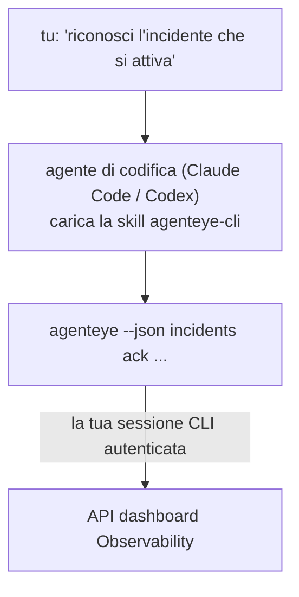

Chiedi al tuo agente di codifica *"c'è qualcosa di rotto oggi?"* e lascia che ti risponda dai tuoi dati FailproofAI Observability in tempo reale, senza comandi da memorizzare. La **FailproofAI Observability CLI skill** (`agenteye-cli`) è un *Agent Skill*: una piccola cartella di istruzioni che un agente di codifica come Claude Code o Codex carica su richiesta. Insegna all'agente come operare il tuo deployment di Observability attraverso la [`agenteye` CLI](/it/agenteye/cli) da richieste in inglese naturale come *"dai a CI una chiave che può solo spingere eventi"* o *"riconosci l'incidente che si sta attivando e assegnalo a me."*

**Non** è un servizio o un binario separato; non c'è nulla da distribuire. Funziona sulla CLI che hai già installato: l'agente esegue `agenteye --json …`, analizza il JSON pulito e ti risponde in prosa. Tutto quello che può fare, potresti farlo tu stesso digitando gli stessi comandi.

---

## Come si relaziona alle altre interfacce di FailproofAI Observability

FailproofAI Observability ti offre quattro modi per raggiungere gli stessi dati e controlli. Si complementano a vicenda:

| Interfaccia | Cos'è | Dove viene eseguita | Usala quando |
|---|---|---|---|
| **[CLI](/it/agenteye/cli)** | Il riferimento comando/flag per `agenteye` | Il tuo terminale | Vuoi eseguire o scrivere uno script di un comando specifico |
| **[Ricette CLI](/it/agenteye/cli-recipes)** | Pattern `jq`/pipeline copia-incolla | Il tuo terminale / script | Stai integrando la CLI nell'automazione |
| **CLI skill** (questo documento) | Una porta d'accesso in linguaggio naturale alla CLI | Il tuo agente di codifica, sulla tua workstation | Vuoi semplicemente chiedere e lasciare che l'agente scelga il comando |
| **[Assistente AI nella dashboard](/it/agenteye/assistant)** | Una chat integrata nella dashboard | Lato server (nella dashboard) | Vuoi domande e risposte nella dashboard sui tuoi dati |

La skill stessa non ha privilegi propri; trasforma semplicemente le tue parole in chiamate CLI che vengono eseguite come te:



### vs. l'assistente AI nella dashboard: una distinzione importante

Si tratta di due strumenti diversi con raggi di azione molto diversi:

- L'**assistente AI nella dashboard** ([AI assistant](/it/agenteye/assistant)) è una chat integrata nella dashboard, supportata dal servizio dell'agente. È **read-only più creazione controllata dall'approvazione**: può elaborare query salvate e dashboard, ma ogni scrittura si mette in pausa per il tuo esplicito click di approvazione e non elimina mai. È limitata dalla permission `agent:use` e vede solo i dati per l'organizzazione che stai visualizzando.
- La **CLI skill** viene eseguita sulla *tua* workstation dentro il *tuo* agente di codifica e guida la `agenteye` CLI come **tu**. Può eseguire la **intera superficie della CLI, incluse le mutazioni** (creare/ruotare/disabilitare chiavi API, modificare le impostazioni dell'org, risolvere incidenti, eliminare query salvate), limitata solo dai permessi del tuo login CLI. Trattala esattamente come tratteresti l'esecuzione di quei comandi manualmente.

---

## Prerequisiti

1. La **`agenteye` CLI installata** e su `PATH` (vedi il [riferimento CLI](/it/agenteye/cli): `pipx install agenteye`).
2. Il tuo **URL della dashboard** impostato (`AGENTEYE_DASHBOARD_URL`, oppure l'agente passa `--base-url`).
3. Una **sessione autenticata**: esegui `agenteye login` tu stesso prima. La skill **non può** completare il login con codice monouso inviato per email; ti dirà di eseguire `agenteye login` se la sessione è mancante o scaduta (codice di uscita CLI `4`).

---

## Installazione della skill

Agent Skills sono cartelle che contengono un `SKILL.md` (più riferimenti opzionali). Installi la skill `agenteye-cli` posizionando la sua cartella dove il tuo agente cerca le skill:

- **Claude Code**: copia la cartella `agenteye-cli/` in `~/.claude/skills/` (disponibile in ogni progetto) o in `<tuo-repo>/.claude/skills/` (limitato a quel repo). Claude Code la scopre automaticamente; verifica con l'elenco `/skills`, o semplicemente fai una domanda che corrisponda alla sua descrizione.
- **Codex (OpenAI)**: Codex legge lo stesso `SKILL.md`. Il `agents/openai.yaml` in bundle imposta `allow_implicit_invocation: true`, quindi Codex seleziona automaticamente la skill quando un'attività corrisponde; altrimenti invocala esplicitamente come `$agenteye-cli`.

La skill viene mantenuta insieme alla CLI `agenteye` ma viene distribuita come **cartella separata**, non dentro il pacchetto `pipx install agenteye`, quindi non cercarla lì. FailproofAI Observability ti fornisce la cartella `agenteye-cli/` autonomamente; se non ce l'hai, contatta il tuo referente FailproofAI. Nulla in essa è protetto: non ha bisogno di alcuna credenziale, perché guida solo la CLI `agenteye` **pubblica** contro la tua dashboard.

---

## Sicurezza: le mutazioni NON richiedono conferma quando un agente esegue la CLI

> **Avviso:** Leggi questo prima di lasciare che un agente faccia modifiche.

La CLI `agenteye` normalmente chiede *"sei sicuro?"* prima di un'azione distruttiva. **Salta automaticamente quella conferma ogni volta che non è collegata a un terminale (che è esattamente come un agente di codifica la esegue), e `--json` la salta comunque.** Quindi il prompt di sicurezza **non** si attiverà per l'agente.

La skill è scritta per compensare: è istruita a dichiarare il comando esatto che eseguirà e ottenere il tuo esplicito **OK prima di qualsiasi cambiamento di stato**. Mantieni questa disciplina. Quando guidi FailproofAI Observability attraverso un agente, *tu* sei il passo di conferma. I comandi che cambiano lo stato da tenere d'occhio:

- `keys create` / `update` / `disable` / `regenerate`
- `users create` / `update` / `disable` / `enable`
- `settings set`
- `alerts create` / `update` / `delete` / `test`
- i sottocomandi di scrittura di `incidents`: `ack` / `assign` / `resolve` / `open` / `comment-add` / `comment-delete` / `subscribe` / `unsubscribe`
- `query create` / `update` / `delete`
- `agent rename` / `delete`
- `orgs switch`

Tutto sotto **Observe** (`events`, `sessions`, `evals`, `errors`, `list`, `whoami`, `orgs list/current/perms`) è read-only e non cambia nulla.

Poiché l'agente agisce come **tu**, può fare solo ciò che il tuo login è autorizzato a fare; i permessi vengono risolti **per org** (vedi [Chiavi API](/it/agenteye/api-keys)). Un comando per cui manca il permesso restituisce il codice di uscita `5` con il permesso esatto denominato, quindi l'agente può dirti precisamente cosa chiedere a un amministratore invece di fallire in modo opaco.

---

## Quello che puoi chiedere

Ecco come appare un vero round-trip, una lettura, poi un cambiamento che attende il tuo OK:

```text
tu    ▸ C'è qualcosa di rotto nell'ultimo giorno?

agente ▸ In esecuzione: agenteye --json errors --since 24h --aggregate
        3 tipi di errori negli ultimi 24 ore. Il più grande è TimeoutError
        (18 hit, tutti su checkout-agent), poi RateLimited (5).
        Vuoi le sessioni fallite per TimeoutError?

tu    ▸ Dai a CI una chiave che può solo spingere eventi.

agente ▸ Questo crea una chiave API. Eseguirò:
          agenteye keys create ci --add events:add
        OK per procedere?

tu    ▸ sì

agente ▸ Fatto. Chiave "ci" creata con solo events:add.
        Il segreto viene mostrato solo una volta, quindi salvalo ora. Non posso ristamparlo.
```

La skill mappa ogni intento in linguaggio naturale al giusto comando `agenteye`, scoprendo prima i valori validi (`list <kind>`, `whoami`) così non indovina, e dichiarando il comando esatto prima di qualsiasi cambiamento. Altri esempi:

- *"C'è qualcosa di rotto / che fallisce nelle ultime 24 ore?"* → `errors --since 24h --aggregate`, poi una scomposizione.
- *"Perché la sessione `run-001` è fallita?"* → `events --session-id run-001 --all` + `evals --session-id run-001`.
- *"Come sta trending la qualità questa settimana?"* → `evals --aggregate --since 7d`, poi approfondisci le run con punteggio basso.
- *"Dai a CI una chiave che può solo spingere eventi."* → `keys create ci --add events:add` (dichiara il comando, poi lo crea e cattura il segreto monouso).
- *"Chi ha accesso? Rendi Dana read-only."* → `users list` → `users update dana@… --permission-set read-only` (dopo aver confermato con te).
- *"Riconosci l'incidente che si sta attivando e assegnalo a me."* → `incidents list --state firing` → `incidents ack <id>` / `incidents assign <id> you@…`.

Per i comandi esatti, i flag e le forme JSON dietro questi, vedi il [riferimento CLI](/it/agenteye/cli) e le [ricette CLI per agenti](/it/agenteye/cli-recipes).

---

## Prossimi passi

- **[CLI](/it/agenteye/cli)**: riferimento completo per comandi e flag per `agenteye`.
- **[Ricette CLI per agenti](/it/agenteye/cli-recipes)**: pattern `jq` copia-incolla e gestione codici di uscita.
- **[Assistente AI](/it/agenteye/assistant)**: l'assistente nella dashboard (da non confondere con questa skill del terminale).
- **[Chiavi API](/it/agenteye/api-keys)**: il modello di permission per-org che limita quello che la skill può fare.