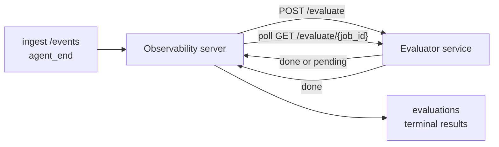

---
---
title: "Suite di Valutazione"
description: "Failproof AI Observability può valutare automaticamente ogni esecuzione dell'agente completata in termini di qualità: tu fornisci un piccolo servizio di scoring, e Observability fa il resto."
---


Failproof AI Observability può valutare automaticamente ogni esecuzione dell'agente completata in termini di qualità: tu fornisci un piccolo servizio di scoring, e Observability fa il resto. Usalo per tracciare le dimensioni che ti interessano (utilità, efficienza degli strumenti, fattualità, sicurezza; tu scegli), individuare regressioni in anticipo e confrontare agenti o ambienti a colpo d'occhio. Lo scoring è opzionale: la pipeline non fa nulla finché non imposti `EVALUATOR_ENDPOINT` sul server.

> **Nota:** Tu definisci le dimensioni del punteggio. Il tuo evaluator può restituire qualsiasi chiave numerica desideri; Observability archivia, tende e visualizza tutto ciò che invii indietro.

## A colpo d'occhio

1. **Scrivi uno scorer.** Configura un piccolo servizio HTTP che legge una trascrizione della sessione e restituisce i punteggi. Observability include un reference funzionante che puoi copiare. Vedi [Scrivere un evaluator con l'SDK](#writing-an-evaluator-with-the-sdk).
2. **Punta Observability ad esso.** Imposta `EVALUATOR_ENDPOINT` (e un `EVALUATOR_TOKEN` condiviso) sul processo server.
3. **Guarda i punteggi arrivare.** Ogni sessione completata viene automaticamente valutata; i risultati appaiono nella pagina dei dettagli della sessione, nella griglia delle sessioni e nei dashboard salvati.


*Una volta configurato un evaluator, ogni esecuzione completata viene valutata e i risultati appaiono nella barra laterale destra della sessione: il riepilogo in alto, quindi barre dei punteggi per dimensione con ragionamento.*

---

## Come funziona



Quando l'SDK di Observability emette un evento `agent_end` per una sessione, il server
pianifica una valutazione. Quindi invia in POST la trascrizione dell'evento completo al tuo
servizio evaluator, che può:

- **Restituire il risultato inline** con `{"status":"done", "scores":{...}, "reasoning":{...}, "summary":"..."}`. Il
  risultato viene aggiunto alla timeline di valutazione della sessione. `reasoning` e
  `summary` sono facoltativi.
- **Rinviare** con `{"status":"pending", "job_id":"abc-123"}`. Observability quindi
  chiama `GET {EVALUATOR_ENDPOINT}/evaluate/abc-123` finché il tuo evaluator non
  restituisce `{"status":"done", ...}` o `{"status":"error", "error":"..."}`.

  La cadenza di polling è per lavoro: una risposta `pending` può includere
  `next_poll_secs` per sovrascrivere; altrimenti Observability utilizza il
  valore `default_poll_interval_secs` da `GET /config`; altrimenti il server
  ricade su `EVALUATOR_POLLING_INTERVAL_SECS` (predefinito 10s). Tutti i valori
  sono limitati a [1s, 1h].

Le sessioni che non emettono mai `agent_end` (ad esempio, un processo di agente arrestato in modo anomalo)
possono anche essere acquisite: il `GET /config` dell'evaluator può restituire
`{"inactivity_timeout_secs": 1800}`, e Observability valuterà qualsiasi sessione
che sia rimasta inattiva per quel lasso di tempo. Imposta il campo su `null` o omettilo per
disabilitare questo fallback.

La pipeline è completamente no-op quando `EVALUATOR_ENDPOINT` non è impostato.

Una sessione può accumulare **più valutazioni terminali nel tempo**: ogni
evento `agent_end` (e ogni re-eval manuale dal dashboard) aggiunge una
nuova riga di valutazione. Questo è il modo supportato per valutare una conversazione
ripresa: un utente termina un agente, torna più tardi, invia altri eventi,
termina di nuovo l'agente, e una seconda valutazione viene eseguita sulla trascrizione completa aggiornata. Il dashboard visualizza la valutazione più recente come titolo
e le valutazioni precedenti come timeline comprimibile. Mentre una valutazione è in esecuzione per una sessione, gli eventi `agent_end` aggiuntivi per quella sessione vengono ignorati; il prossimo dopo il completamento della valutazione in esecuzione
metterà in coda una nuova valutazione come al solito.

Il fallback di inattività si riattiva anche nelle sessioni riprese: se arrivano nuovi eventi dopo una precedente valutazione terminale e la sessione quindi diventa inattiva oltre `inactivity_timeout_secs`, una nuova valutazione viene accodata.

I guasti transitori (5xx, 429, timeout, errori di rete) vengono ritentati con
backoff esponenziale fino a `EVALUATOR_MAX_ATTEMPTS`; le risposte 4xx sono
terminali. Observability è sicuro da eseguire con più istanze server scalate orizzontalmente; il lavoro viene partizionato affinché la stessa sessione non venga mai
inviata due volte contemporaneamente.

---

## Contratto HTTP

Ogni percorso autenticato utilizza **autenticazione bearer token**. Lo stesso valore deve essere
configurato su entrambi i lati:

- Server Observability: variabile d'ambiente `EVALUATOR_TOKEN`
- Servizio evaluator: configurato allo stesso modo (l'SDK `agenteye-evaluator` 
  legge `EVALUATOR_TOKEN` per convenzione)

Se `EVALUATOR_TOKEN` non è impostato, il server non invia alcun header `Authorization`; l'evaluator
può quindi accettare richieste anonime, il che va bene per una rete solo interna ma è sconsigliato su internet pubblico.

### Percorsi che l'evaluator deve servire

| Percorso | Corpo / parametri | Risposta |
|---|---|---|
| `GET /health` | nessuno | `{"status":"ok"}` (aperto, senza auth) |
| `GET /config` | nessuno | `{"inactivity_timeout_secs": <int> \| null, "default_poll_interval_secs": <int> \| omesso}` |
| `POST /evaluate` | JSON `EvalRequest` | `{"status":"done", ...}` o `{"status":"pending", "job_id":"..."}` |
| `GET /evaluate/{id}` | nessuno | stessa forma di risposta di `/evaluate` |

### Corpo `EvalRequest` inviato dal server

```json
{
  "schema_version": "1",
  "session_id":     "session-abc123",
  "agent_id":       "planner",
  "environment":    "production",
  "started_at":     "2026-05-10T12:00:00Z",
  "ended_at":       "2026-05-10T12:05:00Z",
  "events": [
    { "id": 1234, "ts": "...", "event_type": "agent_start", "payload": { ... } },
    ...
  ]
}
```

### Forme di risposta

**Sincrono (done):**

```json
{
  "status": "done",
  "scores": { "helpfulness": 0.85, "tool_efficiency": 0.6 },
  "reasoning": {
    "helpfulness": "answered the question directly with citations",
    "tool_efficiency": "called list_files three times when one would have done"
  },
  "summary": "strong answer quality, weak tool selection"
}
```

`reasoning` (una mappa di giustificazione per punteggio) e `summary` (una
narrazione complessiva di un paragrafo) sono entrambi facoltativi. Le chiavi in `reasoning` dovrebbero
corrispondere alle chiavi in `scores`; il dashboard visualizza ogni voce inline sotto
la relativa barra del punteggio. Gli evaluator più vecchi che restituiscono solo `scores` continuano a
funzionare invariati; `reasoning` e `summary` semplicemente si leggono come null e
le corrispondenti affordance dell'interfaccia utente sono omesse.

**Asincrono (rinviato):**

```json
{ "status": "pending", "job_id": "abc-123", "next_poll_secs": 30 }
```

`next_poll_secs` è facoltativo; se omesso il server ricade al
`default_poll_interval_secs` dell'evaluator da `/config`, quindi alla propria
variabile d'ambiente `EVALUATOR_POLLING_INTERVAL_SECS`.

**Errore terminale lato evaluator:**

```json
{ "status": "error", "error": "model service unavailable" }
```

Il server tratta qualsiasi altro corpo 2xx come errore di protocollo e registra un
`error` terminale per la sessione.

---

## Scrivere un evaluator con l'SDK

Non devi implementare il contratto HTTP manualmente. Il pacchetto Python `agenteye-evaluator`
ti offre un wrapper FastAPI tipizzato che gestisce l'autenticazione, l'instradamento e
le forme di richiesta/risposta per te.

Failproof AI Observability fornisce anche un **evaluator reference funzionante** che
valuta `helpfulness`, `tool_efficiency` e `factuality` dalla forma della
trascrizione. Copialo come punto di partenza e scambia la tua logica: un
giudice LLM, un motore di regole, quello che si adatta al tuo standard di qualità.

Evaluator minimale praticabile:

```python
import os
from agenteye_evaluator import Evaluator, EvalRequest, EvalResponse

app = Evaluator(token=os.environ["EVALUATOR_TOKEN"])

@app.evaluator
def run(req: EvalRequest) -> EvalResponse:
    # Inspect req.events (the full session transcript) and return scores.
    tool_calls = sum(1 for e in req.events if e.event_type == "tool_use")
    return EvalResponse(
        scores={"tool_calls": float(tool_calls)},
        reasoning={"tool_calls": f"{tool_calls} tool invocations in the transcript"},
        summary="tight tool loop" if tool_calls < 5 else "agent looped on tools",
    )
```

L'istanza `app` viene eseguita su qualsiasi server ASGI, quindi `uvicorn module:app` la avvia.

Per gli evaluator che hanno bisogno di rinviare il lavoro costoso, restituisci `JobPending`
invece e registra un handler `@app.job_lookup`; il server Observability
sonda `GET /evaluate/{job_id}` finché non restituisci uno stato terminale o il
limite `EVALUATOR_MAX_POLL_DURATION_SECS` (predefinito 1 h) scade.

L'API reference completa, il pattern asincrono e lo schema degli eventi sono documentati nel
README dell'SDK `agenteye-evaluator`.

---

## Esecuzione dell'evaluator

L'evaluator è **il tuo servizio** — Failproof AI Observability non fornisce
un evaluator predefinito, quindi lo costruisci ed esegui dove esegui i tuoi servizi.
Funziona su qualsiasi server ASGI (ad esempio `uvicorn my_evaluator:app`); servi
i percorsi `/health`, `/config` e `/evaluate` dal
[contratto HTTP](#http-contract), quindi punta il server ad esso (vedi
[Configurazione del server](#configuring-the-server)).

Una volta che l'evaluator è raggiungibile, `GET /health` restituisce `{"status":"ok"}`. Dopo
che un agente viene eseguito end-to-end, `GET /evaluations` sul server restituisce una riga con
`status: "done"` e i punteggi prodotti dal tuo evaluator.

---

## Configurazione del server

Imposta sul processo server:

| Variabile d'ambiente | Significato |
|---|---|
| `EVALUATOR_ENDPOINT` | URL di base del tuo evaluator (`http://evaluator:9000`). Non impostato = pipeline disabilitata. |
| `EVALUATOR_TOKEN` | Bearer token. Deve corrispondere al valore configurato nel servizio evaluator. |
| `EVALUATOR_WORKERS` | Attività worker per istanza server (predefinito 2). |
| `EVALUATOR_CLAIM_BATCH` | Righe rivendicate per tick worker (predefinito 4). I batch vengono elaborati **concorrentemente**; la concorrenza effettiva sull'endpoint evaluator è `EVALUATOR_WORKERS × EVALUATOR_CLAIM_BATCH`. |
| `EVALUATOR_POLL_IDLE_SECS` | Quanto a lungo un worker dorme tra i tentativi di invio quando nessuna valutazione è dovuta (predefinito 2s). |
| `EVALUATOR_POLLING_INTERVAL_SECS` | Fallback finale per la cadenza `GET /evaluate/{id}` quando né `next_poll_secs` per risposta né `default_poll_interval_secs` dell'evaluator sono impostati (predefinito 10s). |
| `EVALUATOR_REQUEST_TIMEOUT_MS` | Timeout per richiesta (predefinito 30000). |
| `EVALUATOR_MAX_ATTEMPTS` | Dopo questo numero di guasti transitori il risultato viene registrato come `error` terminale (predefinito 5). |
| `EVALUATOR_CONFIG_REFRESH_SECS` | Cadenza `GET /config` (predefinito 300). |
| `EVALUATOR_MAX_POLL_DURATION_SECS` | Tempo massimo in cui una sessione può rimanere nella coda di polling prima di essere terminata come `timeout` (predefinito 3600s). Protegge contro un evaluator che continua a restituire `pending` per sempre. |

Per attivare lo scoring automatico, imposta sia `EVALUATOR_ENDPOINT` che
`EVALUATOR_TOKEN` sul server, quindi riavvialo per applicare la modifica. Con
`EVALUATOR_ENDPOINT` non impostato la pipeline rimane no-op.

I parametri di sintonizzazione sopra sono facoltativi; imposta le corrispondenti variabili d'ambiente
sul server solo se hai bisogno di sovrascrivere i valori predefiniti.

---

## Riferimento API

| Metodo | Percorso | Autorizzazione richiesta | Scopo |
|---|---|---|---|
| `GET` | `/evaluations` | `evaluations:read` | Interrogare i risultati terminali. Supporta `session_id`, `agent_id`, `environment`, `status` (`done`/`error`/`timeout`), `ts_from`, `ts_to`, `cursor`, `limit`, `score_filters`, `latest_per_session`. `limit` predefinito a 50 e è limitato a 200 (nota che differisce da `/events`, che limita a 1000). `environment` accetta un elenco separato da virgole (ad es. `environment=prod,staging`); i singoli valori funzionano ancora. Con `latest_per_session=true` la risposta contiene al massimo una riga per `session_id` (la più recente per `completed_at`) utilizzata dalla pagina dell'elenco delle sessioni per comprimere la timeline di valutazione di una sessione al suo titolo attuale. Predefinito a false (restituisce la cronologia completa). |
| `GET` | `/evaluations/aggregate` | `evaluations:read` | Salute della valutazione aggregata per una sezione filtrata: conteggio totale, suddivisione done/error/timeout, statistiche per chiave di punteggio (count/avg/min/max/p50 su chiavi `scores` arbitrarie) e timeline con bucket temporale. Accetta **gli stessi parametri di filtro di `/evaluations`** più `featured_keys` (CSV di chiavi di punteggio da tracciare) e `latest_per_session`. Potenzia la funzione Dashboard; le metriche sono esatte sul set corrispondente intero, non campionate. |
| `GET` | `/evaluations/environments` | `evaluations:read` | Valori di ambiente distinti dalla tabella `evaluations`. Utilizzato per popolare i dropdown di filtro con ambito ai dati leggibili dalla valutazione. |
| `GET` | `/evaluation-jobs` | `evaluations:read` | Visibilità nelle valutazioni in volo. Filtra per `status` (`pending`/`polling`). |
| `GET` | `/events` | `events:read` | Trasmetti gli eventi grezzi di una sessione. Supporta `session_id`, `agent_id`, `event_type` (CSV), `environment` (CSV), `ts_from`, `ts_to`, `cursor`, `limit` e `order`. `order` è `desc` (più recente prima, predefinito) o `asc` (meno recente prima); un valore non riconosciuto ricade a `desc`. Pagina cursore tramite il `next_cursor` della risposta (un id evento): passa di nuovo come `cursor` per ottenere la pagina successiva; con `asc` la pagina successiva è gli eventi dopo quell'id, con `desc` gli eventi prima di esso. `limit` predefinito a 50 ed è limitato a 1000. |
| `GET` | `/sessions/:session_id/export` | `events:read` | Restituisce il corpo JSON esatto che l'evaluator riceverebbe per questa sessione, servito come allegato scaricabile denominato `session-<id>.json`. Utile per riprodurre le sessioni di produzione tramite `agenteye-evaluator` per i test offline. I byte sono identici byte per byte a quello che la pipeline evaluator invia. |
| `POST` | `/sessions/:session_id/re-evaluate` | `evaluations:trigger` | Accoda una nuova valutazione per una sessione; viene eseguita indipendentemente dal fatto che esista una valutazione precedente. Il nuovo risultato è **aggiunto** alla timeline di valutazione della sessione anziché sovrascrivere quello precedente, quindi i punteggi precedenti rimangono visibili come cronologia. Restituisce `202` all'accodamento, `404` per una sessione sconosciuta, `409` se una valutazione è già in volo. Usalo dopo aver distribuito un nuovo evaluator o per sessioni che non hanno mai emesso `agent_end`. |

### Filtraggio per intervallo di punteggio: `score_filters`

`GET /evaluations` accetta un parametro facoltativo `score_filters` che
restringe i risultati per valori numerici all'interno dell'oggetto `scores`. Il
parametro è un elenco separato da virgole di voci `key:min..max`; uno dei due
limiti può essere omesso. Più voci si combinano con AND logico. Le righe
dove la chiave denominata è assente o non numerica sono escluse. Una richiesta può
portare al massimo 20 voci di filtro; il superamento restituisce HTTP 400.

Esempi:
```text
# helpfulness in [0.5, 0.8]
GET /evaluations?score_filters=helpfulness:0.5..0.8

# tool_efficiency at most 0.3 (no lower bound)
GET /evaluations?score_filters=tool_efficiency:..0.3

# helpfulness >= 0.5 AND factuality >= 0.9
GET /evaluations?score_filters=helpfulness:0.5..,factuality:0.9..
```

Ogni oggetto della risposta `/evaluations` ha questi campi:

| Campo | Tipo | Note |
|---|---|---|
| `evaluation_id` | string (UUID) | L'identificatore canonico per questa valutazione terminale. Ogni valutazione terminale riceve un nuovo UUID; una singola sessione può contenerne multiple. |
| `id` | string (UUID) | Alias di compatibilità all'indietro con lo stesso valore di `evaluation_id`. |
| `session_id` | string | La sessione su cui è stata eseguita questa valutazione. Una sessione può avere più valutazioni nella timeline. |
| `agent_id` | string | Identifica l'agente che ha prodotto la sessione. |
| `environment` | string | Etichetta di ambiente copiata dalla sessione. |
| `status` | enum | Uno di `"done"`, `"error"`, `"timeout"`. |
| `scores` | object \| null | Punteggi restituiti dal tuo evaluator. |
| `reasoning` | object \| null | Mappa facoltativa di giustificazione per punteggio restituita dal tuo evaluator. Le chiavi tipicamente rispecchiano quelle in `scores`. Il dashboard visualizza ogni voce sotto la relativa barra del punteggio. |
| `summary` | string \| null | Narrazione complessiva facoltativa di un paragrafo restituita dal tuo evaluator. Il dashboard visualizza questo sopra la suddivisione per punteggio come titolo della valutazione. |
| `error` | string \| null | Popolato solo su `"error"` / `"timeout"`. |
| `attempt_count` | integer | Numero di tentativi di invio (≥ 1). |
| `duration_ms` | integer \| null | Durata del tentativo finale. |
| `completed_at` | string (ISO 8601 UTC) | Quando il risultato terminale è stato registrato. I risultati sono ordinati per `completed_at` (più recente prima). |
| `created_at` | string (ISO 8601 UTC) | Porta lo stesso timestamp di `completed_at` (semantica write-once). |

---

## Autorizzazioni

| Autorizzazione | Concede |
|---|---|
| `evaluations:read` | Elencare i risultati delle valutazioni, visualizzare i punteggi nel dashboard e caricare le metriche di salute del dashboard. |
| `evaluations:trigger` | Accodare manualmente una valutazione per una sessione tramite `POST /sessions/:session_id/re-evaluate` o il pulsante di rivalutazione del dashboard. |
| `dashboards:read` | Visualizzare i dashboard salvati (ha bisogno anche di `evaluations:read` per caricare le loro metriche). |
| `dashboards:write` | Creare e modificare i dashboard. |
| `dashboards:delete` | Eliminare i dashboard. |

L'admin di bootstrap (`ADMIN_KEY`, `ADMIN_EMAIL`) riceve automaticamente questi.

---

## Visualizzazione dei risultati

- **`/sessions/<id>`**: timeline degli eventi + una barra laterale destra che mostra i punteggi della sessione
  e qualsiasi errore dal tentativo di invio. Se la tua chiave ha
  `evaluations:trigger`, appare un pulsante **re-evaluate** accanto al pulsante di esportazione,
  utile per le sessioni che non hanno mai emesso `agent_end` o per
  aggiornare i punteggi dopo aver distribuito un nuovo evaluator. Il dashboard esegue il polling per
  il nuovo risultato e aggiorna la barra laterale destra quando arriva.
- **`/sessions`**: griglia di sessioni filtrabile; la colonna del punteggio mostra il
  stato di valutazione e i punteggi di ogni sessione a colpo d'occhio.
- **`/dashboards`**: viste di salute valutazione salvate (vedi [Dashboard](#dashboards) sotto).


*La griglia di sessioni mostra lo stato di valutazione e i punteggi di ogni esecuzione a colpo d'occhio; i badge rossi/ambra/verdi rendono i punteggi bassi evidenti.*

---

## Dashboard

La pagina **Dashboard** (`/dashboards`) ti consente di salvare una combinazione di filtri di valutazione
come vista denominata e riutilizzabile e osservare come sta andando quella sezione di valutazioni
a colpo d'occhio. I dashboard sono **condivisi in tutta la tua organizzazione**;
tutti con `dashboards:read` vedono lo stesso set.

Ogni dashboard fissa:

- **Filtri**: gli stessi controlli della pagina sessioni: environment, status,
  agent, una finestra temporale mobile e filtri di intervallo di punteggio (`key:min..max`).
- **Una configurazione di visualizzazione**: quali chiavi di punteggio da evidenziare, le soglie di salute verde/ambra/rossa,
  quali pannelli mostrare e se comprimere alla valutazione più recente per sessione.

Ogni scheda mostra il numero di sessioni corrispondenti, una suddivisione done/error/timeout,
la media di ogni punteggio evidenziato e un piccolo sparkline di tendenza. Aprire un
dashboard mostra i pannelli a dimensione intera; **"open in sessions"** ti porta nella pagina
sessioni prefiltrare esattamente a quella sezione. Le metriche vengono calcolate
lato server sul set corrispondente intero (tramite `GET /evaluations/aggregate`), quindi
i numeri sono esatti piuttosto che campionati.


**Autorizzazioni:** la visualizzazione richiede sia `dashboards:read` che `evaluations:read`;
creare e modificare richiede `dashboards:write`; eliminare richiede `dashboards:delete`.
L'admin di bootstrap riceve automaticamente tutti questi.

---

## Risoluzione dei problemi

**Le sessioni esistono ma nessuna valutazione viene creata.** Conferma che `EVALUATOR_ENDPOINT`
è impostato sul processo server, che il server e l'evaluator condividono lo stesso
valore `EVALUATOR_TOKEN` e che l'endpoint `/health` dell'evaluator
è raggiungibile dal server. Con `EVALUATOR_ENDPOINT` non impostato la pipeline è una
no-op.

**Le valutazioni in volo si accumulano.** Interroga `GET /evaluation-jobs` per vedere la
coda in volo. Ispeziona `attempt_count`, `next_attempt_at` e `last_error`
su ogni riga. Cause comuni: servizio evaluator non raggiungibile o che restituisce 5xx
(ritentato con backoff), `EVALUATOR_TOKEN` errato (401 è terminale) o un
evaluator asincrono che restituisce `pending` indefinitamente (vedi sotto).

**Sessioni completate ma nessuna valutazione terminale.** Interroga
`GET /evaluation-jobs?status=polling`; il risultato potrebbe ancora essere in volo.
Se un lavoro è bloccato in `pending`, il server ha difficoltà a raggiungere l'evaluator; controlla
che l'evaluator sia in esecuzione e che `EVALUATOR_TOKEN` corrisponda.

**`HTTP 401 from evaluator: invalid bearer token`.** Il valore `EVALUATOR_TOKEN`
sul server non corrisponde al valore con cui è configurato il servizio evaluator.
Devono essere identici.

**L'evaluator asincrono restituisce `pending` per sempre.** Il server esegue il polling
`GET /evaluate/{job_id}` finché l'evaluator non restituisce `done` o `error` o
finché il limite `EVALUATOR_MAX_POLL_DURATION_SECS` (predefinito 1 h) scade. Dopo il limite
la valutazione viene registrata come `timeout` e rimossa dalla coda in volo.
Aumenta `EVALUATOR_MAX_POLL_DURATION_SECS` se il tuo evaluator ha veramente bisogno
di più tempo del predefinito.

---

## Prossimi passi

- [Skill agente Evaluator](/it/agenteye/evaluator-skill): fai progettare a un agente di programmazione le tue dimensioni rispetto alle sessioni reali e costruire questo servizio per te.
- [SDK Python](/it/agenteye/python-sdk): emetti gli eventi `agent_end` che attivano lo scoring.
- [Chiavi API](/it/agenteye/api-keys): le autorizzazioni `evaluations:read` e `evaluations:trigger`.
- [Audit](/it/agenteye/audits): l'altra funzione di qualità automatizzata di Observability, per la revisione basata su policy.