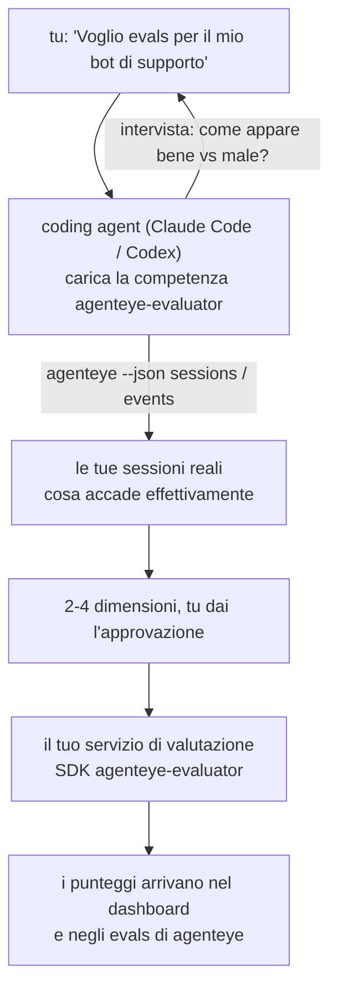

Passa da *"Penso che il nostro agent a volte funzioni male"* a un servizio di scoring distribuito, con il tuo coding agent che prende le decisioni e costruisce il tutto. La **competenza di valutazione Observability di Failproof AI** (`agenteye-evaluator`) è una *Agent Skill*: una piccola cartella di istruzioni che un coding agent come Claude Code o Codex carica su richiesta. Insegna all'agent a individuare quali dimensioni di qualità vale la pena tracciare per *il tuo* agent, quindi scrivere, testare e distribuire il [servizio di valutazione](/it/agenteye/evaluation-suite) che le assegna un punteggio.

**Non** è uno scorer ospitato, un registro in cui caricare, o un sistema di plugin. Il tuo valutatore rimane il tuo servizio HTTP sulla tua infrastruttura, esattamente come descritto nella guida [Suite di valutazione](/it/agenteye/evaluation-suite). La competenza insegna soltanto al tuo agent a costruirlo bene, così tutto ciò che fa, potresti farlo tu stesso scrivendo lo stesso codice.

---

## La parte difficile è decidere cosa valutare

La superficie dell'SDK è piccola — un decoratore e due modelli — e un agent può scriverla dalla [contract](/it/agenteye/evaluation-suite#http-contract) da solo. Non è lì che i valutatori falliscono. Falliscono perché valutano la cosa sbagliata, e un valutatore che valuta la cosa sbagliata è peggio di niente: produce una dashboard che tutti imparano a ignorare.

Quindi la maggior parte della competenza è la parte precedente a qualsiasi codice. Ha l'agent che ti intervista (*"descrivi un'esecuzione che è andata bene; ora una che è andata male"*), poi estrae le tue sessioni reali attraverso la [`agenteye` CLI](/it/agenteye/cli) e le legge da cima a fondo. Queste due metà di solito non concordano, e il divario è il punto: quello che intendi misurare rispetto a quello che i tuoi trascritti possono effettivamente supportare. Una dimensione sopravvive solo se è **calcolabile** dagli eventi e **discriminante** — se assegna 0.9 sia alla tua esecuzione buona che a quella cattiva, non insegna nulla e viene eliminata.

Quello che ritorna è una proposta di 2-4 dimensioni con il ragionamento allegato, affinché tu dia l'approvazione prima che una riga venga scritta.



---

## Come si relaziona con gli altri componenti di valutazione

Quattro documenti coprono lo scoring, e si passano la mano l'uno all'altro in ordine:

| Pagina | Cos'è | Usalo quando |
|---|---|---|
| **[Evaluations](/it/agenteye/evaluations)** | La feature: punteggi sulla griglia di sessioni, dashboard, rivaluta | Vuoi sapere cosa ti offre lo scoring automatico |
| **[Evaluation suite](/it/agenteye/evaluation-suite)** | La contract HTTP, l'SDK, le variabili di ambiente del server | Stai implementando o debuggando il valutatore tu stesso |
| **Competenza di valutazione** (questo documento) | Una porta di ingresso in linguaggio naturale su design *e* costruzione dello scorer | Vuoi passare da "voglio evals" a un servizio in esecuzione |
| **[Competenza CLI](/it/agenteye/cli-skill)** | Una porta di ingresso in linguaggio naturale sulla `agenteye` CLI | Vuoi *leggere* i punteggi che hai già |
| **[Competenza Python SDK](/it/agenteye/python-sdk-skill)** | Una porta di ingresso in linguaggio naturale su strumentazione del tuo agent | Il tuo agent non sta ancora emettendo sessioni — non c'è nulla da valutare |

### rispetto alla competenza CLI: costruire rispetto a leggere

Le due competenze sono deliberatamente non sovrapposte, e installarle entrambe è la configurazione normale — l'agent sceglie tra loro in base a quello che chiedi:

- **`agenteye-evaluator`** (questo documento) costruisce la cosa che *produce* punteggi. Il suo lavoro finisce quando i punteggi arrivano per la prima volta.
- **[`agenteye-cli`](/it/agenteye/cli-skill)** legge punteggi che già esistono (`agenteye evals`). *"La qualità è scesa questa settimana?"* è la sua domanda, non quella di questa competenza.

---

## Prerequisiti

1. La **`agenteye` CLI installata e collegata** (`pipx install agenteye`, quindi `agenteye login`). La competenza si appoggia su di essa due volte: per estrarre le sessioni reali su cui progetta, e per confermare che i tuoi punteggi sono arrivati alla fine. Il tuo login ha bisogno di `events:read`, più `evaluations:read` per quel controllo finale. Come con la competenza CLI, **non può** completare per te il login con codice monouso inviato via email.
2. **Un posto dove il valutatore deve stare.** Viene costruito in un'immagine ed eseguito come servizio a lungo termine, quindi ha bisogno di un vero repository, non di un file provvisorio. I valutatori spesso vivono nel loro proprio repository, separato dall'agent valutato — la competenza cerca uno esistente e chiede prima di strutturare uno nuovo.
3. **La ruota SDK `agenteye-evaluator`** — leggi la sezione successiva prima che il tuo agent inizi a digitare comandi `pip`.

---

## Dove ottenerla

La competenza è pubblicata nella collezione di competenze pubbliche di Failproof AI:

**[github.com/FailproofAI/skills](https://github.com/FailproofAI/skills)** → [`skills/agenteye-evaluator/`](https://github.com/FailproofAI/skills/tree/main/skills/agenteye-evaluator)

Il repository è pubblico e la competenza non ha bisogno di credenziali proprie — guida solo la `agenteye` CLI con la sessione in cui *tu* hai effettuato l'accesso, e scrive codice nel *tuo* repository. Nota che viene fornita come sua propria cartella e **non** è dentro il pacchetto `pipx install agenteye`, quindi non cercarla lì.

## Installazione della competenza

Il percorso più veloce è la CLI [`skills`](https://skills.sh), che scarica la cartella e la mette dove il tuo agent guarda:

```bash
# Claude Code, solo questo progetto
npx skills add FailproofAI/skills --skill agenteye-evaluator -a claude-code

# ogni progetto (installa in ~/.claude/skills/)
npx skills add FailproofAI/skills --skill agenteye-evaluator -a claude-code -g --copy

# Codex invece
npx skills add FailproofAI/skills --skill agenteye-evaluator -a codex
```

Quindi gestiscilo come qualsiasi altra competenza:

```bash
npx skills list -a claude-code           # cosa è installato
npx skills update agenteye-evaluator     # scarica la versione più recente
npx skills remove agenteye-evaluator     # rimuovilo
```

Preferisci installare manualmente? Una Agent Skill è solo una cartella contenente un `SKILL.md` (più riferimenti opzionali), quindi copiarla funziona anche:

- **Claude Code**: metti la cartella `agenteye-evaluator/` in `~/.claude/skills/` (ogni progetto) o `<your-repo>/.claude/skills/` (solo quel repository). Claude Code la auto-scopre — verifica con l'elenco `/skills`, o chiedi semplicemente gli evals.
- **Codex (OpenAI)**: Codex legge lo stesso `SKILL.md`. Lo `agents/openai.yaml` fornito imposta `allow_implicit_invocation: true`, così Codex auto-seleziona la competenza quando un'attività corrisponde; altrimenti invocala esplicitamente come `$agenteye-evaluator`.

---

## L'SDK non è su PyPI pubblico

> **Warning:** Leggi questo prima di far installare l'SDK a un agent.

La competenza è pubblica; l'SDK che guida non lo è. `agenteye-evaluator` viene fornito solo come artefatto di release privato, e a differenza di `agenteye`, il nome è **non rivendicato su PyPI pubblico** — quindi un semplice `pip install agenteye-evaluator` potrebbe tirare il pacchetto di uno sconosciuto nel servizio che legge i tuoi trascritti di produzione. Questo è un problema di supply-chain, non un errore di battitura.

La competenza lo sa e lavora lungo una scala di installazione invece, fermandosi al primo piolo che si applica: la fonte del monorepo se sei dentro il repository AgentEye, altrimenti la ruota di release privata da GitHub Releases (ha bisogno di accesso), e se nessuno dei due è raggiungibile **si ferma e ti dice di chiedere al tuo contatto Failproof AI la ruota** piuttosto che improvvisare.

Quindi se il tuo agent propone un semplice `pip install agenteye-evaluator` da PyPI pubblico, questo è il segno che la competenza non ha mai caricato. Fermati lì e controlla che sia installata.

---

## Cosa puoi chiederle

Un vero andata e ritorno inizia con una richiesta vaga e finisce con un design approvato, non con codice:

```text
tu    ▸ Voglio evals per il nostro bot di supporto. Penso che a volte
        funzioni male.

agent ▸ Prima di scrivere qualsiasi cosa: descrivi un'esecuzione che
        è andata bene, e una che è andata male.

tu    ▸ Bene: risponde dai documenti. Male: inventa cose, o rinuncia
        e dice "contatta il supporto".

agent ▸ In esecuzione: agenteye --json sessions --status error --since 7d
        Lettura di 5 sessioni, incluse due che definiresti cattive.

        Le tue parole dicono fattualità e defezione. I trascritti
        concordano sulla defezione (2 di 5 terminano con un passaggio
        di supporto, ed è chiaro in model_response.content), ma la
        fattualità ha bisogno di una ground truth che i tuoi eventi
        non portano.

        Quindi valuterei tre cose:
          - deflection      regole, economico, separa le tue due esecuzioni
          - tool_efficiency regole, cattura il ciclo di retry in run-004
          - groundedness    LLM judge: ogni affermazione è nei documenti recuperati?

        "factuality" avrebbe bisogno di ground truth che non abbiamo;
        groundedness è la cosa più vicina che i tuoi trascritti possono
        effettivamente supportare. Va bene con questi tre nomi?
        Rinominare dopo divide la storia.

tu    ▸ sì

agent ▸ Nessun valutatore in questo repository. Dovrei strutturarne uno qui,
        o ne hai uno altrove?
```

Da lì scrive prima le dimensioni basate su regole (gratis, istantaneo, deterministico), le testa rispetto a una sessione reale catturata incluse quelle vuote e mai terminate che mandano in crash i valutatori ingenui, e raggiunge un LLM judge solo sulla dimensione soggettiva. Conosce i [limiti del dispatcher](/it/agenteye/evaluation-suite#configuring-the-server) — timeout di richiesta di 30s e 8 chiamate concorrenti deployment-wide — quindi se il judge non starà affidabilmente dentro, va asincrono con `JobPending` piuttosto che lasciare che il tuo judge venga cancellato e riprovato cinque volte a cinque volte il costo.

Poi distribuisce, imposta le due variabili di ambiente del server, e conferma con `agenteye --json evals --session-id <id>` che i punteggi sono effettivamente arrivati. I punteggi che arrivano sono l'unica prova.

---

## Cosa stare attenti

- **I nomi delle dimensioni sono quasi permanenti.** Le chiavi di punteggio sono stringhe arbitrarie e la piattaforma tende a qualsiasi cosa tu invii, il che significa che nulla downstream corregge una scelta cattiva. Rinomina dopo e la storia divide: le sessioni vecchie mantengono la chiave vecchia e il trend si rompe. Questo è il motivo per cui la competenza ottiene l'approvazione esplicita prima di scrivere codice — prendi seriamente quel prompt.
- **Gli fixture sono trascritti reali di produzione.** Progettare rispetto alle sessioni reali significa estrarle su disco, e possono contenere dati dei clienti. La competenza chiede prima di assegnarli a git; in caso di dubbio, mantieni `fixtures/` fuori dal repository e fai estrarre a ogni sviluppatore il proprio.
- **L'agent scrive e distribuisce un servizio che legge ogni trascritto.** Agisce come te, vincolato dalle autorizzazioni del login della tua CLI, ma rivedi il valutatore come qualsiasi altro codice che tocca i dati di produzione.

---

## Passaggi successivi

- **[Evaluation suite](/it/agenteye/evaluation-suite)**: la contract HTTP, l'SDK, e le variabili di ambiente del server che la competenza configura.
- **[Evaluations](/it/agenteye/evaluations)**: dove appaiono i punteggi una volta che arrivano.
- **[Competenza CLI](/it/agenteye/cli-skill)**: la competenza sorella, per leggere i risultati piuttosto che costruire lo scorer.
- **[CLI](/it/agenteye/cli)**: il riferimento dei comandi dietro i dati di sessione su cui la competenza progetta.