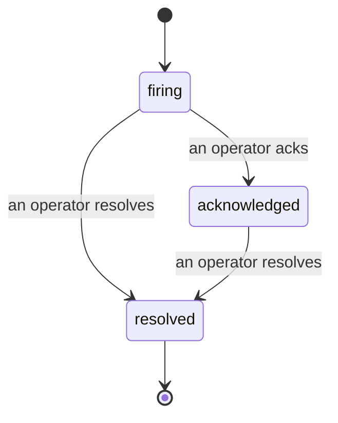

Quando un avviso scatta, la prima domanda è sempre "chi se ne sta occupando?" Gli incident rispondono a questa domanda: nel momento in cui qualcosa viene violato, tutti possono vedere che l'incident è aperto, chi è il proprietario, e esattamente cosa è accaduto finora, con un registro pulito e attribuito che puoi consegnare direttamente a un post-mortem.

*La inbox raggruppa gli incident aperti per stato e filtra per gravità e assegnatario, così vedi cosa ha bisogno di un operatore adesso.*

## Sappi chi se ne sta occupando, a colpo d'occhio

Niente più "qualcuno sta guardando questo?" in un thread di chat. Una violazione apre automaticamente un incident e lo inserisce in una inbox condivisa, raggruppata per stato. Riconoscilo e il tuo nome sarà su di esso, così il resto del team sa che è gestito. Il riconoscimento è condiviso: diversi operatori possono riconoscere lo stesso incident e ciascuno è registrato singolarmente, così una sala guerra completa compare per nome invece di sovrapporsi l'uno con l'altro. Assegna un proprietario per il triage e filtra la inbox per gravità o assegnatario per ridurla a quello che è tuo.

## L'intera storia, in una sola timeline

Quando l'incident è concluso, avrai già la relazione. Apri un incident qualsiasi e ottieni l'evidenza della violazione, i suoi assegnatari e iscritti, un thread di commenti per coordinare sul posto, e una timeline di attività in sola aggiunta.

*Tutto quello che è accaduto, in ordine, ogni riga firmata da chi l'ha fatto.*

Ogni azione (aperto, riconosciuto, risolto, e così via) è scritta su quella timeline e mai modificata. Ogni voce è attribuita: all'operatore che l'ha presa, per email, o a **automated** per qualsiasi cosa FailproofAI Observability ha fatto autonomamente, come aprire l'incident sulla violazione. Niente è anonimo e niente è perso, così il post-mortem più o meno si scrive da solo.

## Come si muove un incident

- **Aperto (firing):** la violazione apre l'incident e notifica i tuoi canali una sola volta. Le violazioni ripetute si uniscono allo stesso incident e aggiornano la sua evidenza invece di notificarti di nuovo e di nuovo.
- **Riconosciuto:** un operatore se ne occupa. Rimane aperto, e le violazioni successive aggiornano l'evidenza silenziosamente.
- **Risolto:** un operatore lo chiude. La risoluzione automatica quando la condizione si risolve è pianificata ma non ancora abilitata, quindi un incident rimane aperto finché un operatore non lo risolve, il che mantiene tutti onesti su cosa sia effettivamente stato risolto. Un nuovo incident può aprirsi sullo stesso avviso in seguito.

Un avviso contiene al massimo un incident aperto alla volta, quindi una regola che oscilla non può seppellirti in duplicati. Puoi anche aprire un incident manualmente: uno standalone per qualcosa che nessun avviso ha catturato, o uno collegato a un avviso esistente, se hai `incidents:write`.

## Dove trovarlo

Gli incident si trovano in `/<org-slug>/incidents`. La visualizzazione richiede **`incidents:read`**; aprire un incident manuale richiede **`incidents:write`**; riconoscere, assegnare, commentare e risolvere richiedono **`incidents:ack`**. Le chiavi più vecchie che hanno concesso il `alerts:ack` ritirato continuano a funzionare, poiché è onorato come `incidents:ack`, quindi il tuo on-call rotation non ha bisogno di essere rilasciato.

## Correlati

- [Avvisi](/it/agenteye/alerts): le regole che aprono questi incident quando una soglia viene violata.
- [Tracciamento degli errori](/it/agenteye/error-tracking): vedi ogni fallimento in un solo posto e promuovine uno a un avviso.
- [Audit](/it/agenteye/audits): l'analista programmato che trova i fallimenti che nessuna regola stava monitorando.