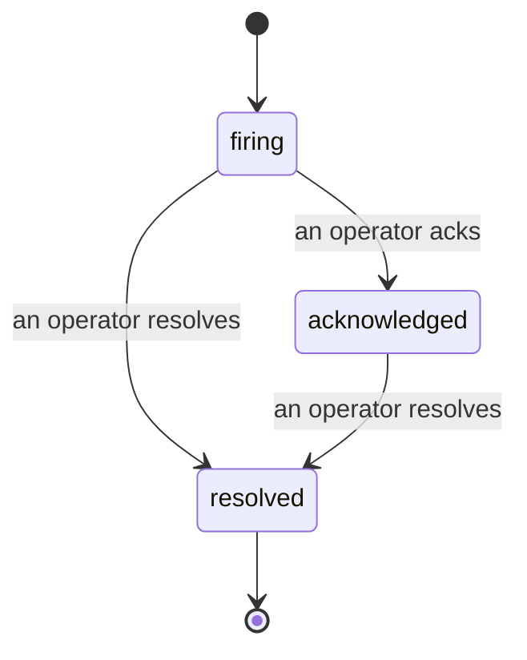

Quando un avviso si attiva, la prima domanda è sempre "chi se ne occupa?". Gli Incidents rispondono: nel momento in cui qualcosa viene violato, tutti possono vedere che l'incident è aperto, chi lo gestisce e esattamente cosa è successo finora, con un registro pulito e attribuito che puoi consegnare direttamente al post-mortem.

*La inbox raggruppa gli incident aperti per stato e filtra per severità e assegnatario, così vedi cosa ha bisogno di un intervento umano adesso.*

## Sappi chi se ne occupa, a colpo d'occhio

Niente più "qualcuno sta guardando questo?" in un thread di chat. Una violazione apre automaticamente un incident e lo inserisce in una inbox condivisa, raggruppato per stato. Riconoscilo e il tuo nome è su di esso, così il resto del team sa che è gestito. Il riconoscimento è condiviso: più operatori possono riconoscere lo stesso incident e ognuno viene registrato singolarmente, così una guerra room completa appare per nome invece di sovrapporsi. Assegna un proprietario per il triage e filtra la inbox per severità o assegnatario per ridurla a quello che è tuo.

## L'intera storia, in una sola cronologia

Quando l'incident è finito, hai già il rapporto. Apri un incident qualsiasi e ottieni l'evidenza della violazione, i suoi assegnatari e sottoscrittori, un thread di commenti per coordinare sul posto, e una cronologia dell'attività in sola lettura.

*Tutto quello che è successo, in ordine, ogni riga firmata da chi l'ha fatto.*

Ogni azione (apertura, riconoscimento, risoluzione, ecc.) viene scritta in quella cronologia e non viene mai modificata. Ogni voce è attribuita: all'operatore che l'ha eseguita, per email, o ad **automated** per tutto quello che Failproof AI Observability ha fatto da solo, come aprire l'incident sulla violazione. Niente è anonimo e niente viene perso, quindi il post-mortem più o meno si scrive da solo.

## Come si muove un incident

- **Open (firing):** la violazione apre l'incident e pagina i tuoi canali una volta. Le violazioni ripetute si ripiegano nello stesso incident e aggiornano la sua evidenza invece di pagarti di nuovo e di nuovo.
- **Acknowledged:** un operatore lo prende in carico. Rimane aperto, e le violazioni successive aggiornano l'evidenza silenziosamente.
- **Resolved:** un operatore lo chiude. La risoluzione automatica quando la condizione si risolve è pianificata ma non ancora abilitata, quindi un incident rimane aperto fino a quando un umano non lo risolve, il che mantiene tutti onesti su quello che ha effettivamente risolto. Un nuovo incident può aprirsi sullo stesso avviso in seguito.

Un avviso contiene al massimo un incident aperto alla volta, quindi una regola che sfarfalla non può sommergerti di duplicati. Puoi anche aprire un incident manualmente: uno standalone per qualcosa che nessun avviso ha catturato, o uno allegato a un avviso esistente, se hai `incidents:write`.

## Dove trovarlo

Gli Incidents si trovano in `/<org-slug>/incidents`. La visualizzazione richiede **`incidents:read`**; aprire un incident manuale richiede **`incidents:write`**; riconoscere, assegnare, commentare e risolvere richiedono **`incidents:ack`**. Le chiavi più vecchie che hanno concesso il deprecato `alerts:ack` continuano a funzionare, poiché viene riconosciuto come `incidents:ack`, quindi la tua rotazione on-call non ha bisogno di essere riemessa.

## Correlati

- [Alerts](/it/agenteye/alerts): le regole che aprono questi incident quando una soglia viene violata.
- [Error tracking](/it/agenteye/error-tracking): vedi ogni errore in un unico posto e promuovine uno a un avviso.
- [Audits](/it/agenteye/audits): l'analista pianificato che trova i guasti che nessuna regola stava controllando.