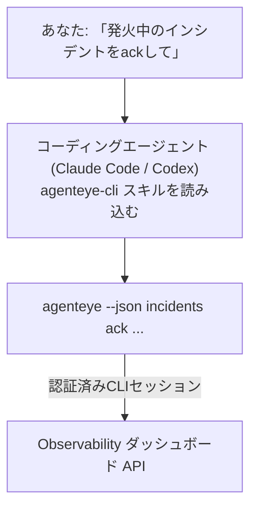

コーディングエージェントに *「今日、何か壊れているものはある？」* と聞くだけで、ライブの FailproofAI Observability データから答えを得られます。コマンドを覚える必要はありません。**FailproofAI Observability CLI スキル**（`agenteye-cli`）は*エージェントスキル*です。これは、Claude Code や Codex などのコーディングエージェントがオンデマンドで読み込む、小さな指示ファイルのフォルダです。このスキルにより、エージェントは *「CIにイベントをプッシュするだけのキーを作って」* や *「発火中のインシデントをackして自分にアサインして」* といった自然な日本語のリクエストから [`agenteye` CLI](/ja/agenteye/cli) を使ってObservabilityデプロイメントを操作できるようになります。

これは**サービスでも独立したバイナリでもありません**。デプロイは不要です。すでにインストール済みのCLIの上で動作します。エージェントは `agenteye --json …` をシェル実行し、きれいなJSONを解析して、結果を文章で返します。エージェントができることは、同じコマンドを自分で入力すれば自分でもできることと同じです。

---

## 他の FailproofAI Observability インターフェースとの関係

FailproofAI Observability では、同じデータとコントロールにアクセスするための4つの方法を提供しています。それぞれが互いを補完します。

| インターフェース | 概要 | 実行場所 | 使うべきとき |
|---|---|---|---|
| **[CLI](/ja/agenteye/cli)** | `agenteye` のコマンド・フラグリファレンス | ターミナル | 特定のコマンドを実行またはスクリプト化したいとき |
| **[CLI レシピ](/ja/agenteye/cli-recipes)** | コピペ可能な `jq`/パイプラインパターン | ターミナル / スクリプト | CLIを自動化に組み込むとき |
| **CLI スキル**（このドキュメント） | CLIへの自然言語フロントエンド | ワークステーション上のコーディングエージェント | 聞くだけでエージェントにコマンドを選ばせたいとき |
| **[ダッシュボード内AIアシスタント](/ja/agenteye/assistant)** | ダッシュボードに組み込まれたチャット | サーバーサイド（ダッシュボード内） | ダッシュボード上でデータにQ&Aしたいとき |

スキル自体には固有の権限はありません。あなたの言葉をCLI呼び出しに変換して、あなたとして実行するだけです。



### ダッシュボード内AIアシスタントとの違い：重要な区別

これらは影響範囲が大きく異なる2つの別々のツールです。

- **ダッシュボード内AIアシスタント**（[AIアシスタント](/ja/agenteye/assistant)）はダッシュボードに組み込まれたチャットで、エージェントサービスによってバックアップされています。**読み取り専用＋承認ゲート付きの編集**が可能です。保存済みクエリやダッシュボードの下書きは作れますが、書き込みはすべてあなたの明示的なクリック承認で一時停止し、削除は行いません。`agent:use` 権限によってゲートされ、閲覧中のOrg のデータのみを参照します。
- **CLI スキル**は*あなたの*ワークステーション上の*あなたの*コーディングエージェント内で動作し、`agenteye` CLI を**あなたとして**駆動します。APIキーの作成/ローテーション/無効化、Org設定の変更、インシデントの解決、保存済みクエリの削除など、**ミューテーションを含むCLIの全機能**を実行できます。制限はCLIログインの権限のみです。これらのコマンドを手動で実行するのと同じくらい慎重に扱ってください。

---

## 前提条件

1. **`agenteye` CLIがインストール済みで `PATH` に含まれていること**（[CLI](/ja/agenteye/cli) リファレンスを参照: `pipx install agenteye`）。
2. **ダッシュボードURLが設定済みであること**（`AGENTEYE_DASHBOARD_URL`、またはエージェントが `--base-url` を渡す）。
3. **ログイン済みのセッションがあること**：まず自分で `agenteye login` を実行してください。スキルはメールで送られるワンタイムコードのログインを代行**できません**。セッションが存在しないか期限切れの場合（CLIの終了コード `4`）、`agenteye login` を実行するよう案内します。

---

## スキルのインストール

エージェントスキルは `SKILL.md`（およびオプションの参照ファイル）を含むフォルダです。`agenteye-cli` スキルをインストールするには、エージェントがスキルを探す場所にそのフォルダを配置します。

- **Claude Code**: `agenteye-cli/` フォルダを `~/.claude/skills/`（すべてのプロジェクトで使用可能）または `<your-repo>/.claude/skills/`（そのリポジトリ限定）にコピーします。Claude Code は自動的に検出します。`/skills` リストで確認するか、その説明に合う質問をしてみてください。
- **Codex (OpenAI)**: Codex も同じ `SKILL.md` を読み込みます。バンドルされている `agents/openai.yaml` は `allow_implicit_invocation: true` を設定しているため、タスクが一致すると Codex はスキルを自動選択します。それ以外の場合は `$agenteye-cli` として明示的に呼び出します。

スキルは `agenteye` CLI と並行してメンテナンスされていますが、`pipx install agenteye` パッケージには含まれない**別フォルダ**として提供されます。そのため、パッケージの中を探さないでください。FailproofAI Observability は `agenteye-cli/` フォルダを別途提供します。お持ちでない場合は FailproofAI の担当者にお問い合わせください。何も制限はありません。スキル自体には認証情報は不要で、自分のダッシュボードに対して**公開**の `agenteye` CLI を駆動するだけです。

---

## 安全性：エージェントがCLIを実行するとき、ミューテーションは確認を求めません

> **警告：** エージェントに変更を加えさせる前に必ずお読みください。

`agenteye` CLI は通常、破壊的な操作の前に*「本当によいですか？」* と確認を求めます。しかし、**ターミナルに接続されていない場合（コーディングエージェントが実行する場合はまさにこれ）は確認を自動スキップします。`--json` も同様にスキップします**。そのため、エージェントに対して安全確認のプロンプトは**表示されません**。

スキルはこれを補うよう設計されています。実行するコマンドを明示し、状態を変更する前にあなたの明示的な **OK** を得るよう指示されています。この規律を守ってください。エージェントを通じて FailproofAI Observability を操作する場合、**あなた自身**が確認ステップとなります。注意すべき状態変更コマンドは以下のとおりです。

- `keys create` / `update` / `disable` / `regenerate`
- `users create` / `update` / `disable` / `enable`
- `settings set`
- `alerts create` / `update` / `delete` / `test`
- 書き込み系の `incidents` サブコマンド: `ack` / `assign` / `resolve` / `open` / `comment-add` / `comment-delete` / `subscribe` / `unsubscribe`
- `query create` / `update` / `delete`
- `agent rename` / `delete`
- `orgs switch`

**Observe** 配下（`events`、`sessions`、`evals`、`errors`、`list`、`whoami`、`orgs list/current/perms`）はすべて読み取り専用で、何も変更しません。

エージェントは**あなたとして**動作するため、あなたのログインで許可されていることしかできません。権限は **Org ごと**に解決されます（[APIキー](/ja/agenteye/api-keys)を参照）。権限のないコマンドは、必要な権限名を明示した終了コード `5` を返します。そのため、エージェントは曖昧に失敗するのではなく、管理者に何を依頼すべきかを正確に伝えられます。

---

## 何を聞けるか

実際のやり取りの例です。まず読み取り、次にOKを待つ変更を行います。

```text
あなた ▸ 昨日から何か壊れているものはある？

エージェント ▸ 実行中: agenteye --json errors --since 24h --aggregate
              過去24時間で3種類のエラーが見つかりました。最も多いのは
              TimeoutError（18件、すべてcheckout-agent）、次いで
              RateLimited（5件）です。
              TimeoutError の失敗したセッションを確認しますか？

あなた ▸ CIにイベントをプッシュするだけのキーを作って。

エージェント ▸ APIキーを作成します。以下を実行します:
                agenteye keys create ci --add events:add
              実行してよいですか？

あなた ▸ yes

エージェント ▸ 完了。キー "ci" が events:add のみで作成されました。
              シークレットは一度しか表示されないため、今すぐ保存してください。再表示はできません。
```

スキルは各自然言語の意図を適切な `agenteye` コマンドにマッピングします。推測せず、有効な値を先に検出（`list <kind>`、`whoami`）し、変更前に正確なコマンドを提示します。その他の例：

- *「過去24時間で壊れているもの・失敗しているものはある？」* → `errors --since 24h --aggregate`、その後内訳を表示。
- *「セッション `run-001` はなぜ失敗した？」* → `events --session-id run-001 --all` + `evals --session-id run-001`。
- *「今週の品質トレンドはどう？」* → `evals --aggregate --since 7d`、その後スコアの低いrunを詳細確認。
- *「CIにイベントをプッシュするだけのキーを作って。」* → `keys create ci --add events:add`（コマンドを提示してから作成し、ワンタイムシークレットを取得）。
- *「誰がアクセスできる？ Dana を読み取り専用にして。」* → `users list` → `users update dana@… --permission-set read-only`（確認後）。
- *「発火中のインシデントをackして自分にアサインして。」* → `incidents list --state firing` → `incidents ack <id>` / `incidents assign <id> you@…`。

これらの背後にある正確なコマンド、フラグ、JSONの形式については、[CLI](/ja/agenteye/cli) リファレンスと[エージェント向けCLIレシピ](/ja/agenteye/cli-recipes)を参照してください。

---

## 次のステップ

- **[CLI](/ja/agenteye/cli)**: `agenteye` の全コマンド・フラグリファレンス。
- **[エージェント向けCLIレシピ](/ja/agenteye/cli-recipes)**: コピペ可能な `jq` パターンと終了コードの処理。
- **[AIアシスタント](/ja/agenteye/assistant)**: ダッシュボード内アシスタント（このターミナルスキルとは異なります）。
- **[APIキー](/ja/agenteye/api-keys)**: スキルが実行できることを制限するOrg単位の権限モデル。