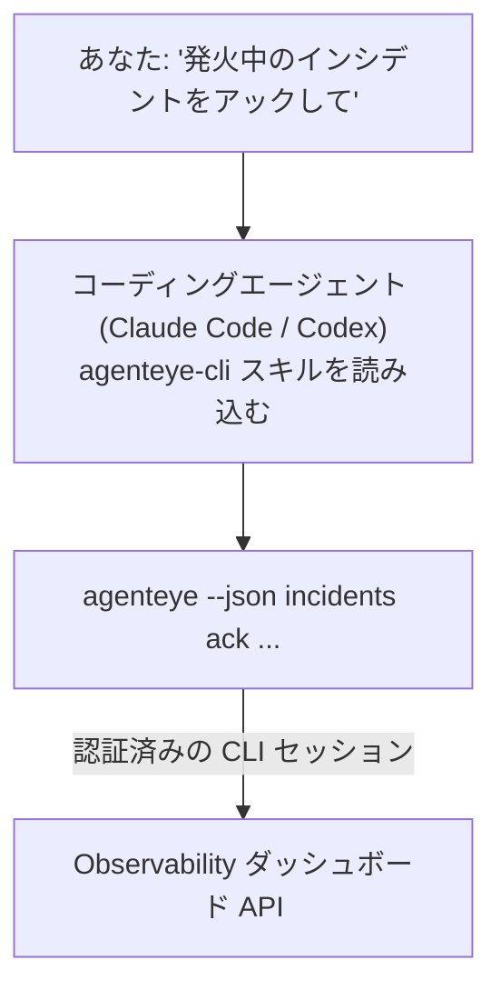

コーディングエージェントに *「今日、何か壊れていますか？」* と聞くだけで、Failproof AI Observability のライブデータから答えを得られます。コマンドを覚える必要はありません。**Failproof AI Observability CLI スキル**（`agenteye-cli`）は *エージェントスキル* です。Claude Code や Codex などのコーディングエージェントがオンデマンドで読み込む小さなフォルダで、*「イベントのプッシュだけが可能なキーを CI に渡して」* や *「発火中のインシデントをアックして自分にアサインして」* といった自然言語のリクエストを通じて、エージェントが [`agenteye` CLI](/ja/agenteye/cli) を使って Observability デプロイメントを操作できるようにします。

これはサービスでも独立したバイナリでもなく、デプロイするものは何もありません。すでにインストール済みの CLI の上に乗るだけです。エージェントは `agenteye --json …` をシェルから呼び出し、クリーンな JSON を解析して、散文形式で回答します。エージェントができることはすべて、同じコマンドを手で入力しても実現できます。

---

## 他の Failproof AI Observability インターフェースとの関係

Failproof AI Observability は、同じデータとコントロールにアクセスするための 4 つの方法を提供しています。それぞれは補完的な関係にあります：

| インターフェース | 説明 | 動作環境 | 使いどころ |
|---|---|---|---|
| **[CLI](/ja/agenteye/cli)** | `agenteye` のコマンド・フラグリファレンス | ターミナル | 特定のコマンドを実行またはスクリプト化したい場合 |
| **[CLI レシピ](/ja/agenteye/cli-recipes)** | コピペ可能な `jq`/パイプラインパターン | ターミナル・スクリプト | CLI を自動化に組み込む場合 |
| **CLI スキル**（このドキュメント） | CLI への自然言語フロントエンド | ワークステーション上のコーディングエージェント | 聞くだけでエージェントにコマンドを選ばせたい場合 |
| **[エバリュエータースキル](/ja/agenteye/evaluator-skill)** | スコアリングサービスを設計・構築する姉妹スキル | ワークステーション上のコーディングエージェント | eval スコアを読むのではなく *生成* したい場合 |
| **[Python SDK スキル](/ja/agenteye/python-sdk-skill)** | エージェントにテレメトリーを送出させるための姉妹スキル | ワークステーション上のコーディングエージェント | このスキルが読み取るイベントをエージェントに *生成* させたい場合 |
| **[ダッシュボード内 AI アシスタント](/ja/agenteye/assistant)** | ダッシュボードに組み込まれたチャット | サーバーサイド（ダッシュボード内） | ダッシュボード内でデータへの Q&A を行いたい場合 |

スキル自体には独自の権限はなく、あなたが発した言葉を CLI 呼び出しに変換してあなたとして実行するだけです：



### ダッシュボード内 AI アシスタントとの比較：重要な違い

この 2 つは、影響範囲が大きく異なる別々のツールです：

- **ダッシュボード内 AI アシスタント**（[AI アシスタント](/ja/agenteye/assistant)）はダッシュボードに組み込まれたチャットで、エージェントサービスによってバックアップされています。**読み取り専用 + 承認ゲート付きの作成**: 保存済みクエリやダッシュボードの下書きを作成できますが、すべての書き込みはあなたの明示的なクリック承認で一時停止し、削除は行いません。`agent:use` 権限でゲートされており、表示中の組織のデータのみにアクセスします。
- **CLI スキル**は *あなたの* ワークステーション上の *あなたの* コーディングエージェント内で動作し、**あなたとして** `agenteye` CLI を操作します。API キーの作成・ローテーション・無効化、組織設定の変更、インシデントの解決、保存済みクエリの削除など、**ミューテーションを含む CLI のフル機能**を実行できます。制限は CLI ログインの権限のみです。これらのコマンドを手で実行するのと同じ慎重さで取り扱ってください。

---

## 前提条件

1. **`agenteye` CLI がインストール済み**で `PATH` に含まれていること（[CLI](/ja/agenteye/cli) リファレンスを参照: `pipx install agenteye`）。
2. **ダッシュボード URL** が設定されていること（`AGENTEYE_DASHBOARD_URL`、またはエージェントが `--base-url` で渡す）。
3. **ログイン済みのセッション**: 事前に `agenteye login` を自分で実行しておくこと。スキルはメールで届くワンタイムコードのログインを代わりに完了させることは**できません**。セッションが存在しないか期限切れの場合（CLI 終了コード `4`）、`agenteye login` を実行するよう案内します。

---

## 入手方法

スキルは Failproof AI の公開スキルコレクションで公開されています：

**[github.com/FailproofAI/skills](https://github.com/FailproofAI/skills)** → [`skills/agenteye-cli/`](https://github.com/FailproofAI/skills/tree/main/skills/agenteye-cli)

リポジトリは公開されており、スキル自体に独自の認証情報は不要です。*あなたが* ログインしたセッションを使って、**公開** `agenteye` CLI を *あなたの* ダッシュボードに対して実行するだけだからです。誰かに許可を求める必要はありません。

なお、このスキルは独自のフォルダとして提供されており、`pipx install agenteye` パッケージには含まれていないため、そちらを探さないでください。

## スキルのインストール

最も手軽な方法は [`skills`](https://skills.sh) CLI を使うことです。フォルダを取得してエージェントが参照する場所に配置してくれます：

```bash
# Claude Code、このプロジェクトのみ
npx skills add FailproofAI/skills --skill agenteye-cli -a claude-code

# すべてのプロジェクト（~/.claude/skills/ にインストール）
npx skills add FailproofAI/skills --skill agenteye-cli -a claude-code -g --copy

# Codex の場合
npx skills add FailproofAI/skills --skill agenteye-cli -a codex
```

その後は他のスキルと同様に管理できます：

```bash
npx skills list -a claude-code      # インストール済みのスキルを確認
npx skills update agenteye-cli      # 最新バージョンに更新
npx skills remove agenteye-cli      # 削除
```

手動でインストールしたい場合は、エージェントスキルは `SKILL.md`（とオプションのリファレンス）を含むフォルダにすぎないため、コピーするだけでも動作します：

- **Claude Code**: `agenteye-cli/` フォルダを `~/.claude/skills/`（全プロジェクト共通）または `<your-repo>/.claude/skills/`（そのリポジトリのみ）に配置してください。Claude Code は自動的に検出します。`/skills` リストで確認するか、スキルの説明に合致する質問をしてみてください。
- **Codex（OpenAI）**: Codex も同じ `SKILL.md` を読み込みます。バンドルされた `agents/openai.yaml` に `allow_implicit_invocation: true` が設定されているため、タスクが合致すれば Codex が自動的にスキルを選択します。それ以外の場合は `$agenteye-cli` として明示的に呼び出してください。

---

## 安全性：エージェントが CLI を実行する場合、ミューテーションは確認プロンプトを表示しない

> **警告:** エージェントに変更を加えさせる前に、必ずこちらをお読みください。

`agenteye` CLI は通常、破壊的な操作の前に *「本当によろしいですか？」* と確認します。ただし、**ターミナルに接続されていない場合（コーディングエージェントがまさにこの方式で実行します）、および `--json` を使用する場合は、その確認を自動的にスキップします。** そのため、エージェントに対して確認プロンプトは**表示されません**。

スキルはこれを補うように設計されています。実行するコマンドを明示的に提示し、**状態を変更する前にあなたの明示的な OK を求める**よう指示されています。この規律を維持してください。エージェントを通じて Failproof AI Observability を操作する場合、*あなた* が確認ステップです。注意が必要な状態変更コマンドは以下のとおりです：

- `keys create` / `update` / `disable` / `regenerate`
- `users create` / `update` / `disable` / `enable`
- `settings set`
- `alerts create` / `update` / `delete` / `test`
- 書き込み系の `incidents` サブコマンド: `ack` / `assign` / `resolve` / `open` / `comment-add` / `comment-delete` / `subscribe` / `unsubscribe`
- `query create` / `update` / `delete`
- `agent rename` / `delete`
- `orgs switch`

**Observe** 系（`events`、`sessions`、`evals`、`errors`、`list`、`whoami`、`orgs list/current/perms`）はすべて読み取り専用で、何も変更しません。

エージェントは **あなたとして** 動作するため、あなたのログインが許可している操作しか実行できません。権限は**組織ごと**に解決されます（[API キー](/ja/agenteye/api-keys)を参照）。権限が不足しているコマンドは終了コード `5` と該当する権限名を返すため、エージェントは不明瞭な失敗ではなく、管理者に何を依頼すればよいかを正確に伝えられます。

---

## 聞けること

実際のやり取りの例を示します。まず読み取り、次に確認を待つ変更操作です：

```text
あなた ▸ 昨日から何か壊れていますか？

エージェント ▸ 実行: agenteye --json errors --since 24h --aggregate
              過去 24 時間に 3 種類のエラーがありました。最も多いのは
              TimeoutError（18 件、すべて checkout-agent）、
              次に RateLimited（5 件）です。
              TimeoutError の失敗セッションを確認しますか？

あなた ▸ イベントのプッシュだけが可能なキーを CI に渡して。

エージェント ▸ API キーを作成します。実行するコマンド:
                agenteye keys create ci --add events:add
              続行してよいですか？

あなた ▸ yes

エージェント ▸ 完了しました。events:add のみを持つキー "ci" を作成しました。
              シークレットは一度しか表示されないため、今すぐ保存してください。再表示はできません。
```

スキルは各自然言語の意図を適切な `agenteye` コマンドにマッピングし、`list <kind>` や `whoami` で有効な値を事前に確認して推測を避け、変更前に正確なコマンドを提示します。さらに例を挙げます：

- *「過去 24 時間で壊れている・失敗しているものはある？」* → `errors --since 24h --aggregate`、その後内訳を表示。
- *「セッション `run-001` がなぜ失敗したのか教えて。」* → `events --session-id run-001 --all` + `evals --session-id run-001`。
- *「今週の品質トレンドを教えて。」* → `evals --aggregate --since 7d`、その後低スコアのランを掘り下げ。
- *「イベントのプッシュだけが可能なキーを CI に渡して。」* → `keys create ci --add events:add`（コマンドを提示後、作成してワンタイムシークレットを取得）。
- *「誰がアクセス権を持っている？Dana を読み取り専用にして。」* → `users list` → `users update dana@… --permission-set read-only`（確認後）。
- *「発火中のインシデントをアックして自分にアサインして。」* → `incidents list --state firing` → `incidents ack <id>` / `incidents assign <id> you@…`。

これらの背景にある正確なコマンド、フラグ、JSON の形式については、[CLI](/ja/agenteye/cli) リファレンスと [エージェント向け CLI レシピ](/ja/agenteye/cli-recipes)を参照してください。

---

## 次のステップ

- **[CLI](/ja/agenteye/cli)**: `agenteye` のコマンド・フラグの完全なリファレンス。
- **[エージェント向け CLI レシピ](/ja/agenteye/cli-recipes)**: コピペ可能な `jq` パターンと終了コードの処理。
- **[エバリュエータースキル](/ja/agenteye/evaluator-skill)**: `agenteye evals` が読み取るスコアを生成するエバリュエーターを構築するための姉妹スキル。
- **[Python SDK エージェントスキル](/ja/agenteye/python-sdk-skill)**: `agenteye` が読み取るテレメトリーを送出するようエージェントをインストルメント化するための姉妹スキル。
- **[AI アシスタント](/ja/agenteye/assistant)**: ダッシュボード内アシスタント（このターミナルスキルとは別物です）。
- **[API キー](/ja/agenteye/api-keys)**: スキルが実行できる操作を制限する組織ごとの権限モデル。