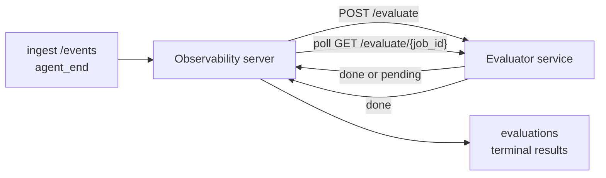

FailproofAI Observability は、完了したすべてのエージェント実行を品質の観点から自動的にスコアリングできます。小規模なスコアリングサービスを用意するだけで、あとは Observability がすべて処理します。重視する評価軸（有用性、ツール効率、事実性、安全性など、軸はご自身で定義できます）を追跡し、品質低下を早期に検出し、エージェントや環境を一目で比較するために活用してください。スコアリングはオプトイン方式です。サーバーに `EVALUATOR_ENDPOINT` を設定するまで、パイプラインは何も行いません。

> **注意:** スコアの評価軸はご自身で定義します。評価器は任意の数値キーを返すことができ、Observability は送信された内容をそのまま保存・トレンド表示・可視化します。

## 概要

1. **スコアラーを作成する。** セッションのトランスクリプトを読み込んでスコアを返す小規模な HTTP サービスを立ち上げます。Observability にはすぐに使えるリファレンス実装が同梱されているので、コピーして使い始めることができます。[SDK を使った評価器の作成](#writing-an-evaluator-with-the-sdk)を参照してください。
2. **Observability にエンドポイントを設定する。** サーバープロセスに `EVALUATOR_ENDPOINT`（および共有の `EVALUATOR_TOKEN`）を設定します。
3. **スコアを確認する。** 完了したすべてのセッションが自動的にスコアリングされ、セッション詳細ページ、セッション一覧グリッド、保存済みダッシュボードに結果が表示されます。


*評価器が設定されると、完了した各実行がスコアリングされ、セッションの右側パネルに結果が表示されます。上部にサマリー、その下に推論付きの評価軸ごとのスコアバーが並びます。*

---

## 仕組み



Observability SDK がセッションの `agent_end` イベントを発行すると、サーバーは評価をスケジュールします。その後、完全なイベントトランスクリプトを評価器サービスに POST します。評価器は次のいずれかの方法で応答できます。

- `{"status":"done", "scores":{...}, "reasoning":{...}, "summary":"..."}` で**インラインで結果を返す**。結果はセッションの評価タイムラインに追記されます。`reasoning` と `summary` はオプションです。
- `{"status":"pending", "job_id":"abc-123"}` で**処理を延期する**。Observability は評価器が `{"status":"done", ...}` または `{"status":"error", "error":"..."}` を返すまで `GET {EVALUATOR_ENDPOINT}/evaluate/abc-123` を定期的にポーリングします。

  ポーリング間隔はジョブごとに設定できます。`pending` レスポンスに `next_poll_secs` を含めることでオーバーライドできます。指定しない場合、Observability は `GET /config` から返される `default_poll_interval_secs` を使用し、それも設定されていない場合はサーバーの `EVALUATOR_POLLING_INTERVAL_SECS`（デフォルト 10 秒）にフォールバックします。すべての値は [1 秒, 1 時間] の範囲に制限されます。

`agent_end` を発行しないセッション（例：クラッシュしたエージェントプロセス）も処理できます。評価器の `GET /config` が `{"inactivity_timeout_secs": 1800}` を返す場合、Observability はその時間を超えてアイドル状態になったセッションを評価します。このフォールバックを無効にするには、フィールドを `null` に設定するか省略してください。

`EVALUATOR_ENDPOINT` が未設定の場合、パイプラインは完全にノーオペレーションになります。

セッションには**複数の終端評価が時間をかけて蓄積**できます。各 `agent_end` イベント（およびダッシュボードからの手動再評価）は新しい評価行を追記します。これは再開された会話を評価するためにサポートされている方法です。ユーザーがエージェントを終了し、後で戻ってさらにイベントを送信し、再度エージェントを終了すると、更新されたトランスクリプト全体に対して2回目の評価が実行されます。ダッシュボードは最新の評価をヘッドラインとして表示し、以前の評価は折りたたみ可能なタイムラインとして表示します。あるセッションで評価が実行中の場合、そのセッションへの追加の `agent_end` イベントは無視されます。実行中の評価が完了した後の次の `agent_end` イベントが、通常どおり新しい評価をキューに追加します。

非アクティブ状態によるフォールバックは、再開されたセッションにも再適用されます。以前の終端評価の後に新しいイベントが到着し、セッションが `inactivity_timeout_secs` を超えてアイドル状態になった場合、新しい評価がキューに追加されます。

一時的な障害（5xx、429、タイムアウト、ネットワークエラー）は `EVALUATOR_MAX_ATTEMPTS` の回数まで指数バックオフで再試行されます。4xx レスポンスは終端として扱われます。Observability は水平スケールされた複数のサーバーインスタンスで安全に動作します。ワークはパーティション分割されるため、同じセッションが同時に二重ディスパッチされることはありません。

---

## HTTP コントラクト

認証が必要なすべてのルートは**ベアラートークン認証**を使用します。両側で同じ値を設定する必要があります。

- Observability サーバー：環境変数 `EVALUATOR_TOKEN`
- 評価器サービス：同様に設定（`agenteye-evaluator` SDK は規約により `EVALUATOR_TOKEN` を読み取ります）

`EVALUATOR_TOKEN` が未設定の場合、サーバーは `Authorization` ヘッダーを送信しません。評価器は匿名リクエストを受け入れることができますが、これは内部専用ネットワークでは問題ありませんが、公開インターネットでは推奨されません。

### 評価器が提供する必要があるルート

| ルート | ボディ / パラメーター | レスポンス |
|---|---|---|
| `GET /health` | なし | `{"status":"ok"}`（オープン、認証不要） |
| `GET /config` | なし | `{"inactivity_timeout_secs": <int> \| null, "default_poll_interval_secs": <int> \| omitted}` |
| `POST /evaluate` | `EvalRequest` JSON | `{"status":"done", ...}` または `{"status":"pending", "job_id":"..."}` |
| `GET /evaluate/{id}` | なし | `/evaluate` と同じレスポンス形式 |

### サーバーが送信する `EvalRequest` ボディ

```json
{
  "schema_version": "1",
  "session_id":     "session-abc123",
  "agent_id":       "planner",
  "environment":    "production",
  "started_at":     "2026-05-10T12:00:00Z",
  "ended_at":       "2026-05-10T12:05:00Z",
  "events": [
    { "id": 1234, "ts": "...", "event_type": "agent_start", "payload": { ... } },
    ...
  ]
}
```

### レスポンス形式

**同期（done）:**

```json
{
  "status": "done",
  "scores": { "helpfulness": 0.85, "tool_efficiency": 0.6 },
  "reasoning": {
    "helpfulness": "answered the question directly with citations",
    "tool_efficiency": "called list_files three times when one would have done"
  },
  "summary": "strong answer quality, weak tool selection"
}
```

`reasoning`（スコアごとの根拠マップ）と `summary`（全体的な1段落の説明文）はどちらもオプションです。`reasoning` のキーは `scores` のキーに対応させることが推奨されます。ダッシュボードでは各エントリがスコアバーの下にインラインで表示されます。`scores` のみを返す旧来の評価器も変更なしで動作し続けます。`reasoning` と `summary` は null として扱われ、対応する UI 要素が省略されます。

**非同期（延期）:**

```json
{ "status": "pending", "job_id": "abc-123", "next_poll_secs": 30 }
```

`next_poll_secs` はオプションです。省略した場合、サーバーは `/config` の評価器の `default_poll_interval_secs` にフォールバックし、それも設定されていない場合は自身の `EVALUATOR_POLLING_INTERVAL_SECS` 環境変数を使用します。

**評価器側の終端エラー:**

```json
{ "status": "error", "error": "model service unavailable" }
```

サーバーは他の 2xx ボディをプロトコルエラーとして扱い、セッションに終端の `error` を記録します。

---

## SDK を使った評価器の作成

HTTP コントラクトを手動で実装する必要はありません。`agenteye-evaluator` Python パッケージは、認証、ルーティング、リクエスト/レスポンス形式を処理する型付き FastAPI ラッパーを提供します。

FailproofAI Observability には、トランスクリプトの構造から `helpfulness`、`tool_efficiency`、`factuality` をスコアリングする**動作確認済みのリファレンス評価器**も同梱されています。これを出発点としてコピーし、LLM ジャッジ、ルールエンジンなど、品質基準に合った独自のロジックに置き換えてください。

最小構成の評価器：

```python
import os
from agenteye_evaluator import Evaluator, EvalRequest, EvalResponse

app = Evaluator(token=os.environ["EVALUATOR_TOKEN"])

@app.evaluator
def run(req: EvalRequest) -> EvalResponse:
    # Inspect req.events (the full session transcript) and return scores.
    tool_calls = sum(1 for e in req.events if e.event_type == "tool_use")
    return EvalResponse(
        scores={"tool_calls": float(tool_calls)},
        reasoning={"tool_calls": f"{tool_calls} tool invocations in the transcript"},
        summary="tight tool loop" if tool_calls < 5 else "agent looped on tools",
    )
```

`app` インスタンスは任意の ASGI サーバーで動作するため、`uvicorn module:app` で起動できます。

高コストな処理を遅延させる必要がある評価器の場合は、代わりに `JobPending` を返して `@app.job_lookup` ハンドラーを登録してください。Observability サーバーは評価器が終端ステータスを返すか、`EVALUATOR_MAX_POLL_DURATION_SECS` の上限（デフォルト 1 時間）に達するまで `GET /evaluate/{job_id}` をポーリングします。

完全な API リファレンス、非同期パターン、イベントスキーマは `agenteye-evaluator` SDK の README に記載されています。

---

## 評価器の実行

評価器は**ご自身のサービス**です。FailproofAI Observability はデフォルトの評価器を同梱していないため、ご自身のサービスを運用している環境でビルドして実行してください。任意の ASGI サーバー（例：`uvicorn my_evaluator:app`）で動作します。[HTTP コントラクト](#http-contract)の `/health`、`/config`、`/evaluate` ルートを提供し、サーバーに向けるよう設定してください（[サーバーの設定](#configuring-the-server)を参照）。

評価器に到達できるようになると、`GET /health` が `{"status":"ok"}` を返します。エージェントがエンドツーエンドで実行された後、サーバーの `GET /evaluations` は `status: "done"` と評価器が生成したスコアを含む行を返します。

---

## サーバーの設定

サーバープロセスに設定する環境変数：

| 環境変数 | 意味 |
|---|---|
| `EVALUATOR_ENDPOINT` | 評価器のベース URL（例：`http://evaluator:9000`）。未設定の場合、パイプラインは無効化されます。 |
| `EVALUATOR_TOKEN` | ベアラートークン。評価器サービスに設定された値と一致する必要があります。 |
| `EVALUATOR_WORKERS` | サーバーインスタンスあたりのワーカータスク数（デフォルト 2）。 |
| `EVALUATOR_CLAIM_BATCH` | ワーカーのティックごとに取得する行数（デフォルト 4）。バッチは**並行して**処理されます。評価器エンドポイントへの実効並行数は `EVALUATOR_WORKERS × EVALUATOR_CLAIM_BATCH` になります。 |
| `EVALUATOR_POLL_IDLE_SECS` | 評価が不要な場合に、ワーカーがディスパッチ試行の間にスリープする時間（デフォルト 2 秒）。 |
| `EVALUATOR_POLLING_INTERVAL_SECS` | レスポンスごとの `next_poll_secs` も評価器の `default_poll_interval_secs` も設定されていない場合の `GET /evaluate/{id}` 間隔の最終フォールバック（デフォルト 10 秒）。 |
| `EVALUATOR_REQUEST_TIMEOUT_MS` | リクエストごとのタイムアウト（デフォルト 30000）。 |
| `EVALUATOR_MAX_ATTEMPTS` | この回数の一時的な障害が発生すると、結果が終端 `error` として記録されます（デフォルト 5）。 |
| `EVALUATOR_CONFIG_REFRESH_SECS` | `GET /config` の取得間隔（デフォルト 300）。 |
| `EVALUATOR_MAX_POLL_DURATION_SECS` | セッションがポーリングキューに残留できる最大実時間。この時間を超えると `timeout` として終端されます（デフォルト 3600 秒）。`pending` を返し続ける評価器への対策として機能します。 |

自動スコアリングを有効にするには、サーバーに `EVALUATOR_ENDPOINT` と `EVALUATOR_TOKEN` の両方を設定し、サーバーを再起動して変更を反映させてください。`EVALUATOR_ENDPOINT` が未設定の場合、パイプラインはノーオペレーションのままです。

上記のチューニングパラメーターはオプションです。デフォルト値をオーバーライドする必要がある場合のみ、サーバーに対応する環境変数を設定してください。

---

## API リファレンス

| メソッド | パス | 必要な権限 | 目的 |
|---|---|---|---|
| `GET` | `/evaluations` | `evaluations:read` | 終端結果を照会します。`session_id`、`agent_id`、`environment`、`status`（`done`/`error`/`timeout`）、`ts_from`、`ts_to`、`cursor`、`limit`、`score_filters`、`latest_per_session` をサポートします。`limit` のデフォルトは 50 で、最大 200 に制限されます（1000 が上限の `/events` とは異なります）。`environment` はカンマ区切りリストを受け入れます（例：`environment=prod,staging`）。単一の値も引き続き機能します。`latest_per_session=true` を指定すると、レスポンスには `session_id` ごとに最大 1 行（`completed_at` が最新のもの）が含まれます。セッションの評価タイムラインを現在のヘッドラインに折りたたむためにセッション一覧ページで使用されます。デフォルトは false（全履歴を返します）。 |
| `GET` | `/evaluations/aggregate` | `evaluations:read` | フィルタリングされたスライスの評価ヘルス集計情報を返します。合計数、done/error/timeout の内訳、スコアキーごとの統計情報（任意の `scores` キーに対する count/avg/min/max/p50）、時間バケット化されたタイムラインが含まれます。`/evaluations` と**同じフィルターパラメーター**に加えて、`featured_keys`（トレンド表示するスコアキーの CSV）と `latest_per_session` を受け入れます。ダッシュボード機能に使用されます。メトリクスはサンプリングではなく、一致するセット全体に対して正確に計算されます。 |
| `GET` | `/evaluations/environments` | `evaluations:read` | `evaluations` テーブルの distinct な environment 値を返します。評価データにスコープされたフィルタードロップダウンの候補として使用されます。 |
| `GET` | `/evaluation-jobs` | `evaluations:read` | 実行中の評価の状態を確認できます。`status`（`pending`/`polling`）でフィルタリングできます。 |
| `GET` | `/events` | `events:read` | セッションの生イベントをストリーミングします。`session_id`、`agent_id`、`event_type`（CSV）、`environment`（CSV）、`ts_from`、`ts_to`、`cursor`、`limit`、`order` をサポートします。`order` は `desc`（最新順、デフォルト）または `asc`（古い順）で、認識されない値は `desc` にフォールバックします。レスポンスの `next_cursor`（イベント ID）を使ってカーソルページネーションができます。`cursor` として渡すと次のページが返されます。`asc` の場合は指定した ID の後のイベント、`desc` の場合はその前のイベントになります。`limit` のデフォルトは 50 で、最大 1000 に制限されます。 |
| `GET` | `/sessions/:session_id/export` | `events:read` | このセッションで評価器が受け取る正確な JSON ボディを、`session-<id>.json` というダウンロード可能な添付ファイルとして返します。本番セッションをオフラインテスト用に `agenteye-evaluator` で再生する際に便利です。バイト列は評価器パイプラインが送信するものと完全に同一です。 |
| `POST` | `/sessions/:session_id/re-evaluate` | `evaluations:trigger` | セッションの新しい評価をキューに追加します。以前の評価の有無にかかわらず実行されます。新しい結果は以前の結果を上書きするのではなく、セッションの評価タイムラインに**追記**されるため、以前のスコアも履歴として表示されます。キュー追加時は `202`、不明なセッションは `404`、評価がすでに実行中の場合は `409` を返します。新しい評価器をデプロイした後や、`agent_end` を発行しなかったセッションに使用します。 |

### スコア範囲によるフィルタリング：`score_filters`

`GET /evaluations` は、`scores` オブジェクト内の数値に基づいて結果を絞り込むオプションの `score_filters` パラメーターを受け入れます。このパラメーターはカンマ区切りの `key:min..max` エントリーのリストです。上限・下限のどちらかは省略可能です。複数のエントリーは論理 AND で結合されます。指定したキーが存在しないか数値でない行は除外されます。リクエストに含められるフィルターエントリーは最大 20 件です。超過した場合は HTTP 400 が返されます。

例：
```text
# helpfulness が [0.5, 0.8] の範囲
GET /evaluations?score_filters=helpfulness:0.5..0.8

# tool_efficiency が最大 0.3（下限なし）
GET /evaluations?score_filters=tool_efficiency:..0.3

# helpfulness >= 0.5 かつ factuality >= 0.9
GET /evaluations?score_filters=helpfulness:0.5..,factuality:0.9..
```

各 `/evaluations` レスポンスオブジェクトのフィールド：

| フィールド | 型 | 備考 |
|---|---|---|
| `evaluation_id` | string（UUID） | この終端評価の正規識別子。各終端評価には新しい UUID が割り当てられます。1 つのセッションが複数の評価を持つことができます。 |
| `id` | string（UUID） | `evaluation_id` と同じ値を持つ後方互換エイリアス。 |
| `session_id` | string | この評価が実行されたセッション。セッションはタイムラインに複数の評価を持つことができます。 |
| `agent_id` | string | セッションを生成したエージェントを識別します。 |
| `environment` | string | セッションからコピーされた環境ラベル。 |
| `status` | enum | `"done"`、`"error"`、`"timeout"` のいずれか。 |
| `scores` | object \| null | 評価器が返したスコア。 |
| `reasoning` | object \| null | 評価器が返したオプションのスコアごとの根拠マップ。キーは通常 `scores` のキーに対応します。ダッシュボードでは各エントリがスコアバーの下に表示されます。 |
| `summary` | string \| null | 評価器が返したオプションの全体的な1段落の説明文。ダッシュボードでは評価のヘッドラインとしてスコア詳細の上に表示されます。 |
| `error` | string \| null | `"error"` / `"timeout"` の場合のみ設定されます。 |
| `attempt_count` | integer | ディスパッチ試行回数（1 以上）。 |
| `duration_ms` | integer \| null | 最後の試行の所要時間。 |
| `completed_at` | string（ISO 8601 UTC） | 終端結果が記録された日時。結果は `completed_at` の降順（最新順）で並びます。 |
| `created_at` | string（ISO 8601 UTC） | `completed_at` と同じタイムスタンプ（書き込み一回限りのセマンティクス）。 |

---

## 権限

| 権限 | 付与内容 |
|---|---|
| `evaluations:read` | 評価結果の一覧表示、ダッシュボードでのスコア閲覧、ダッシュボードヘルスメトリクスの読み込み。 |
| `evaluations:trigger` | `POST /sessions/:session_id/re-evaluate` またはダッシュボードの再評価ボタンを使ったセッションへの評価の手動キュー追加。 |
| `dashboards:read` | 保存済みダッシュボードの閲覧（メトリクスの読み込みには `evaluations:read` も必要）。 |
| `dashboards:write` | ダッシュボードの作成と編集。 |
| `dashboards:delete` | ダッシュボードの削除。 |

ブートストラップ管理者（`ADMIN_KEY`、`ADMIN_EMAIL`）はこれらすべての権限を自動的に付与されます。

---

## 結果の確認

- **`/sessions/<id>`**: イベントタイムライン + セッションのスコアとディスパッチ試行のエラーを表示する右側パネル。キーに `evaluations:trigger` 権限がある場合、エクスポートボタンの隣に**再評価**ボタンが表示されます。`agent_end` を発行しなかったセッションや、新しい評価器のデプロイ後にスコアを更新する際に便利です。ダッシュボードは新しい結果をポーリングし、到着次第右側パネルを更新します。
- **`/sessions`**: フィルタリング可能なセッション一覧グリッド。スコア列では各セッションの評価ステータスとスコアが一目でわかります。
- **`/dashboards`**: 保存済みの評価ヘルスビュー（下記の[ダッシュボード](#dashboards)を参照）。


*セッション一覧グリッドでは各実行の評価ステータスとスコアが一目でわかります。赤/黄/緑のバッジで低スコアを素早く識別できます。*

---

## ダッシュボード

**ダッシュボード**ページ（`/dashboards`）では、評価フィルターの組み合わせを名前付きの再利用可能なビューとして保存し、その評価スライスの状態を一目で監視できます。ダッシュボードは**組織全体で共有**されます。`dashboards:read` 権限を持つ全員が同じセットを閲覧できます。

各ダッシュボードには以下が固定されます：

- **フィルター**：セッションページと同じコントロール（環境、ステータス、エージェント、ローリングタイムウィンドウ、スコア範囲フィルター（`key:min..max`））。
- **表示設定**：フィーチャーするスコアキー、緑/黄/赤のヘルス閾値、表示するパネル、セッションごとに最新の評価に折りたたむかどうか。

各カードには、一致するセッション数、done/error/timeout の内訳、フィーチャーされた各スコアの平均値、小さなトレンドスパークラインが表示されます。ダッシュボードを開くと全サイズのパネルが表示されます。**「セッションで開く」**をクリックすると、そのスライスでフィルタリング済みのセッションページに移動します。メトリクスはサーバー側で一致するセット全体に対して計算されます（`GET /evaluations/aggregate` 経由）。数値はサンプリングではなく正確な値です。


**権限：** 閲覧には `dashboards:read` と `evaluations:read` の両方が必要です。作成・編集には `dashboards:write`、削除には `dashboards:delete` が必要です。ブートストラップ管理者はこれらすべてを自動的に付与されます。

---

## トラブルシューティング

**セッションは存在するが評価が作成されない。** サーバープロセスに `EVALUATOR_ENDPOINT` が設定されているか、サーバーと評価器が同じ `EVALUATOR_TOKEN` の値を共有しているか、サーバーから評価器の `/health` エンドポイントに到達できるかを確認してください。`EVALUATOR_ENDPOINT` が未設定の場合、パイプラインはノーオペレーションです。

**実行中の評価が溜まっていく。** `GET /evaluation-jobs` をクエリしてインフライトキューを確認してください。各行の `attempt_count`、`next_attempt_at`、`last_error` を調べてください。よくある原因：評価器サービスに到達できないか 5xx を返している（バックオフで再試行）、`EVALUATOR_TOKEN` が誤っている（401 は終端）、または非同期評価器が `pending` を返し続けている（下記参照）。

**セッションが完了しているが終端評価が存在しない。** `GET /evaluation-jobs?status=polling` をクエリしてください。まだ実行中の可能性があります。ジョブが `pending` で止まっている場合、サーバーが評価器に到達できない状態です。評価器が起動しているか、`EVALUATOR_TOKEN` が一致しているかを確認してください。

**`HTTP 401 from evaluator: invalid bearer token`.** サーバーの `EVALUATOR_TOKEN` が評価器サービスに設定された値と一致していません。両者は完全に同一である必要があります。

**非同期評価器が `pending` を返し続ける。** サーバーは評価器が `done` または `error` を返すか、`EVALUATOR_MAX_POLL_DURATION_SECS`（デフォルト 1 時間）の上限に達するまで `GET /evaluate/{job_id}` をポーリングします。上限を超えると、評価は `timeout` として記録され、インフライトキューから削除されます。評価器が正当にデフォルトより長い時間を必要とする場合は、`EVALUATOR_MAX_POLL_DURATION_SECS` を引き上げてください。

---

## 次のステップ

- [Python SDK](/ja/agenteye/python-sdk): スコアリングをトリガーする `agent_end` イベントの発行。
- [API キー](/ja/agenteye/api-keys): `evaluations:read` および `evaluations:trigger` 権限。
- [監査](/ja/agenteye/audits): ポリシーベースのレビューのための Observability のもう一つの自動品質機能。