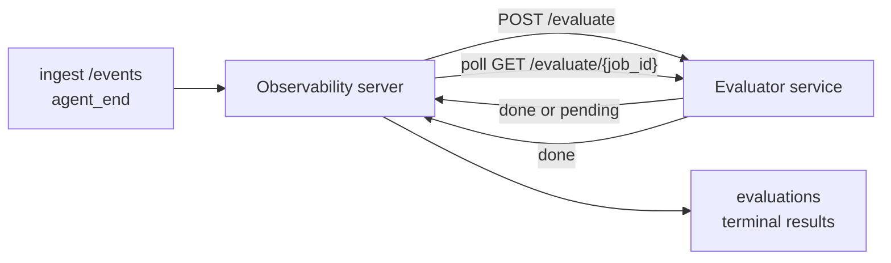

Failproof AI Observability は、完了したすべてのエージェント実行を自動的に品質スコアリングできます。小規模なスコアリングサービスを用意するだけで、残りはObservabilityが処理します。重視する評価軸（有用性、ツール効率、事実性、安全性など）を追跡し、品質低下を早期に検出し、エージェントや環境を一目で比較できます。スコアリングはオプトイン方式で、サーバーに `EVALUATOR_ENDPOINT` を設定するまでパイプラインは何もしません。

> **注意:** スコアの評価軸はご自身で定義します。評価器は任意の数値キーを返すことができ、Observabilityは送り返された内容をすべて保存・トレンド表示・可視化します。

## 概要

1. **スコアラーを作成する。** セッションのトランスクリプトを読み取りスコアを返す、小規模なHTTPサービスを立ち上げます。Observabilityにはすぐに使える参考実装が含まれているのでコピーして利用できます。[SDKを使った評価器の作成](#writing-an-evaluator-with-the-sdk)を参照してください。
2. **ObservabilityにURLを設定する。** サーバープロセスに `EVALUATOR_ENDPOINT`（および共有の `EVALUATOR_TOKEN`）を設定します。
3. **スコアが表示されるのを確認する。** 完了したセッションはすべて自動的にスコアリングされ、セッション詳細ページ・セッション一覧グリッド・保存済みダッシュボードに結果が表示されます。


*評価器を設定すると、完了した各実行にスコアが付き、セッションの右ペインに結果が表示されます。上部にサマリー、次に評価軸ごとのスコアバーと推論が表示されます。*

---

## 仕組み



Observability SDKがセッションの `agent_end` イベントを送信すると、サーバーは評価をスケジュールします。その後、完全なイベントトランスクリプトをPOSTで評価器サービスに送信します。評価器は以下のどちらかの方法で応答できます。

- `{"status":"done", "scores":{...}, "reasoning":{...}, "summary":"..."}` で**インラインで結果を返す**。結果はセッションの評価タイムラインに追記されます。`reasoning` と `summary` はオプションです。
- `{"status":"pending", "job_id":"abc-123"}` で**遅延する**。Observabilityは評価器が `{"status":"done", ...}` または `{"status":"error", "error":"..."}` を返すまで `GET {EVALUATOR_ENDPOINT}/evaluate/abc-123` を呼び続けます。

  ポーリング間隔はジョブ単位で設定できます。`pending` レスポンスに `next_poll_secs` を含めることで上書きできます。含めない場合、Observabilityは `GET /config` の `default_poll_interval_secs` を使用し、それも未設定の場合はサーバーの `EVALUATOR_POLLING_INTERVAL_SECS`（デフォルト10秒）にフォールバックします。すべての値は [1秒, 1時間] の範囲にクランプされます。

`agent_end` を送信しないセッション（クラッシュしたエージェントプロセスなど）も評価対象にできます。評価器の `GET /config` で `{"inactivity_timeout_secs": 1800}` を返すと、Observabilityはその時間アイドル状態のセッションを評価します。このフォールバックを無効にするには、フィールドを `null` にするか省略してください。

`EVALUATOR_ENDPOINT` が未設定の場合、パイプラインは完全にno-opとなります。

1つのセッションは**複数の最終評価を時系列で蓄積できます**。各 `agent_end` イベント（およびダッシュボードからの手動再評価）はそれぞれ新しい評価行を追記します。これは再開した会話を評価するための推奨方法です。ユーザーがエージェントを終了し、後で戻ってきてさらにイベントを送信してエージェントを再度終了すると、更新された完全なトランスクリプトに対して2回目の評価が実行されます。ダッシュボードでは最新の評価がメインで表示され、以前の評価は折りたたみ可能なタイムラインとして表示されます。セッションで1つの評価が実行中の間、そのセッションへの追加の `agent_end` イベントは無視されます。実行中の評価が完了した後に次の `agent_end` が来ると、通常通り新しい評価がキューに追加されます。

アイドル時のフォールバックは再開されたセッションにも適用されます。前回の最終評価後に新しいイベントが届き、セッションが `inactivity_timeout_secs` を超えてアイドル状態になると、新しい評価がキューに追加されます。

一時的なエラー（5xx、429、タイムアウト、ネットワークエラー）は `EVALUATOR_MAX_ATTEMPTS` に達するまで指数バックオフでリトライされます。4xx レスポンスは終端（terminal）として扱われます。Observabilityは水平スケールされた複数のサーバーインスタンスでの運用が安全です。ワークは分散されるため、同じセッションが同時に2回ディスパッチされることはありません。

---

## HTTPコントラクト

認証が必要なすべてのルートは**ベアラートークン認証**を使用します。両側で同じ値を設定する必要があります。

- Observabilityサーバー: 環境変数 `EVALUATOR_TOKEN`
- 評価器サービス: 同様の方法で設定（`agenteye-evaluator` SDKは慣例として `EVALUATOR_TOKEN` を読み取ります）

`EVALUATOR_TOKEN` が未設定の場合、サーバーは `Authorization` ヘッダーを送信しません。評価器は匿名リクエストを受け入れることができますが、これは内部専用ネットワークでは許容されるものの、パブリックインターネット上では推奨されません。

### 評価器が提供する必要があるルート

| ルート | ボディ / パラメーター | レスポンス |
|---|---|---|
| `GET /health` | なし | `{"status":"ok"}` （オープン、認証なし） |
| `GET /config` | なし | `{"inactivity_timeout_secs": <int> \| null, "default_poll_interval_secs": <int> \| omitted}` |
| `POST /evaluate` | `EvalRequest` JSON | `{"status":"done", ...}` または `{"status":"pending", "job_id":"..."}` |
| `GET /evaluate/{id}` | なし | `/evaluate` と同じレスポンス形式 |

### サーバーが送信する `EvalRequest` ボディ

```json
{
  "schema_version": "1",
  "session_id":     "session-abc123",
  "agent_id":       "planner",
  "environment":    "production",
  "started_at":     "2026-05-10T12:00:00Z",
  "ended_at":       "2026-05-10T12:05:00Z",
  "events": [
    { "id": 1234, "ts": "...", "event_type": "agent_start", "payload": { ... } },
    ...
  ]
}
```

### レスポンス形式

**同期（done）:**

```json
{
  "status": "done",
  "scores": { "helpfulness": 0.85, "tool_efficiency": 0.6 },
  "reasoning": {
    "helpfulness": "answered the question directly with citations",
    "tool_efficiency": "called list_files three times when one would have done"
  },
  "summary": "strong answer quality, weak tool selection"
}
```

`reasoning`（スコアごとの根拠マップ）と `summary`（全体的な1段落のナレーション）はどちらもオプションです。`reasoning` のキーは `scores` のキーと対応している必要があります。ダッシュボードは各エントリーをスコアバーの下にインラインで表示します。`scores` のみを返す旧来の評価器はそのまま動作し続けます。`reasoning` と `summary` はnullとして読み取られ、対応するUI要素は省略されます。

**非同期（deferred）:**

```json
{ "status": "pending", "job_id": "abc-123", "next_poll_secs": 30 }
```

`next_poll_secs` はオプションです。省略した場合、サーバーは評価器の `/config` の `default_poll_interval_secs`、次に自身の `EVALUATOR_POLLING_INTERVAL_SECS` 環境変数にフォールバックします。

**評価器側の終端エラー:**

```json
{ "status": "error", "error": "model service unavailable" }
```

サーバーはその他の2xxボディをプロトコルエラーとして扱い、セッションに終端の `error` を記録します。

---

## SDKを使った評価器の作成

HTTPコントラクトを手動で実装する必要はありません。`agenteye-evaluator` Pythonパッケージは、認証・ルーティング・リクエスト/レスポンス形式を処理する型付きのFastAPIラッパーを提供します。

Failproof AI Observabilityには、トランスクリプトの形状から `helpfulness`、`tool_efficiency`、`factuality` をスコアリングする**動作する参考実装の評価器**も含まれています。これを出発点としてコピーし、LLMジャッジ・ルールエンジンなど、品質基準に合った独自のロジックに置き換えてください。

最小構成の評価器:

```python
import os
from agenteye_evaluator import Evaluator, EvalRequest, EvalResponse

app = Evaluator(token=os.environ["EVALUATOR_TOKEN"])

@app.evaluator
def run(req: EvalRequest) -> EvalResponse:
    # Inspect req.events (the full session transcript) and return scores.
    tool_calls = sum(1 for e in req.events if e.event_type == "tool_use")
    return EvalResponse(
        scores={"tool_calls": float(tool_calls)},
        reasoning={"tool_calls": f"{tool_calls} tool invocations in the transcript"},
        summary="tight tool loop" if tool_calls < 5 else "agent looped on tools",
    )
```

`app` インスタンスは任意のASGIサーバーで動作するため、`uvicorn module:app` で起動できます。

高コストな処理を遅延させる必要がある評価器の場合は、代わりに `JobPending` を返して `@app.job_lookup` ハンドラーを登録してください。Observabilityサーバーは評価器が終端ステータスを返すか、`EVALUATOR_MAX_POLL_DURATION_SECS` の上限（デフォルト1時間）が経過するまで `GET /evaluate/{job_id}` をポーリングします。

完全なAPIリファレンス、非同期パターン、およびイベントスキーマは `agenteye-evaluator` SDKのREADMEに記載されています。

---

## 評価器の実行

評価器は**ご自身のサービス**です。Failproof AI Observabilityはデフォルトの評価器を提供しないため、ご自身のサービスを実行している場所で構築・実行してください。任意のASGIサーバー（例：`uvicorn my_evaluator:app`）で動作します。[HTTPコントラクト](#http-contract)の `/health`、`/config`、`/evaluate` ルートを提供し、サーバーにURLを設定してください（[サーバーの設定](#configuring-the-server)を参照）。

評価器にアクセスできるようになると、`GET /health` が `{"status":"ok"}` を返します。エージェントがエンドツーエンドで実行された後、サーバーの `GET /evaluations` は `status: "done"` と評価器が生成したスコアを含む行を返します。

---

## サーバーの設定

サーバープロセスに以下を設定してください。

| 環境変数 | 説明 |
|---|---|
| `EVALUATOR_ENDPOINT` | 評価器のベースURL（`http://evaluator:9000`）。未設定の場合、パイプラインは無効。 |
| `EVALUATOR_TOKEN` | ベアラートークン。評価器サービスに設定された値と一致する必要があります。 |
| `EVALUATOR_WORKERS` | サーバーインスタンスごとのワーカータスク数（デフォルト2）。 |
| `EVALUATOR_CLAIM_BATCH` | ワーカーティックごとに取得する行数（デフォルト4）。バッチは**並行**して処理されます。評価器エンドポイントの実効並行数は `EVALUATOR_WORKERS × EVALUATOR_CLAIM_BATCH` です。 |
| `EVALUATOR_POLL_IDLE_SECS` | 評価が予定されていないときにワーカーがディスパッチ試行の間にスリープする時間（デフォルト2秒）。 |
| `EVALUATOR_POLLING_INTERVAL_SECS` | レスポンスごとの `next_poll_secs` も評価器の `default_poll_interval_secs` も設定されていない場合の `GET /evaluate/{id}` の最終フォールバック間隔（デフォルト10秒）。 |
| `EVALUATOR_REQUEST_TIMEOUT_MS` | リクエストごとのタイムアウト（デフォルト30000）。 |
| `EVALUATOR_MAX_ATTEMPTS` | この回数の一時的な失敗の後、結果は終端の `error` として記録されます（デフォルト5）。 |
| `EVALUATOR_CONFIG_REFRESH_SECS` | `GET /config` の呼び出し間隔（デフォルト300）。 |
| `EVALUATOR_MAX_POLL_DURATION_SECS` | セッションがポーリングキューに残ることができる最大の実経過時間。この時間を超えると `timeout` として終了します（デフォルト3600秒）。評価器が `pending` を返し続ける状況を防ぎます。 |

自動スコアリングを有効にするには、サーバーに `EVALUATOR_ENDPOINT` と `EVALUATOR_TOKEN` の両方を設定し、サーバーを再起動して変更を反映させてください。`EVALUATOR_ENDPOINT` が未設定の場合、パイプラインはno-opのままです。

上記のチューニングパラメーターはオプションです。デフォルト値を上書きする必要がある場合のみ、サーバーの対応する環境変数を設定してください。

---

## APIリファレンス

| メソッド | パス | 必要な権限 | 目的 |
|---|---|---|---|
| `GET` | `/evaluations` | `evaluations:read` | 最終結果をクエリします。`session_id`、`agent_id`、`environment`、`status`（`done`/`error`/`timeout`）、`ts_from`、`ts_to`、`cursor`、`limit`、`score_filters`、`latest_per_session` をサポートします。`limit` はデフォルト50で200が上限です（1000が上限の `/events` とは異なります）。`environment` はカンマ区切りリストを受け付けます（例：`environment=prod,staging`）。単一の値も引き続き機能します。`latest_per_session=true` を指定すると、レスポンスは `session_id` ごとに最大1行（`completed_at` が最新のもの）を含み、セッションの評価タイムラインを現在のメインに折りたたむセッション一覧ページで使用されます。デフォルトはfalse（完全な履歴を返します）。 |
| `GET` | `/evaluations/aggregate` | `evaluations:read` | フィルタリングされたスライスの集計eval健全性を返します。総数、done/error/timeoutの内訳、スコアキーごとの統計（任意の `scores` キーのcount/avg/min/max/p50）、時間バケットのタイムラインが含まれます。`/evaluations` と**同じフィルターパラメーター**に加えて `featured_keys`（トレンドするスコアキーのCSV）と `latest_per_session` を受け付けます。ダッシュボード機能を提供します。メトリクスはサンプリングではなく、一致するセット全体に対して正確に計算されます。 |
| `GET` | `/evaluations/environments` | `evaluations:read` | `evaluations` テーブルの個別の環境値を返します。評価データにスコープされたフィルタードロップダウンの入力に使用されます。 |
| `GET` | `/evaluation-jobs` | `evaluations:read` | 進行中の評価の可視性を提供します。`status`（`pending`/`polling`）でフィルタリングできます。 |
| `GET` | `/events` | `events:read` | セッションの生のイベントをストリームします。`session_id`、`agent_id`、`event_type`（CSV）、`environment`（CSV）、`ts_from`、`ts_to`、`cursor`、`limit`、`order` をサポートします。`order` は `desc`（最新優先、デフォルト）または `asc`（古い順）で、認識できない値は `desc` にフォールバックします。レスポンスの `next_cursor`（イベントID）を使ってカーソルページネーションを行います。`cursor` として渡すと次のページを取得できます。`asc` ではそのIDより後のイベント、`desc` ではそのIDより前のイベントが返されます。`limit` はデフォルト50で1000が上限です。 |
| `GET` | `/sessions/:session_id/export` | `events:read` | このセッションに対して評価器が受け取るJSONボディをそのまま返し、`session-<id>.json` という名前のダウンロード可能な添付ファイルとして提供します。本番セッションを `agenteye-evaluator` でオフラインテスト用に再生するのに便利です。バイトは評価器パイプラインが送信するものとバイト単位で同一です。 |
| `POST` | `/sessions/:session_id/re-evaluate` | `evaluations:trigger` | セッションの新しい評価をキューに追加します。以前の評価が存在するかどうかに関わらず実行されます。新しい結果は前のものを上書きするのではなく、セッションの評価タイムラインに**追記**されるため、以前のスコアは履歴として残ります。キュー追加時に `202`、セッションが不明な場合は `404`、評価がすでに実行中の場合は `409` を返します。新しい評価器をデプロイした後、または `agent_end` を送信しなかったセッションに使用します。 |

### スコア範囲によるフィルタリング: `score_filters`

`GET /evaluations` は `scores` オブジェクト内の数値でResults を絞り込むオプションの `score_filters` パラメーターを受け付けます。パラメーターは `key:min..max` エントリのカンマ区切りリストで、どちらの境界も省略できます。複数のエントリは論理ANDで結合されます。指定されたキーが存在しないか数値でない行は除外されます。1リクエストにつき最大20件のフィルターエントリを設定できます。超過した場合はHTTP 400が返されます。

例:
```text
# helpfulness in [0.5, 0.8]
GET /evaluations?score_filters=helpfulness:0.5..0.8

# tool_efficiency at most 0.3 (no lower bound)
GET /evaluations?score_filters=tool_efficiency:..0.3

# helpfulness >= 0.5 AND factuality >= 0.9
GET /evaluations?score_filters=helpfulness:0.5..,factuality:0.9..
```

各 `/evaluations` レスポンスオブジェクトには以下のフィールドがあります。

| フィールド | 型 | 備考 |
|---|---|---|
| `evaluation_id` | string (UUID) | この最終評価の正規識別子。各最終評価に新しいUUIDが割り当てられます。1つのセッションが複数持つことができます。 |
| `id` | string (UUID) | `evaluation_id` と同じ値を持つ後方互換性のエイリアス。 |
| `session_id` | string | この評価が実行されたセッション。1つのセッションはタイムライン内に複数の評価を持つことができます。 |
| `agent_id` | string | セッションを生成したエージェントを識別します。 |
| `environment` | string | セッションからコピーされた環境ラベル。 |
| `status` | enum | `"done"`、`"error"`、`"timeout"` のいずれか。 |
| `scores` | object \| null | 評価器が返したスコア。 |
| `reasoning` | object \| null | 評価器が返したオプションのスコアごとの根拠マップ。キーは通常 `scores` のキーと対応しています。ダッシュボードは各エントリーをスコアバーの下に表示します。 |
| `summary` | string \| null | 評価器が返したオプションの全体的な1段落のナレーション。ダッシュボードはこれをスコア内訳の上部に評価のメインとして表示します。 |
| `error` | string \| null | `"error"` / `"timeout"` の場合のみ入力されます。 |
| `attempt_count` | integer | ディスパッチ試行回数（1以上）。 |
| `duration_ms` | integer \| null | 最後の試行の所要時間。 |
| `completed_at` | string (ISO 8601 UTC) | 最終結果が記録された日時。結果は `completed_at`（最新順）でソートされます。 |
| `created_at` | string (ISO 8601 UTC) | `completed_at` と同じタイムスタンプ（書き込み一回のセマンティクス）。 |

---

## 権限

| 権限 | 付与する機能 |
|---|---|
| `evaluations:read` | 評価結果の一覧表示、ダッシュボードでのスコア表示、ダッシュボード健全性メトリクスの読み込み。 |
| `evaluations:trigger` | `POST /sessions/:session_id/re-evaluate` またはダッシュボードの再評価ボタンを通じて、セッションの評価を手動でキューに追加する。 |
| `dashboards:read` | 保存済みダッシュボードの表示（メトリクスの読み込みには `evaluations:read` も必要）。 |
| `dashboards:write` | ダッシュボードの作成・編集。 |
| `dashboards:delete` | ダッシュボードの削除。 |

ブートストラップ管理者（`ADMIN_KEY`、`ADMIN_EMAIL`）はこれらすべてを自動的に受け取ります。

---

## 結果の表示

- **`/sessions/<id>`**: イベントタイムライン + セッションのスコアとディスパッチ試行のエラーを表示する右ペイン。キーに `evaluations:trigger` 権限があると、エクスポートボタンの隣に**再評価**ボタンが表示されます。`agent_end` を送信しなかったセッションや、新しい評価器をデプロイした後のスコア更新に便利です。ダッシュボードは新しい結果をポーリングし、結果が得られると右ペインを更新します。
- **`/sessions`**: フィルタリング可能なセッショングリッド。スコア列には各セッションの評価ステータスとスコアが一目でわかるように表示されます。
- **`/dashboards`**: 保存済みのeval健全性ビュー（後述の[ダッシュボード](#dashboards)を参照）。


*セッショングリッドには各実行の評価ステータスとスコアが一目でわかるように表示されます。赤/黄/緑のバッジで低スコアが目立ちます。*

---

## ダッシュボード

**ダッシュボード**ページ（`/dashboards`）では、評価フィルターの組み合わせを名前付きの再利用可能なビューとして保存し、その評価のスライスがどのような状態かを一目で確認できます。ダッシュボードは**組織全体で共有**されます。`dashboards:read` を持つ全員が同じセットを表示できます。

各ダッシュボードには以下が固定されます。

- **フィルター**: セッションページと同じコントロール（環境、ステータス、エージェント、ローリング時間ウィンドウ、スコア範囲フィルター（`key:min..max`））。
- **表示設定**: 注目するスコアキー、緑/黄/赤の健全性しきい値、表示するパネル、セッションごとに最新の評価に折りたたむかどうか。

各カードには、一致するセッション数、done/error/timeoutの内訳、注目する各スコアの平均値、小さなトレンドスパークラインが表示されます。ダッシュボードを開くとフルサイズのパネルが表示されます。**「セッションで開く」**をクリックすると、そのスライスにプリフィルターされたセッションページに移動します。メトリクスはサーバー側で一致するセット全体に対して計算されます（`GET /evaluations/aggregate` 経由）。数値はサンプリングではなく正確な値です。


**権限:** 表示には `dashboards:read` と `evaluations:read` の両方が必要です。作成・編集には `dashboards:write` が必要です。削除には `dashboards:delete` が必要です。ブートストラップ管理者はこれらすべてを自動的に受け取ります。

---

## トラブルシューティング

**セッションは存在するが評価が作成されない。** サーバープロセスに `EVALUATOR_ENDPOINT` が設定されていること、サーバーと評価器が同じ `EVALUATOR_TOKEN` 値を共有していること、評価器の `/health` エンドポイントがサーバーからアクセスできることを確認してください。`EVALUATOR_ENDPOINT` が未設定の場合、パイプラインはno-opです。

**進行中の評価が積み上がる。** `GET /evaluation-jobs` をクエリして進行中のキューを確認してください。各行の `attempt_count`、`next_attempt_at`、`last_error` を確認してください。一般的な原因：評価器サービスにアクセスできないまたは5xxを返している（バックオフでリトライ）、`EVALUATOR_TOKEN` が間違っている（401は終端）、または `pending` を返し続ける非同期評価器（後述）。

**セッションは完了しているが最終評価がない。** `GET /evaluation-jobs?status=polling` をクエリしてください。まだ進行中かもしれません。ジョブが `pending` で止まっている場合、サーバーが評価器に接続できていません。評価器が起動していること、`EVALUATOR_TOKEN` が一致していることを確認してください。

**`HTTP 401 from evaluator: invalid bearer token`.** サーバーの `EVALUATOR_TOKEN` が評価器サービスに設定された値と一致していません。両者は完全に同一である必要があります。

**非同期評価器が `pending` を返し続ける。** サーバーは評価器が `done` または `error` を返すか、`EVALUATOR_MAX_POLL_DURATION_SECS`（デフォルト1時間）が経過するまで `GET /evaluate/{job_id}` をポーリングします。上限に達すると、評価は `timeout` として記録され、進行中のキューから削除されます。評価器が正当にデフォルトより長い時間を必要とする場合は、`EVALUATOR_MAX_POLL_DURATION_SECS` を増やしてください。

---

## 次のステップ

- [評価器エージェントスキル](/ja/agenteye/evaluator-skill): コーディングエージェントを使って、実際のセッションを基に評価軸を設計し、このサービスを構築させます。
- [Python SDK](/ja/agenteye/python-sdk): スコアリングをトリガーする `agent_end` イベントを送信します。
- [APIキー](/ja/agenteye/api-keys): `evaluations:read` と `evaluations:trigger` 権限。
- [監査](/ja/agenteye/audits): ポリシーベースのレビューを行うObservabilityのもう1つの自動品質機能。