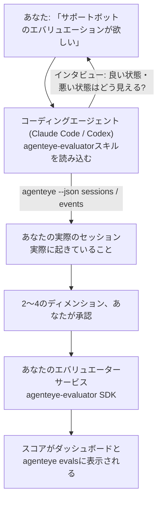

「エージェントの品質が良くない気がする」という状態から、スコアリングサービスのデプロイまで、コーディングエージェントが設計とビルドの両方を担います。**Failproof AI Observability エバリュエータースキル**（`agenteye-evaluator`）は *Agent Skill* です。Claude Code や Codex などのコーディングエージェントがオンデマンドで読み込む、小さなフォルダー形式の指示セットです。このスキルにより、エージェントは*あなたの*エージェントにとってトラッキングすべき品質ディメンションを特定し、それらをスコアリングする[エバリュエーターサービス](/ja/agenteye/evaluation-suite)を記述・テスト・デプロイできるようになります。

これはホスト型スコアラーでも、アップロード先のレジストリでも、プラグインシステムでもありません。エバリュエーターは[Evaluation suite](/ja/agenteye/evaluation-suite)ガイドに記載されているとおり、あなた自身のインフラ上で動作するHTTPサービスとして完全にあなたのものです。スキルはエージェントがそれをうまく構築できるよう教えるだけであり、エージェントが行うことはすべて、あなた自身が同じコードを書くことでも実現できます。

---

## 難しいのは「何をスコアリングするか」を決めること

SDKのインターフェースは小さく、デコレーターとふたつのモデルだけです。エージェントは[コントラクト](/ja/agenteye/evaluation-suite#http-contract)だけからそれを書けます。エバリュエーターが失敗する理由はそこではありません。間違ったものをスコアリングするから失敗するのです。そして間違ったものをスコアリングするエバリュエーターは、ないよりも悪いです。誰もが無視するようになるダッシュボードを生み出すからです。

そのため、スキルの大半はコードが存在する前の段階に費やされます。エージェントがあなたにインタビューし（「うまくいった実行を説明してください。次に、うまくいかなかったものを」）、[`agenteye` CLI](/ja/agenteye/cli)を使って実際のセッションを取得し、最初から最後まで読み込みます。この2つの半分は往々にして食い違います。そしてそのギャップこそが重要な点です。つまり、あなたが測定しようとしているものと、実際のトランスクリプトがサポートできるものの差異です。ディメンションが生き残るのは、イベントから**計算可能**であり、かつ**識別力がある**場合のみです。良い実行と悪い実行の両方で0.9のスコアが出るなら、何も教えてくれないため除外されます。

返ってくるのは、根拠を添えた2〜4のディメンションの提案であり、1行のコードが書かれる前にあなたが承認します。



---

## 他のエバリュエーション関連ドキュメントとの関係

スコアリングに関するドキュメントは4つあり、順番に引き継がれます。

| ページ | 内容 | 使いどき |
|---|---|---|
| **[Evaluations](/ja/agenteye/evaluations)** | 機能：セッショングリッドのスコア、ダッシュボード、再評価 | 自動スコアリングで何が得られるか知りたいとき |
| **[Evaluation suite](/ja/agenteye/evaluation-suite)** | HTTPコントラクト、SDK、サーバー環境変数 | エバリュエーターを自分で実装またはデバッグするとき |
| **エバリュエータースキル**（本ドキュメント） | スコアラーの設計と構築への自然言語インターフェース | 「エバリュエーションが欲しい」から稼働サービスまでたどり着きたいとき |
| **[CLIスキル](/ja/agenteye/cli-skill)** | `agenteye` CLIへの自然言語インターフェース | すでにあるスコアを*読み取り*たいとき |
| **[Python SDKスキル](/ja/agenteye/python-sdk-skill)** | エージェントのインスツルメンテーションへの自然言語インターフェース | エージェントがまだセッションを出力していない — スコアリングするものがないとき |

### CLIスキルとの違い：構築か読み取りか

2つのスキルは意図的に重複しないよう設計されており、両方インストールするのが通常のセットアップです。エージェントはあなたのリクエストに基づいて使い分けます。

- **`agenteye-evaluator`**（本ドキュメント）はスコアを*生み出す*ものを構築します。スコアが初めて表示された時点でその役割は終わります。
- **[`agenteye-cli`](/ja/agenteye/cli-skill)** はすでに存在するスコアを読み取ります（`agenteye evals`）。「今週、品質は落ちましたか？」という問いに答えるのはこちらであり、本スキルの役割ではありません。

---

## 前提条件

1. **`agenteye` CLIのインストールとログイン**（`pipx install agenteye`、次に`agenteye login`）。スキルはこれを2回使います：設計の基となる実際のセッションを取得するときと、最後にスコアが反映されたことを確認するときです。ログインには`events:read`と、最終確認のために`evaluations:read`が必要です。CLIスキルと同様に、メールで送られるワンタイムコードのログインを代わりに完了させることは**できません**。
2. **エバリュエーターの置き場所。** イメージとしてビルドされ、常駐サービスとして実行されるため、一時ファイルではなく実際のリポジトリが必要です。エバリュエーターはスコアリング対象のエージェントとは別のリポジトリに置かれることが多く、スキルは既存のリポジトリを探し、新たにスキャフォールドする前に確認を求めます。
3. **`agenteye-evaluator` SDK wheel** — エージェントが`pip`コマンドを打ち始める前に次のセクションを読んでください。

---

## 入手方法

スキルはFailproof AIの公開スキルコレクションで公開されています：

**[github.com/FailproofAI/skills](https://github.com/FailproofAI/skills)** → [`skills/agenteye-evaluator/`](https://github.com/FailproofAI/skills/tree/main/skills/agenteye-evaluator)

リポジトリは公開されており、スキル自体には固有の認証情報は不要です。あなたがログインしているセッションで`agenteye` CLIを操作し、*あなたの*リポジトリにコードを書くだけです。スキルは独自のフォルダーとして提供されており、`pipx install agenteye`パッケージには含まれていないことに注意してください。

## スキルのインストール

最も手軽な方法は[`skills`](https://skills.sh) CLIです。フォルダーを取得してエージェントが参照する場所に配置します：

```bash
# Claude Code、このプロジェクトのみ
npx skills add FailproofAI/skills --skill agenteye-evaluator -a claude-code

# すべてのプロジェクト（~/.claude/skills/ にインストール）
npx skills add FailproofAI/skills --skill agenteye-evaluator -a claude-code -g --copy

# Codexの場合
npx skills add FailproofAI/skills --skill agenteye-evaluator -a codex
```

その後は他のスキルと同様に管理できます：

```bash
npx skills list -a claude-code           # インストール済みのスキルを確認
npx skills update agenteye-evaluator     # 最新バージョンに更新
npx skills remove agenteye-evaluator     # 削除
```

手動でインストールしたい場合も可能です。Agent Skillは`SKILL.md`（とオプションの参照ファイル）を含むフォルダーにすぎないため、コピーするだけでも動作します：

- **Claude Code**: `agenteye-evaluator/`フォルダーを`~/.claude/skills/`（すべてのプロジェクト）または`<your-repo>/.claude/skills/`（そのリポジトリのみ）に置きます。Claude Codeが自動的に認識します。`/skills`リストで確認するか、エバリュエーションについて質問してみてください。
- **Codex（OpenAI）**: Codexも同じ`SKILL.md`を読みます。バンドルされている`agents/openai.yaml`が`allow_implicit_invocation: true`を設定しているため、タスクが一致した場合にCodexが自動的にスキルを選択します。それ以外の場合は`$agenteye-evaluator`として明示的に呼び出してください。

---

## SDKは公開PyPIにはありません

> **警告:** エージェントにSDKをインストールさせる前に必ずお読みください。

スキルは公開されていますが、それが使用するSDKは公開されていません。`agenteye-evaluator`はプライベートリリースのアーティファクトとしてのみ提供されており、`agenteye`とは異なり、その名前は**公開PyPIで未請求**です。つまり、裸の`pip install agenteye-evaluator`を実行すると、第三者のパッケージを本番のトランスクリプトを読み取るサービスに取り込んでしまう可能性があります。これはタイポではなく、サプライチェーンの問題です。

スキルはこれを把握しており、代わりにインストールの優先順位に従って動作します。最初に該当する段階で停止します：AgentEyeリポジトリ内にいる場合はモノリポのソース、それ以外の場合はGitHub Releasesのプライベートリリースwheel（アクセス権が必要）、どちらにもアクセスできない場合は**即興せずに、Failproof AIの担当者にwheelを問い合わせるよう伝えて停止します**。

エージェントが公開PyPIからの裸の`pip install agenteye-evaluator`を提案した場合、それはスキルが読み込まれていないサインです。その場でインストールを確認してください。

---

## 使い方の例

実際のやり取りは漠然とした依頼から始まり、コードが書かれる前に承認済みの設計で終わります：

```text
あなた ▸ サポートボットのエバリュエーションが欲しいです。品質が良くない気がします。

エージェント ▸ 何かを書く前に確認させてください：うまくいった実行を説明してください。
               次に、うまくいかなかった実行を説明してください。

あなた ▸ 良い例：ドキュメントから回答する。悪い例：でたらめを言う、
         または諦めて「サポートに連絡してください」と言う。

エージェント ▸ 実行中: agenteye --json sessions --status error --since 7d
               5つのセッションを読み込んでいます。うち2つが悪い例です。

               あなたの言葉は「事実性」と「回避」を示しています。トランスクリプトは
               回避については一致しています（5件中2件がサポートへの引き継ぎで終わっており、
               model_response.contentから明確にわかります）。しかし事実性には
               イベントに含まれていないグラウンドトゥルースが必要です。

               そこで3つをスコアリングします：
                 - deflection      ルールベース、低コスト、2つの実行を区別できる
                 - tool_efficiency ルールベース、run-004のリトライループを検出
                 - groundedness    LLMジャッジ：すべての主張が取得したドキュメントに含まれているか？

               「事実性」にはグラウンドトゥルースが必要ですが用意できません。groundednessは
               トランスクリプトが実際にサポートできる最も近い指標です。
               この3つの名前で進めていいですか？後から変更すると履歴が分断されます。

あなた ▸ はい

エージェント ▸ このリポジトリにエバリュエーターが見つかりません。ここにスキャフォールドしますか、
               それとも他にリポジトリがありますか？
```

その後、ルールベースのディメンションから先に記述します（無料、即時、決定論的）。空のセッションや未完了のセッションも含む実際のキャプチャされたセッションに対してテストします（ナイーブなエバリュエーターはこれでクラッシュします）。主観的なディメンションにのみLLMジャッジを使います。[ディスパッチャーの制限](/ja/agenteye/evaluation-suite#configuring-the-server)（リクエストタイムアウト30秒、デプロイ全体で同時8コール）を把握しているため、ジャッジが確実に収まらない場合は、5倍のコストで5回キャンセルと再試行が繰り返されるよりも、`JobPending`で非同期処理します。

その後デプロイし、2つのサーバー環境変数を設定し、`agenteye --json evals --session-id <id>`でスコアが実際に反映されたことを確認します。スコアが反映されることが唯一の証明です。

---

## 注意事項

- **ディメンション名はほぼ永続的です。** スコアキーは任意の文字列であり、プラットフォームは送信したものをトレンドとして追跡します。つまり、ダウンストリームで誤った選択を修正する仕組みはありません。後から名前を変えると履歴が分断されます：古いセッションは古いキーを保持し、トレンドが壊れます。スキルがコードを書く前に明示的な承認を求めるのはこのためです。そのプロンプトを真剣に受け止めてください。
- **フィクスチャーは実際の本番トランスクリプトです。** 実際のセッションを基に設計するということは、それらをディスクに取得することを意味し、顧客データが含まれている可能性があります。スキルはgitにコミットする前に確認を求めます。不安な場合は`fixtures/`をリポジトリから除外し、各開発者が自分自身でセッションを取得するようにしてください。
- **エージェントはすべてのトランスクリプトを読み取るサービスを構築・デプロイします。** CLIログインの権限の範囲内であなたとして動作しますが、本番データに触れる他のコードと同様にエバリュエーターをレビューしてください。

---

## 次のステップ

- **[Evaluation suite](/ja/agenteye/evaluation-suite)**：スキルが設定するHTTPコントラクト、SDK、サーバー環境変数。
- **[Evaluations](/ja/agenteye/evaluations)**：スコアが反映された後に表示される場所。
- **[CLIスキル](/ja/agenteye/cli-skill)**：スコアラーを構築するのではなく結果を読み取るための兄弟スキル。
- **[CLI](/ja/agenteye/cli)**：スキルが設計の基として使うセッションデータのコマンドリファレンス。