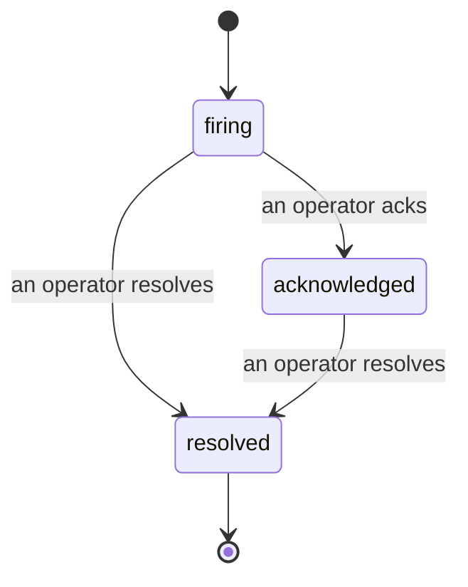

アラートが発火したとき、最初の疑問は常に「誰が対応しているか？」です。インシデントはその答えです。何かが閾値を超えた瞬間、全員がインシデントの開始、担当者、これまでの経緯を確認できます。そのクリーンで帰属情報付きの記録は、そのままポストモーテムに渡せます。

*受信トレイはオープン中のインシデントを状態ごとにグループ化し、重大度や担当者でフィルタリングできるため、今すぐ人の対応が必要なものだけを確認できます。*

## 担当者を一目で把握する

チャットで「誰か見てる？」とやり取りする必要はもうありません。閾値を超えると自動的にインシデントが開き、状態ごとにグループ化された共有の受信トレイに投入されます。確認（Acknowledge）すると自分の名前が表示され、他のチームメンバーは対応済みとわかります。確認は共有されます。複数のオペレーターが同じインシデントを確認でき、それぞれが個別に記録されるため、ウォールームに集まったメンバー全員が名前で表示され、お互いの作業が上書きされることはありません。トリアージ用のオーナーを一人アサインし、受信トレイを重大度や担当者でフィルタリングして自分に関係するものに絞り込みましょう。

## 全経緯を一本のタイムラインで

インシデントが終わったとき、すでに振り返りの記録が手元にあります。任意のインシデントを開くと、閾値超過のエビデンス、担当者とサブスクライバー、その場で調整するためのコメントスレッド、そして追記のみ可能なアクティビティタイムラインが確認できます。

*起きたことすべてが時系列で並び、各行に実行者が記名されています。*

すべてのアクション（オープン、確認、解決など）はタイムラインに書き込まれ、編集されることはありません。各エントリには帰属情報が付きます。操作を行ったオペレーターのメールアドレス、または Failproof AI Observability が自動的に行った処理（閾値超過時のインシデント開始など）の場合は **automated** と表示されます。匿名の操作はなく、何も失われないため、ポストモーテムはほぼ自動的に出来上がります。

## インシデントの遷移

- **オープン（firing）：** 閾値超過によりインシデントが開き、チャンネルへ一度通知されます。繰り返し発生した閾値超過は同じインシデントに統合され、何度も通知する代わりにエビデンスが更新されます。
- **確認済み（acknowledged）：** オペレーターが引き受けます。インシデントはオープンのままで、その後の閾値超過はエビデンスを静かに更新します。
- **解決済み（resolved）：** オペレーターがクローズします。条件がクリアされたときの自動解決は計画中ですがまだ有効化されていないため、人間が解決するまでインシデントはオープンのままです。これにより、実際に何がクリアされたかについて全員が正直でいられます。同じアラートで後から新たなインシデントを開くことができます。

1つのアラートに対してオープン中のインシデントは最大1つまでです。そのため、フラッピングするルールによって重複インシデントが大量に発生することはありません。手動でインシデントを開くこともできます。アラートが検知しなかった事象に対してスタンドアロンで開くか、既存のアラートに紐付けて開くかを選べます（`incidents:write` が必要です）。

## 場所

インシデントは `/<org-slug>/incidents` にあります。閲覧には **`incidents:read`**、手動インシデントの開始には **`incidents:write`**、確認・アサイン・コメント・解決には **`incidents:ack`** が必要です。廃止された `alerts:ack` を付与された古いキーは引き続き動作します。`incidents:ack` として扱われるため、オンコールのローテーションを再発行する必要はありません。

## 関連

- [アラート](/ja/agenteye/alerts)：閾値超過時にインシデントを開くルール。
- [エラートラッキング](/ja/agenteye/error-tracking)：すべての障害を一箇所で確認し、アラートに昇格させる。
- [監査](/ja/agenteye/audits)：ルールが監視していなかった障害を発見するスケジュール型アナリスト。