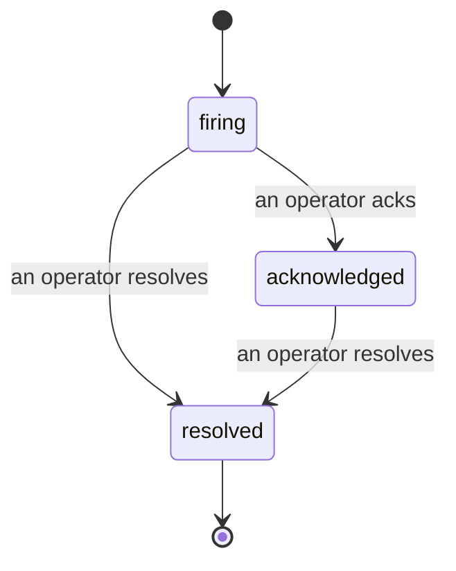

アラートが発火したとき、最初に浮かぶ疑問は常に「誰が対応しているのか？」です。インシデントはその答えを提供します。何かが閾値を超えた瞬間、インシデントがオープンされたこと、誰が担当しているか、そしてこれまでに何が起きたかを全員が把握できます。ポストモーテムにそのまま使えるきれいな記録も残ります。

*受信箱ではオープンなインシデントが状態別にグループ化され、重大度や担当者でフィルタリングできるため、今すぐ人が対応すべきものが一目でわかります。*

## 誰が対応中か、ひと目でわかる

「誰か見てる？」とチャットで聞き回る必要はもうありません。閾値を超えると自動的にインシデントが作成され、状態別にグループ化された共有受信箱に追加されます。確認（Acknowledge）すれば自分の名前が表示され、チームの他のメンバーは対応済みだとわかります。確認はそれぞれ個別に記録されるため、複数のオペレーターが同じインシデントを確認してもそれぞれの名前が残り、ウォールームのメンバーが重複して表示されることもありません。トリアージ担当者を一人アサインし、重大度や担当者でフィルタリングすれば、自分に関係するものだけに絞り込めます。

## すべての経緯が、1つのタイムラインに

インシデントが解決した時点で、すでに記録は完成しています。インシデントを開くと、閾値超過の証拠、担当者とサブスクライバー、その場で調整するためのコメントスレッド、そして追記専用のアクティビティタイムラインが確認できます。

*発生したすべての出来事が時系列で並び、各行に実行者が明記されています。*

すべてのアクション（オープン、確認、解決など）はタイムラインに書き込まれ、削除・編集はできません。各エントリーには帰属情報が付与されます。操作を行ったオペレーターのメールアドレス、または FailproofAI Observability が自動的に実行した場合（閾値超過によるインシデントの自動作成など）は **automated** と記録されます。匿名の操作はなく、情報が失われることもないため、ポストモーテムはほぼ自動的に完成します。

## インシデントの状態遷移

- **オープン（firing）：** 閾値超過によってインシデントが作成され、設定されたチャンネルに一度通知が送られます。同じインシデントへの繰り返しの閾値超過は同一インシデントにまとめられ、証拠が更新されるだけで再度通知は送られません。
- **確認済み（acknowledged）：** オペレーターが対応を引き受けた状態です。インシデントはオープンのままで、その後の閾値超過は静かに証拠を更新します。
- **解決済み（resolved）：** オペレーターがクローズした状態です。条件がクリアされた際の自動解決は計画中ですが、まだ有効ではありません。そのため、インシデントは人間が解決するまでオープンのままになります。これにより、実際に何が解決されたかについての透明性が保たれます。同じアラートで後から新しいインシデントが作成されることもあります。

1つのアラートに対してオープンなインシデントは常に最大1件です。そのため、ルールがフラッピングしても重複インシデントに埋もれることはありません。`incidents:write` 権限があれば、手動でインシデントを作成することもできます。アラートが検知していない事象のためのスタンドアロンインシデントや、既存のアラートに紐づけたインシデントも作成可能です。

## アクセス方法

インシデントは `/<org-slug>/incidents` にあります。閲覧には **`incidents:read`**、手動インシデントの作成には **`incidents:write`**、確認・アサイン・コメント・解決には **`incidents:ack`** が必要です。廃止された `alerts:ack` が付与されている古いキーも引き続き機能します。`incidents:ack` として扱われるため、オンコールローテーションを再設定する必要はありません。

## 関連ドキュメント

- [アラート](/ja/agenteye/alerts)：閾値超過時にインシデントを作成するルールです。
- [エラートラッキング](/ja/agenteye/error-tracking)：すべての障害を一か所で確認し、アラートに昇格させることができます。
- [監査](/ja/agenteye/audits)：どのルールも監視していなかった障害を発見するスケジュール型アナリストです。