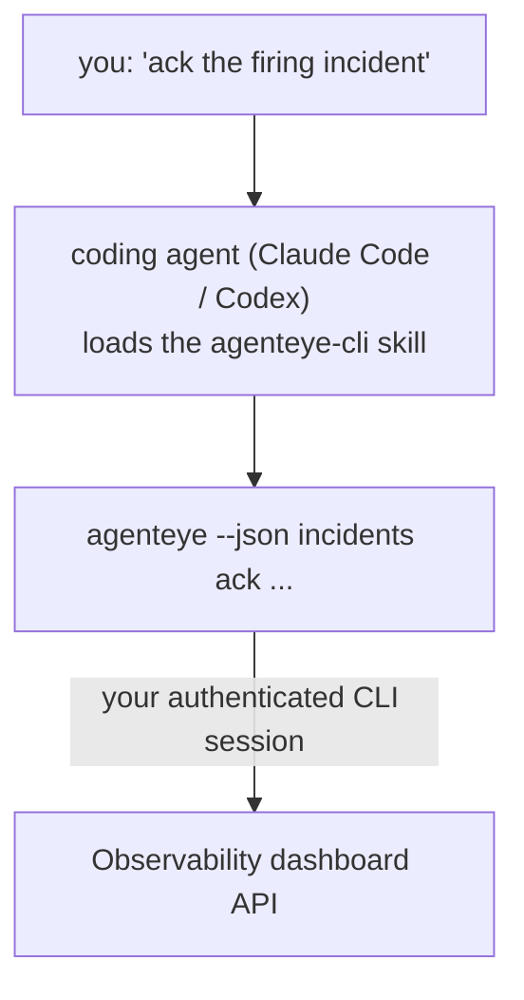

코딩 에이전트에게 *"오늘 뭔가 망가진 게 있어?"* 라고 물어보면, 명령어를 외울 필요 없이 실시간 Failproof AI Observability 데이터를 기반으로 답변을 받을 수 있습니다. **Failproof AI Observability CLI 스킬** (`agenteye-cli`)은 *에이전트 스킬*입니다. Claude Code나 Codex 같은 코딩 에이전트가 필요할 때 불러오는 소규모 지침 폴더로, *"이벤트만 푸시할 수 있는 CI 키를 만들어줘"* 또는 *"발화 중인 인시던트를 ack하고 나에게 할당해줘"* 같은 자연어 요청으로 [`agenteye` CLI](/ko/agenteye/cli)를 통해 Observability 배포를 다루는 방법을 에이전트에게 가르쳐 줍니다.

이것은 **서비스나 별도의 바이너리가 아닙니다**. 배포할 것이 없습니다. 이미 설치한 CLI 위에서 동작합니다. 에이전트가 `agenteye --json …` 을 셸로 실행하고, 깔끔한 JSON을 파싱하여 일반 텍스트로 답변합니다. 에이전트가 할 수 있는 모든 것은 동일한 명령어를 직접 입력해서 할 수 있습니다.

---

## 다른 Failproof AI Observability 인터페이스와의 관계

Failproof AI Observability는 동일한 데이터와 제어에 접근하는 네 가지 방법을 제공합니다. 각 방법은 서로를 보완합니다:

| 인터페이스 | 설명 | 실행 위치 | 사용 시점 |
|---|---|---|---|
| **[CLI](/ko/agenteye/cli)** | `agenteye`의 명령/플래그 레퍼런스 | 터미널 | 특정 명령을 실행하거나 스크립팅할 때 |
| **[CLI 레시피](/ko/agenteye/cli-recipes)** | 복사해서 쓰는 `jq`/파이프라인 패턴 | 터미널 / 스크립트 | CLI를 자동화에 연결할 때 |
| **CLI 스킬** (이 문서) | CLI 위의 자연어 인터페이스 | 워크스테이션의 코딩 에이전트 | 그냥 물어보고 에이전트가 명령을 고르게 하고 싶을 때 |
| **[평가자 스킬](/ko/agenteye/evaluator-skill)** | 채점 서비스를 설계하고 구축하는 형제 스킬 | 워크스테이션의 코딩 에이전트 | 평가 점수를 *읽는* 것이 아니라 *생성*하고 싶을 때 |
| **[Python SDK 스킬](/ko/agenteye/python-sdk-skill)** | 에이전트가 텔레메트리를 내보내도록 계측하는 형제 스킬 | 워크스테이션의 코딩 에이전트 | 에이전트가 이 스킬이 읽는 이벤트를 *생성*하게 하고 싶을 때 |
| **[대시보드 내 AI 어시스턴트](/ko/agenteye/assistant)** | 대시보드에 내장된 채팅 | 서버 사이드 (대시보드 내) | 대시보드 내에서 데이터에 대한 Q&A를 원할 때 |

스킬 자체는 고유한 권한이 없습니다. 단지 여러분의 말을 CLI 호출로 변환하여 여러분의 권한으로 실행합니다:



### 대시보드 내 AI 어시스턴트와의 비교: 중요한 차이점

이 두 도구는 영향 범위가 매우 다릅니다:

- **대시보드 내 AI 어시스턴트** ([AI 어시스턴트](/ko/agenteye/assistant))는 에이전트 서비스를 기반으로 대시보드에 내장된 채팅입니다. **읽기 전용 + 승인 기반 저작** 기능을 제공합니다. 저장된 쿼리와 대시보드를 초안으로 작성할 수 있지만, 모든 쓰기 작업은 명시적인 클릭 승인을 위해 일시 중지되며 삭제는 절대 하지 않습니다. `agent:use` 권한으로 제한되며, 현재 보고 있는 조직의 데이터만 봅니다.
- **CLI 스킬**은 *여러분의* 워크스테이션에서 *여러분의* 코딩 에이전트 내부에서 실행되며, **여러분** 권한으로 `agenteye` CLI를 구동합니다. CLI의 **전체 기능(뮤테이션 포함)**을 수행할 수 있습니다(API 키 생성/순환/비활성화, 조직 설정 변경, 인시던트 해결, 저장된 쿼리 삭제 등). 이는 여러분의 CLI 로그인 권한에 의해서만 제한됩니다. 해당 명령을 직접 손으로 입력하는 것과 동일하게 신중하게 다루세요.

---

## 사전 요구 사항

1. **`agenteye` CLI 설치** 및 `PATH` 등록 ([CLI](/ko/agenteye/cli) 레퍼런스 참고: `pipx install agenteye`).
2. **대시보드 URL 설정** (`AGENTEYE_DASHBOARD_URL` 또는 에이전트가 `--base-url` 전달).
3. **로그인된 세션**: `agenteye login`을 직접 먼저 실행하세요. 스킬은 이메일로 발송된 일회용 코드 로그인을 대신 완료할 수 **없습니다**. 세션이 없거나 만료된 경우(CLI 종료 코드 `4`) `agenteye login`을 실행하라고 안내할 것입니다.

---

## 다운로드 위치

스킬은 Failproof AI의 공개 스킬 컬렉션에 게시되어 있습니다:

**[github.com/FailproofAI/skills](https://github.com/FailproofAI/skills)** → [`skills/agenteye-cli/`](https://github.com/FailproofAI/skills/tree/main/skills/agenteye-cli)

접근에 제한이 없습니다. 리포지토리는 공개되어 있으며, 스킬은 자체 자격증명이 필요하지 않습니다. *여러분이* 로그인한 세션을 사용하여 **공개** `agenteye` CLI를 *여러분의* 대시보드에 연결하기만 하면 됩니다. 별도로 요청할 필요가 없습니다.

스킬은 자체 폴더로 제공되며 `pipx install agenteye` 패키지 **안에 포함되어 있지 않으니** 거기서 찾지 마세요.

## 스킬 설치

가장 빠른 방법은 [`skills`](https://skills.sh) CLI를 사용하는 것입니다. 폴더를 가져와서 에이전트가 찾는 위치에 저장합니다:

```bash
# Claude Code, 현재 프로젝트만
npx skills add FailproofAI/skills --skill agenteye-cli -a claude-code

# 모든 프로젝트 (~/.claude/skills/에 설치)
npx skills add FailproofAI/skills --skill agenteye-cli -a claude-code -g --copy

# Codex 사용 시
npx skills add FailproofAI/skills --skill agenteye-cli -a codex
```

다른 스킬과 동일하게 관리합니다:

```bash
npx skills list -a claude-code      # 설치된 스킬 확인
npx skills update agenteye-cli      # 최신 버전으로 업데이트
npx skills remove agenteye-cli      # 제거
```

직접 설치하고 싶으신가요? 에이전트 스킬은 `SKILL.md`(및 선택적 참조 파일)를 포함한 폴더에 불과하므로, 복사해서 사용해도 됩니다:

- **Claude Code**: `agenteye-cli/` 폴더를 `~/.claude/skills/` (모든 프로젝트) 또는 `<your-repo>/.claude/skills/` (해당 리포지토리 전용)에 넣으세요. Claude Code가 자동으로 감지합니다. `/skills` 목록으로 확인하거나, 설명과 일치하는 질문을 해보세요.
- **Codex (OpenAI)**: Codex는 동일한 `SKILL.md`를 읽습니다. 번들된 `agents/openai.yaml`은 `allow_implicit_invocation: true`로 설정되어 있어, Codex가 작업이 일치할 때 자동으로 스킬을 선택합니다. 명시적으로 호출하려면 `$agenteye-cli`를 사용하세요.

---

## 안전: 에이전트가 CLI를 실행할 때 뮤테이션은 프롬프트를 표시하지 않습니다

> **경고:** 에이전트가 변경 작업을 수행하도록 허용하기 전에 반드시 읽으세요.

`agenteye` CLI는 일반적으로 파괴적인 작업 전에 *"정말 하시겠습니까?"* 라고 묻습니다. **터미널에 연결되어 있지 않을 때(코딩 에이전트가 실행하는 방식이 정확히 이것입니다) 자동으로 확인을 건너뛰며, `--json`도 건너뜁니다.** 따라서 에이전트에 대해 안전 프롬프트가 **발동되지 않습니다**.

스킬은 이를 보완하도록 작성되었습니다. 실행할 정확한 명령을 명시하고, 상태 변경 전에 명시적인 **승인**을 받도록 지시받습니다. 이 원칙을 지키세요. 에이전트를 통해 Failproof AI Observability를 구동할 때, *여러분*이 확인 단계입니다. 주의해야 할 상태 변경 명령은 다음과 같습니다:

- `keys create` / `update` / `disable` / `regenerate`
- `users create` / `update` / `disable` / `enable`
- `settings set`
- `alerts create` / `update` / `delete` / `test`
- 쓰기 `incidents` 하위 명령: `ack` / `assign` / `resolve` / `open` / `comment-add` / `comment-delete` / `subscribe` / `unsubscribe`
- `query create` / `update` / `delete`
- `agent rename` / `delete`
- `orgs switch`

**Observe** 하위(`events`, `sessions`, `evals`, `errors`, `list`, `whoami`, `orgs list/current/perms`)의 모든 것은 읽기 전용이며 아무것도 변경하지 않습니다.

에이전트는 **여러분**으로 동작하므로, 여러분의 로그인에서 허용된 작업만 수행할 수 있습니다. 권한은 **조직별**로 해결됩니다 ([API 키](/ko/agenteye/api-keys) 참고). 권한이 없는 명령은 정확한 권한 이름과 함께 종료 코드 `5`를 반환하므로, 에이전트가 모호하게 실패하는 대신 관리자에게 무엇을 요청해야 하는지 정확히 알려줄 수 있습니다.

---

## 물어볼 수 있는 것들

실제 왕복 대화 예시입니다. 읽기 작업 하나, 그리고 승인을 기다리는 변경 작업 하나입니다:

```text
you   ▸ Is anything broken in the last day?

agent ▸ Running: agenteye --json errors --since 24h --aggregate
        3 error types in the last 24h. The biggest is TimeoutError
        (18 hits, all on the checkout-agent), then RateLimited (5).
        Want the failing sessions for TimeoutError?

you   ▸ Give CI a key that can only push events.

agent ▸ This creates an API key. I'll run:
          agenteye keys create ci --add events:add
        OK to proceed?

you   ▸ yes

agent ▸ Done. Key "ci" created with events:add only.
        The secret is shown only once, so store it now. I can't reprint it.
```

스킬은 각 자연어 의도를 올바른 `agenteye` 명령으로 매핑합니다. 먼저 유효한 값을 발견하고(`list <kind>`, `whoami`), 추측하지 않으며, 변경 전에 정확한 명령을 명시합니다. 더 많은 예시:

- *"지난 24시간 동안 망가진 것 / 실패한 것이 있나요?"* → `errors --since 24h --aggregate`, 그 다음 분석.
- *"세션 `run-001`은 왜 실패했나요?"* → `events --session-id run-001 --all` + `evals --session-id run-001`.
- *"이번 주 품질 트렌드는 어떻나요?"* → `evals --aggregate --since 7d`, 그 다음 낮은 점수 실행 상세 분석.
- *"이벤트만 푸시할 수 있는 CI 키를 만들어줘."* → `keys create ci --add events:add` (명령을 명시한 후 생성하고 일회성 시크릿을 캡처합니다).
- *"누가 접근 권한이 있나요? Dana를 읽기 전용으로 만들어주세요."* → `users list` → `users update dana@… --permission-set read-only` (여러분에게 확인 후).
- *"발화 중인 인시던트를 ack하고 나에게 할당해줘."* → `incidents list --state firing` → `incidents ack <id>` / `incidents assign <id> you@…`.

이들 뒤에 있는 정확한 명령, 플래그, JSON 형태는 [CLI](/ko/agenteye/cli) 레퍼런스와 [에이전트를 위한 CLI 레시피](/ko/agenteye/cli-recipes)를 참고하세요.

---

## 다음 단계

- **[CLI](/ko/agenteye/cli)**: `agenteye`의 전체 명령 및 플래그 레퍼런스.
- **[에이전트를 위한 CLI 레시피](/ko/agenteye/cli-recipes)**: 복사해서 쓰는 `jq` 패턴과 종료 코드 처리.
- **[평가자 에이전트 스킬](/ko/agenteye/evaluator-skill)**: `agenteye evals`가 읽는 점수를 만드는 평가자를 구축하기 위한 형제 스킬.
- **[Python SDK 에이전트 스킬](/ko/agenteye/python-sdk-skill)**: `agenteye`가 읽는 텔레메트리를 내보내도록 에이전트를 계측하기 위한 형제 스킬.
- **[AI 어시스턴트](/ko/agenteye/assistant)**: 대시보드 내 어시스턴트 (이 터미널 스킬과 혼동하지 마세요).
- **[API 키](/ko/agenteye/api-keys)**: 스킬이 할 수 있는 것을 제한하는 조직별 권한 모델.