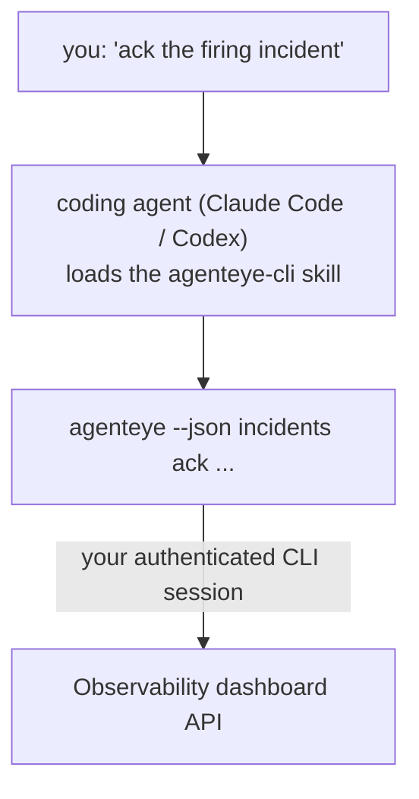

코딩 에이전트에게 *"오늘 뭔가 문제가 있나요?"* 라고 물어보면, 명령어를 외울 필요 없이 실시간 FailproofAI Observability 데이터를 바탕으로 답변을 받을 수 있습니다. **FailproofAI Observability CLI skill** (`agenteye-cli`)은 *Agent Skill*입니다. 즉, Claude Code나 Codex 같은 코딩 에이전트가 필요할 때 불러오는 소규모 지침 폴더입니다. 이 스킬은 *"CI에 이벤트만 푸시할 수 있는 키를 만들어줘"* 또는 *"발생 중인 인시던트를 확인하고 나에게 배정해줘"* 같은 자연어 요청을 통해 에이전트가 [`agenteye` CLI](/ko/agenteye/cli)로 Observability 배포 환경을 조작할 수 있도록 가르칩니다.

이것은 **서비스나 별도의 바이너리가 아닙니다**. 배포할 것이 전혀 없습니다. 이미 설치된 CLI 위에서 동작합니다. 에이전트는 `agenteye --json …`을 셸에서 실행하고, 깔끔한 JSON을 파싱한 뒤 자연어로 답변을 제공합니다. 에이전트가 할 수 있는 모든 작업은 동일한 명령어를 직접 입력해서 수행할 수도 있습니다.

---

## 다른 FailproofAI Observability 인터페이스와의 관계

FailproofAI Observability는 동일한 데이터와 제어 기능에 접근하는 네 가지 방법을 제공합니다. 각각은 서로를 보완합니다:

| 인터페이스 | 설명 | 실행 환경 | 사용 시점 |
|---|---|---|---|
| **[CLI](/ko/agenteye/cli)** | `agenteye`의 명령어/플래그 레퍼런스 | 터미널 | 특정 명령어를 직접 실행하거나 스크립트로 작성할 때 |
| **[CLI 레시피](/ko/agenteye/cli-recipes)** | 복사해서 쓰는 `jq`/파이프라인 패턴 | 터미널 / 스크립트 | CLI를 자동화에 연결할 때 |
| **CLI skill** (이 문서) | CLI에 대한 자연어 진입점 | 워크스테이션의 코딩 에이전트 | 그냥 물어보고 에이전트가 명령어를 선택하도록 할 때 |
| **[대시보드 내 AI 어시스턴트](/ko/agenteye/assistant)** | 대시보드에 내장된 채팅 | 서버 측 (대시보드 내) | 대시보드에서 데이터에 대해 Q&A를 원할 때 |

스킬 자체에는 고유 권한이 없습니다. 여러분의 말을 CLI 호출로 변환하여 여러분의 권한으로 실행할 뿐입니다:



### 대시보드 내 AI 어시스턴트와의 비교: 중요한 차이점

이 두 가지는 영향 범위가 매우 다른 별개의 도구입니다:

- **대시보드 내 AI 어시스턴트** ([AI 어시스턴트](/ko/agenteye/assistant))는 에이전트 서비스를 기반으로 대시보드에 내장된 채팅입니다. **읽기 전용에 승인 기반 작성**만 가능합니다. 저장된 쿼리와 대시보드를 초안으로 작성할 수 있지만, 모든 쓰기 작업은 명시적인 클릭 승인 후에만 진행되며 삭제는 절대 하지 않습니다. `agent:use` 권한으로 제한되며, 현재 보고 있는 조직의 데이터만 접근할 수 있습니다.
- **CLI skill**은 *여러분의* 워크스테이션에서 *여러분의* 코딩 에이전트 내부에서 실행되며, `agenteye` CLI를 **여러분**으로서 구동합니다. API 키 생성/교체/비활성화, 조직 설정 변경, 인시던트 해결, 저장된 쿼리 삭제 등 **변경(mutation)을 포함한 CLI의 전체 기능**을 수행할 수 있으며, 오직 CLI 로그인의 권한에 의해서만 제한됩니다. 해당 명령어들을 직접 입력하는 것과 동일한 수준의 주의를 기울여 사용하세요.

---

## 사전 요구사항

1. **`agenteye` CLI가 설치**되어 `PATH`에 등록되어 있어야 합니다 ([CLI](/ko/agenteye/cli) 레퍼런스 참조: `pipx install agenteye`).
2. **대시보드 URL**이 설정되어 있어야 합니다 (`AGENTEYE_DASHBOARD_URL` 환경 변수 또는 에이전트가 `--base-url`을 통해 전달).
3. **로그인된 세션**이 필요합니다. 먼저 직접 `agenteye login`을 실행하세요. 스킬은 이메일로 전송된 일회용 코드 로그인을 대신 완료할 수 **없습니다**. 세션이 없거나 만료된 경우(CLI 종료 코드 `4`) `agenteye login`을 실행하라고 안내합니다.

---

## 스킬 설치

Agent Skill은 `SKILL.md`(및 선택적 레퍼런스 파일)가 포함된 폴더입니다. `agenteye-cli` 스킬은 해당 폴더를 에이전트가 스킬을 탐색하는 위치에 복사하여 설치합니다:

- **Claude Code**: `agenteye-cli/` 폴더를 `~/.claude/skills/`(모든 프로젝트에서 사용 가능) 또는 `<your-repo>/.claude/skills/`(해당 저장소에만 적용)에 복사하세요. Claude Code가 자동으로 발견합니다. `/skills` 목록으로 확인하거나, 해당 스킬의 설명과 일치하는 질문을 바로 해보세요.
- **Codex (OpenAI)**: Codex도 동일한 `SKILL.md`를 읽습니다. 번들로 제공되는 `agents/openai.yaml`에 `allow_implicit_invocation: true`가 설정되어 있어, 작업이 일치하면 Codex가 자동으로 스킬을 선택합니다. 명시적으로 호출하려면 `$agenteye-cli`를 사용하세요.

스킬은 `agenteye` CLI와 함께 관리되지만 **별도의 폴더**로 제공됩니다. `pipx install agenteye` 패키지 안에 포함되어 있지 않으니 거기서 찾지 마세요. FailproofAI Observability는 `agenteye-cli/` 폴더를 별도로 제공합니다. 없다면 FailproofAI 담당자에게 문의하세요. 접근 제한은 없습니다. 자체 대시보드에 대해 **공개** `agenteye` CLI만 구동하므로 별도의 자격 증명이 필요하지 않습니다.

---

## 안전성: 에이전트가 CLI를 실행할 때 변경 작업은 확인을 요청하지 않습니다

> **경고:** 에이전트가 변경 작업을 수행하도록 허용하기 전에 반드시 읽으세요.

`agenteye` CLI는 일반적으로 파괴적인 작업 전에 *"정말로 진행하시겠습니까?"* 를 묻습니다. 하지만 **터미널에 연결되어 있지 않을 때(코딩 에이전트가 실행하는 방식이 바로 이것)와 `--json`이 사용될 때는 이 확인을 자동으로 건너뜁니다.** 따라서 에이전트에 대해 안전 확인 프롬프트가 **발생하지 않습니다**.

스킬은 이를 보완하도록 작성되어 있습니다. 실행할 정확한 명령어를 제시하고 **상태 변경 전에 명시적인 승인**을 받도록 지침이 작성되어 있습니다. 이 규칙을 지켜주세요. 에이전트를 통해 FailproofAI Observability를 조작할 때, *여러분*이 확인 단계입니다. 주의해야 할 상태 변경 명령어는 다음과 같습니다:

- `keys create` / `update` / `disable` / `regenerate`
- `users create` / `update` / `disable` / `enable`
- `settings set`
- `alerts create` / `update` / `delete` / `test`
- 쓰기 `incidents` 하위 명령어: `ack` / `assign` / `resolve` / `open` / `comment-add` / `comment-delete` / `subscribe` / `unsubscribe`
- `query create` / `update` / `delete`
- `agent rename` / `delete`
- `orgs switch`

**Observe** 하위의 모든 항목 (`events`, `sessions`, `evals`, `errors`, `list`, `whoami`, `orgs list/current/perms`)은 읽기 전용이며 아무것도 변경하지 않습니다.

에이전트는 **여러분**으로서 동작하므로, 여러분의 로그인에 허용된 작업만 수행할 수 있습니다. 권한은 **조직별로** 확인됩니다 ([API keys](/ko/agenteye/api-keys) 참조). 권한이 없는 명령어는 필요한 권한 이름과 함께 종료 코드 `5`를 반환하므로, 에이전트는 불투명한 오류 대신 정확히 어떤 권한을 관리자에게 요청해야 하는지 알려줄 수 있습니다.

---

## 사용 가능한 요청 예시

실제 대화 흐름을 살펴보겠습니다. 먼저 읽기 작업, 그다음 승인을 기다리는 변경 작업입니다:

```text
you   ▸ Is anything broken in the last day?

agent ▸ Running: agenteye --json errors --since 24h --aggregate
        3 error types in the last 24h. The biggest is TimeoutError
        (18 hits, all on the checkout-agent), then RateLimited (5).
        Want the failing sessions for TimeoutError?

you   ▸ Give CI a key that can only push events.

agent ▸ This creates an API key. I'll run:
          agenteye keys create ci --add events:add
        OK to proceed?

you   ▸ yes

agent ▸ Done. Key "ci" created with events:add only.
        The secret is shown only once, so store it now. I can't reprint it.
```

스킬은 각 자연어 의도를 적절한 `agenteye` 명령어에 매핑합니다. 먼저 유효한 값을 탐색하고(`list <kind>`, `whoami`), 추측하지 않으며, 변경 전에 정확한 명령어를 제시합니다. 더 많은 예시:

- *"지난 24시간 동안 문제가 있거나 실패한 것이 있나요?"* → `errors --since 24h --aggregate`, 이후 상세 분석.
- *"세션 `run-001`이 왜 실패했나요?"* → `events --session-id run-001 --all` + `evals --session-id run-001`.
- *"이번 주 품질 추세는 어떤가요?"* → `evals --aggregate --since 7d`, 이후 낮은 점수 실행 드릴다운.
- *"CI에 이벤트만 푸시할 수 있는 키를 만들어줘."* → `keys create ci --add events:add` (명령어를 제시한 후 생성하고 일회성 시크릿을 캡처).
- *"누가 접근 권한이 있나요? Dana를 읽기 전용으로 만들어줘."* → `users list` → `users update dana@… --permission-set read-only` (여러분의 확인 후 실행).
- *"발생 중인 인시던트를 확인하고 나에게 배정해줘."* → `incidents list --state firing` → `incidents ack <id>` / `incidents assign <id> you@…`.

이러한 작업 뒤에 있는 정확한 명령어, 플래그, JSON 형식은 [CLI](/ko/agenteye/cli) 레퍼런스와 [에이전트를 위한 CLI 레시피](/ko/agenteye/cli-recipes)를 참조하세요.

---

## 다음 단계

- **[CLI](/ko/agenteye/cli)**: `agenteye`의 전체 명령어 및 플래그 레퍼런스.
- **[에이전트를 위한 CLI 레시피](/ko/agenteye/cli-recipes)**: 복사해서 쓰는 `jq` 패턴 및 종료 코드 처리.
- **[AI 어시스턴트](/ko/agenteye/assistant)**: 대시보드 내 어시스턴트 (이 터미널 스킬과 혼동하지 마세요).
- **[API keys](/ko/agenteye/api-keys)**: 스킬이 수행할 수 있는 작업을 제한하는 조직별 권한 모델.