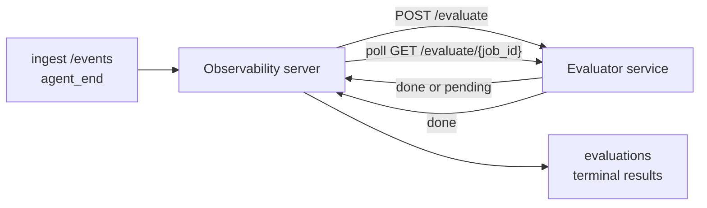

FailproofAI Observability는 완료된 모든 에이전트 실행을 자동으로 품질 점수로 평가할 수 있습니다. 작은 점수 서비스만 제공하면 나머지는 Observability가 처리합니다. 이를 활용해 중요한 지표(유용성, 도구 효율성, 사실 정확성, 안전성 등 원하는 항목을 선택)를 추적하고, 회귀를 조기에 발견하며, 에이전트 또는 환경을 한눈에 비교할 수 있습니다. 점수 평가는 선택 사항으로, 서버에 `EVALUATOR_ENDPOINT`를 설정하기 전까지 파이프라인은 아무 작업도 수행하지 않습니다.

> **참고:** 점수 지표는 직접 정의합니다. 평가자는 원하는 숫자형 키를 반환할 수 있으며, Observability는 반환된 모든 데이터를 저장하고 추세를 추적하며 표시합니다.

## 한눈에 보기

1. **스코어러를 작성합니다.** 세션 트랜스크립트를 읽고 점수를 반환하는 소규모 HTTP 서비스를 구성합니다. Observability에는 복사해서 사용할 수 있는 참조 구현이 포함되어 있습니다. [SDK로 평가자 작성하기](#writing-an-evaluator-with-the-sdk)를 참고하세요.
2. **Observability가 이를 가리키도록 설정합니다.** 서버 프로세스에 `EVALUATOR_ENDPOINT`(및 공유 `EVALUATOR_TOKEN`)를 설정합니다.
3. **점수가 표시되는 것을 확인합니다.** 완료된 모든 세션은 자동으로 점수가 매겨지며, 결과는 세션 상세 페이지, 세션 그리드, 저장된 대시보드에 표시됩니다.


*평가자가 설정되면 완료된 각 실행에 점수가 매겨지고, 결과가 세션의 오른쪽 패널에 표시됩니다. 상단에 요약이, 그 아래에 추론과 함께 지표별 점수 바가 표시됩니다.*

---

## 동작 방식



Observability SDK가 세션에 대한 `agent_end` 이벤트를 발행하면, 서버는
평가를 예약합니다. 그런 다음 전체 이벤트 트랜스크립트를 평가자 서비스에 POST하며,
평가자 서비스는 다음 중 하나를 수행할 수 있습니다:

- **결과를 인라인으로 반환**: `{"status":"done", "scores":{...}, "reasoning":{...}, "summary":"..."}`. 결과는 세션의 평가 타임라인에 추가됩니다. `reasoning`과 `summary`는 선택 사항입니다.
- **지연 처리**: `{"status":"pending", "job_id":"abc-123"}`. Observability는 평가자가 `{"status":"done", ...}` 또는 `{"status":"error", "error":"..."}` 를 반환할 때까지 `GET {EVALUATOR_ENDPOINT}/evaluate/abc-123`을 호출합니다.

  폴링 주기는 작업별로 설정됩니다. `pending` 응답에 `next_poll_secs`를 포함하여 기본값을 재정의할 수 있으며, 그렇지 않으면 Observability는 `GET /config`의 `default_poll_interval_secs` 값을 사용하고, 없을 경우 서버는 `EVALUATOR_POLLING_INTERVAL_SECS`(기본값 10초)로 대체합니다. 모든 값은 [1초, 1시간] 범위로 제한됩니다.

`agent_end`를 발행하지 않은 세션(예: 에이전트 프로세스가 충돌한 경우)도 처리할 수 있습니다. 평가자의 `GET /config`가 `{"inactivity_timeout_secs": 1800}`을 반환하면, Observability는 해당 시간 동안 유휴 상태인 모든 세션을 평가합니다. 이 대체 처리를 비활성화하려면 해당 필드를 `null`로 설정하거나 생략하세요.

`EVALUATOR_ENDPOINT`가 설정되지 않은 경우 파이프라인은 완전히 비활성 상태입니다.

세션은 **시간이 지남에 따라 여러 개의 최종 평가를 누적**할 수 있습니다. 각 `agent_end` 이벤트(및 대시보드에서의 수동 재평가)는 새로운 평가 행을 추가합니다. 이는 재개된 대화를 평가하는 공식 방법입니다. 사용자가 에이전트를 종료하고 나중에 돌아와 더 많은 이벤트를 보내고 에이전트를 다시 종료하면, 전체 업데이트된 트랜스크립트를 대상으로 두 번째 평가가 실행됩니다. 대시보드는 가장 최근 평가를 헤드라인으로 렌더링하고 이전 평가는 접을 수 있는 타임라인으로 표시합니다. 세션에 대한 평가가 실행 중인 동안 해당 세션의 추가 `agent_end` 이벤트는 무시되며, 실행 중인 평가가 완료된 후 다음 이벤트가 새로운 평가를 대기열에 추가합니다.

비활성 대체 처리도 재개된 세션에 다시 적용됩니다. 이전 최종 평가 후에 새 이벤트가 도착하고 세션이 `inactivity_timeout_secs`를 초과하여 유휴 상태가 되면 새로운 평가가 대기열에 추가됩니다.

일시적 오류(5xx, 429, 타임아웃, 네트워크 오류)는 `EVALUATOR_MAX_ATTEMPTS`까지 지수 백오프로 재시도됩니다. 4xx 응답은 최종 오류로 처리됩니다. Observability는 수평 확장된 여러 서버 인스턴스와 함께 안전하게 실행할 수 있으며, 동일한 세션이 동시에 두 번 디스패치되지 않도록 작업이 분할됩니다.

---

## HTTP 계약

모든 인증된 라우트는 **Bearer 토큰 인증**을 사용합니다. 양쪽에 동일한 값을 설정해야 합니다:

- Observability 서버: 환경 변수 `EVALUATOR_TOKEN`
- 평가자 서비스: 동일한 방식으로 설정(`agenteye-evaluator` SDK는 관례에 따라 `EVALUATOR_TOKEN`을 읽음)

`EVALUATOR_TOKEN`이 설정되지 않은 경우, 서버는 `Authorization` 헤더를 보내지 않습니다. 평가자는 익명 요청을 수락할 수 있으며, 이는 내부 전용 네트워크에서는 괜찮지만 공개 인터넷에서는 권장하지 않습니다.

### 평가자가 제공해야 하는 라우트

| 라우트 | 본문 / 파라미터 | 응답 |
|---|---|---|
| `GET /health` | 없음 | `{"status":"ok"}` (공개, 인증 없음) |
| `GET /config` | 없음 | `{"inactivity_timeout_secs": <int> \| null, "default_poll_interval_secs": <int> \| omitted}` |
| `POST /evaluate` | `EvalRequest` JSON | `{"status":"done", ...}` 또는 `{"status":"pending", "job_id":"..."}` |
| `GET /evaluate/{id}` | 없음 | `/evaluate`와 동일한 응답 형식 |

### 서버가 전송하는 `EvalRequest` 본문

```json
{
  "schema_version": "1",
  "session_id":     "session-abc123",
  "agent_id":       "planner",
  "environment":    "production",
  "started_at":     "2026-05-10T12:00:00Z",
  "ended_at":       "2026-05-10T12:05:00Z",
  "events": [
    { "id": 1234, "ts": "...", "event_type": "agent_start", "payload": { ... } },
    ...
  ]
}
```

### 응답 형식

**동기 (완료):**

```json
{
  "status": "done",
  "scores": { "helpfulness": 0.85, "tool_efficiency": 0.6 },
  "reasoning": {
    "helpfulness": "answered the question directly with citations",
    "tool_efficiency": "called list_files three times when one would have done"
  },
  "summary": "strong answer quality, weak tool selection"
}
```

`reasoning`(점수별 근거 맵)과 `summary`(전반적인 단락 형식의 서술)는 모두 선택 사항입니다. `reasoning`의 키는 `scores`의 키와 일치해야 하며, 대시보드는 각 항목을 해당 점수 바 아래에 인라인으로 렌더링합니다. `scores`만 반환하는 기존 평가자는 변경 없이 계속 작동하며, `reasoning`과 `summary`는 단순히 null로 처리되고 해당 UI 요소는 생략됩니다.

**비동기 (지연):**

```json
{ "status": "pending", "job_id": "abc-123", "next_poll_secs": 30 }
```

`next_poll_secs`는 선택 사항입니다. 생략하면 서버는 `/config`의 평가자 `default_poll_interval_secs`를 사용하고, 그 다음에는 자체 `EVALUATOR_POLLING_INTERVAL_SECS` 환경 변수를 사용합니다.

**평가자 측 최종 오류:**

```json
{ "status": "error", "error": "model service unavailable" }
```

서버는 다른 2xx 본문을 프로토콜 오류로 처리하고 세션에 최종 `error`를 기록합니다.

---

## SDK로 평가자 작성하기

HTTP 계약을 직접 구현할 필요는 없습니다. `agenteye-evaluator` Python 패키지는 인증, 라우팅, 요청/응답 형식을 자동으로 처리하는 타입이 지정된 FastAPI 래퍼를 제공합니다.

FailproofAI Observability에는 트랜스크립트 형식을 기반으로 `helpfulness`, `tool_efficiency`, `factuality`를 평가하는 **작동하는 참조 평가자**도 포함되어 있습니다. 이를 시작점으로 복사하고 LLM 판정자, 규칙 엔진 등 품질 기준에 맞는 로직으로 교체하세요.

최소 구현 가능한 평가자:

```python
import os
from agenteye_evaluator import Evaluator, EvalRequest, EvalResponse

app = Evaluator(token=os.environ["EVALUATOR_TOKEN"])

@app.evaluator
def run(req: EvalRequest) -> EvalResponse:
    # Inspect req.events (the full session transcript) and return scores.
    tool_calls = sum(1 for e in req.events if e.event_type == "tool_use")
    return EvalResponse(
        scores={"tool_calls": float(tool_calls)},
        reasoning={"tool_calls": f"{tool_calls} tool invocations in the transcript"},
        summary="tight tool loop" if tool_calls < 5 else "agent looped on tools",
    )
```

`app` 인스턴스는 모든 ASGI 서버에서 실행되므로 `uvicorn module:app`으로 시작할 수 있습니다.

비용이 많이 드는 작업을 지연해야 하는 평가자의 경우, 대신 `JobPending`을 반환하고 `@app.job_lookup` 핸들러를 등록하세요. Observability 서버는 평가자가 최종 상태를 반환하거나 `EVALUATOR_MAX_POLL_DURATION_SECS` 한도(기본값 1시간)에 도달할 때까지 `GET /evaluate/{job_id}`를 폴링합니다.

전체 API 참조, 비동기 패턴, 이벤트 스키마는 `agenteye-evaluator` SDK의 README에 문서화되어 있습니다.

---

## 평가자 실행하기

평가자는 **사용자의 서비스**입니다. FailproofAI Observability는 기본 평가자를 제공하지 않으므로, 자신의 서비스를 실행하는 곳 어디서든 직접 빌드하고 실행해야 합니다. 모든 ASGI 서버(예: `uvicorn my_evaluator:app`)에서 실행할 수 있으며, [HTTP 계약](#http-contract)의 `/health`, `/config`, `/evaluate` 라우트를 제공한 다음 서버가 이를 가리키도록 설정합니다([서버 구성하기](#configuring-the-server) 참조).

평가자에 접근할 수 있게 되면 `GET /health`가 `{"status":"ok"}`를 반환합니다. 에이전트가 엔드투엔드로 실행된 후 서버의 `GET /evaluations`는 `status: "done"`과 평가자가 생성한 점수가 포함된 행을 반환합니다.

---

## 서버 구성하기

서버 프로세스에 설정할 항목:

| 환경 변수 | 의미 |
|---|---|
| `EVALUATOR_ENDPOINT` | 평가자의 기본 URL (`http://evaluator:9000`). 설정하지 않으면 파이프라인이 비활성화됩니다. |
| `EVALUATOR_TOKEN` | Bearer 토큰. 평가자 서비스에 설정된 값과 일치해야 합니다. |
| `EVALUATOR_WORKERS` | 서버 인스턴스당 워커 태스크 수 (기본값 2). |
| `EVALUATOR_CLAIM_BATCH` | 워커 틱당 처리할 행 수 (기본값 4). 배치는 **동시에** 처리되며, 평가자 엔드포인트의 실질적인 동시성은 `EVALUATOR_WORKERS × EVALUATOR_CLAIM_BATCH`입니다. |
| `EVALUATOR_POLL_IDLE_SECS` | 예정된 평가가 없을 때 워커가 디스패치 시도 사이에 대기하는 시간 (기본값 2초). |
| `EVALUATOR_POLLING_INTERVAL_SECS` | 응답별 `next_poll_secs`와 평가자의 `default_poll_interval_secs` 모두 설정되지 않은 경우 `GET /evaluate/{id}` 폴링 주기의 최종 대체값 (기본값 10초). |
| `EVALUATOR_REQUEST_TIMEOUT_MS` | 요청별 타임아웃 (기본값 30000). |
| `EVALUATOR_MAX_ATTEMPTS` | 이만큼 일시적 오류가 발생하면 결과가 최종 `error`로 기록됨 (기본값 5). |
| `EVALUATOR_CONFIG_REFRESH_SECS` | `GET /config` 폴링 주기 (기본값 300). |
| `EVALUATOR_MAX_POLL_DURATION_SECS` | 세션이 `timeout`으로 종료되기 전 폴링 대기열에 머무를 수 있는 최대 실제 시간 (기본값 3600초). 평가자가 계속 `pending`을 반환하는 경우를 방지합니다. |

자동 점수 평가를 활성화하려면 서버에 `EVALUATOR_ENDPOINT`와 `EVALUATOR_TOKEN`을 모두 설정한 다음 서버를 재시작하여 변경 사항을 적용합니다. `EVALUATOR_ENDPOINT`가 설정되지 않으면 파이프라인은 비활성 상태로 유지됩니다.

위의 조정 항목은 선택 사항입니다. 기본값을 재정의해야 하는 경우에만 서버에 해당 환경 변수를 설정하세요.

---

## API 참조

| 메서드 | 경로 | 필요한 권한 | 목적 |
|---|---|---|---|
| `GET` | `/evaluations` | `evaluations:read` | 최종 결과를 조회합니다. `session_id`, `agent_id`, `environment`, `status`(`done`/`error`/`timeout`), `ts_from`, `ts_to`, `cursor`, `limit`, `score_filters`, `latest_per_session`을 지원합니다. `limit`은 기본값 50이며 최대 200으로 제한됩니다(최대 1000으로 제한되는 `/events`와 다름). `environment`는 쉼표로 구분된 목록을 허용합니다(예: `environment=prod,staging`). 단일 값도 여전히 작동합니다. `latest_per_session=true`로 설정하면 응답에 `session_id`당 최대 하나의 행(`completed_at` 기준 가장 최근 것)이 포함되며, 세션 목록 페이지에서 세션의 평가 타임라인을 현재 헤드라인으로 축소하는 데 사용됩니다. 기본값은 false(전체 기록 반환)입니다. |
| `GET` | `/evaluations/aggregate` | `evaluations:read` | 필터링된 슬라이스에 대한 집계된 평가 상태를 반환합니다. 전체 수, done/error/timeout 분류, 점수 키별 통계(임의의 `scores` 키에 대한 count/avg/min/max/p50), 시간 버킷 타임라인이 포함됩니다. `/evaluations`와 **동일한 필터 파라미터**에 추가로 `featured_keys`(추세를 볼 점수 키의 CSV)와 `latest_per_session`을 허용합니다. 대시보드 기능을 지원하며, 메트릭은 샘플링 없이 전체 일치 집합에 대해 정확하게 계산됩니다. |
| `GET` | `/evaluations/environments` | `evaluations:read` | `evaluations` 테이블의 고유한 환경 값을 반환합니다. 평가 읽기 가능 데이터 범위의 필터 드롭다운을 채우는 데 사용됩니다. |
| `GET` | `/evaluation-jobs` | `evaluations:read` | 진행 중인 평가를 확인합니다. `status`(`pending`/`polling`)로 필터링할 수 있습니다. |
| `GET` | `/events` | `events:read` | 세션의 원시 이벤트를 스트리밍합니다. `session_id`, `agent_id`, `event_type`(CSV), `environment`(CSV), `ts_from`, `ts_to`, `cursor`, `limit`, `order`를 지원합니다. `order`는 `desc`(최신순, 기본값) 또는 `asc`(오래된 순)이며, 인식할 수 없는 값은 `desc`로 대체됩니다. 응답의 `next_cursor`(이벤트 ID)를 통해 커서 페이지네이션을 할 수 있으며, 이를 `cursor`로 다시 전달하면 다음 페이지를 가져올 수 있습니다. `asc`의 경우 해당 ID 이후의 이벤트, `desc`의 경우 해당 ID 이전의 이벤트가 다음 페이지입니다. `limit`은 기본값 50이며 최대 1000으로 제한됩니다. |
| `GET` | `/sessions/:session_id/export` | `events:read` | 이 세션에 대해 평가자가 받을 정확한 JSON 본문을 `session-<id>.json`이라는 이름의 다운로드 첨부 파일로 반환합니다. 오프라인 테스트를 위해 프로덕션 세션을 `agenteye-evaluator`를 통해 재현할 때 유용합니다. 바이트는 평가자 파이프라인이 전송하는 것과 완전히 동일합니다. |
| `POST` | `/sessions/:session_id/re-evaluate` | `evaluations:trigger` | 세션에 대한 새로운 평가를 대기열에 추가합니다. 이전 평가 존재 여부와 관계없이 실행됩니다. 새 결과는 이전 결과를 덮어쓰지 않고 세션의 평가 타임라인에 **추가**되므로 이전 점수는 기록으로 계속 표시됩니다. 대기열에 추가되면 `202`를 반환하고, 알 수 없는 세션에는 `404`, 평가가 이미 진행 중이면 `409`를 반환합니다. 새 평가자를 배포한 후나 `agent_end`를 발행하지 않은 세션에 사용합니다. |

### 점수 범위로 필터링: `score_filters`

`GET /evaluations`는 `scores` 객체 내의 숫자 값으로 결과를 좁히는 선택적 `score_filters` 파라미터를 허용합니다. 이 파라미터는 쉼표로 구분된 `key:min..max` 항목 목록이며, 각 경계는 생략할 수 있습니다. 여러 항목은 논리 AND로 결합됩니다. 명명된 키가 없거나 숫자가 아닌 행은 제외됩니다. 요청당 최대 20개의 필터 항목을 포함할 수 있으며, 초과하면 HTTP 400이 반환됩니다.

예시:
```text
# helpfulness가 [0.5, 0.8] 범위
GET /evaluations?score_filters=helpfulness:0.5..0.8

# tool_efficiency가 최대 0.3 (하한 없음)
GET /evaluations?score_filters=tool_efficiency:..0.3

# helpfulness >= 0.5 AND factuality >= 0.9
GET /evaluations?score_filters=helpfulness:0.5..,factuality:0.9..
```

각 `/evaluations` 응답 객체에는 다음 필드가 있습니다:

| 필드 | 타입 | 참고 |
|---|---|---|
| `evaluation_id` | string (UUID) | 이 최종 평가의 표준 식별자. 각 최종 평가는 새 UUID를 받으며, 단일 세션이 여러 개를 가질 수 있습니다. |
| `id` | string (UUID) | `evaluation_id`와 동일한 값을 가진 하위 호환성 별칭. |
| `session_id` | string | 이 평가가 실행된 세션. 세션은 타임라인에 여러 평가를 가질 수 있습니다. |
| `agent_id` | string | 세션을 생성한 에이전트를 식별합니다. |
| `environment` | string | 세션에서 복사된 환경 레이블. |
| `status` | enum | `"done"`, `"error"`, `"timeout"` 중 하나. |
| `scores` | object \| null | 평가자가 반환한 점수. |
| `reasoning` | object \| null | 평가자가 반환한 선택적 점수별 근거 맵. 키는 일반적으로 `scores`의 키와 일치합니다. 대시보드는 각 항목을 해당 점수 바 아래에 렌더링합니다. |
| `summary` | string \| null | 평가자가 반환한 선택적 전반적 단락 서술. 대시보드는 이를 점수별 분류 위에 평가의 헤드라인으로 렌더링합니다. |
| `error` | string \| null | `"error"` / `"timeout"` 시에만 채워집니다. |
| `attempt_count` | integer | 디스패치 시도 횟수 (≥ 1). |
| `duration_ms` | integer \| null | 마지막 시도의 지속 시간. |
| `completed_at` | string (ISO 8601 UTC) | 최종 결과가 기록된 시간. 결과는 `completed_at` 기준으로 정렬됩니다 (최신순). |
| `created_at` | string (ISO 8601 UTC) | `completed_at`과 동일한 타임스탬프를 가집니다 (쓰기 전용 의미론). |

---

## 권한

| 권한 | 부여 내용 |
|---|---|
| `evaluations:read` | 평가 결과 목록 조회, 대시보드에서 점수 보기, 대시보드 상태 메트릭 로드. |
| `evaluations:trigger` | `POST /sessions/:session_id/re-evaluate` 또는 대시보드의 재평가 버튼을 통해 세션에 대한 평가를 수동으로 대기열에 추가. |
| `dashboards:read` | 저장된 대시보드 보기 (메트릭 로드를 위해 `evaluations:read`도 필요). |
| `dashboards:write` | 대시보드 생성 및 편집. |
| `dashboards:delete` | 대시보드 삭제. |

부트스트랩 관리자(`ADMIN_KEY`, `ADMIN_EMAIL`)는 이 권한을 자동으로 받습니다.

---

## 결과 보기

- **`/sessions/<id>`**: 이벤트 타임라인 + 세션의 점수와 디스패치 시도에서 발생한 오류를 표시하는 오른쪽 패널. 키에 `evaluations:trigger` 권한이 있으면 내보내기 버튼 옆에 **재평가** 버튼이 표시됩니다. 이는 `agent_end`를 발행하지 않은 세션이나 새 평가자를 배포한 후 점수를 새로 고칠 때 유용합니다. 대시보드는 새 결과를 폴링하고 결과가 도착하면 오른쪽 패널을 업데이트합니다.
- **`/sessions`**: 필터링 가능한 세션 그리드. 점수 열은 각 세션의 평가 상태와 점수를 한눈에 보여줍니다.
- **`/dashboards`**: 저장된 평가 상태 보기 (아래의 [대시보드](#dashboards) 참조).


*세션 그리드는 각 실행의 평가 상태와 점수를 한눈에 보여주며, 빨간색/주황색/녹색 배지로 낮은 점수를 쉽게 파악할 수 있습니다.*

---

## 대시보드

**대시보드** 페이지(`/dashboards`)에서는 평가 필터 조합을 이름이 지정된 재사용 가능한 보기로 저장하고 해당 평가 슬라이스의 상태를 한눈에 확인할 수 있습니다. 대시보드는 **조직 전체에서 공유**되며, `dashboards:read` 권한이 있는 모든 사람이 동일한 세트를 볼 수 있습니다.

각 대시보드에는 다음이 고정됩니다:

- **필터**: 세션 페이지와 동일한 컨트롤: 환경, 상태, 에이전트, 롤링 시간 창, 점수 범위 필터(`key:min..max`).
- **표시 구성**: 주요로 표시할 점수 키, 녹색/주황색/빨간색 상태 임계값, 표시할 패널, 세션당 최신 평가로 축소할지 여부.

각 카드에는 일치하는 세션 수, done/error/timeout 분류, 각 주요 점수의 평균, 소형 추세 스파크라인이 표시됩니다. 대시보드를 열면 전체 크기 패널이 표시되며, **세션에서 열기**를 클릭하면 해당 슬라이스로 미리 필터링된 세션 페이지로 이동합니다. 메트릭은 전체 일치 집합에 대해 서버 측에서 계산되므로(`GET /evaluations/aggregate`를 통해) 숫자는 샘플링 없이 정확합니다.


**권한:** 보기에는 `dashboards:read`와 `evaluations:read`가 모두 필요하며, 생성 및 편집에는 `dashboards:write`가, 삭제에는 `dashboards:delete`가 필요합니다. 부트스트랩 관리자는 이 모든 권한을 자동으로 받습니다.

---

## 문제 해결

**세션은 있지만 평가가 생성되지 않습니다.** 서버 프로세스에 `EVALUATOR_ENDPOINT`가 설정되어 있는지, 서버와 평가자가 동일한 `EVALUATOR_TOKEN` 값을 공유하는지, 평가자의 `/health` 엔드포인트가 서버에서 접근 가능한지 확인하세요. `EVALUATOR_ENDPOINT`가 설정되지 않으면 파이프라인은 비활성 상태입니다.

**진행 중인 평가가 쌓입니다.** `GET /evaluation-jobs`를 쿼리하여 진행 중인 대기열을 확인하세요. 각 행의 `attempt_count`, `next_attempt_at`, `last_error`를 검사하세요. 일반적인 원인: 평가자 서비스에 접근할 수 없거나 5xx를 반환하는 경우(백오프로 재시도), `EVALUATOR_TOKEN`이 잘못된 경우(401은 최종 오류), 또는 비동기 평가자가 무기한 `pending`을 반환하는 경우(아래 참조).

**세션이 완료되었지만 최종 평가가 없습니다.** `GET /evaluation-jobs?status=polling`을 쿼리하세요. 결과가 아직 진행 중일 수 있습니다. 작업이 `pending` 상태에 멈춰 있다면 서버가 평가자에 접근하는 데 문제가 있는 것입니다. 평가자가 실행 중인지, `EVALUATOR_TOKEN`이 일치하는지 확인하세요.

**`HTTP 401 from evaluator: invalid bearer token`.** 서버의 `EVALUATOR_TOKEN`이 평가자 서비스에 설정된 값과 일치하지 않습니다. 두 값이 동일해야 합니다.

**비동기 평가자가 계속 `pending`을 반환합니다.** 서버는 평가자가 `done` 또는 `error`를 반환하거나 `EVALUATOR_MAX_POLL_DURATION_SECS` 한도(기본값 1시간)에 도달할 때까지 `GET /evaluate/{job_id}`를 폴링합니다. 한도에 도달하면 평가는 `timeout`으로 기록되고 진행 중인 대기열에서 제거됩니다. 평가자가 기본값보다 더 긴 시간이 합법적으로 필요한 경우 `EVALUATOR_MAX_POLL_DURATION_SECS`를 늘리세요.

---

## 다음 단계

- [Python SDK](/ko/agenteye/python-sdk): 점수 평가를 트리거하는 `agent_end` 이벤트를 발행합니다.
- [API 키](/ko/agenteye/api-keys): `evaluations:read` 및 `evaluations:trigger` 권한.
- [감사](/ko/agenteye/audits): 정책 기반 검토를 위한 Observability의 다른 자동화된 품질 기능.