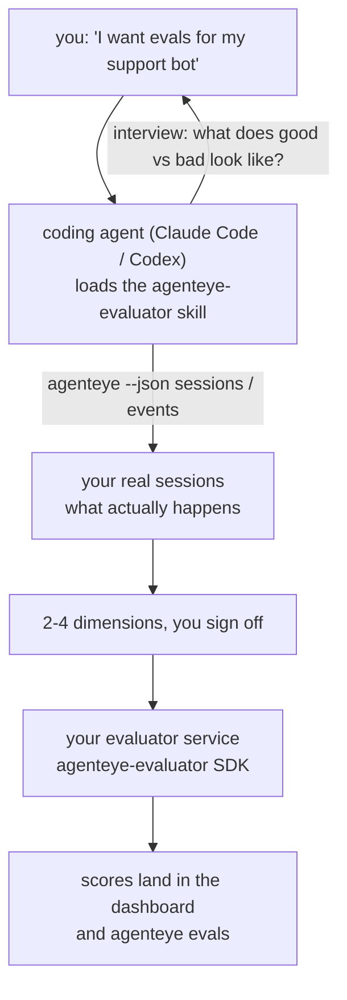

*"에이전트가 가끔 이상한 것 같다"*는 생각에서 배포된 스코어링 서비스까지, 코딩 에이전트가 판단과 구현을 모두 담당합니다. **Failproof AI Observability 평가자 스킬**(`agenteye-evaluator`)은 *Agent Skill*입니다. Claude Code나 Codex 같은 코딩 에이전트가 필요할 때 불러오는 작은 지침 폴더로, 에이전트에게 *여러분의* 에이전트에서 추적할 가치가 있는 품질 차원을 도출하고, 이를 평가하는 [평가자 서비스](/ko/agenteye/evaluation-suite)를 작성·테스트·배포하는 방법을 가르칩니다.

이것은 호스팅된 스코어러도, 업로드하는 레지스트리도, 플러그인 시스템도 **아닙니다**. 평가자는 [평가 스위트](/ko/agenteye/evaluation-suite) 가이드에 설명된 것처럼 여러분 자신의 인프라에서 실행되는 여러분만의 HTTP 서비스로 유지됩니다. 이 스킬은 에이전트가 그것을 잘 구축하도록 가르칠 뿐이며, 에이전트가 하는 모든 것은 여러분이 같은 코드를 직접 작성해도 할 수 있는 일입니다.

---

## 어렵고도 중요한 부분: 무엇을 평가할지 결정하기

SDK 인터페이스는 단순합니다 — 데코레이터 하나와 두 가지 모델. 에이전트는 [계약](/ko/agenteye/evaluation-suite#http-contract)만으로도 이를 작성할 수 있습니다. 평가자가 실패하는 것은 이 부분이 아닙니다. 잘못된 것을 평가하기 때문에 실패하며, 잘못된 것을 평가하는 평가자는 없는 것보다 나쁩니다. 모두가 무시하는 법을 배운 대시보드만 만들어낼 뿐입니다.

따라서 스킬의 대부분은 코드가 존재하기 전 단계에 해당합니다. 에이전트가 여러분을 인터뷰하고(*"잘 진행된 실행을 묘사해 주세요. 이제 잘못된 실행도요"*), [`agenteye` CLI](/ko/agenteye/cli)를 통해 실제 세션을 가져와 처음부터 끝까지 읽습니다. 이 두 가지가 보통 일치하지 않는데, 그 간극이 핵심입니다. 측정하려는 의도와 실제로 트랜스크립트가 지원할 수 있는 것의 차이입니다. 차원이 살아남으려면 이벤트에서 **계산 가능**하고 **변별력**이 있어야 합니다 — 좋은 실행과 나쁜 실행 모두에서 0.9를 기록한다면 아무것도 가르쳐주지 않으므로 제거됩니다.

돌아오는 결과물은 코드 한 줄 작성 전에 여러분이 승인할 수 있도록 추론이 첨부된 2~4개 차원의 제안입니다.



---

## 다른 평가 관련 구성 요소와의 관계

평가 점수를 다루는 문서가 네 개 있으며, 순서대로 서로 연결됩니다:

| 페이지 | 내용 | 사용 시점 |
|---|---|---|
| **[평가](/ko/agenteye/evaluations)** | 기능: 세션 그리드의 점수, 대시보드, 재평가 | 자동 점수 매기기가 무엇을 제공하는지 알고 싶을 때 |
| **[평가 스위트](/ko/agenteye/evaluation-suite)** | HTTP 계약, SDK, 서버 환경 변수 | 평가자를 직접 구현하거나 디버깅할 때 |
| **평가자 스킬** (이 문서) | 스코어러 설계 *및* 구축을 위한 자연어 진입점 | "평가가 필요하다"는 생각에서 실행 중인 서비스까지 가고 싶을 때 |
| **[CLI 스킬](/ko/agenteye/cli-skill)** | `agenteye` CLI에 대한 자연어 진입점 | 이미 보유한 점수를 *읽고* 싶을 때 |
| **[Python SDK 스킬](/ko/agenteye/python-sdk-skill)** | 에이전트 계측을 위한 자연어 진입점 | 에이전트가 아직 세션을 내보내지 않아서 평가할 것이 없을 때 |

### CLI 스킬과의 차이: 구축 vs. 읽기

두 스킬은 의도적으로 겹치지 않으며, 둘 다 설치하는 것이 일반적인 설정입니다 — 에이전트는 여러분이 묻는 것을 기반으로 어떤 것을 사용할지 선택합니다:

- **`agenteye-evaluator`** (이 문서)는 점수를 *생성*하는 것을 구축합니다. 처음으로 점수가 나타나면 역할이 끝납니다.
- **[`agenteye-cli`](/ko/agenteye/cli-skill)**는 이미 존재하는 점수를 읽습니다(`agenteye evals`). *"이번 주에 품질이 떨어졌나?"*가 이 스킬이 답하는 질문이며, 이 문서의 스킬이 답하는 것이 아닙니다.

---

## 사전 요구사항

1. **`agenteye` CLI 설치 및 로그인** (`pipx install agenteye`, 이후 `agenteye login`). 스킬이 두 번 이를 활용합니다: 설계의 기반이 되는 실제 세션을 가져올 때, 그리고 마지막에 점수가 제대로 나타났는지 확인할 때. 로그인에는 `events:read`와 최종 확인을 위한 `evaluations:read` 권한이 필요합니다. CLI 스킬과 마찬가지로, 이메일 일회용 코드 로그인을 대신 완료해 줄 수 **없습니다**.
2. **평가자가 실행될 공간.** 이미지로 빌드되어 장기 실행 서비스로 실행되므로, 임시 파일이 아닌 실제 레포지토리가 필요합니다. 평가자는 종종 평가 대상인 에이전트와 별도의 레포지토리에 위치합니다 — 스킬은 기존 레포지토리를 먼저 찾고, 새로 만들기 전에 확인을 요청합니다.
3. **`agenteye-evaluator` SDK 휠** — 에이전트가 `pip` 명령을 입력하기 전에 다음 섹션을 먼저 읽으세요.

---

## 어디서 구할 수 있나요

이 스킬은 Failproof AI의 공개 스킬 컬렉션에 배포되어 있습니다:

**[github.com/FailproofAI/skills](https://github.com/FailproofAI/skills)** → [`skills/agenteye-evaluator/`](https://github.com/FailproofAI/skills/tree/main/skills/agenteye-evaluator)

레포지토리는 공개되어 있으며 스킬에는 자체 자격 증명이 필요하지 않습니다 — *여러분*이 로그인한 세션으로 `agenteye` CLI를 구동하고, *여러분의* 레포지토리에 코드를 작성할 뿐입니다. 이 스킬은 자체 폴더로 제공되며 `pipx install agenteye` 패키지에는 포함되어 **있지 않으므로**, 그곳에서 찾지 마세요.

## 스킬 설치하기

가장 빠른 방법은 [`skills`](https://skills.sh) CLI를 사용하는 것으로, 폴더를 가져와 에이전트가 찾는 위치에 저장합니다:

```bash
# Claude Code, 현재 프로젝트에만
npx skills add FailproofAI/skills --skill agenteye-evaluator -a claude-code

# 모든 프로젝트 (~/.claude/skills/에 설치)
npx skills add FailproofAI/skills --skill agenteye-evaluator -a claude-code -g --copy

# Codex를 사용하는 경우
npx skills add FailproofAI/skills --skill agenteye-evaluator -a codex
```

이후 다른 스킬과 동일하게 관리합니다:

```bash
npx skills list -a claude-code           # 설치된 목록 확인
npx skills update agenteye-evaluator     # 최신 버전으로 업데이트
npx skills remove agenteye-evaluator     # 제거
```

직접 설치하고 싶으신가요? Agent Skill은 `SKILL.md`(및 선택적 참조 파일)를 포함하는 폴더에 불과하므로 복사하는 방법도 가능합니다:

- **Claude Code**: `agenteye-evaluator/` 폴더를 `~/.claude/skills/`(모든 프로젝트)나 `<your-repo>/.claude/skills/`(해당 레포지토리만)에 넣으세요. Claude Code가 자동으로 감지합니다 — `/skills` 목록으로 확인하거나, 간단히 평가를 요청해보세요.
- **Codex (OpenAI)**: Codex도 동일한 `SKILL.md`를 읽습니다. 번들된 `agents/openai.yaml`에 `allow_implicit_invocation: true`가 설정되어 있어 Codex가 작업에 맞는 스킬을 자동으로 선택합니다. 그렇지 않은 경우 `$agenteye-evaluator`로 명시적으로 호출하세요.

---

## SDK는 공개 PyPI에 없습니다

> **경고:** 에이전트가 SDK를 설치하기 전에 이 내용을 읽으세요.

스킬은 공개되어 있지만, 스킬이 구동하는 SDK는 그렇지 않습니다. `agenteye-evaluator`는 비공개 릴리스 아티팩트로만 제공되며, `agenteye`와 달리 공개 PyPI에서 이름이 **등록되지 않은 상태**입니다 — 따라서 단순한 `pip install agenteye-evaluator`를 실행하면 여러분의 프로덕션 트랜스크립트를 읽는 서비스에 낯선 패키지가 설치될 수 있습니다. 이는 오타가 아니라 공급망 보안 문제입니다.

스킬은 이를 알고 있어서 대신 설치 우선순위 목록을 순서대로 내려갑니다. 첫 번째로 적용되는 단계에서 멈춥니다: AgentEye 레포지토리 내부에 있다면 모노레포 소스를, 그렇지 않으면 GitHub Releases의 비공개 릴리스 휠을(접근 권한 필요), 어느 것도 접근할 수 없다면 즉흥적으로 해결하지 않고 **Failproof AI 담당자에게 휠 파일을 요청하라고 안내하고 멈춥니다**.

따라서 에이전트가 공개 PyPI에서 단순한 `pip install agenteye-evaluator`를 제안한다면, 스킬이 로드되지 않았다는 신호입니다. 그 자리에서 멈추고 스킬이 설치되어 있는지 확인하세요.

---

## 사용 예시

실제 대화는 모호한 요청으로 시작해서 코드가 아닌 승인된 설계로 끝납니다:

```text
you   ▸ I want evals for our support bot. I think it's sometimes bad.

agent ▸ Before I write anything: describe a run that went well,
        and one that went badly.

you   ▸ Good: it answers from the docs. Bad: it makes stuff up,
        or gives up and says "contact support".

agent ▸ Running: agenteye --json sessions --status error --since 7d
        Reading 5 sessions, including two you'd call bad.

        Your words say factuality and deflection. The transcripts
        agree on deflection (2 of 5 end with a support hand-off,
        and it's plain in model_response.content), but factuality
        needs a ground truth your events don't carry.

        So I'd score three things:
          - deflection      rules, cheap, separates your two runs
          - tool_efficiency rules, catches the retry loop in run-004
          - groundedness    LLM judge: is every claim in the docs it retrieved?

        "factuality" would need ground truth we don't have; groundedness
        is the closest thing your transcripts can actually support.
        OK with those three names? Renaming later splits the history.

you   ▸ yes

agent ▸ No evaluator in this repo. Should I scaffold one here, or do
        you have one elsewhere?
```

이후 에이전트는 규칙 기반 차원(무료, 즉각적, 결정론적)을 먼저 작성하고, 순진한 평가자를 충돌시키는 빈 세션과 완료되지 않은 세션을 포함한 실제 캡처된 세션으로 테스트합니다. 주관적인 차원에는 LLM 판정자를 사용합니다. 에이전트는 [디스패처의 제한](/ko/agenteye/evaluation-suite#configuring-the-server)을 알고 있습니다 — 30초 요청 타임아웃과 배포 전체에 걸친 8개의 동시 호출 — 따라서 판정자가 안정적으로 처리되지 않을 것 같으면, 다섯 배의 비용으로 다섯 번 취소 및 재시도되는 대신 `JobPending`으로 비동기 처리합니다.

그런 다음 배포하고, 두 개의 서버 환경 변수를 설정하고, `agenteye --json evals --session-id <id>`로 점수가 실제로 나타났는지 확인합니다. 점수가 나타나는 것만이 유일한 증거입니다.

---

## 주의해야 할 사항

- **차원 이름은 거의 영구적입니다.** 점수 키는 임의의 문자열이며 플랫폼은 전송된 것을 그대로 추적하므로, 다운스트림에서 잘못된 선택을 수정하는 것은 없습니다. 나중에 이름을 변경하면 히스토리가 분리됩니다. 이전 세션은 이전 키를 유지하고 추세가 끊어집니다. 스킬이 코드 작성 전에 명시적인 승인을 받는 이유가 바로 이것입니다 — 그 프롬프트를 진지하게 받아들이세요.
- **픽스처는 실제 프로덕션 트랜스크립트입니다.** 실제 세션을 기반으로 설계한다는 것은 디스크에 가져온다는 의미이며, 고객 데이터가 포함될 수 있습니다. 스킬은 git에 커밋하기 전에 확인을 요청합니다. 확실하지 않다면 `fixtures/`를 레포지토리 밖에 두고 각 개발자가 직접 가져오도록 하세요.
- **에이전트는 모든 트랜스크립트를 읽는 서비스를 작성하고 배포합니다.** CLI 로그인 권한 범위 내에서 여러분 대신 행동하지만, 프로덕션 데이터를 다루는 다른 코드처럼 평가자를 검토하세요.

---

## 다음 단계

- **[평가 스위트](/ko/agenteye/evaluation-suite)**: 스킬이 구성하는 HTTP 계약, SDK, 서버 환경 변수.
- **[평가](/ko/agenteye/evaluations)**: 점수가 나타난 후 어디서 확인할 수 있는지.
- **[CLI 스킬](/ko/agenteye/cli-skill)**: 스코어러를 구축하는 것이 아닌 결과를 읽기 위한 형제 스킬.
- **[CLI](/ko/agenteye/cli)**: 스킬이 기반으로 하는 세션 데이터 뒤의 명령어 레퍼런스.