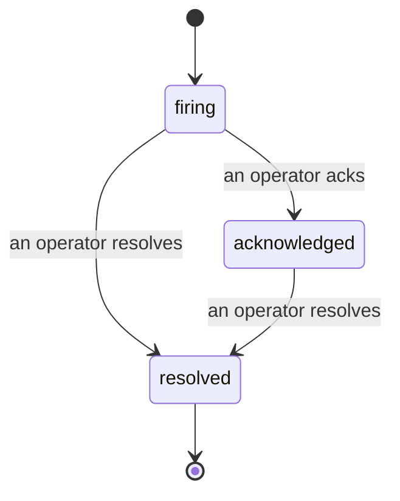

알림이 발생했을 때 가장 먼저 드는 질문은 항상 "누가 맡고 있지?"입니다. 인시던트가 이 질문에 답합니다. 임계치가 초과되는 순간, 누구나 인시던트가 열렸는지, 담당자가 누구인지, 지금까지 정확히 무슨 일이 있었는지를 명확하고 귀속된 기록으로 확인할 수 있으며, 이 기록은 사후 분석(post-mortem)에 바로 활용할 수 있습니다.

*인박스는 열린 인시던트를 상태별로 그룹화하고, 심각도 및 담당자로 필터링할 수 있어 지금 당장 사람이 처리해야 할 항목을 바로 확인할 수 있습니다.*

## 담당자를 한눈에 파악하기

채팅 스레드에서 "누가 보고 있나요?"라고 물을 필요가 없습니다. 임계치를 초과하면 자동으로 인시던트가 열리고 공유 인박스에 상태별로 그룹화되어 표시됩니다. 인시던트를 인지(acknowledge)하면 담당자 이름이 표시되어 나머지 팀원이 처리 중임을 알 수 있습니다. 인지는 공유 방식으로 동작합니다. 여러 운영자가 동일한 인시던트를 인지할 수 있으며, 각각이 별도로 기록되므로 전체 대응 팀(war room)이 서로 겹치지 않고 이름별로 표시됩니다. 트리아지를 위한 단일 담당자를 지정하고, 인박스를 심각도나 담당자로 필터링하여 자신이 맡은 항목만 볼 수 있습니다.

## 하나의 타임라인으로 전체 경위 파악

인시던트가 종료되면 보고서가 이미 완성되어 있습니다. 인시던트를 열면 임계치 초과 증거, 담당자 및 구독자 목록, 협업을 위한 댓글 스레드, 그리고 추가만 가능한(append-only) 활동 타임라인을 확인할 수 있습니다.

*일어난 모든 일이 순서대로 기록되며, 각 항목에는 처리한 사람의 이름이 표시됩니다.*

모든 행동(열림, 인지, 해결 등)은 타임라인에 기록되며 절대 수정되지 않습니다. 각 항목은 이메일을 통해 해당 운영자에게 귀속되거나, Failproof AI Observability가 임계치 초과 시 인시던트를 자동으로 여는 것과 같이 자체적으로 수행한 작업에는 **automated**로 표시됩니다. 익명 항목은 없고 유실되는 것도 없으므로, 사후 분석 문서는 거의 저절로 완성됩니다.

## 인시던트 상태 흐름

- **열림(firing):** 임계치 초과 시 인시던트가 열리고 채널에 한 번 알림이 전송됩니다. 반복적인 임계치 초과는 동일한 인시던트에 합쳐지며, 알림을 반복 발송하는 대신 증거만 갱신됩니다.
- **인지(acknowledged):** 운영자가 인시던트를 맡습니다. 인시던트는 열린 상태를 유지하며, 이후 임계치 초과 시 증거가 조용히 업데이트됩니다.
- **해결(resolved):** 운영자가 인시던트를 닫습니다. 조건이 해소되면 자동으로 해결되는 기능은 계획 중이나 아직 활성화되지 않았으므로, 사람이 직접 해결하기 전까지 인시던트는 열린 상태를 유지합니다. 이를 통해 실제로 무엇이 해결되었는지 모두가 정확히 파악할 수 있습니다. 이후 동일한 알림에 대해 새로운 인시던트가 다시 열릴 수 있습니다.

하나의 알림에는 최대 하나의 열린 인시던트만 존재할 수 있으므로, 반복적으로 발생하는 규칙으로 인해 중복 인시던트에 묻히는 일이 없습니다. `incidents:write` 권한이 있다면 인시던트를 수동으로 열 수도 있습니다. 어떤 알림도 감지하지 못한 사안을 위한 독립 인시던트를 만들거나, 기존 알림에 연결된 인시던트를 생성할 수 있습니다.

## 인시던트 위치

인시던트는 `/<org-slug>/incidents`에 있습니다. 조회에는 **`incidents:read`**, 수동 인시던트 열기에는 **`incidents:write`**, 인지·담당자 지정·댓글·해결에는 **`incidents:ack`** 권한이 필요합니다. 이전에 폐기된 `alerts:ack`를 부여받은 기존 키는 `incidents:ack`로 인정되어 계속 동작하므로, 온콜 로테이션을 다시 설정할 필요가 없습니다.

## 관련 항목

- [알림](/ko/agenteye/alerts): 임계치 초과 시 인시던트를 여는 규칙입니다.
- [에러 추적](/ko/agenteye/error-tracking): 모든 오류를 한곳에서 확인하고 알림으로 전환합니다.
- [감사](/ko/agenteye/audits): 어떤 규칙도 감지하지 못한 장애를 찾아내는 예약 분석 기능입니다.