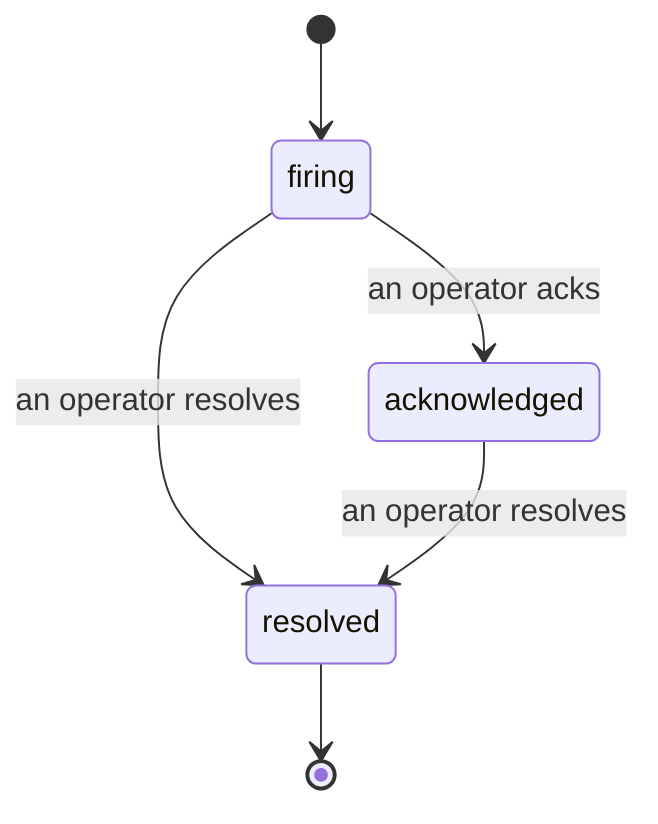

알림이 발생하면 가장 먼저 드는 질문은 항상 "누가 담당하고 있나요?"입니다. 인시던트가 그 답을 제공합니다. 임계값이 초과되는 순간, 인시던트가 열렸다는 것, 누가 소유하고 있는지, 그리고 지금까지 정확히 무슨 일이 있었는지를 모두가 확인할 수 있으며, 사후 분석에 바로 활용할 수 있는 명확하고 귀속된 기록이 남습니다.

*받은 편지함은 열린 인시던트를 상태별로 그룹화하고 심각도 및 담당자로 필터링하므로, 지금 당장 사람이 처리해야 할 항목을 바로 확인할 수 있습니다.*

## 누가 담당하고 있는지 한눈에 파악

채팅 스레드에서 "누가 이걸 보고 있나요?"라고 물어볼 필요가 없습니다. 임계값 초과 시 인시던트가 자동으로 열리고 공유 받은 편지함에 상태별로 그룹화되어 들어갑니다. 인시던트를 확인(Acknowledge)하면 이름이 표시되어 팀의 다른 사람들이 처리 중임을 알 수 있습니다. 확인은 공유됩니다. 여러 운영자가 동일한 인시던트를 확인할 수 있고 각각 별도로 기록되므로, 전체 대응팀이 서로 겹치지 않고 각자의 이름으로 표시됩니다. 트리아지를 위한 단일 소유자를 지정하고, 심각도나 담당자로 받은 편지함을 필터링하여 자신의 항목만 볼 수 있습니다.

## 모든 경과를 하나의 타임라인으로

인시던트가 종료되면 이미 보고서가 준비되어 있습니다. 인시던트를 열면 침해 증거, 담당자 및 구독자, 현장 조율을 위한 댓글 스레드, 그리고 추가만 가능한 활동 타임라인을 확인할 수 있습니다.

*발생한 모든 사항이 순서대로 기록되며, 각 항목은 실행한 사람이 서명합니다.*

모든 작업(열림, 확인, 해결 등)은 타임라인에 기록되며 절대 수정되지 않습니다. 각 항목은 귀속됩니다. 즉, 이메일로 작업을 수행한 운영자에게 귀속되거나, 침해 시 인시던트 열기처럼 FailproofAI Observability가 자체적으로 수행한 작업에는 **automated**로 표시됩니다. 익명 항목은 없으며 유실되는 정보도 없으므로, 사후 분석 보고서가 거의 저절로 작성됩니다.

## 인시던트의 진행 방식

- **열림(firing):** 임계값 초과 시 인시던트가 열리고 채널에 한 번 페이지를 보냅니다. 반복적인 침해는 동일한 인시던트로 합산되어 증거를 갱신하며, 반복적으로 페이지를 보내지 않습니다.
- **확인됨(acknowledged):** 운영자가 인시던트를 맡습니다. 인시던트는 열린 상태로 유지되며, 이후 침해는 증거를 자동으로 업데이트합니다.
- **해결됨(resolved):** 운영자가 인시던트를 종료합니다. 조건이 해소될 때 자동으로 해결되는 기능은 계획되어 있지만 아직 활성화되지 않았으므로, 사람이 직접 해결할 때까지 인시던트가 열린 상태로 유지됩니다. 이는 실제로 무엇이 해소되었는지에 대해 모두가 책임감을 갖도록 합니다. 이후 동일한 알림에 새로운 인시던트가 열릴 수 있습니다.

하나의 알림에는 동시에 열린 인시던트가 최대 하나이므로, 불안정한 규칙으로 인해 중복 인시던트에 묻히는 일이 없습니다. 또한 인시던트를 수동으로 열 수 있습니다. `incidents:write` 권한이 있다면 어떤 알림도 감지하지 못한 상황을 위한 독립형 인시던트나 기존 알림에 연결된 인시던트를 생성할 수 있습니다.

## 찾는 방법

인시던트는 `/<org-slug>/incidents`에 있습니다. 조회에는 **`incidents:read`**, 수동 인시던트 열기에는 **`incidents:write`**, 확인·지정·댓글·해결에는 **`incidents:ack`**가 필요합니다. 이전에 부여된 `alerts:ack` 키는 `incidents:ack`로 인정되므로 계속 작동합니다. 따라서 온콜 로테이션을 다시 발급할 필요가 없습니다.

## 관련 항목

- [알림](/ko/agenteye/alerts): 임계값 초과 시 인시던트를 여는 규칙입니다.
- [오류 추적](/ko/agenteye/error-tracking): 모든 실패를 한 곳에서 확인하고 알림으로 전환합니다.
- [감사](/ko/agenteye/audits): 어떤 규칙도 감시하지 않은 실패를 찾아내는 예약된 분석기입니다.