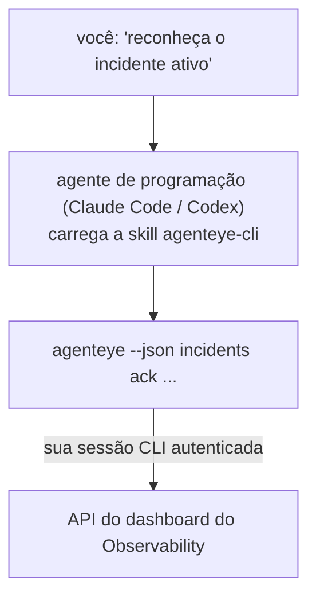

Pergunte ao seu agente de programação *"algo está quebrado hoje?"* e deixe-o responder com seus dados ao vivo do Failproof AI Observability, sem precisar memorizar nenhum comando. A **Failproof AI Observability CLI skill** (`agenteye-cli`) é uma *Agent Skill*: uma pequena pasta de instruções que um agente de programação como Claude Code ou Codex carrega sob demanda. Ela ensina o agente a operar seu deployment do Observability através da [`agenteye` CLI](/pt-br/agenteye/cli) a partir de requisições em linguagem natural como *"dê ao CI uma chave que só possa enviar eventos"* ou *"reconheça o incidente ativo e atribua-o a mim."*

Ela **não** é um serviço nem um binário separado; não há nada para fazer deploy. Ela funciona em cima da CLI que você já tem instalada: o agente executa `agenteye --json …`, analisa o JSON limpo e responde em prosa. Tudo que ela pode fazer, você poderia fazer digitando os mesmos comandos.

---

## Como ela se relaciona com as outras interfaces do Failproof AI Observability

O Failproof AI Observability oferece quatro formas de acessar os mesmos dados e controles. Elas se complementam:

| Interface | O que é | Onde roda | Use quando |
|---|---|---|---|
| **[CLI](/pt-br/agenteye/cli)** | A referência de comandos e flags para `agenteye` | Seu terminal | Você quer executar ou automatizar um comando específico |
| **[Receitas de CLI](/pt-br/agenteye/cli-recipes)** | Padrões de `jq`/pipeline para copiar e colar | Seu terminal / scripts | Você está integrando a CLI em automações |
| **CLI skill** (este doc) | Uma porta de entrada em linguagem natural para a CLI | Seu agente de programação, na sua estação de trabalho | Você quer *simplesmente perguntar* e deixar o agente escolher o comando |
| **[Evaluator skill](/pt-br/agenteye/evaluator-skill)** | Uma skill irmã que projeta e constrói seu serviço de pontuação | Seu agente de programação, na sua estação de trabalho | Você quer *produzir* pontuações de avaliação em vez de lê-las |
| **[Python SDK skill](/pt-br/agenteye/python-sdk-skill)** | Uma skill irmã que instrumenta seu agente para que ele emita telemetria | Seu agente de programação, na sua estação de trabalho | Você quer que seu agente *produza* os eventos que esta skill lê |
| **[Assistente de IA no dashboard](/pt-br/agenteye/assistant)** | Um chat integrado ao dashboard | Server-side (no dashboard) | Você quer fazer perguntas sobre seus dados dentro do dashboard |

A skill em si não tem privilégios próprios; ela apenas transforma suas palavras em chamadas de CLI que rodam como você:



### vs. o assistente de IA no dashboard: uma distinção importante

Estas são duas ferramentas diferentes com raios de ação muito distintos:

- O **assistente de IA no dashboard** ([AI assistant](/pt-br/agenteye/assistant)) é um chat integrado ao dashboard, respaldado pelo serviço de agente. Ele é **somente leitura mais criação com aprovação**: pode rascunhar queries salvas e dashboards, mas toda escrita pausa para sua aprovação explícita com um clique, e nunca exclui nada. Ele é limitado pela permissão `agent:use` e só vê dados da organização que você está visualizando.
- A **CLI skill** roda na *sua* estação de trabalho dentro do *seu* agente de programação e aciona a CLI `agenteye` como **você**. Ela pode executar a **superfície completa da CLI, incluindo mutações** (criar/rotacionar/desabilitar chaves de API, alterar configurações da organização, resolver incidentes, excluir queries salvas), limitada apenas pelas permissões do seu login na CLI. Trate-a com exatamente o mesmo cuidado que você teria ao rodar esses comandos manualmente.

---

## Pré-requisitos

1. A **`agenteye` CLI instalada** e no `PATH` (veja a referência da [CLI](/pt-br/agenteye/cli): `pipx install agenteye`).
2. Sua **URL do dashboard** configurada (`AGENTEYE_DASHBOARD_URL`, ou o agente passa `--base-url`).
3. Uma **sessão autenticada**: execute `agenteye login` você mesmo primeiro. A skill **não consegue** completar o login com código de uso único enviado por e-mail; ela vai pedir que você execute `agenteye login` se a sessão estiver ausente ou expirada (código de saída da CLI `4`).

---

## Onde encontrá-la

A skill está publicada na coleção pública de skills da Failproof AI:

**[github.com/FailproofAI/skills](https://github.com/FailproofAI/skills)** → [`skills/agenteye-cli/`](https://github.com/FailproofAI/skills/tree/main/skills/agenteye-cli)

Nada nela é restrito — o repositório é público e a skill não precisa de credencial própria, pois ela apenas aciona a CLI `agenteye` **pública** contra o *seu* dashboard, usando a sessão com a qual *você* fez login. Você não precisa pedir permissão a ninguém.

Note que ela é distribuída como sua própria pasta e **não** está dentro do pacote `pipx install agenteye`, portanto não a procure lá.

## Instalando a skill

O caminho mais rápido é a CLI [`skills`](https://skills.sh), que busca a pasta e a coloca onde seu agente procura:

```bash
# Claude Code, somente este projeto
npx skills add FailproofAI/skills --skill agenteye-cli -a claude-code

# todos os projetos (instala em ~/.claude/skills/)
npx skills add FailproofAI/skills --skill agenteye-cli -a claude-code -g --copy

# Codex em vez disso
npx skills add FailproofAI/skills --skill agenteye-cli -a codex
```

Em seguida, gerencie como qualquer outra skill:

```bash
npx skills list -a claude-code      # o que está instalado
npx skills update agenteye-cli      # baixar a versão mais recente
npx skills remove agenteye-cli      # remover
```

Prefere instalar manualmente? Uma Agent Skill é apenas uma pasta contendo um `SKILL.md` (mais referências opcionais), então copiá-la também funciona:

- **Claude Code**: coloque a pasta `agenteye-cli/` em `~/.claude/skills/` (todos os projetos) ou `<seu-repo>/.claude/skills/` (somente aquele repositório). Claude Code a descobre automaticamente — verifique com a lista `/skills`, ou simplesmente faça uma pergunta que corresponda à sua descrição.
- **Codex (OpenAI)**: o Codex lê o mesmo `SKILL.md`. O arquivo `agents/openai.yaml` incluído define `allow_implicit_invocation: true`, então o Codex seleciona a skill automaticamente quando uma tarefa corresponde; caso contrário, invoque-a explicitamente como `$agenteye-cli`.

---

## Segurança: mutações NÃO solicitam confirmação quando um agente executa a CLI

> **Aviso:** Leia isto antes de permitir que um agente faça alterações.

A CLI `agenteye` normalmente pergunta *"tem certeza?"* antes de uma ação destrutiva. Ela **pula automaticamente essa confirmação sempre que não está conectada a um terminal (que é exatamente como um agente de programação a executa), e `--json` também a pula.** Portanto, o prompt de segurança **não** será acionado para o agente.

A skill foi escrita para compensar isso: ela é instruída a declarar o comando exato que vai executar e obter seu **OK explícito antes de qualquer alteração de estado**. Mantenha essa disciplina. Quando você aciona o Failproof AI Observability por meio de um agente, *você* é o passo de confirmação. Os comandos que alteram estado para ficar de olho:

- `keys create` / `update` / `disable` / `regenerate`
- `users create` / `update` / `disable` / `enable`
- `settings set`
- `alerts create` / `update` / `delete` / `test`
- os subcomandos de escrita de `incidents`: `ack` / `assign` / `resolve` / `open` / `comment-add` / `comment-delete` / `subscribe` / `unsubscribe`
- `query create` / `update` / `delete`
- `agent rename` / `delete`
- `orgs switch`

Tudo sob **Observe** (`events`, `sessions`, `evals`, `errors`, `list`, `whoami`, `orgs list/current/perms`) é somente leitura e não altera nada.

Como o agente age como **você**, ele só pode fazer o que seu login tem permissão para fazer; as permissões são resolvidas **por organização** (veja [API keys](/pt-br/agenteye/api-keys)). Um comando para o qual você não tem permissão retorna o código de saída `5` com o nome exato da permissão, para que o agente possa dizer precisamente o que você precisa pedir a um administrador, em vez de falhar de forma obscura.

---

## O que você pode perguntar

Veja como uma interação real se parece — uma leitura, depois uma alteração que aguarda sua aprovação:

```text
você   ▸ Algo quebrou no último dia?

agente ▸ Executando: agenteye --json errors --since 24h --aggregate
         3 tipos de erro nas últimas 24h. O maior é TimeoutError
         (18 ocorrências, todas no checkout-agent), depois RateLimited (5).
         Quer as sessões com falha para TimeoutError?

você   ▸ Dê ao CI uma chave que só possa enviar eventos.

agente ▸ Isso cria uma chave de API. Vou executar:
           agenteye keys create ci --add events:add
         Pode prosseguir?

você   ▸ sim

agente ▸ Pronto. Chave "ci" criada com events:add apenas.
         O segredo é exibido somente uma vez, então salve-o agora. Não consigo reexibi-lo.
```

A skill mapeia cada intenção em linguagem natural para o comando `agenteye` correto, descobrindo valores válidos primeiro (`list <kind>`, `whoami`) para não adivinhar, e declarando o comando exato antes de qualquer alteração. Mais exemplos:

- *"Algo está quebrado/falhando nas últimas 24 horas?"* → `errors --since 24h --aggregate`, depois um detalhamento.
- *"Por que a sessão `run-001` falhou?"* → `events --session-id run-001 --all` + `evals --session-id run-001`.
- *"Como a qualidade está evoluindo esta semana?"* → `evals --aggregate --since 7d`, depois detalhar execuções com baixa pontuação.
- *"Dê ao CI uma chave que só possa enviar eventos."* → `keys create ci --add events:add` (declara o comando, depois cria e captura o segredo de uso único).
- *"Quem tem acesso? Deixe a Dana como somente leitura."* → `users list` → `users update dana@… --permission-set read-only` (após confirmar com você).
- *"Reconheça o incidente ativo e atribua-o a mim."* → `incidents list --state firing` → `incidents ack <id>` / `incidents assign <id> você@…`.

Para os comandos exatos, flags e formatos JSON por trás desses exemplos, veja a referência da [CLI](/pt-br/agenteye/cli) e as [receitas de CLI para agentes](/pt-br/agenteye/cli-recipes).

---

## Próximos passos

- **[CLI](/pt-br/agenteye/cli)**: referência completa de comandos e flags para `agenteye`.
- **[Receitas de CLI para agentes](/pt-br/agenteye/cli-recipes)**: padrões de `jq` para copiar e colar e tratamento de códigos de saída.
- **[Evaluator agent skill](/pt-br/agenteye/evaluator-skill)**: a skill irmã, para construir o avaliador cujas pontuações `agenteye evals` lê.
- **[Python SDK agent skill](/pt-br/agenteye/python-sdk-skill)**: a skill irmã, para instrumentar um agente para que ele emita a telemetria que `agenteye` lê.
- **[AI assistant](/pt-br/agenteye/assistant)**: o assistente integrado ao dashboard (não confundir com esta skill de terminal).
- **[API keys](/pt-br/agenteye/api-keys)**: o modelo de permissão por organização que limita o que a skill pode fazer.