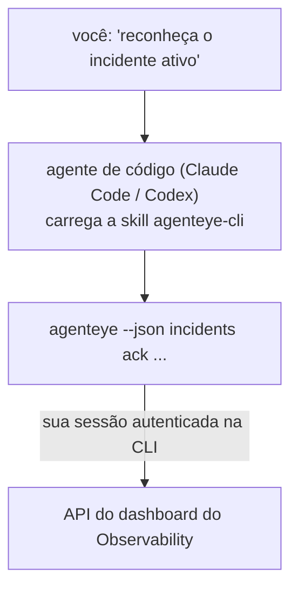

Pergunte ao seu agente de código *"há algo quebrado hoje?"* e deixe-o responder com base nos seus dados ao vivo do FailproofAI Observability, sem precisar memorizar nenhum comando. A **CLI skill do FailproofAI Observability** (`agenteye-cli`) é uma *Agent Skill*: uma pequena pasta de instruções que um agente de código como Claude Code ou Codex carrega sob demanda. Ela ensina o agente a operar seu deployment do Observability através da [`agenteye` CLI](/pt-br/agenteye/cli) a partir de solicitações em linguagem natural como *"dê ao CI uma chave que só possa enviar eventos"* ou *"reconheça o incidente ativo e atribua-o a mim."*

Ela **não** é um serviço nem um binário separado; não há nada para implantar. Ela funciona em cima da CLI que você já instalou: o agente executa `agenteye --json …`, analisa o JSON limpo e responde em prosa. Tudo o que ela pode fazer, você poderia fazer digitando os mesmos comandos.

---

## Como ela se relaciona com as outras interfaces do FailproofAI Observability

O FailproofAI Observability oferece quatro formas de acessar os mesmos dados e controles. Elas se complementam:

| Interface | O que é | Onde é executada | Use quando |
|---|---|---|---|
| **[CLI](/pt-br/agenteye/cli)** | A referência de comandos e flags do `agenteye` | Seu terminal | Você quer executar ou criar scripts de um comando específico |
| **[Receitas de CLI](/pt-br/agenteye/cli-recipes)** | Padrões de `jq`/pipeline para copiar e colar | Seu terminal / scripts | Você está integrando a CLI em automações |
| **CLI skill** (este documento) | Uma porta de entrada em linguagem natural para a CLI | Seu agente de código, na sua estação de trabalho | Você quer *simplesmente perguntar* e deixar o agente escolher o comando |
| **[Assistente de IA no dashboard](/pt-br/agenteye/assistant)** | Um chat embutido no dashboard | Server-side (no dashboard) | Você quer fazer perguntas sobre seus dados diretamente no dashboard |

A skill em si não tem privilégios próprios; ela apenas transforma suas palavras em chamadas de CLI que são executadas como você:



### vs. o assistente de IA no dashboard: uma distinção importante

Estas são duas ferramentas diferentes com raios de impacto muito distintos:

- O **assistente de IA no dashboard** ([AI assistant](/pt-br/agenteye/assistant)) é um chat embutido no dashboard, apoiado pelo serviço do agente. Ele é **somente leitura mais criação com aprovação**: pode rascunhar queries salvas e dashboards, mas toda escrita aguarda sua aprovação explícita com um clique, e nunca deleta nada. É controlado pela permissão `agent:use` e só acessa dados da organização que você está visualizando.
- A **CLI skill** é executada na *sua* estação de trabalho dentro do *seu* agente de código e aciona a `agenteye` CLI como **você**. Ela pode realizar toda a **superfície da CLI, incluindo mutações** (criar/rotacionar/desativar chaves de API, alterar configurações da organização, resolver incidentes, deletar queries salvas), limitada apenas pelas permissões do seu login na CLI. Trate-a com exatamente o mesmo cuidado que você teria ao executar esses comandos manualmente.

---

## Pré-requisitos

1. A **`agenteye` CLI instalada** e no `PATH` (veja a referência da [CLI](/pt-br/agenteye/cli): `pipx install agenteye`).
2. Sua **URL do dashboard** configurada (`AGENTEYE_DASHBOARD_URL`, ou o agente passa `--base-url`).
3. Uma **sessão autenticada**: execute `agenteye login` você mesmo primeiro. A skill **não pode** concluir o login com código de uso único enviado por e-mail; ela irá orientar você a executar `agenteye login` caso a sessão esteja ausente ou expirada (código de saída da CLI `4`).

---

## Instalando a skill

Agent Skills são pastas que contêm um `SKILL.md` (mais referências opcionais). Você instala a skill `agenteye-cli` colocando sua pasta onde seu agente procura por skills:

- **Claude Code**: copie a pasta `agenteye-cli/` para `~/.claude/skills/` (disponível em todos os projetos) ou para `<seu-repositório>/.claude/skills/` (com escopo para aquele repositório). Claude Code a detecta automaticamente; verifique com a lista `/skills`, ou simplesmente faça uma pergunta que corresponda à sua descrição.
- **Codex (OpenAI)**: o Codex lê o mesmo `SKILL.md`. O arquivo `agents/openai.yaml` incluído define `allow_implicit_invocation: true`, então o Codex seleciona automaticamente a skill quando uma tarefa corresponde; caso contrário, invoque-a explicitamente como `$agenteye-cli`.

A skill é mantida junto com a `agenteye` CLI, mas é distribuída como uma **pasta separada**, não dentro do pacote `pipx install agenteye`, portanto não a procure lá. O FailproofAI Observability entrega a pasta `agenteye-cli/` a você de forma independente; se você não a tiver, entre em contato com seu representante FailproofAI. Não há nenhuma restrição de acesso: ela não precisa de nenhuma credencial, pois apenas aciona a `agenteye` CLI **pública** contra o seu próprio dashboard.

---

## Segurança: mutações NÃO exibem prompt de confirmação quando um agente executa a CLI

> **Atenção:** Leia isto antes de permitir que um agente faça alterações.

A `agenteye` CLI normalmente pergunta *"tem certeza?"* antes de uma ação destrutiva. Ela **pula automaticamente essa confirmação sempre que não está conectada a um terminal (que é exatamente como um agente de código a executa), e `--json` também a pula.** Portanto, o prompt de segurança **não** será acionado para o agente.

A skill foi escrita para compensar isso: ela é instruída a informar o comando exato que será executado e obter seu **OK explícito antes de qualquer alteração de estado**. Mantenha essa disciplina. Quando você opera o FailproofAI Observability por meio de um agente, *você* é a etapa de confirmação. Os comandos que modificam o estado e que devem ser monitorados com atenção:

- `keys create` / `update` / `disable` / `regenerate`
- `users create` / `update` / `disable` / `enable`
- `settings set`
- `alerts create` / `update` / `delete` / `test`
- os subcomandos de escrita de `incidents`: `ack` / `assign` / `resolve` / `open` / `comment-add` / `comment-delete` / `subscribe` / `unsubscribe`
- `query create` / `update` / `delete`
- `agent rename` / `delete`
- `orgs switch`

Tudo em **Observe** (`events`, `sessions`, `evals`, `errors`, `list`, `whoami`, `orgs list/current/perms`) é somente leitura e não altera nada.

Como o agente age como **você**, ele só pode fazer o que seu login tem permissão para fazer; as permissões são resolvidas **por organização** (consulte [API keys](/pt-br/agenteye/api-keys)). Um comando para o qual você não tem permissão retorna o código de saída `5` com o nome exato da permissão necessária, para que o agente possa informar precisamente o que você precisa solicitar a um administrador, em vez de falhar de forma opaca.

---

## O que você pode perguntar

Veja como é uma interação real — uma leitura, depois uma alteração que aguarda sua aprovação:

```text
você  ▸ Há algo quebrado no último dia?

agente▸ Executando: agenteye --json errors --since 24h --aggregate
        3 tipos de erro nas últimas 24h. O maior é TimeoutError
        (18 ocorrências, todas no checkout-agent), depois RateLimited (5).
        Quer as sessões com falha para TimeoutError?

você  ▸ Dê ao CI uma chave que só possa enviar eventos.

agente▸ Isso vai criar uma chave de API. Vou executar:
          agenteye keys create ci --add events:add
        Posso prosseguir?

você  ▸ sim

agente▸ Pronto. Chave "ci" criada com events:add apenas.
        O segredo é exibido apenas uma vez, então salve-o agora. Não consigo reimprimí-lo.
```

A skill mapeia cada intenção em linguagem natural para o comando `agenteye` correto, descobrindo valores válidos primeiro (`list <kind>`, `whoami`) para não adivinhar, e informando o comando exato antes de qualquer alteração. Mais exemplos:

- *"Há algo quebrado / falhando nas últimas 24 horas?"* → `errors --since 24h --aggregate`, seguido de um detalhamento.
- *"Por que a sessão `run-001` falhou?"* → `events --session-id run-001 --all` + `evals --session-id run-001`.
- *"Como a qualidade está evoluindo esta semana?"* → `evals --aggregate --since 7d`, depois detalhar as execuções com pontuação baixa.
- *"Dê ao CI uma chave que só possa enviar eventos."* → `keys create ci --add events:add` (informa o comando, depois o cria e captura o segredo de uso único).
- *"Quem tem acesso? Deixe a Dana somente com permissão de leitura."* → `users list` → `users update dana@… --permission-set read-only` (após confirmar com você).
- *"Reconheça o incidente ativo e atribua-o a mim."* → `incidents list --state firing` → `incidents ack <id>` / `incidents assign <id> você@…`.

Para os comandos exatos, flags e estruturas JSON por trás desses exemplos, consulte a referência da [CLI](/pt-br/agenteye/cli) e as [receitas de CLI para agentes](/pt-br/agenteye/cli-recipes).

---

## Próximos passos

- **[CLI](/pt-br/agenteye/cli)**: referência completa de comandos e flags do `agenteye`.
- **[Receitas de CLI para agentes](/pt-br/agenteye/cli-recipes)**: padrões `jq` para copiar e colar e tratamento de códigos de saída.
- **[AI assistant](/pt-br/agenteye/assistant)**: o assistente no dashboard (não confundir com esta skill de terminal).
- **[API keys](/pt-br/agenteye/api-keys)**: o modelo de permissões por organização que delimita o que a skill pode fazer.