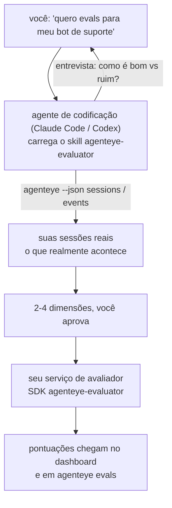

Saia de *"acho que nosso agente às vezes é ruim"* para um serviço de pontuação implantado, com seu agente de codificação fazendo tanto as decisões quanto a construção. O **skill de avaliador de Observabilidade Failproof AI** (`agenteye-evaluator`) é um *Agent Skill*: uma pequena pasta de instruções que um agente de codificação como Claude Code ou Codex carrega sob demanda. Ele ensina o agente a descobrir quais dimensões de qualidade valem a pena monitorar para o *seu* agente, depois escrever, testar e implantar o [serviço de avaliador](/pt-br/agenteye/evaluation-suite) que as pontua.

**Não** é um pontuador hospedado, um registro para o qual você faz upload, nem um sistema de plugins. Seu avaliador permanece como seu próprio serviço HTTP na sua própria infraestrutura, exatamente como descrito no guia de [Evaluation suite](/pt-br/agenteye/evaluation-suite). O skill apenas ensina seu agente a construí-lo bem, então tudo o que ele faz, você poderia fazer sozinho escrevendo o mesmo código.

---

## A parte difícil é decidir o que pontuar

A superfície do SDK é pequena — um decorator e dois models — e um agente pode escrevê-la a partir do [contrato](/pt-br/agenteye/evaluation-suite#http-contract) sozinho. Não é aí que os avaliadores falham. Eles falham porque pontuam a coisa errada, e um avaliador que pontua a coisa errada é pior do que nenhum: ele produz um dashboard que todos aprendem a ignorar.

Então a maior parte do skill está na fase que existe antes de qualquer código ser escrito. Ele faz o agente entrevistar você (*"descreva uma execução que correu bem; agora uma que correu mal"*), depois puxa suas sessões reais através da [CLI do `agenteye`](/pt-br/agenteye/cli) e as lê de ponta a ponta. Essas duas metades geralmente discordam, e a lacuna é o ponto central: o que você pretende medir versus o que suas transcrições realmente conseguem suportar. Uma dimensão só sobrevive se for **computável** a partir dos eventos e **discriminante** — se pontuar 0,9 tanto na sua execução boa quanto na ruim, ela não ensina nada e é descartada.

O que resulta é uma proposta de 2 a 4 dimensões com o raciocínio anexado, para você aprovar antes que uma linha seja escrita.



---

## Como ele se relaciona com as outras peças de avaliação

Quatro documentos cobrem a pontuação, e eles se passam para o próximo em ordem:

| Página | O que é | Consulte quando |
|---|---|---|
| **[Evaluations](/pt-br/agenteye/evaluations)** | O recurso: pontuações na grade de sessões, dashboards, reavaliação | Você quer saber o que a pontuação automática oferece |
| **[Evaluation suite](/pt-br/agenteye/evaluation-suite)** | O contrato HTTP, o SDK, as variáveis de ambiente do servidor | Você está implementando ou depurando o avaliador sozinho |
| **Skill de avaliador** (este doc) | Uma porta de entrada em linguagem natural para projetar *e* construir o pontuador | Você quer ir de "quero evals" a um serviço em execução |
| **[CLI skill](/pt-br/agenteye/cli-skill)** | Uma porta de entrada em linguagem natural para a CLI do `agenteye` | Você quer *ler* as pontuações que já tem |
| **[Python SDK skill](/pt-br/agenteye/python-sdk-skill)** | Uma porta de entrada em linguagem natural para instrumentar seu agente | Seu agente ainda não está emitindo sessões — não há nada para pontuar |

### vs. o CLI skill: construir versus ler

Os dois skills são deliberadamente não sobrepostos, e instalar ambos é a configuração normal — o agente escolhe entre eles com base no que você pede:

- **`agenteye-evaluator`** (este doc) constrói a coisa que *produz* pontuações. Seu trabalho termina quando as pontuações chegam pela primeira vez.
- **[`agenteye-cli`](/pt-br/agenteye/cli-skill)** lê pontuações que já existem (`agenteye evals`). *"A qualidade caiu esta semana?"* é a pergunta dele, não deste skill.

---

## Pré-requisitos

1. A **CLI do `agenteye` instalada e com login efetuado** (`pipx install agenteye`, depois `agenteye login`). O skill depende dela em dois momentos: para puxar as sessões reais nas quais baseia o design, e para confirmar que suas pontuações chegaram no final. Seu login precisa de `events:read`, mais `evaluations:read` para essa verificação final. Assim como com o CLI skill, ele **não consegue** completar o login de código único enviado por e-mail por você.
2. **Um lugar para o avaliador residir.** Ele é construído em uma imagem e executado como um serviço de longa duração, então precisa de um repositório real, não de um arquivo temporário. Avaliadores geralmente vivem em seu próprio repositório, separado do agente sendo pontuado — o skill procura um existente e pergunta antes de criar um novo.
3. **O wheel do SDK `agenteye-evaluator`** — leia a próxima seção antes de deixar seu agente começar a digitar comandos `pip`.

---

## Onde obtê-lo

O skill está publicado na coleção pública de skills da Failproof AI:

**[github.com/FailproofAI/skills](https://github.com/FailproofAI/skills)** → [`skills/agenteye-evaluator/`](https://github.com/FailproofAI/skills/tree/main/skills/agenteye-evaluator)

O repositório é público e o skill não precisa de credenciais próprias — ele apenas opera a CLI do `agenteye` com a sessão com a qual *você* fez login, e escreve código no *seu* repositório. Note que ele é entregue como sua própria pasta e **não** está dentro do pacote `pipx install agenteye`, então não o procure lá.

## Instalando o skill

O caminho mais rápido é a CLI [`skills`](https://skills.sh), que busca a pasta e a coloca onde seu agente procura:

```bash
# Claude Code, somente este projeto
npx skills add FailproofAI/skills --skill agenteye-evaluator -a claude-code

# todos os projetos (instala em ~/.claude/skills/)
npx skills add FailproofAI/skills --skill agenteye-evaluator -a claude-code -g --copy

# Codex em vez disso
npx skills add FailproofAI/skills --skill agenteye-evaluator -a codex
```

Depois gerencie-o como qualquer outro skill:

```bash
npx skills list -a claude-code           # o que está instalado
npx skills update agenteye-evaluator     # puxar a versão mais recente
npx skills remove agenteye-evaluator     # remover
```

Prefere instalar manualmente? Um Agent Skill é apenas uma pasta contendo um `SKILL.md` (mais referências opcionais), então copiá-la também funciona:

- **Claude Code**: coloque a pasta `agenteye-evaluator/` em `~/.claude/skills/` (todos os projetos) ou `<seu-repo>/.claude/skills/` (somente aquele repositório). Claude Code a descobre automaticamente — verifique com a lista `/skills`, ou simplesmente peça por evals.
- **Codex (OpenAI)**: o Codex lê o mesmo `SKILL.md`. O `agents/openai.yaml` incluído define `allow_implicit_invocation: true`, então o Codex seleciona automaticamente o skill quando uma tarefa corresponde; caso contrário, invoque-o explicitamente como `$agenteye-evaluator`.

---

## O SDK não está no PyPI público

> **Aviso:** Leia isso antes de deixar um agente instalar o SDK.

O skill é público; o SDK que ele opera não é. O `agenteye-evaluator` é entregue apenas como um artefato de release privado, e ao contrário do `agenteye`, o nome está **não reivindicado no PyPI público** — então um simples `pip install agenteye-evaluator` poderia puxar um pacote de um estranho para o serviço que lê suas transcrições de produção. Isso é um problema de cadeia de suprimentos, não um erro de digitação.

O skill sabe disso e percorre uma escada de instalação em vez disso, parando no primeiro degrau que se aplica: a fonte do monorepo se você estiver dentro do repositório AgentEye, caso contrário o wheel de release privado do GitHub Releases (requer acesso), e se nenhum dos dois estiver acessível ele **para e avisa que você deve pedir o wheel ao seu contato na Failproof AI** em vez de improvisar.

Portanto, se seu agente propõe um simples `pip install agenteye-evaluator` do PyPI público, isso é o sinal de que o skill nunca foi carregado. Pare aí e verifique se ele está instalado.

---

## O que você pode pedir a ele

Um ciclo completo real começa com um pedido vago e termina com um design aprovado, não com código:

```text
você   ▸ Quero evals para nosso bot de suporte. Acho que ele às vezes é ruim.

agente ▸ Antes de escrever qualquer coisa: descreva uma execução que correu
         bem, e uma que correu mal.

você   ▸ Boa: ele responde com base na documentação. Ruim: ele inventa coisas,
         ou desiste e diz "entre em contato com o suporte".

agente ▸ Executando: agenteye --json sessions --status error --since 7d
         Lendo 5 sessões, incluindo duas que você consideraria ruins.

         Suas palavras dizem factualidade e deflexão. As transcrições
         concordam com deflexão (2 de 5 terminam com um encaminhamento
         ao suporte, e isso é evidente em model_response.content), mas
         factualidade precisa de uma verdade fundamental que seus eventos
         não carregam.

         Então eu pontuaria três coisas:
           - deflection      regras, barato, separa suas duas execuções
           - tool_efficiency regras, detecta o loop de retry em run-004
           - groundedness    juiz LLM: cada afirmação está nos docs recuperados?

         "factuality" precisaria de uma verdade fundamental que não temos;
         groundedness é o mais próximo que suas transcrições conseguem suportar.
         OK com esses três nomes? Renomear depois divide o histórico.

você   ▸ sim

agente ▸ Nenhum avaliador neste repositório. Devo criar um aqui, ou você
         tem um em outro lugar?
```

A partir daí, ele escreve as dimensões baseadas em regras primeiro (gratuitas, instantâneas, determinísticas), testa-as em uma sessão real capturada incluindo as vazias e as que nunca terminaram e que travam avaliadores ingênuos, e só recorre a um juiz LLM na dimensão subjetiva. Ele conhece os [limites do dispatcher](/pt-br/agenteye/evaluation-suite#configuring-the-server) — um timeout de requisição de 30s e 8 chamadas concorrentes em todo o deployment — então se o juiz não couber de forma confiável, ele vai assíncrono com `JobPending` em vez de deixar seu juiz ser cancelado e reexecutado cinco vezes com cinco vezes o custo.

Depois faz o deploy, define as duas variáveis de ambiente do servidor e confirma com `agenteye --json evals --session-id <id>` que as pontuações realmente chegaram. As pontuações chegando é a única prova.

---

## O que observar

- **Os nomes das dimensões são quase permanentes.** As chaves de pontuação são strings arbitrárias e a plataforma rastreia tendências de tudo o que você envia, o que significa que nada a downstream corrige uma escolha ruim. Renomeie depois e o histórico se divide: sessões antigas mantêm a chave antiga e a tendência quebra. É por isso que o skill obtém aprovação explícita antes de escrever código — leve esse prompt a sério.
- **Os fixtures são transcrições reais de produção.** Projetar com base em sessões reais significa puxá-las para o disco, e elas podem conter dados de clientes. O skill pergunta antes de fazer commit delas no git; em caso de dúvida, mantenha `fixtures/` fora do repositório e peça a cada desenvolvedor que puxe as suas próprias.
- **O agente escreve e implanta um serviço que lê cada transcrição.** Ele age como você, limitado pelas permissões do seu login na CLI, mas revise o avaliador como qualquer outro código que toca dados de produção.

---

## Próximos passos

- **[Evaluation suite](/pt-br/agenteye/evaluation-suite)**: o contrato HTTP, o SDK e as variáveis de ambiente do servidor que o skill configura.
- **[Evaluations](/pt-br/agenteye/evaluations)**: onde as pontuações aparecem quando chegam.
- **[CLI skill](/pt-br/agenteye/cli-skill)**: o skill irmão, para ler resultados em vez de construir o pontuador.
- **[CLI](/pt-br/agenteye/cli)**: a referência de comandos por trás dos dados de sessão nos quais o skill baseia seu design.