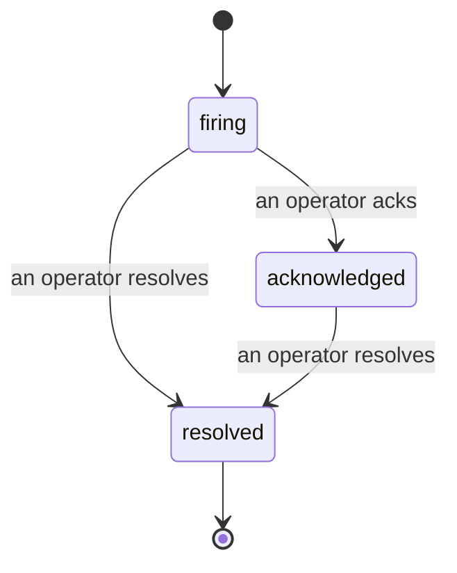

Quando um alerta dispara, a primeira pergunta é sempre "quem está cuidando disso?" Os incidentes respondem a essa pergunta: no momento em que algo é violado, todos podem ver que o incidente está aberto, quem é o responsável e exatamente o que aconteceu até agora, com um registro limpo e atribuído que você pode passar diretamente para uma retrospectiva.

*A caixa de entrada agrupa incidentes abertos por estado e filtra por severidade e responsável, para que você veja o que precisa de atenção humana agora.*

## Saiba quem está cuidando, de relance

Chega de "alguém está olhando para isso?" em uma thread de chat. Uma violação abre um incidente automaticamente e o coloca em uma caixa de entrada compartilhada, agrupada por estado. Confirme o recebimento e seu nome aparece nele, para que o restante da equipe saiba que está sendo tratado. A confirmação é compartilhada: vários operadores podem confirmar o mesmo incidente e cada confirmação é registrada individualmente, de modo que uma sala de guerra completa aparece por nome em vez de se sobreporem. Atribua um responsável para triagem e filtre a caixa de entrada por severidade ou responsável para ver apenas o que é seu.

## A história completa em uma única linha do tempo

Quando o incidente termina, você já tem o relatório. Abra qualquer incidente e você verá as evidências da violação, seus responsáveis e assinantes, uma thread de comentários para coordenação no lugar e uma linha do tempo de atividades somente para acréscimo.

*Tudo o que aconteceu, em ordem, cada linha assinada por quem a executou.*

Cada ação (aberto, confirmado, resolvido e assim por diante) é gravada nessa linha do tempo e nunca é apagada. Cada entrada é atribuída: ao operador que a realizou, por e-mail, ou como **automatizado** para qualquer coisa que a FailproofAI Observability fez por conta própria, como abrir o incidente na violação. Nada é anônimo e nada se perde, portanto a retrospectiva praticamente se escreve sozinha.

## Como um incidente avança

- **Aberto (firing):** a violação abre o incidente e notifica seus canais uma vez. Violações repetidas são incorporadas ao mesmo incidente e atualizam suas evidências em vez de notificá-lo repetidamente.
- **Confirmado (acknowledged):** um operador assume o incidente. Ele permanece aberto e violações posteriores atualizam as evidências silenciosamente.
- **Resolvido (resolved):** um operador o encerra. A resolução automática quando a condição é normalizada está planejada, mas ainda não está habilitada, então um incidente permanece aberto até que um humano o resolva, o que mantém todos honestos sobre o que realmente foi resolvido. Um novo incidente pode ser aberto no mesmo alerta posteriormente.

Um alerta comporta no máximo um incidente aberto por vez, portanto uma regra instável não pode te soterrar em duplicatas. Você também pode abrir um incidente manualmente: um independente para algo que nenhum alerta capturou, ou um vinculado a um alerta existente, se você tiver `incidents:write`.

## Onde encontrar

Os incidentes ficam em `/<org-slug>/incidents`. A visualização requer **`incidents:read`**; abrir um incidente manual requer **`incidents:write`**; confirmar, atribuir, comentar e resolver requerem **`incidents:ack`**. Chaves mais antigas que concediam o `alerts:ack` descontinuado continuam funcionando, pois ele é reconhecido como `incidents:ack`, então sua escala de plantão não precisa ser reemitida.

## Relacionados

- [Alertas](/pt-br/agenteye/alerts): as regras que abrem esses incidentes quando um limite é violado.
- [Rastreamento de erros](/pt-br/agenteye/error-tracking): veja todas as falhas em um único lugar e promova uma para um alerta.
- [Auditorias](/pt-br/agenteye/audits): o analista agendado que encontra as falhas que nenhuma regra estava monitorando.