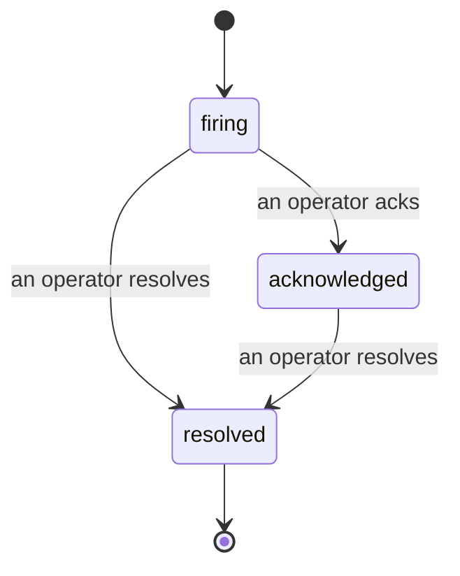

Quando um alerta é disparado, a primeira pergunta é sempre "quem está cuidando disso?" Os incidentes respondem a essa pergunta: no momento em que algo é violado, todos podem ver que o incidente está aberto, quem é o responsável e exatamente o que aconteceu até agora, com um registro limpo e atribuído que você pode levar direto para um post-mortem.

*A caixa de entrada agrupa os incidentes abertos por estado e filtra por severidade e responsável, para que você veja o que precisa de atenção humana agora.*

## Saiba quem está cuidando, de relance

Chega de "alguém está olhando para isso?" em uma thread de chat. Uma violação abre um incidente automaticamente e o deposita em uma caixa de entrada compartilhada, agrupada por estado. Reconheça o incidente e seu nome aparece nele, para que o resto da equipe saiba que está sendo tratado. O reconhecimento é compartilhado: vários operadores podem reconhecer o mesmo incidente e cada um é registrado individualmente, então uma war room completa aparece com os nomes de todos sem que ninguém se sobreponha ao outro. Atribua um responsável pelo triagem e filtre a caixa de entrada por severidade ou responsável para ver apenas o que é seu.

## Toda a história, em uma linha do tempo

Quando o incidente termina, você já tem o relatório pronto. Abra qualquer incidente e você verá as evidências da violação, seus responsáveis e assinantes, um thread de comentários para coordenação in loco e uma linha do tempo append-only de atividades.

*Tudo o que aconteceu, em ordem, cada linha assinada por quem a realizou.*

Cada ação (aberto, reconhecido, resolvido, entre outras) é registrada nessa linha do tempo e nunca é editada ou removida. Cada entrada é atribuída: ao operador que a executou, por e-mail, ou como **automatizado** para qualquer coisa que o Failproof AI Observability fez por conta própria, como abrir o incidente na violação. Nada é anônimo e nada se perde, então o post-mortem praticamente se escreve sozinho.

## Como um incidente evolui

- **Aberto (firing):** a violação abre o incidente e notifica seus canais uma única vez. Violações repetidas são agrupadas no mesmo incidente e atualizam suas evidências em vez de notificá-lo repetidamente.
- **Reconhecido (acknowledged):** um operador assume o incidente. Ele permanece aberto e violações posteriores atualizam as evidências silenciosamente.
- **Resolvido (resolved):** um operador fecha o incidente. A resolução automática quando a condição é limpa está planejada, mas ainda não está habilitada, portanto um incidente permanece aberto até que um humano o resolva — o que mantém todos honestos sobre o que realmente foi resolvido. Um novo incidente pode ser aberto no mesmo alerta posteriormente.

Um alerta comporta no máximo um incidente aberto por vez, então uma regra instável não pode te enterrar em duplicatas. Você também pode abrir um incidente manualmente: um incidente avulso para algo que nenhum alerta detectou, ou um vinculado a um alerta existente, caso você tenha `incidents:write`.

## Onde encontrar

Os incidentes ficam em `/<org-slug>/incidents`. Para visualizar, é necessária a permissão **`incidents:read`**; para abrir um incidente manual, **`incidents:write`**; para reconhecer, atribuir, comentar e resolver, **`incidents:ack`**. Chaves antigas que concediam o `alerts:ack` descontinuado continuam funcionando, pois ele é tratado como `incidents:ack`, então o seu esquema de plantão não precisa ser reemitido.

## Relacionados

- [Alertas](/pt-br/agenteye/alerts): as regras que abrem esses incidentes quando um limite é violado.
- [Rastreamento de erros](/pt-br/agenteye/error-tracking): veja todas as falhas em um único lugar e promova uma delas para um alerta.
- [Auditorias](/pt-br/agenteye/audits): o analista agendado que encontra as falhas que nenhuma regra estava monitorando.