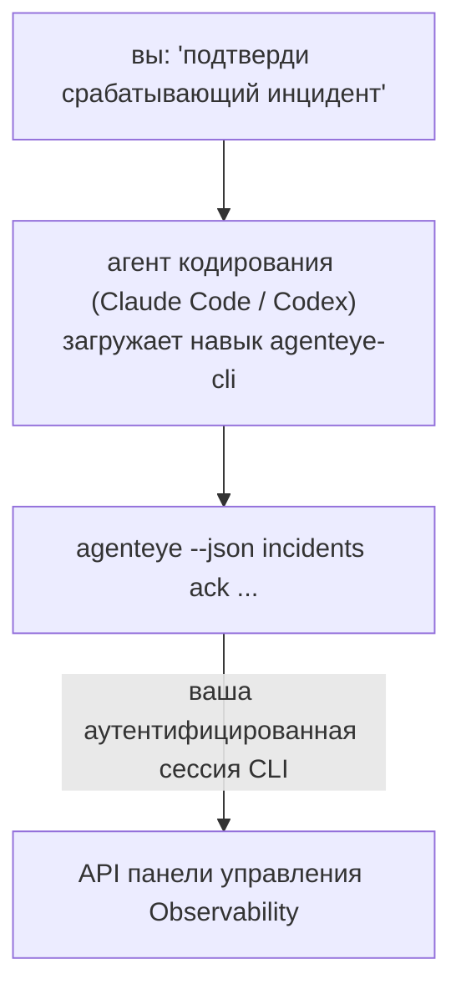

---
---
title: "Навык CLI агента Failproof AI Observability"
description: "Спросите у своего агента кодирования «что-нибудь сломалось сегодня?» и получите ответ на основе живых данных Failproof AI Observability, без необходимости запоминать команды."
---


Спросите у своего агента кодирования *«что-нибудь сломалось сегодня?»* и получите ответ на основе живых данных Failproof AI Observability, без необходимости запоминать команды. **Навык CLI Failproof AI Observability** (`agenteye-cli`) является *Agent Skill*: небольшой папкой с инструкциями, которые агент кодирования, такой как Claude Code или Codex, загружает по требованию. Это учит агента управлять вашим развёртыванием Observability через CLI [`agenteye`](/ru/agenteye/cli) на основе простых запросов на английском языке, например *«дай CI ключ, который может только отправлять события»* или *«подтверди срабатывающий инцидент и назначь его на меня»*.

Это **не** сервис и не отдельный бинарный файл; нет ничего для развёртывания. Он работает на базе CLI, который вы уже установили: агент запускает `agenteye --json …`, разбирает чистый JSON и отвечает вам прозой. Всё, что он может делать, вы можете делать сами, вводя те же команды.

---

## Как это соотносится с другими интерфейсами Failproof AI Observability

Failproof AI Observability предоставляет четыре способа доступа к одним и тем же данным и элементам управления. Они дополняют друг друга:

| Интерфейс | Что это | Где работает | Используйте это, когда |
|---|---|---|---|
| **[CLI](/ru/agenteye/cli)** | Справочник команд и флагов для `agenteye` | Ваш терминал | Вы хотите запустить или скрипт определённую команду |
| **[Рецепты CLI](/ru/agenteye/cli-recipes)** | Готовые к копированию паттерны `jq`/pipeline | Ваш терминал / скрипты | Вы интегрируете CLI в автоматизацию |
| **Навык CLI** (этот документ) | Дверь на естественном языке к CLI | Ваш агент кодирования на вашей рабочей станции | Вы хотите просто спросить и дать агенту выбрать команду |
| **[Навык Evaluator](/ru/agenteye/evaluator-skill)** | Встроенный навык, который проектирует и создаёт вашу сервис оценки | Ваш агент кодирования на вашей рабочей станции | Вы хотите производить оценки, а не читать их |
| **[Навык Python SDK](/ru/agenteye/python-sdk-skill)** | Встроенный навык, который инструментирует ваш агент для испускания телеметрии | Ваш агент кодирования на вашей рабочей станции | Вы хотите, чтобы ваш агент производил события, которые этот навык читает |
| **[Встроенный AI-ассистент](/ru/agenteye/assistant)** | Чат, встроенный в панель управления | На стороне сервера (в панели управления) | Вы хотите Q&A в панели управления над вашими данными |

Сам навык не имеет собственных привилегий; он просто превращает ваши слова в вызовы CLI, которые работают от вас:



### vs. встроенный AI-ассистент: важное различие

Это два разных инструмента с очень разными сферами влияния:

- **Встроенный AI-ассистент** ([AI ассистент](/ru/agenteye/assistant)) - это чат, встроенный в панель управления, поддерживаемый агент-сервисом. Это **только чтение плюс одобрение для авторства**: он может создавать черновики сохранённых запросов и панелей управления, но каждая запись приостанавливается для вашего явного нажатия кнопки утверждения, и он никогда не удаляет. Это ограничивается разрешением `agent:use` и видит только данные организации, которую вы просматриваете.
- **Навык CLI** работает на *вашей* рабочей станции внутри *вашего* агента кодирования и управляет CLI `agenteye` как **вы**. Он может выполнять **полную поверхность CLI, включая мутации** (создание/ротация/отключение API ключей, изменение настроек организации, разрешение инцидентов, удаление сохранённых запросов), ограниченный только разрешениями вашего входа в CLI. Относитесь к нему так же осторожно, как к запуску этих команд вручную.

---

## Предварительные требования

1. **`agenteye` CLI установлен** и в `PATH` (см. справочник [CLI](/ru/agenteye/cli): `pipx install agenteye`).
2. Ваш **URL панели управления установлен** (`AGENTEYE_DASHBOARD_URL`, или агент передаёт `--base-url`).
3. **Аутентифицированная сессия**: сначала запустите `agenteye login` самостоятельно. Навык **не может** завершить одноразовый вход по электронной почте за вас; он скажет вам запустить `agenteye login`, если сессия отсутствует или истекла (код выхода CLI `4`).

---

## Где его получить

Навык опубликован в публичной коллекции навыков Failproof AI:

**[github.com/FailproofAI/skills](https://github.com/FailproofAI/skills)** → [`skills/agenteye-cli/`](https://github.com/FailproofAI/skills/tree/main/skills/agenteye-cli)

Ничего в этом репозитории не ограничено — репозиторий является публичным, и навык не требует собственного учётного данного, потому что он только управляет **публичным** CLI `agenteye` против *вашей* панели управления, используя сессию, *с которой вы* вошли. Вам не нужно у кого-то это запрашивать.

Обратите внимание, что он поставляется как отдельная папка и **не находится** в пакете `pipx install agenteye`, так что не ищите его там.

## Установка навыка

Самый быстрый способ - это CLI [`skills`](https://skills.sh), который загружает папку и помещает её туда, где ваш агент её ищет:

```bash
# Claude Code, только этот проект
npx skills add FailproofAI/skills --skill agenteye-cli -a claude-code

# каждый проект (устанавливается в ~/.claude/skills/)
npx skills add FailproofAI/skills --skill agenteye-cli -a claude-code -g --copy

# Вместо этого Codex
npx skills add FailproofAI/skills --skill agenteye-cli -a codex
```

Затем управляйте им как любым другим навыком:

```bash
npx skills list -a claude-code      # что установлено
npx skills update agenteye-cli      # получить последнюю версию
npx skills remove agenteye-cli      # удалить его
```

Предпочитаете устанавливать вручную? Agent Skill - это просто папка, содержащая `SKILL.md` (плюс необязательные справочные материалы), поэтому копирование тоже работает:

- **Claude Code**: поместите папку `agenteye-cli/` в `~/.claude/skills/` (каждый проект) или `<your-repo>/.claude/skills/` (только этот репозиторий). Claude Code автоматически её обнаружит — проверьте с помощью списка `/skills` или просто задайте вопрос, который совпадает с её описанием.
- **Codex (OpenAI)**: Codex читает тот же `SKILL.md`. Поставляемый `agents/openai.yaml` устанавливает `allow_implicit_invocation: true`, поэтому Codex автоматически выбирает навык, когда задача совпадает; иначе вызовите его явно как `$agenteye-cli`.

---

## Безопасность: мутации НЕ приводят к приглашению, когда агент запускает CLI

> **Предупреждение:** Прочитайте это перед тем, как позволить агенту вносить изменения.

CLI `agenteye` обычно спрашивает *«вы уверены?»* перед деструктивным действием. Он **автоматически пропускает это подтверждение всякий раз, когда он не прикреплён к терминалу (что точно так, как агент кодирования его запускает), и `--json` тоже его пропускает.** Так что приглашение безопасности **не будет** срабатывать для агента.

Навык написан, чтобы это компенсировать: ему инструктировано указывать точную команду, которую он будет запускать, и получить ваше явное **ОК перед любым изменением состояния**. Сохраняйте эту дисциплину. Когда вы управляете Failproof AI Observability через агента, *вы* - шаг подтверждения. Команды, которые изменяют состояние и на которые нужно обратить внимание:

- `keys create` / `update` / `disable` / `regenerate`
- `users create` / `update` / `disable` / `enable`
- `settings set`
- `alerts create` / `update` / `delete` / `test`
- подкоманды записи `incidents`: `ack` / `assign` / `resolve` / `open` / `comment-add` / `comment-delete` / `subscribe` / `unsubscribe`
- `query create` / `update` / `delete`
- `agent rename` / `delete`
- `orgs switch`

Всё под **Observe** (`events`, `sessions`, `evals`, `errors`, `list`, `whoami`, `orgs list/current/perms`) является только чтением и ничего не изменяет.

Поскольку агент действует как **вы**, он может делать только то, что позволено вашему входу; разрешения разрешаются **для каждой организации** (см. [API ключи](/ru/agenteye/api-keys)). Команда, на которую у вас нет разрешения, возвращает код выхода `5` с точным названием разрешения, поэтому агент может точно сказать вам, что попросить у администратора, вместо того чтобы неудачно потерпеть неудачу.

---

## Что вы можете его спросить

Вот как выглядит настоящий полный оборот - чтение, а затем изменение, которое ждёт вашего ОК:

```text
вы   ▸ Что-нибудь сломалось в последний день?

агент ▸ Запуск: agenteye --json errors --since 24h --aggregate
        3 типа ошибок за последние 24 часа. Самая большая - это TimeoutError
        (18 попаданий, все на checkout-agent), затем RateLimited (5).
        Хотите видеть падающие сессии для TimeoutError?

вы   ▸ Дай CI ключ, который может только отправлять события.

агент ▸ Это создаёт API ключ. Я запущу:
          agenteye keys create ci --add events:add
        ОК для продолжения?

вы   ▸ да

агент ▸ Готово. Ключ "ci" создан только с events:add.
        Секрет показан только один раз, поэтому сохраните его сейчас. Я не могу его перепечатать.
```

Навык отображает каждое намерение на естественном языке в правильную команду `agenteye`, сначала обнаруживая допустимые значения (`list <kind>`, `whoami`), чтобы он не угадывал, и указывает точную команду перед любым изменением. Дополнительные примеры:

- *«Что-нибудь сломалось / не работает в последние 24 часа?»* → `errors --since 24h --aggregate`, затем разбор.
- *«Почему сессия `run-001` не удалась?»* → `events --session-id run-001 --all` + `evals --session-id run-001`.
- *«Как качество тренируется на этой неделе?»* → `evals --aggregate --since 7d`, затем разберите низкооценённые запуски.
- *«Дай CI ключ, который может только отправлять события.»* → `keys create ci --add events:add` (он указывает команду, затем создаёт её и захватывает одноразовый секрет).
- *«Кто имеет доступ? Сделай Dana только для чтения.»* → `users list` → `users update dana@… --permission-set read-only` (после вашего подтверждения).
- *«Подтверди срабатывающий инцидент и назначь его на меня.»* → `incidents list --state firing` → `incidents ack <id>` / `incidents assign <id> you@…`.

Для точных команд, флагов и форм JSON за этим см. справочник [CLI](/ru/agenteye/cli) и [рецепты CLI для агентов](/ru/agenteye/cli-recipes).

---

## Следующие шаги

- **[CLI](/ru/agenteye/cli)**: полный справочник команд и флагов для `agenteye`.
- **[Рецепты CLI для агентов](/ru/agenteye/cli-recipes)**: готовые к копированию паттерны `jq` и обработка кодов выхода.
- **[Навык агента Evaluator](/ru/agenteye/evaluator-skill)**: встроенный навык для создания оценщика, чьи оценки читает `agenteye evals`.
- **[Навык агента Python SDK](/ru/agenteye/python-sdk-skill)**: встроенный навык для инструментирования агента, чтобы он испускал телеметрию, которую читает `agenteye`.
- **[AI ассистент](/ru/agenteye/assistant)**: встроенный в панель управления ассистент (не путайте с этим навыком терминала).
- **[API ключи](/ru/agenteye/api-keys)**: модель разрешений для каждой организации, которая ограничивает то, что может делать навык.