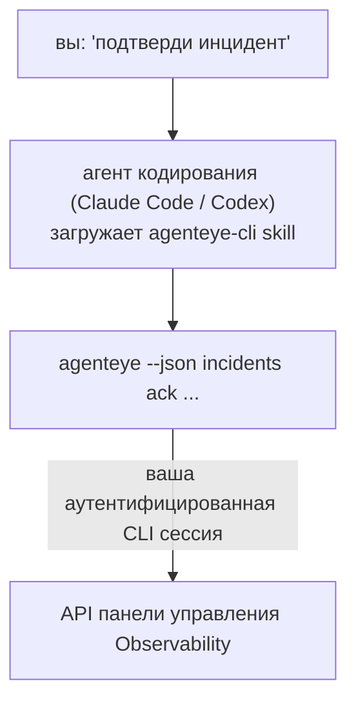

Спросите у вашего агента кодирования *«что-нибудь сломалось сегодня?»* и позвольте ему ответить из ваших живых данных FailproofAI Observability без необходимости запоминать команды. **FailproofAI Observability CLI skill** (`agenteye-cli`) — это *Agent Skill*: небольшая папка с инструкциями, которую агент кодирования, такой как Claude Code или Codex, загружает по требованию. Она учит агента управлять вашим развертыванием Observability через [`agenteye` CLI](/ru/agenteye/cli) на основе простых английских запросов, таких как *«дай CI ключ, который может только отправлять события»* или *«подтверди инцидент и назначь его на меня».*

Это **не** сервис и не отдельный бинарный файл; нечего развертывать. Она работает поверх CLI, который вы уже установили: агент выполняет `agenteye --json …`, анализирует чистый JSON и отвечает вам прозой. Всё, что она может делать, вы могли бы делать сами, набрав те же команды.

---

## Связь с другими интерфейсами FailproofAI Observability

FailproofAI Observability предоставляет вам четыре способа достичь одинаковые данные и элементы управления. Они дополняют друг друга:

| Интерфейс | Что это | Где работает | Используйте, когда |
|---|---|---|---|
| **[CLI](/ru/agenteye/cli)** | Справочник команд и флагов для `agenteye` | Ваш терминал | Вы хотите запустить или написать скрипт для конкретной команды |
| **[CLI recipes](/ru/agenteye/cli-recipes)** | Готовые к копированию шаблоны `jq`/конвейеров | Ваш терминал / скрипты | Вы интегрируете CLI в автоматизацию |
| **CLI skill** (этот документ) | Естественно-языковой фасад к CLI | Ваш агент кодирования на вашей рабочей станции | Вы хотите просто спросить и позволить агенту выбрать команду |
| **[In-dashboard AI assistant](/ru/agenteye/assistant)** | Чат, встроенный в панель управления | На стороне сервера (в панели управления) | Вы хотите Q&A в панели управления над вашими данными |

Сама skill не имеет собственных привилегий; она просто превращает ваши слова в вызовы CLI, которые выполняются от вас:



### vs. in-dashboard AI assistant: важное различие

Это два разных инструмента с очень разными зонами воздействия:

- **In-dashboard AI assistant** ([AI assistant](/ru/agenteye/assistant)) — это чат, встроенный в панель управления, поддерживаемый сервисом агента. Это **только чтение плюс одобрение для авторизации**: он может составлять сохраненные запросы и панели управления, но каждая запись паузирует для вашего явного щелчка подтверждения, и он никогда не удаляет. Он защищен разрешением `agent:use` и видит только данные для организации, которую вы просматриваете.
- **CLI skill** работает на *вашей* рабочей станции внутри *вашего* агента кодирования и управляет `agenteye` CLI как **вы**. Он может выполнять **полную поверхность CLI, включая мутации** (создание/ротация/отключение ключей API, изменение параметров org, разрешение инцидентов, удаление сохраненных запросов), ограниченные только разрешениями вашего CLI логина. Относитесь к нему ровно так же осторожно, как если бы вы запускали эти команды вручную.

---

## Предварительные требования

1. **`agenteye` CLI установлен** и в `PATH` (см. [справочник CLI](/ru/agenteye/cli): `pipx install agenteye`).
2. Ваш **URL панели управления установлен** (`AGENTEYE_DASHBOARD_URL`, или агент передает `--base-url`).
3. **Аутентифицированная сессия**: сначала запустите `agenteye login` самостоятельно. Skill **не может** завершить для вас вход по одноразовому коду, отправленному по почте; он скажет вам запустить `agenteye login`, если сессия отсутствует или истекла (код выхода CLI `4`).

---

## Установка skill

Agent Skills — это папки, содержащие `SKILL.md` (плюс опциональные ссылки). Вы устанавливаете `agenteye-cli` skill, размещая его папку там, где ваш агент ищет skills:

- **Claude Code**: скопируйте папку `agenteye-cli/` в `~/.claude/skills/` (доступна в каждом проекте) или в `<your-repo>/.claude/skills/` (привязана к этому репо). Claude Code автоматически её обнаружит; проверьте список `/skills` или просто задайте вопрос, который соответствует её описанию.
- **Codex (OpenAI)**: Codex читает тот же `SKILL.md`. Bundled `agents/openai.yaml` устанавливает `allow_implicit_invocation: true`, поэтому Codex автоматически выбирает skill, когда задача соответствует; в противном случае вызовите его явно как `$agenteye-cli`.

Skill поддерживается вместе с `agenteye` CLI, но поставляется как **отдельная папка**, не внутри пакета `pipx install agenteye`, поэтому не ищите её там. FailproofAI Observability доставляет вам папку `agenteye-cli/` отдельно; если у вас её нет, обратитесь к вашему контакту FailproofAI. Ничего в ней не ограничивается: ей не нужны никакие учетные данные вообще, потому что она только управляет **публичным** `agenteye` CLI против вашей собственной панели управления.

---

## Безопасность: мутации НЕ требуют подтверждение при выполнении агентом CLI

> **Warning:** Прочитайте это перед тем, как разрешить агенту делать изменения.

`agenteye` CLI обычно спрашивает *«ты уверен?»* перед деструктивным действием. Это **автоматически пропускает это подтверждение, когда это не присоединено к терминалу (что в точности как работает агент кодирования), и `--json` тоже это пропускает.** Таким образом, подсказка безопасности **не будет** срабатывать для агента.

Skill написана для компенсации: ей инструктировано указывать точную команду, которую она будет запускать, и получать ваше явное **ОК перед любым изменением состояния**. Сохраняйте эту дисциплину. Когда вы используете FailproofAI Observability через агента, *вы* являетесь шагом подтверждения. Команды, изменяющие состояние, на которые нужно обратить внимание:

- `keys create` / `update` / `disable` / `regenerate`
- `users create` / `update` / `disable` / `enable`
- `settings set`
- `alerts create` / `update` / `delete` / `test`
- команды записи `incidents`: `ack` / `assign` / `resolve` / `open` / `comment-add` / `comment-delete` / `subscribe` / `unsubscribe`
- `query create` / `update` / `delete`
- `agent rename` / `delete`
- `orgs switch`

Всё под **Observe** (`events`, `sessions`, `evals`, `errors`, `list`, `whoami`, `orgs list/current/perms`) — только чтение и ничего не меняет.

Так как агент действует как **вы**, он может делать только то, что позволяет ваш логин; разрешения разрешаются **по org** (см. [API keys](/ru/agenteye/api-keys)). Команда, на которую у вас нет разрешения, возвращает код выхода `5` с точным названием разрешения, поэтому агент может сказать вам точно, что попросить у админа, вместо того чтобы неудачно сбиться.

---

## Что вы можете у неё спросить

Вот как выглядит реальный полный цикл — чтение, а затем изменение, которое ждет вашего ОК:

```text
вы   ▸ Что-нибудь сломалось за последний день?

агент ▸ Запущено: agenteye --json errors --since 24h --aggregate
        3 типа ошибок за последние 24 часа. Самая большая — TimeoutError
        (18 попаданий, все на checkout-agent), потом RateLimited (5).
        Хотите видеть падающие сессии для TimeoutError?

вы   ▸ Дай CI ключ, который может только отправлять события.

агент ▸ Это создаёт ключ API. Я запущу:
          agenteye keys create ci --add events:add
        ОК, продолжать?

вы   ▸ да

агент ▸ Готово. Ключ "ci" создан с events:add только.
        Секрет показан только один раз, поэтому сохраните его сейчас. Я не могу его переопубликовать.
```

Skill соотносит каждое намерение на простом английском языке с правильной `agenteye` командой, сначала обнаруживая допустимые значения (`list <kind>`, `whoami`) чтобы не угадывать, и указывая точную команду перед любым изменением. Больше примеров:

- *«Что-нибудь сломалось / падает за последние 24 часа?»* → `errors --since 24h --aggregate`, затем разбивка.
- *«Почему сессия `run-001` упала?»* → `events --session-id run-001 --all` + `evals --session-id run-001`.
- *«Как тенденция качества на этой неделе?»* → `evals --aggregate --since 7d`, затем детализация по низкооценённым запускам.
- *«Дай CI ключ, который может только отправлять события.»* → `keys create ci --add events:add` (она указывает команду, затем создаёт её и захватывает одноразовый секрет).
- *«Кто имеет доступ? Сделай Дану только чтением.»* → `users list` → `users update dana@… --permission-set read-only` (после подтверждения с вами).
- *«Подтверди инцидент и назначь его на меня.»* → `incidents list --state firing` → `incidents ack <id>` / `incidents assign <id> you@…`.

Для точных команд, флагов и JSON форм за этими см. [справочник CLI](/ru/agenteye/cli) и [CLI recipes for agents](/ru/agenteye/cli-recipes).

---

## Следующие шаги

- **[CLI](/ru/agenteye/cli)**: полный справочник команд и флагов для `agenteye`.
- **[CLI recipes for agents](/ru/agenteye/cli-recipes)**: готовые к копированию шаблоны `jq` и обработка кодов выхода.
- **[AI assistant](/ru/agenteye/assistant)**: встроенный в панель управления ассистент (не путайте с этим терминальным skill).
- **[API keys](/ru/agenteye/api-keys)**: модель разрешений по org, которая ограничивает то, что может делать skill.