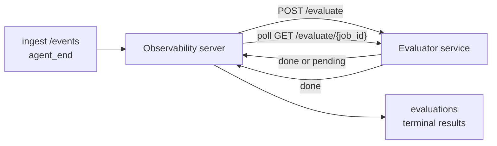

FailproofAI Observability может автоматически оценивать качество каждого завершённого запуска агента: вы предоставляете небольшой сервис оценки, а Observability берёт на себя остальное. Используйте его для отслеживания интересующих вас параметров (полезность, эффективность инструментов, фактичность, безопасность — вы выбираете), выявления регрессий на ранних этапах и быстрого сравнения агентов или окружений. Оценка — опциональна: конвейер не делает ничего до момента установки `EVALUATOR_ENDPOINT` на сервере.

> **Примечание:** Вы определяете размеры оценки. Ваша система оценки может возвращать любые числовые ключи; Observability сохраняет, отслеживает тренды и отображает всё, что вы отправляете.

## Краткий обзор

1. **Напишите скоринг.** Создайте небольшой HTTP-сервис, который читает транскрипт сессии и возвращает оценки. Observability поставляется с рабочим примером, который вы можете скопировать. См. [Writing an evaluator with the SDK](#writing-an-evaluator-with-the-sdk).
2. **Укажите на него Observability.** Установите `EVALUATOR_ENDPOINT` (и общий `EVALUATOR_TOKEN`) на процесс сервера.
3. **Следите за поступлением оценок.** Каждая завершённая сессия автоматически оценивается; результаты отображаются на странице деталей сессии, в сетке сессий и на сохранённых панелях.


*После настройки системы оценки каждый завершённый запуск оценивается и результаты отображаются в правой колонке сессии: резюме сверху, затем полосы оценок по размерам с обоснованием.*

---

## Как это работает



Когда SDK FailproofAI Observability отправляет событие `agent_end` для сессии, сервер планирует оценку. Затем он отправляет POST с полным транскриптом событий на ваш сервис оценки, который может либо:

- **Вернуть результат встроенным образом** с `{"status":"done", "scores":{...}, "reasoning":{...}, "summary":"..."}`. Результат добавляется в временную шкалу оценки сессии. `reasoning` и `summary` опциональны.
- **Отложить** с `{"status":"pending", "job_id":"abc-123"}`. Observability затем вызывает `GET {EVALUATOR_ENDPOINT}/evaluate/abc-123` до тех пор, пока ваша система оценки не вернёт `{"status":"done", ...}` или `{"status":"error", "error":"..."}`.

  Периодичность опроса зависит от задания: ответ `pending` может включать `next_poll_secs` для переопределения; в противном случае Observability использует значение `default_poll_interval_secs` из `GET /config`; в противном случае сервер переходит на `EVALUATOR_POLLING_INTERVAL_SECS` (по умолчанию 10s). Все значения ограничены [1s, 1h].

Сессии, которые никогда не отправляют `agent_end` (например, процесс краша агента), также могут быть обработаны: `GET /config` системы оценки может вернуть `{"inactivity_timeout_secs": 1800}`, и Observability будет оценивать любую сессию, находившуюся в неактивном состоянии столько времени. Установите значение `null` или опустите его для отключения этого резервного варианта.

Конвейер полностью неактивен, когда `EVALUATOR_ENDPOINT` не установлен.

Сессия может накапливать **несколько финальных оценок с течением времени**: каждое событие `agent_end` (и каждая ручная переоценка с панели) добавляет новую строку оценки. Это поддерживаемый способ оценки возобновлённого разговора: пользователь заканчивает агента, возвращается позже, отправляет больше событий, заканчивает агента снова, и вторая оценка запускается по отношению к полному обновлённому транскрипту. Панель отображает самую последнюю оценку как заголовок и предыдущие оценки как сворачиваемую временную шкалу. Пока для сессии выполняется одна оценка, дополнительные события `agent_end` для этой сессии игнорируются; следующее после завершения выполняющейся оценки поставит в очередь новую оценку, как обычно.

Резервный вариант неактивности переактивируется и на возобновлённых сессиях: если новые события прибывают после предыдущей финальной оценки и сессия затем переходит в режим ожидания, превышая `inactivity_timeout_secs`, новая оценка ставится в очередь.

Временные сбои (5xx, 429, таймауты, сетевые ошибки) повторяются с экспоненциальной задержкой до `EVALUATOR_MAX_ATTEMPTS`; ответы 4xx являются финальными. Observability безопасен для запуска с несколькими горизонтально масштабируемыми экземплярами сервера; работа разделена так, чтобы одна и та же сессия никогда не отправлялась дважды одновременно.

---

## HTTP контракт

Каждый аутентифицированный маршрут использует **аутентификацию bearer токена**. Одно и то же значение должно быть настроено с обеих сторон:

- Сервер Observability: переменная окружения `EVALUATOR_TOKEN`
- Сервис оценки: настроен таким же образом (SDK `agenteye-evaluator` по соглашению читает `EVALUATOR_TOKEN`)

Если `EVALUATOR_TOKEN` не установлен, сервер не отправляет заголовок `Authorization`; система оценки может принимать анонимные запросы, что подходит для внутренней сети, но не рекомендуется в интернете.

### Маршруты, которые должна служить система оценки

| Маршрут | Тело / параметры | Ответ |
|---|---|---|
| `GET /health` | нет | `{"status":"ok"}` (открытый, без аутентификации) |
| `GET /config` | нет | `{"inactivity_timeout_secs": <int> \| null, "default_poll_interval_secs": <int> \| опущено}` |
| `POST /evaluate` | JSON `EvalRequest` | `{"status":"done", ...}` или `{"status":"pending", "job_id":"..."}` |
| `GET /evaluate/{id}` | нет | та же форма ответа, что и `/evaluate` |

### Тело `EvalRequest`, отправляемое сервером

```json
{
  "schema_version": "1",
  "session_id":     "session-abc123",
  "agent_id":       "planner",
  "environment":    "production",
  "started_at":     "2026-05-10T12:00:00Z",
  "ended_at":       "2026-05-10T12:05:00Z",
  "events": [
    { "id": 1234, "ts": "...", "event_type": "agent_start", "payload": { ... } },
    ...
  ]
}
```

### Формы ответов

**Синхронный (done):**

```json
{
  "status": "done",
  "scores": { "helpfulness": 0.85, "tool_efficiency": 0.6 },
  "reasoning": {
    "helpfulness": "answered the question directly with citations",
    "tool_efficiency": "called list_files three times when one would have done"
  },
  "summary": "strong answer quality, weak tool selection"
}
```

`reasoning` (карта обоснований для каждой оценки) и `summary` (общее однопараграфное описание) опциональны. Ключи в `reasoning` должны соответствовать ключам в `scores`; панель отображает каждую запись встроенной под её полосой оценки. Более старые системы оценки, возвращающие только `scores`, продолжают работать без изменений; `reasoning` и `summary` просто читаются как null и соответствующие элементы интерфейса опускаются.

**Асинхронный (отложенный):**

```json
{ "status": "pending", "job_id": "abc-123", "next_poll_secs": 30 }
```

`next_poll_secs` опционален; если опущен, сервер переходит на `default_poll_interval_secs` системы оценки из `/config`, затем на переменную окружения `EVALUATOR_POLLING_INTERVAL_SECS` собственного сервера.

**Финальная ошибка на стороне системы оценки:**

```json
{ "status": "error", "error": "model service unavailable" }
```

Сервер обрабатывает любое другое тело 2xx как ошибку протокола и записывает финальную `error` для сессии.

---

## Написание системы оценки с SDK

Вам не нужно реализовывать HTTP контракт вручную. Пакет Python `agenteye-evaluator` предоставляет типизированный обёртку FastAPI, которая обрабатывает аутентификацию, маршрутизацию и формы запросов/ответов за вас.

FailproofAI Observability также поставляется с **рабочей примером системы оценки**, которая оценивает `helpfulness`, `tool_efficiency` и `factuality` на основе формы транскрипта. Скопируйте её как отправную точку и поменяйте на вашу собственную логику: судья-LLM, механизм правил, всё, что подходит вашему порогу качества.

Минимальная жизнеспособная система оценки:

```python
import os
from agenteye_evaluator import Evaluator, EvalRequest, EvalResponse

app = Evaluator(token=os.environ["EVALUATOR_TOKEN"])

@app.evaluator
def run(req: EvalRequest) -> EvalResponse:
    # Inspect req.events (the full session transcript) and return scores.
    tool_calls = sum(1 for e in req.events if e.event_type == "tool_use")
    return EvalResponse(
        scores={"tool_calls": float(tool_calls)},
        reasoning={"tool_calls": f"{tool_calls} tool invocations in the transcript"},
        summary="tight tool loop" if tool_calls < 5 else "agent looped on tools",
    )
```

Экземпляр `app` работает под любым ASGI-сервером, поэтому `uvicorn module:app` его запустит.

Для систем оценки, которым нужно отложить дорогостоящую работу, верните `JobPending` и зарегистрируйте обработчик `@app.job_lookup`; сервер Observability опрашивает `GET /evaluate/{job_id}` до тех пор, пока вы не вернёте финальный статус или не истечёт лимит `EVALUATOR_MAX_POLL_DURATION_SECS` (по умолчанию 1 ч).

Полная справка по API, асинхронный паттерн и схема событий документированы в README SDK `agenteye-evaluator`.

---

## Запуск вашей системы оценки

Система оценки — **ваш сервис** — FailproofAI Observability не поставляет систему оценки по умолчанию, поэтому вы создаёте и запускаете её там же, где запускаете свои собственные сервисы. Она работает под любым ASGI-сервером (например `uvicorn my_evaluator:app`); обслуживайте маршруты `/health`, `/config` и `/evaluate` из [HTTP контракта](#http-contract), затем укажите на неё сервер (см. [Configuring the server](#configuring-the-server)).

После того как система оценки доступна, `GET /health` возвращает `{"status":"ok"}`. После того как агент работает end-to-end, `GET /evaluations` на сервере возвращает строку со статусом `"done"` и оценками, которые произвела ваша система оценки.

---

## Настройка сервера

Установить на процесс сервера:

| Переменная окружения | Значение |
|---|---|
| `EVALUATOR_ENDPOINT` | Базовый URL вашей системы оценки (`http://evaluator:9000`). Не установлено = конвейер отключен. |
| `EVALUATOR_TOKEN` | Bearer токен. Должно совпадать со значением, с которым настроена система оценки. |
| `EVALUATOR_WORKERS` | Рабочие задачи на экземпляр сервера (по умолчанию 2). |
| `EVALUATOR_CLAIM_BATCH` | Строк, претендующих на рабочий тик (по умолчанию 4). Партии обрабатываются **одновременно**; эффективная параллелизм на вашей конечной точке оценки — `EVALUATOR_WORKERS × EVALUATOR_CLAIM_BATCH`. |
| `EVALUATOR_POLL_IDLE_SECS` | Как долго рабочий спит между попытками отправки, когда оценка не требуется (по умолчанию 2s). |
| `EVALUATOR_POLLING_INTERVAL_SECS` | Финальный резервный вариант для периодичности `GET /evaluate/{id}` когда ни `next_poll_secs` на ответ, ни `default_poll_interval_secs` системы оценки не установлены (по умолчанию 10s). |
| `EVALUATOR_REQUEST_TIMEOUT_MS` | Таймаут для каждого запроса (по умолчанию 30000). |
| `EVALUATOR_MAX_ATTEMPTS` | После столько временных сбоев результат записывается как финальная `error` (по умолчанию 5). |
| `EVALUATOR_CONFIG_REFRESH_SECS` | Периодичность `GET /config` (по умолчанию 300). |
| `EVALUATOR_MAX_POLL_DURATION_SECS` | Максимальное реальное время, которое сессия может оставаться в очереди опроса до завершения с `timeout` (по умолчанию 3600s). Защита от системы оценки, которая продолжает возвращать `pending` бесконечно. |

Чтобы включить автоматическую оценку, установите оба `EVALUATOR_ENDPOINT` и `EVALUATOR_TOKEN` на сервер, затем перезагрузите его, чтобы подхватить изменение. Если `EVALUATOR_ENDPOINT` не установлен, конвейер остаётся неактивным.

Указанные выше ручки настройки опциональны; установите соответствующие переменные окружения на сервере только если вам нужно переопределить значения по умолчанию.

---

## Справка по API

| Метод | Путь | Требуемое разрешение | Назначение |
|---|---|---|---|
| `GET` | `/evaluations` | `evaluations:read` | Запрос финальных результатов. Поддерживает `session_id`, `agent_id`, `environment`, `status` (`done`/`error`/`timeout`), `ts_from`, `ts_to`, `cursor`, `limit`, `score_filters`, `latest_per_session`. `limit` по умолчанию 50 и ограничено 200 (заметим, это отличается от `/events`, который ограничен 1000). `environment` принимает разделённый запятыми список (напр. `environment=prod,staging`); единичные значения по-прежнему работают. С `latest_per_session=true` ответ содержит не более одной строки на `session_id` (самую последнюю по `completed_at`), используемой страницей списка сессий для свёртывания временной шкалы оценки сессии в её текущий заголовок. По умолчанию false (возвращает полную историю). |
| `GET` | `/evaluations/aggregate` | `evaluations:read` | Свёрнутое здоровье оценки для отфильтрованного среза: общее количество, разбор done/error/timeout, статистика по ключам оценок (count/avg/min/max/p50 над произвольными ключами `scores`) и временная шкала по бакетам. Принимает **те же параметры фильтра, что и `/evaluations`** плюс `featured_keys` (CSV ключей оценок для тренда) и `latest_per_session`. Питает функцию Dashboards; метрики точны над всем совпадающим набором, не выбраны. |
| `GET` | `/evaluations/environments` | `evaluations:read` | Различные значения окружения из таблицы `evaluations`. Используется для заполнения раскрывающихся фильтров с областью видимости для данных с возможностью чтения оценки. |
| `GET` | `/evaluation-jobs` | `evaluations:read` | Видимость оценок в полёте. Фильтр по `status` (`pending`/`polling`). |
| `GET` | `/events` | `events:read` | Транспортировка сырых событий сессии. Поддерживает `session_id`, `agent_id`, `event_type` (CSV), `environment` (CSV), `ts_from`, `ts_to`, `cursor`, `limit` и `order`. `order` — `desc` (новое первое, по умолчанию) или `asc` (старое первое); неузнанное значение возвращается к `desc`. Курсор-пагинация через `next_cursor` ответа (id события): передайте её обратно как `cursor` для получения следующей страницы; с `asc` следующая страница — события после этого id, с `desc` — события до него. `limit` по умолчанию 50 и ограничено 1000. |
| `GET` | `/sessions/:session_id/export` | `events:read` | Возвращает точное тело JSON, которое система оценки получит для этой сессии, обслуживаемое как загружаемое вложение названное `session-<id>.json`. Полезно для воспроизведения производственных сессий через `agenteye-evaluator` для автономного тестирования. Байты идентичны байтам, которые отправляет конвейер оценки. |
| `POST` | `/sessions/:session_id/re-evaluate` | `evaluations:trigger` | Ставит в очередь свежую оценку для сессии; запускается независимо от того, существует ли предыдущая оценка. Новый результат **добавляется** к временной шкале оценки сессии вместо перезаписи предыдущего, поэтому предыдущие оценки остаются видимыми как история. Возвращает `202` при ставке в очередь, `404` для неизвестной сессии, `409` если оценка уже выполняется. Используйте после развёртывания новой системы оценки или для сессий, которые никогда не отправляли `agent_end`. |

### Фильтрация по диапазону оценок: `score_filters`

`GET /evaluations` принимает опциональный параметр `score_filters`, который сужает результаты по числовым значениям внутри объекта `scores`. Параметр — разделённый запятыми список записей `key:min..max`; любая граница может быть опущена. Несколько записей объединяются логическим И. Строки, где названный ключ отсутствует или не числовой, исключаются. Запрос может содержать не более 20 записей фильтра; превышение этого возвращает HTTP 400.

Примеры:
```text
# helpfulness в [0.5, 0.8]
GET /evaluations?score_filters=helpfulness:0.5..0.8

# tool_efficiency максимум 0.3 (нет нижней границы)
GET /evaluations?score_filters=tool_efficiency:..0.3

# helpfulness >= 0.5 И factuality >= 0.9
GET /evaluations?score_filters=helpfulness:0.5..,factuality:0.9..
```

Каждый объект ответа `/evaluations` имеет эти поля:

| Поле | Тип | Примечания |
|---|---|---|
| `evaluation_id` | string (UUID) | Каноническое имя для этой финальной оценки. Каждая финальная оценка получает новый UUID; одна сессия может содержать несколько. |
| `id` | string (UUID) | Обратно совместимый псевдоним, несущий то же значение, что и `evaluation_id`. |
| `session_id` | string | Сессия, для которой запустилась оценка. Сессия может иметь несколько оценок в временной шкале. |
| `agent_id` | string | Идентифицирует агента, который произвёл сессию. |
| `environment` | string | Метка окружения, скопированная из сессии. |
| `status` | enum | Один из `"done"`, `"error"`, `"timeout"`. |
| `scores` | object \| null | Оценки, возвращённые вашей системой оценки. |
| `reasoning` | object \| null | Опциональная карта обоснований для каждой оценки, возвращённая вашей системой оценки. Ключи обычно зеркальны к тем, что в `scores`. Панель отображает каждую запись под её полосой оценки. |
| `summary` | string \| null | Опциональное однопараграфное общее описание, возвращённое вашей системой оценки. Панель отображает это выше разбивки по оценкам как заголовок оценки. |
| `error` | string \| null | Заполняется только при `"error"` / `"timeout"`. |
| `attempt_count` | integer | Количество попыток отправки (≥ 1). |
| `duration_ms` | integer \| null | Длительность финальной попытки. |
| `completed_at` | string (ISO 8601 UTC) | Когда был записан финальный результат. Результаты упорядочены по `completed_at` (новое первое). |
| `created_at` | string (ISO 8601 UTC) | Несёт тот же временной штамп, что и `completed_at` (семантика write-once). |

---

## Разрешения

| Разрешение | Даёт |
|---|---|
| `evaluations:read` | Список результатов оценки, просмотр оценок на панели и загрузка метрик здоровья панели. |
| `evaluations:trigger` | Вручную ставить в очередь оценку для сессии через `POST /sessions/:session_id/re-evaluate` или кнопку переоценки панели. |
| `dashboards:read` | Просмотр сохранённых панелей (также нужен `evaluations:read` для загрузки их метрик). |
| `dashboards:write` | Создание и редактирование панелей. |
| `dashboards:delete` | Удаление панелей. |

Начальный администратор (`ADMIN_KEY`, `ADMIN_EMAIL`) автоматически получает их.

---

## Просмотр результатов

- **`/sessions/<id>`**: временная шкала событий + правая колонка, показывающая оценки сессии и любую ошибку из попытки отправки. Если ваш ключ имеет `evaluations:trigger`, кнопка **переоценки** появляется рядом с кнопкой экспорта, полезна для сессий, которые никогда не отправляли `agent_end`, или для обновления оценок после развёртывания новой системы оценки. Панель опрашивает новый результат и обновляет правую колонку при его поступлении.
- **`/sessions`**: фильтруемая сетка сессий; столбец оценки показывает статус оценки и оценки каждой сессии с первого взгляда.
- **`/dashboards`**: сохранённые представления здоровья оценки (см. [Dashboards](#dashboards) ниже).


*Сетка сессий показывает статус оценки и оценки каждого запуска с первого взгляда; красные/жёлтые/зелёные значки выделяют низкие оценки.*

---

## Панели

Страница **Dashboards** (`/dashboards`) позволяет сохранять комбинацию фильтров оценки как именованное переиспользуемое представление и следить за тем, как работает этот срез оценок с первого взгляда. Панели — **общие для всей вашей организации**; все с `dashboards:read` видят один и тот же набор.

Каждая панель закрепляет:

- **Фильтры**: те же управления, что на странице сессий: окружение, статус, агент, скользящее временное окно и фильтры диапазона оценок (`key:min..max`).
- **Конфигурацию отображения**: какие ключи оценок показывать, пороги здоровья зелено/жёлто/красного, какие панели показывать и нужно ли свёртывать до последней оценки на сессию.

Каждая карточка показывает количество совпадающих сессий, разбор done/error/timeout, среднее по каждой показываемой оценке и маленькую спарклайн тренда. Открытие панели показывает полноразмерные панели; **"открыть в сессиях"** вас на страницу сессий с предварительно заданным фильтром в точно этот срез. Метрики вычисляются на стороне сервера над всем совпадающим набором (через `GET /evaluations/aggregate`), поэтому числа точные, а не выбранные.


**Разрешения:** просмотр требует и `dashboards:read` и `evaluations:read`; создание и редактирование требуют `dashboards:write`; удаление требует `dashboards:delete`. Начальный администратор получает все эти автоматически.

---

## Устранение неполадок

**Сессии существуют, но оценки не создаются.** Подтвердите, что `EVALUATOR_ENDPOINT` установлен на процесс сервера, что сервер и система оценки используют одно и то же значение `EVALUATOR_TOKEN`, и что конечная точка `/health` системы оценки достижима с сервера. Если `EVALUATOR_ENDPOINT` не установлен, конвейер неактивен.

**Оценки в полёте накапливаются.** Запросите `GET /evaluation-jobs` для просмотра очереди. Проверьте `attempt_count`, `next_attempt_at` и `last_error` для каждой строки. Распространённые причины: сервис оценки недостижим или возвращает 5xx (повтор с задержкой), неправильный `EVALUATOR_TOKEN` (401 финален) или асинхронная система оценки, которая возвращает `pending` бесконечно (см. ниже).

**Сессии завершены, но нет финальной оценки.** Запросите `GET /evaluation-jobs?status=polling`; результат может всё ещё быть в полёте. Если задание застряло в `pending`, сервер имеет проблемы с достижением системы оценки; проверьте, что система оценки запущена и что `EVALUATOR_TOKEN` совпадает.

**`HTTP 401 from evaluator: invalid bearer token`.** `EVALUATOR_TOKEN` на сервере не совпадает со значением, с которым настроена система оценки. Они должны быть идентичны.

**Асинхронная система оценки возвращает `pending` бесконечно.** Сервер опрашивает `GET /evaluate/{job_id}` до тех пор, пока система оценки не вернёт `done` или `error`, или до истечения `EVALUATOR_MAX_POLL_DURATION_SECS` (по умолчанию 1 ч). После лимита оценка записывается как `timeout` и удаляется из очереди в полёте. Поднимите `EVALUATOR_MAX_POLL_DURATION_SECS`, если ваша система оценки законно нуждается в большем времени, чем по умолчанию.

---

## Дальнейшие действия

- [Python SDK](/ru/agenteye/python-sdk): отправка событий `agent_end`, которые запускают оценку.
- [API keys](/ru/agenteye/api-keys): разрешения `evaluations:read` и `evaluations:trigger`.
- [Audits](/ru/agenteye/audits): другая автоматизированная функция качества FailproofAI Observability, для политики-основанного рецензирования.