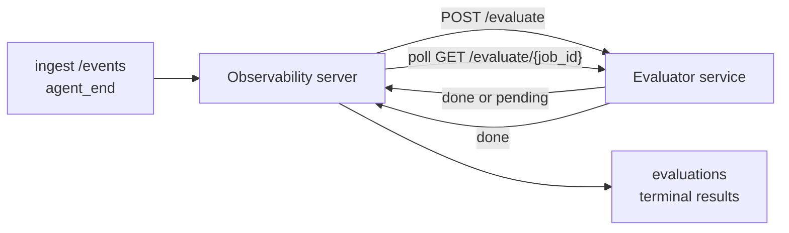

Failproof AI Observability может автоматически оценивать качество каждого завершённого запуска агента: вы предоставляете небольшой сервис оценки, а Observability берёт всё остальное на себя. Используйте его для отслеживания интересующих вас параметров (полезность, эффективность инструментов, фактологичность, безопасность — вы выбираете), раннего обнаружения регрессий и быстрого сравнения агентов или окружений. Оценка опциональна: конвейер не работает, пока вы не установите `EVALUATOR_ENDPOINT` на сервере.

> **Примечание:** вы определяете размеры оценок. Ваш оценщик может возвращать любые числовые ключи; Observability сохраняет, отслеживает и отображает всё, что вы отправляете.

## С первого взгляда

1. **Напишите оценщик.** Создайте небольшой HTTP-сервис, который читает транскрипт сессии и возвращает оценки. Observability поставляется с рабочей ссылкой, которую можно скопировать. См. [Написание оценщика с использованием SDK](#writing-an-evaluator-with-the-sdk).
2. **Укажите Observability на него.** Установите `EVALUATOR_ENDPOINT` (и совместно используемый `EVALUATOR_TOKEN`) на серверном процессе.
3. **Смотрите, как приходят оценки.** Каждая завершённая сессия автоматически оценивается; результаты появляются на странице деталей сессии, в сетке сессий и на сохранённых панелях управления.


*После настройки оценщика каждый завершённый запуск оценивается и результаты появляются в правой полосе сессии: сводка вверху, затем полосы оценок по размерам с обоснованием.*

---

## Как это работает



Когда SDK Observability выдаёт событие `agent_end` для сессии, сервер планирует оценку. Затем он отправляет полный транскрипт событий в ваш сервис оценки, который может либо:

- **Вернуть результат непосредственно** с помощью `{"status":"done", "scores":{...}, "reasoning":{...}, "summary":"..."}`. Результат добавляется в timeline оценок сессии. `reasoning` и `summary` опциональны.
- **Отложить** с помощью `{"status":"pending", "job_id":"abc-123"}`. Observability затем вызывает `GET {EVALUATOR_ENDPOINT}/evaluate/abc-123` до тех пор, пока ваш оценщик не вернёт `{"status":"done", ...}` или `{"status":"error", "error":"..."}`.

  Периодичность опроса зависит от работы: ответ `pending` может включать `next_poll_secs` для переопределения; в противном случае Observability использует значение `default_poll_interval_secs` из `GET /config`; в противном случае сервер переходит на `EVALUATOR_POLLING_INTERVAL_SECS` (по умолчанию 10s). Все значения ограничены [1s, 1h].

Сессии, которые никогда не выдают `agent_end` (например, упавший процесс агента), также могут быть обработаны: `GET /config` оценщика может возвращать `{"inactivity_timeout_secs": 1800}`, и Observability будет оценивать любую сессию, которая была неактивна так долго. Установите поле на `null` или опустите его, чтобы отключить это резервное решение.

Конвейер полностью неработающий, когда `EVALUATOR_ENDPOINT` не установлен.

Сессия может накапливать **несколько терминальных оценок с течением времени**: каждое событие `agent_end` (и каждая ручная переоценка с панели управления) добавляет новую строку оценки. Это поддерживаемый способ оценки возобновленного разговора: пользователь завершает агента, возвращается позже, отправляет больше событий, заканчивает агента снова, и вторая оценка выполняется с полным обновленным транскриптом. Панель управления отображает самую свежую оценку как заголовок, а предыдущие оценки как свёрнутый timeline. Пока для сессии выполняется одна оценка, дополнительные события `agent_end` для этой сессии игнорируются; следующее после завершения текущей оценки поставит свежую оценку в очередь, как обычно.

Резервное решение бездействия также повторно активируется для возобновленных сессий: если новые события поступают после предыдущей терминальной оценки и сессия затем становится неактивной дольше `inactivity_timeout_secs`, свежая оценка ставится в очередь.

Переходящие сбои (5xx, 429, таймауты, ошибки сети) повторяются с экспоненциальной задержкой до `EVALUATOR_MAX_ATTEMPTS`; ответы 4xx являются терминальными. Observability безопасна для работы с несколькими горизонтально масштабируемыми экземплярами сервера; работа разделяется так, чтобы одна и та же сессия никогда не отправлялась дважды одновременно.

---

## HTTP контракт

Каждый аутентифицированный маршрут использует **аутентификацию Bearer токена**. Одно и то же значение должно быть настроено с обеих сторон:

- Сервер Observability: переменная окружения `EVALUATOR_TOKEN`
- Сервис оценки: настроен так же (SDK `agenteye-evaluator` по соглашению читает `EVALUATOR_TOKEN`)

Если `EVALUATOR_TOKEN` не установлен, сервер не отправляет заголовок `Authorization`; оценщик может затем принимать анонимные запросы, что нормально для внутренней сети, но не рекомендуется в публичном интернете.

### Маршруты, которые должен обслуживать оценщик

| Маршрут | Тело / параметры | Ответ |
|---|---|---|
| `GET /health` | нет | `{"status":"ok"}` (открытый, без аутентификации) |
| `GET /config` | нет | `{"inactivity_timeout_secs": <int> \| null, "default_poll_interval_secs": <int> \| omitted}` |
| `POST /evaluate` | JSON `EvalRequest` | `{"status":"done", ...}` или `{"status":"pending", "job_id":"..."}` |
| `GET /evaluate/{id}` | нет | та же форма ответа, что и `/evaluate` |

### Тело `EvalRequest`, отправленное сервером

```json
{
  "schema_version": "1",
  "session_id":     "session-abc123",
  "agent_id":       "planner",
  "environment":    "production",
  "started_at":     "2026-05-10T12:00:00Z",
  "ended_at":       "2026-05-10T12:05:00Z",
  "events": [
    { "id": 1234, "ts": "...", "event_type": "agent_start", "payload": { ... } },
    ...
  ]
}
```

### Формы ответов

**Синхронный (выполнен):**

```json
{
  "status": "done",
  "scores": { "helpfulness": 0.85, "tool_efficiency": 0.6 },
  "reasoning": {
    "helpfulness": "answered the question directly with citations",
    "tool_efficiency": "called list_files three times when one would have done"
  },
  "summary": "strong answer quality, weak tool selection"
}
```

`reasoning` (карта обоснования на оценку) и `summary` (общее однопараграфное повествование) оба опциональны. Ключи в `reasoning` должны отражать ключи в `scores`; панель управления отображает каждую запись встроенной под его полоской оценок. Старые оценщики, которые возвращают только `scores`, продолжают работать без изменений; `reasoning` и `summary` просто читаются как null, и соответствующие интерфейсные возможности опускаются.

**Асинхронный (отложенный):**

```json
{ "status": "pending", "job_id": "abc-123", "next_poll_secs": 30 }
```

`next_poll_secs` опционален; если опущен, сервер переходит на `default_poll_interval_secs` оценщика из `/config`, затем на собственную переменную окружения `EVALUATOR_POLLING_INTERVAL_SECS`.

**Терминальная ошибка со стороны оценщика:**

```json
{ "status": "error", "error": "model service unavailable" }
```

Сервер рассматривает любое другое тело 2xx как ошибку протокола и записывает терминальную `error` для сессии.

---

## Написание оценщика с использованием SDK

Вам не нужно реализовывать HTTP контракт вручную. Пакет Python `agenteye-evaluator` предоставляет вам типизированную обёртку FastAPI, которая обрабатывает аутентификацию, маршрутизацию и формы запроса/ответа за вас.

Failproof AI Observability также поставляется с **рабочим эталонным оценщиком**, который оценивает `helpfulness`, `tool_efficiency` и `factuality` на основе формы транскрипта. Скопируйте его как отправную точку и замените свою логику: судья LLM, механизм правил, всё, что соответствует вашему стандарту качества.

Минимально жизнеспособный оценщик:

```python
import os
from agenteye_evaluator import Evaluator, EvalRequest, EvalResponse

app = Evaluator(token=os.environ["EVALUATOR_TOKEN"])

@app.evaluator
def run(req: EvalRequest) -> EvalResponse:
    # Inspect req.events (the full session transcript) and return scores.
    tool_calls = sum(1 for e in req.events if e.event_type == "tool_use")
    return EvalResponse(
        scores={"tool_calls": float(tool_calls)},
        reasoning={"tool_calls": f"{tool_calls} tool invocations in the transcript"},
        summary="tight tool loop" if tool_calls < 5 else "agent looped on tools",
    )
```

Экземпляр `app` работает под любым ASGI сервером, так что `uvicorn module:app` его запускает.

Для оценщиков, которым нужно отложить дорогостоящую работу, возвращайте `JobPending` вместо этого и регистрируйте обработчик `@app.job_lookup`; сервер Observability опрашивает `GET /evaluate/{job_id}` до тех пор, пока вы не вернёте терминальный статус или не истечёт лимит `EVALUATOR_MAX_POLL_DURATION_SECS` (по умолчанию 1 ч).

Полный справочник API, асинхронный шаблон и схема событий описаны в README SDK `agenteye-evaluator`.

---

## Запуск вашего оценщика

Оценщик — **ваш сервис** — Failproof AI Observability не поставляется с оценщиком по умолчанию, поэтому вы его создаёте и запускаете там же, где запускаете свои собственные сервисы. Он работает под любым ASGI сервером (например `uvicorn my_evaluator:app`); обслуживайте маршруты `/health`, `/config` и `/evaluate` из [HTTP контракта](#http-contract), затем укажите на них сервер (см. [Настройка сервера](#configuring-the-server)).

Как только оценщик станет доступен, `GET /health` вернёт `{"status":"ok"}`. После выполнения агента от конца к концу, `GET /evaluations` на сервере вернёт строку с `status: "done"` и оценки, которые произвёл ваш оценщик.

---

## Настройка сервера

Установите на серверном процессе:

| Переменная окружения | Значение |
|---|---|
| `EVALUATOR_ENDPOINT` | Базовый URL вашего оценщика (`http://evaluator:9000`). Не установлено = конвейер отключён. |
| `EVALUATOR_TOKEN` | Bearer токен. Должен совпадать со значением, с которым настроен сервис оценки. |
| `EVALUATOR_WORKERS` | Рабочие задачи на экземпляр сервера (по умолчанию 2). |
| `EVALUATOR_CLAIM_BATCH` | Строки, заявленные за тик рабочего (по умолчанию 4). Пакеты обрабатываются **одновременно**; эффективная одновременность на вашей конечной точке оценщика — `EVALUATOR_WORKERS × EVALUATOR_CLAIM_BATCH`. |
| `EVALUATOR_POLL_IDLE_SECS` | Как долго рабочий спит между попытками отправки, когда оценка не назначена (по умолчанию 2s). |
| `EVALUATOR_POLLING_INTERVAL_SECS` | Окончательный запас для периодичности `GET /evaluate/{id}`, когда ни `next_poll_secs` ответа, ни `default_poll_interval_secs` оценщика не установлены (по умолчанию 10s). |
| `EVALUATOR_REQUEST_TIMEOUT_MS` | Таймаут на запрос (по умолчанию 30000). |
| `EVALUATOR_MAX_ATTEMPTS` | После стольких переходящих сбоев результат записывается как терминальная `error` (по умолчанию 5). |
| `EVALUATOR_CONFIG_REFRESH_SECS` | Периодичность `GET /config` (по умолчанию 300). |
| `EVALUATOR_MAX_POLL_DURATION_SECS` | Максимальное реальное время, которое сессия может оставаться в очереди опроса до того, как будет завершена как `timeout` (по умолчанию 3600s). Защищает от оценщика, который продолжает возвращать `pending` бесконечно. |

Чтобы включить автоматическую оценку, установите `EVALUATOR_ENDPOINT` и `EVALUATOR_TOKEN` на сервере, затем перезагрузите его, чтобы применить изменение. Когда `EVALUATOR_ENDPOINT` не установлен, конвейер остаётся неработающим.

Наладочные ручки выше опциональны; установите соответствующие переменные окружения на сервере только если нужно переопределить умолчания.

---

## Справочник API

| Метод | Путь | Требуемое разрешение | Назначение |
|---|---|---|---|
| `GET` | `/evaluations` | `evaluations:read` | Запрос терминальных результатов. Поддерживает `session_id`, `agent_id`, `environment`, `status` (`done`/`error`/`timeout`), `ts_from`, `ts_to`, `cursor`, `limit`, `score_filters`, `latest_per_session`. `limit` по умолчанию 50 и ограничен на 200 (обратите внимание, это отличается от `/events`, который ограничен на 1000). `environment` принимает список, разделённый запятыми (например `environment=prod,staging`); отдельные значения все ещё работают. С `latest_per_session=true` ответ содержит не более одной строки на `session_id` (самой последней по `completed_at`), используемой страницей списка сессий для сворачивания timeline оценок сессии в его текущий заголовок. По умолчанию false (возвращает полную историю). |
| `GET` | `/evaluations/aggregate` | `evaluations:read` | Свёрнутое здоровье оценок для отфильтрованного срезе: общее количество, разбивка done/error/timeout, статистика по ключам оценок (count/avg/min/max/p50 над произвольными ключами `scores`), и timeline с временными интервалами. Принимает **те же параметры фильтра как `/evaluations`** плюс `featured_keys` (CSV ключей оценок для отслеживания) и `latest_per_session`. Питает функцию Dashboards; метрики точны над всем соответствующим набором, не выборочные. |
| `GET` | `/evaluations/environments` | `evaluations:read` | Различные значения окружений из таблицы `evaluations`. Используется для заполнения раскрывающихся фильтров, ограниченных данными, доступными для чтения оценок. |
| `GET` | `/evaluation-jobs` | `evaluations:read` | Видимость в оценках в полёте. Фильтр по `status` (`pending`/`polling`). |
| `GET` | `/events` | `events:read` | Поток необработанных событий сессии. Поддерживает `session_id`, `agent_id`, `event_type` (CSV), `environment` (CSV), `ts_from`, `ts_to`, `cursor`, `limit` и `order`. `order` — это `desc` (новые в первую очередь, по умолчанию) или `asc` (старые в первую очередь); неопознанное значение переходит на `desc`. Постраничная навигация курсором через `next_cursor` ответа (ID события): передайте его обратно как `cursor`, чтобы получить следующую страницу; с `asc` следующая страница — события после этого ID, с `desc` — события до него. `limit` по умолчанию 50 и ограничен на 1000. |
| `GET` | `/sessions/:session_id/export` | `events:read` | Возвращает точное тело JSON, которое оценщик получил бы для этой сессии, обслуживаемое как загружаемое вложение с именем `session-<id>.json`. Полезно для повторного воспроизведения сессий производства через `agenteye-evaluator` для автономного тестирования. Байты идентичны тому, что отправляет конвейер оценщика. |
| `POST` | `/sessions/:session_id/re-evaluate` | `evaluations:trigger` | Поставить свежую оценку в очередь для сессии; выполняется независимо от того, существует ли предыдущая оценка. Новый результат **добавляется** к timeline оценок сессии, а не перезаписывает предыдущий, поэтому предыдущие оценки остаются видимыми как история. Возвращает `202` при постановке в очередь, `404` для неизвестной сессии, `409` если оценка уже выполняется. Используйте это после развёртывания нового оценщика или для сессий, которые никогда не выдали `agent_end`. |

### Фильтрация по диапазону оценок: `score_filters`

`GET /evaluations` принимает опциональный параметр `score_filters`, который сужает результаты по числовым значениям внутри объекта `scores`. Параметр — это список, разделённый запятыми, из записей `key:min..max`; любая граница может быть опущена. Несколько записей комбинируются с логическим И. Строки, где именованный ключ отсутствует или не является числовым, исключаются. Запрос может нести максимум 20 записей фильтра; превышение возвращает HTTP 400.

Примеры:
```text
# helpfulness в [0.5, 0.8]
GET /evaluations?score_filters=helpfulness:0.5..0.8

# tool_efficiency не более 0.3 (нет нижней границы)
GET /evaluations?score_filters=tool_efficiency:..0.3

# helpfulness >= 0.5 И factuality >= 0.9
GET /evaluations?score_filters=helpfulness:0.5..,factuality:0.9..
```

Каждый объект ответа `/evaluations` имеет эти поля:

| Поле | Тип | Примечания |
|---|---|---|
| `evaluation_id` | строка (UUID) | Канонический идентификатор этой терминальной оценки. Каждая терминальная оценка получает новый UUID; одна сессия может содержать несколько. |
| `id` | строка (UUID) | Псевдоним обратной совместимости, несущий то же значение, что и `evaluation_id`. |
| `session_id` | строка | Сессия, против которой выполнялась эта оценка. Сессия может иметь несколько оценок в timeline. |
| `agent_id` | строка | Идентифицирует агента, который произвёл сессию. |
| `environment` | строка | Метка окружения, скопированная из сессии. |
| `status` | enum | Одно из `"done"`, `"error"`, `"timeout"`. |
| `scores` | объект \| null | Оценки, возвращённые вашим оценщиком. |
| `reasoning` | объект \| null | Опциональная карта обоснования на оценку, возвращённая вашим оценщиком. Ключи обычно отражают те, что в `scores`. Панель управления отображает каждую запись под её полоской оценок. |
| `summary` | строка \| null | Опциональное однопараграфное общее повествование, возвращённое вашим оценщиком. Панель управления отображает это выше разбивки по оценкам как заголовок оценки. |
| `error` | строка \| null | Заполняется только на `"error"` / `"timeout"`. |
| `attempt_count` | целое число | Количество попыток отправки (≥ 1). |
| `duration_ms` | целое число \| null | Длительность окончательной попытки. |
| `completed_at` | строка (ISO 8601 UTC) | Когда терминальный результат был записан. Результаты упорядочены по `completed_at` (новые в первую очередь). |
| `created_at` | строка (ISO 8601 UTC) | Несёт то же временное метку, что и `completed_at` (семантика write-once). |

---

## Разрешения

| Разрешение | Предоставляет |
|---|---|
| `evaluations:read` | Список результатов оценок, просмотр оценок на панели управления и загрузка метрик здоровья панели управления. |
| `evaluations:trigger` | Вручную поставить в очередь оценку для сессии через `POST /sessions/:session_id/re-evaluate` или кнопку переоценки на панели управления. |
| `dashboards:read` | Просмотр сохранённых панелей управления (также нужно `evaluations:read` для загрузки их метрик). |
| `dashboards:write` | Создание и редактирование панелей управления. |
| `dashboards:delete` | Удаление панелей управления. |

Администратор начальной загрузки (`ADMIN_KEY`, `ADMIN_EMAIL`) автоматически получает их.

---

## Просмотр результатов

- **`/sessions/<id>`**: timeline событий + правая полоса, показывающая оценки сессии и любую ошибку из попытки отправки. Если ваш ключ имеет `evaluations:trigger`, кнопка **переоценки** появляется рядом с кнопкой экспорта, полезна для сессий, которые никогда не выдали `agent_end`, или для обновления оценок после развёртывания нового оценщика. Панель управления опрашивает новый результат и обновляет правую полосу, когда он приходит.
- **`/sessions`**: отфильтруемая сетка сессий; колонка оценок показывает статус оценки каждой сессии и оценки с первого взгляда.
- **`/dashboards`**: сохранённые представления здоровья оценок (см. [Dashboards](#dashboards) ниже).


*Сетка сессий показывает статус оценки каждого запуска и оценки с первого взгляда; красные/жёлтые/зелёные значки делают низкие оценки заметными.*

---

## Dashboards

Страница **Dashboards** (`/dashboards`) позволяет вам сохранить комбинацию фильтров оценок как именованное, переиспользуемое представление и смотреть, как этот срез оценок работает с первого взгляда. Dashboards — **общие для всей организации**; каждый с `dashboards:read` видит один и тот же набор.

Каждая панель управления закрепляет:

- **Фильтры**: те же элементы управления, что и на странице сессий: окружение, статус, агент, скользящее временное окно и фильтры диапазона оценок (`key:min..max`).
- **Конфигурацию отображения**: какие ключи оценок выделить, пороги здоровья зелёный/жёлтый/красный, какие панели показать и следует ли свернуть на последнюю оценку на сессию.

Каждая карточка показывает количество соответствующих сессий, разбивку done/error/timeout, среднее значение каждой выделенной оценки и маленькую трендовую спарклайн. Открытие панели управления показывает полнозначные панели; **открыть в sessions** перемещает вас на страницу сессий, предварительно отфильтрованную на этот точный срез. Метрики вычисляются на сервере над всем соответствующим набором (через `GET /evaluations/aggregate`), так что числа точны, а не выборочные.


**Разрешения:** просмотр требует `dashboards:read` и `evaluations:read`; создание и редактирование требуют `dashboards:write`; удаление требует `dashboards:delete`. Администратор начальной загрузки получает их все автоматически.

---

## Устранение неполадок

**Сессии существуют, но оценки не создаются.** Подтвердите, что `EVALUATOR_ENDPOINT` установлен на серверном процессе, что сервер и оценщик совместно используют то же значение `EVALUATOR_TOKEN`, и что конечная точка `/health` оценщика достижима с сервера. Когда `EVALUATOR_ENDPOINT` не установлен, конвейер неработающий.

**Оценки в полёте накапливаются.** Запросите `GET /evaluation-jobs`, чтобы увидеть очередь в полёте. Изучите `attempt_count`, `next_attempt_at` и `last_error` на каждой строке. Распространённые причины: сервис оценки недостижим или возвращает 5xx (повторено с задержкой), неправильный `EVALUATOR_TOKEN` (401 является терминальным), или асинхронный оценщик, который возвращает `pending` бесконечно (см. ниже).

**Сессии завершены, но нет терминальной оценки.** Запросите `GET /evaluation-jobs?status=polling`; результат может ещё быть в полёте. Если работа застряла в `pending`, сервер имеет проблемы с достижением оценщика; проверьте, что оценщик запущен и что `EVALUATOR_TOKEN` совпадает.

**`HTTP 401 from evaluator: invalid bearer token`.** `EVALUATOR_TOKEN` на сервере не совпадает со значением, с которым настроен сервис оценки. Они должны быть идентичны.

**Асинхронный оценщик возвращает `pending` бесконечно.** Сервер опрашивает `GET /evaluate/{job_id}` до тех пор, пока оценщик не вернёт `done` или `error`, или до истечения `EVALUATOR_MAX_POLL_DURATION_SECS` (по умолчанию 1 ч). После лимита оценка записывается как `timeout` и удаляется из очереди в полёте. Повысьте `EVALUATOR_MAX_POLL_DURATION_SECS`, если ваш оценщик легально нуждается в более долгом времени, чем умолчание.

---

## Следующие шаги

- [Evaluator agent skill](/ru/agenteye/evaluator-skill): пусть кодирующий агент проектирует ваши размеры против реальных сессий и создаёт этот сервис для вас.
- [Python SDK](/ru/agenteye/python-sdk): выдавайте события `agent_end`, которые запускают оценку.
- [API keys](/ru/agenteye/api-keys): разрешения `evaluations:read` и `evaluations:trigger`.
- [Audits](/ru/agenteye/audits): другая функция автоматического качества Observability для проверки на основе политик.