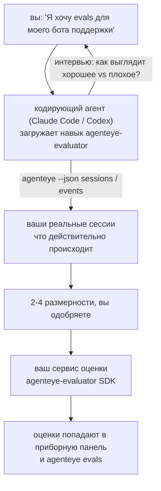

От *«я думаю, что наш агент иногда работает плохо»* к развёрнутому сервису оценки, где кодирующий агент и принимает решение, и строит решение. **Навык наблюдаемости Failproof AI** (`agenteye-evaluator`) — это *Agent Skill*: небольшая папка с инструкциями, которую кодирующий агент, такой как Claude Code или Codex, загружает по требованию. Она учит агента определять, какие метрики качества стоит отслеживать для *вашего* агента, а затем писать, тестировать и развёртывать [сервис оценки](/ru/agenteye/evaluation-suite), который их рассчитывает.

Это **не** размещённый на сервере оценщик, реестр для загрузки или система плагинов. Ваш оценщик остаётся вашим HTTP-сервисом на вашей инфраструктуре, точно как описано в руководстве [Evaluation suite](/ru/agenteye/evaluation-suite). Навык только учит агента строить его хорошо, поэтому всё, что он делает, вы могли бы сделать сами, написав тот же код.

---

## Самая сложная часть — решить, что оценивать

Поверхность SDK небольшая — декоратор и две модели — и агент может написать это из [контракта](/ru/agenteye/evaluation-suite#http-contract) самостоятельно. Не в этом отказывают оценщики. Они отказывают, потому что оценивают не то, и оценщик, оценивающий не то, хуже, чем ничего: он создаёт приборную панель, которую все научаются игнорировать.

Так что большая часть навыка — это часть до появления кода. Агент берёт интервью у вас (*«опишите хорошее выполнение, теперь плохое»*), затем вытягивает ваши реальные сессии через [`agenteye` CLI](/ru/agenteye/cli) и читает их от начала до конца. Эти две половины обычно не согласны, и разрыв — это смысл: то, что вы намеревались измерять, против того, что ваши стенограммы на самом деле могут поддержать. Размерность выживает только если она **вычисляемая** из событий и **различающая** — если она ставит 0.9 и для вашего хорошего выполнения, и для плохого, она ничему не учит и её убирают.

Что возвращается — это предложение 2-4 размерностей с прилагаемым обоснованием, чтобы вы их одобрили до того, как будет написана хоть одна строка.



---

## Как это связано с другими частями оценки

Четыре документа охватывают оценку и передают друг другу по порядку:

| Страница | Что это | Используйте, когда |
|---|---|---|
| **[Evaluations](/ru/agenteye/evaluations)** | Функция: оценки на сетке сессий, приборные панели, переоценка | Вы хотите узнать, что даёт вам автоматическая оценка |
| **[Evaluation suite](/ru/agenteye/evaluation-suite)** | HTTP-контракт, SDK, переменные окружения сервера | Вы реализуете или отлаживаете оценщик сами |
| **Evaluator skill** (этот документ) | Естественноязычная входная дверь для проектирования *и* построения оценщика | Вы хотите перейти от «я хочу evals» к работающему сервису |
| **[CLI skill](/ru/agenteye/cli-skill)** | Естественноязычная входная дверь для `agenteye` CLI | Вы хотите *читать* оценки, которые у вас уже есть |
| **[Python SDK skill](/ru/agenteye/python-sdk-skill)** | Естественноязычная входная дверь для инструментирования вашего агента | Ваш агент ещё не отправляет сессии — нечего оценивать |

### vs. CLI skill: построение против чтения

Два навыка сознательно не пересекаются, и установка обоих — нормальная конфигурация — агент выбирает между ними в зависимости от вашего запроса:

- **`agenteye-evaluator`** (этот документ) строит то, что *производит* оценки. Его работа заканчивается, когда оценки попадают в первый раз.
- **[`agenteye-cli`](/ru/agenteye/cli-skill)** читает оценки, которые уже существуют (`agenteye evals`). «Качество упало на этой неделе?» — его вопрос, а не вопрос этого навыка.

---

## Предварительные условия

1. **`agenteye` CLI установлен и авторизован** (`pipx install agenteye`, затем `agenteye login`). Навык опирается на него дважды: чтобы вытянуть реальные сессии для проектирования и чтобы подтвердить, что ваши оценки попали в конце. Ваш вход должен иметь разрешение `events:read`, плюс `evaluations:read` для этой финальной проверки. Как и с CLI skill, навык **не может** завершить для вас отправленный по почте одноразовый вход с кодом.
2. **Место для размещения оценщика.** Он строится в образ и запускается как долгоживущий сервис, поэтому ему нужен реальный репозиторий, а не временный файл. Оценщики часто живут в собственном репозитории, отдельно от оцениваемого агента — навык ищет существующий и спрашивает перед созданием нового.
3. **Wheel SDK `agenteye-evaluator`** — прочитайте следующий раздел перед тем, как агент начнёт вводить команды `pip`.

---

## Где это взять

Навык опубликован в общественной коллекции навыков Failproof AI:

**[github.com/FailproofAI/skills](https://github.com/FailproofAI/skills)** → [`skills/agenteye-evaluator/`](https://github.com/FailproofAI/skills/tree/main/skills/agenteye-evaluator)

Репозиторий является общественным, и навык не требует собственных учётных данных — он только запускает `agenteye` CLI с сессией, с которой *вы* вошли, и пишет код в *вашем* репозитории. Обратите внимание, что он поставляется как собственная папка и **не** находится внутри пакета `pipx install agenteye`, поэтому не ищите его там.

## Установка навыка

Самый быстрый способ — это [`skills`](https://skills.sh) CLI, который забирает папку и помещает её в то место, где ваш агент ищет:

```bash
# Claude Code, только этот проект
npx skills add FailproofAI/skills --skill agenteye-evaluator -a claude-code

# каждый проект (устанавливается в ~/.claude/skills/)
npx skills add FailproofAI/skills --skill agenteye-evaluator -a claude-code -g --copy

# Codex вместо этого
npx skills add FailproofAI/skills --skill agenteye-evaluator -a codex
```

Затем управляйте им как любым другим навыком:

```bash
npx skills list -a claude-code           # что установлено
npx skills update agenteye-evaluator     # потянуть последнюю версию
npx skills remove agenteye-evaluator     # удалить его
```

Предпочитаете установку вручную? Agent Skill — это просто папка, содержащая `SKILL.md` (плюс опциональные ссылки), поэтому копирование работает:

- **Claude Code**: поместите папку `agenteye-evaluator/` в `~/.claude/skills/` (для каждого проекта) или `<ваш-репо>/.claude/skills/` (только для этого репо). Claude Code автоматически её обнаруживает — проверьте командой `/skills list` или просто попросите evals.
- **Codex (OpenAI)**: Codex читает тот же `SKILL.md`. Поставляемый `agents/openai.yaml` устанавливает `allow_implicit_invocation: true`, поэтому Codex автоматически выбирает навык, когда задача совпадает; иначе вызовите его явно как `$agenteye-evaluator`.

---

## SDK не находится на общественном PyPI

> **Warning:** Прочитайте это перед тем, как разрешить агенту установить SDK.

Навык является общественным; SDK, который он запускает — нет. `agenteye-evaluator` поставляется только как приватный артефакт выпуска, и в отличие от `agenteye`, имя **не заявлено на общественном PyPI** — так что простая команда `pip install agenteye-evaluator` может вытянуть пакет незнакомца в сервис, который читает ваши производственные стенограммы. Это проблема цепочки поставок, а не опечатка.

Навык это знает и вместо этого работает с лестницей установок, останавливаясь на первой ступени, которая применима: исходный код монорепо, если вы находитесь внутри репо AgentEye, иначе приватный wheel выпуска из GitHub Releases (требуется доступ), и если ни один из них не доступен, он **останавливается и говорит вам попросить wheel у вашего контакта в Failproof AI**, а не импровизировать.

Так что если ваш агент предлагает простую команду `pip install agenteye-evaluator` из общественного PyPI, это означает, что навык никогда не загружался. Остановитесь там и проверьте, что он установлен.

---

## Что вы можете у него попросить

Реальный круговой процесс начинается с неясного запроса и заканчивается одобренным проектом, а не кодом:

```text
вы   ▸ Я хочу evals для нашего бота поддержки. Я думаю, что он иногда
        работает плохо.

агент ▸ Перед тем как я что-то пишу: опишите хорошее выполнение,
        и одно плохое.

вы   ▸ Хорошее: отвечает из документов. Плохое: что-то придумывает,
        или сдаётся и говорит «свяжитесь с поддержкой».

агент ▸ Запущено: agenteye --json sessions --status error --since 7d
        Чтение 5 сессий, включая две, которые вы назвали плохими.

        Ваши слова говорят о факте и отклонении. Стенограммы
        согласны с отклонением (2 из 5 заканчиваются передачей
        поддержке, и это видно в model_response.content), но факт
        нужна земля истины, которую ваши события не несут.

        Так что я буду оценивать три вещи:
          - deflection      правила, дёшево, отличает ваши два выполнения
          - tool_efficiency правила, ловит цикл повтора в run-004
          - groundedness    LLM судья: каждое ли утверждение в документах,
                            которые он получил?

        «factuality» потребовала бы земли истины, которая у нас нет;
        groundedness — это ближайшее к чему ваши стенограммы могут
        действительно поддержать. Ладно с этими тремя названиями?
        Переименование позже расколет историю.

вы   ▸ да

агент ▸ Нет оценщика в этом репо. Мне создать его здесь, или у вас
        есть один где-нибудь ещё?
```

Отсюда он сначала пишет размерности на основе правил (бесплатно, мгновенно, детерминировано), тестирует их против реальной захваченной сессии, включая пустые и никогда не завершённые, которые вызывают крах наивных оценщиков, и только затем обращается к LLM судье для субъективной размерности. Он знает [ограничения диспетчера](/ru/agenteye/evaluation-suite#configuring-the-server) — 30-секундный таймаут запроса и 8 одновременных вызовов развёртывания — так что если судья не будет надёжно подходить, он идёт асинхронно с `JobPending` вместо того чтобы позволить вашему судье быть отменённым и повторно пробованным пять раз в пять раз больше затрат.

Затем он развёртывает, устанавливает две переменные окружения сервера и подтверждает командой `agenteye --json evals --session-id <id>`, что оценки действительно попали. Оценки, которые попали — это единственное доказательство.

---

## На что нужно обратить внимание

- **Имена размерностей близки к постоянным.** Ключи оценки — это произвольные строки, и платформа тренирует то, что вы отправляете, что означает, что ничто ниже не исправляет плохой выбор. Переименование позже расколет историю: старые сессии сохраняют старый ключ и тренд ломается. Вот почему навык получает явное одобрение перед написанием кода — отнеситесь к этому запросу серьёзно.
- **Фиксчастины — это реальные производственные стенограммы.** Проектирование против реальных сессий означает вытягивание их на диск, и они могут содержать данные клиентов. Навык спрашивает перед коммитом их в git; если в сомнении, держите `fixtures/` вне репо и имейте каждого разработчика вытянуть свои собственные.
- **Агент пишет и развёртывает сервис, который читает каждую стенограмму.** Он действует как вы, ограниченный разрешениями вашего входа CLI, но проверьте оценщик как любой другой код, который касается производственных данных.

---

## Следующие шаги

- **[Evaluation suite](/ru/agenteye/evaluation-suite)**: HTTP-контракт, SDK и переменные окружения сервера, которые настраивает навык.
- **[Evaluations](/ru/agenteye/evaluations)**: где показываются оценки после того, как они попали.
- **[CLI skill](/ru/agenteye/cli-skill)**: соседний навык для чтения результатов вместо построения оценщика.
- **[CLI](/ru/agenteye/cli)**: справка команды позади данных сессии, против которых проектирует навык.