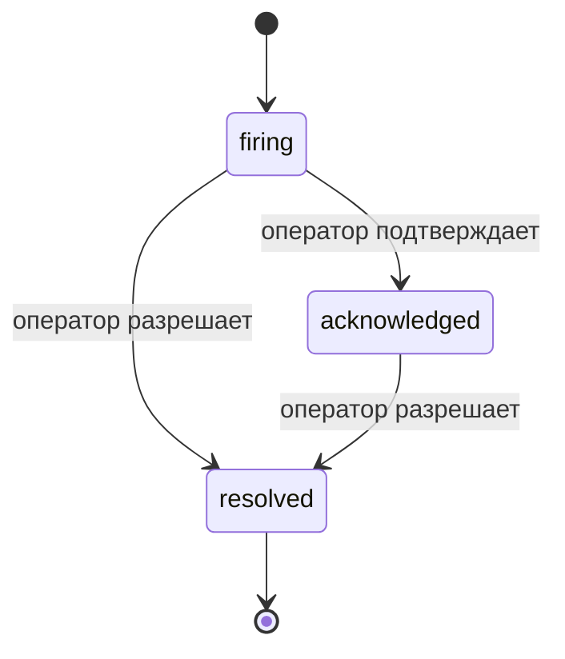

Когда срабатывает оповещение, первый вопрос всегда: "кто этим занимается?" Инциденты отвечают на него: в момент нарушения все видят открытый инцидент, кто за него отвечает и ровно что произошло к этому моменту, с чистой и атрибутированной записью, которую можно прямо передать на постмортем.

*Входящие данные группируют открытые инциденты по статусу и фильтруют по серьезности и назначенному сотруднику, так что вы видите, что требует внимания человека сейчас.*

## Знайте, кто это держит, с первого взгляда

Больше никаких "кто-нибудь это смотрит?" в потоке чата. Нарушение автоматически открывает инцидент и бросает его в общий входящий ящик, сгруппированный по статусу. Подтвердите его, и ваше имя на нем, так что остальная команда знает, что это взято под контроль. Подтверждение совместное: несколько операторов могут подтвердить один и тот же инцидент, и каждый записывается отдельно, так что весь боевой штаб появляется по именам вместо того, чтобы мешать друг другу. Назначьте одного владельца для сортировки и фильтруйте входящие по серьезности или назначенному сотруднику, чтобы сократить до того, что принадлежит вам.

## Вся история в одной временной шкале

Когда инцидент закончен, у вас уже есть отчет. Откройте любой инцидент и вы получите доказательство нарушения, его назначенных сотрудников и подписчиков, поток комментариев для координации на месте и ленту активности только для добавления.

*Все, что произошло, по порядку, каждая строка подписана тем, кто это сделал.*

Каждое действие (открыто, подтверждено, разрешено и так далее) записывается в эту ленту и никогда не редактируется. Каждая запись атрибутирована: оператору, который это сделал, по электронной почте, или **автоматически** для всего, что FailproofAI Observability сделала самостоятельно, например открытие инцидента при нарушении. Ничто не анонимно и ничто не потеряно, так что постмортем более или менее пишет себя сам.

## Как инцидент движется

- **Открыт (срабатывает):** нарушение открывает инцидент и страницы вашего канала один раз. Повторные нарушения объединяются в один и тот же инцидент и обновляют его доказательства вместо многократного вызова.
- **Подтвержден:** оператор его берет. Он остается открытым, и более поздние нарушения обновляют доказательства без уведомления.
- **Разрешен:** оператор его закрывает. Автоматическое разрешение при очистке условия запланировано, но пока не включено, так что инцидент остается открытым до тех пор, пока его не разрешит человек, что держит всех в честности относительно того, что на самом деле очищено. Новый инцидент может открыться по тому же оповещению позже.

Одно оповещение держит максимум один открытый инцидент одновременно, так что мигающее правило не может вас захоронить в дубликатах. Вы также можете открыть инцидент вручную: отдельный для чего-то, что не поймало оповещение, или один, присоединенный к существующему оповещению, если у вас есть `incidents:write`.

## Где его найти

Инциденты находятся в `/<org-slug>/incidents`. Просмотр требует **`incidents:read`**; открытие ручного инцидента требует **`incidents:write`**; подтверждение, назначение, комментирование и разрешение требуют **`incidents:ack`**. Старые ключи, предоставившие снятый с производства `alerts:ack`, продолжают работать, так как он принимается как `incidents:ack`, поэтому ваша ротация на дежурстве не нуждается в переоформлении.

## Связанные

- [Оповещения](/ru/agenteye/alerts): правила, которые открывают эти инциденты при нарушении порога.
- [Отслеживание ошибок](/ru/agenteye/error-tracking): видите каждый сбой в одном месте и повышайте один до оповещения.
- [Аудиты](/ru/agenteye/audits): запланированный аналитик, который находит сбои, которые ни одно правило не отслеживало.