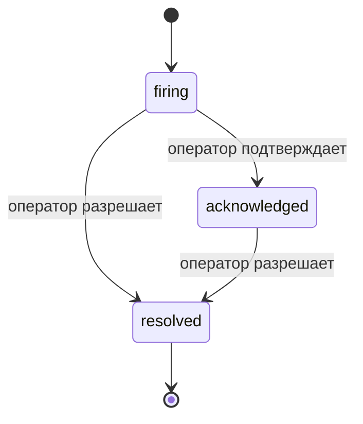

Когда срабатывает алерт, первый вопрос всегда один: «кто это берёт?» Инциденты отвечают на него: в момент нарушения все видят, что инцидент открыт, кто за него отвечает и ровно что произошло, с чистой атрибутированной записью, которую можно сразу передать на post-mortem.

*Входящие группируют открытые инциденты по статусу и фильтруют по серьёзности и ответственному, чтобы вы видели, что требует внимания.*

## Сразу видите, кто над этим работает

Больше не нужно писать в чат: «кто-нибудь смотрит на это?» Нарушение автоматически открывает инцидент и отправляет его в общий входящий, сгруппированный по статусу. Подтвердите — и ваше имя на нём, чтобы команда знала, что это берёшься ты. Подтверждение — общее: несколько операторов могут подтвердить один инцидент, и каждый записывается отдельно, так что полная боевая комната показывает всех по именам вместо наложения друг на друга. Назначьте одного владельца для сортировки и фильтруйте входящие по серьёзности или ответственному, чтобы оставить только ваше.

## Вся история на одной временной шкале

Когда инцидент закончен, отчёт уже готов. Откройте любой инцидент — видите доказательство нарушения, его ответственных и подписчиков, ветку комментариев для координации на месте и добавляемую только в конце временную шкалу действий.

*Всё, что произошло, по порядку, каждая строка подписана тем, кто это сделал.*

Каждое действие (открыто, подтверждено, разрешено и т. д.) записывается в эту временную шкалу и никогда не редактируется. Каждая запись атрибутирована: оператору, который её выполнил, по электронной почте, или **automated** для всего, что Failproof AI Observability сделал самостоятельно, например открыл инцидент на нарушении. Ничего не анонимно и ничего не потеряно, так что post-mortem более или менее пишет себя сам.

## Как движется инцидент

- **Открыт (firing):** нарушение открывает инцидент и однократно уведомляет ваши каналы. Повторные нарушения объединяются в один инцидент и обновляют его доказательства вместо повторных уведомлений.
- **Подтверждён (acknowledged):** оператор его берёт. Инцидент остаётся открытым, и более поздние нарушения обновляют доказательства тихо.
- **Разрешён (resolved):** оператор его закрывает. Автоматическое разрешение при очистке условия планируется, но пока не включено, так что инцидент остаётся открытым, пока его не разрешит человек, что держит всех в тонусе относительно того, что действительно разрешилось. Новый инцидент может открыться на том же алерте позже.

Один алерт держит максимум один открытый инцидент одновременно, так что прыгающее правило не может вас завалить дубликатами. Вы также можете открыть инцидент вручную: отдельный для чего-то, что ни один алерт не поймал, или привязанный к существующему алерту, если у вас есть `incidents:write`.

## Где его найти

Инциденты находятся в `/<org-slug>/incidents`. Просмотр требует **`incidents:read`**; открытие ручного инцидента требует **`incidents:write`**; подтверждение, назначение, комментирование и разрешение требуют **`incidents:ack`**. Старые ключи, которым был дан снятый с производства `alerts:ack`, продолжают работать, так как он воспринимается как `incidents:ack`, поэтому вашему на-вызове не нужна переиздача.

## Связанное

- [Alerts](/ru/agenteye/alerts): правила, которые открывают эти инциденты при нарушении порога.
- [Error tracking](/ru/agenteye/error-tracking): смотрите каждый отказ в одном месте и повысьте один до алерта.
- [Audits](/ru/agenteye/audits): запланированный аналитик, который находит отказы, которые ни одно правило не было слежение.