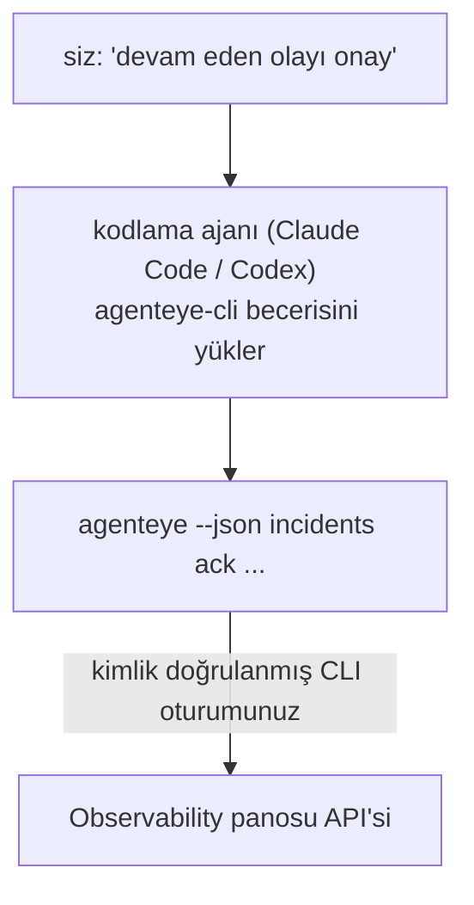

---
---
title: "Failproof AI Observability CLI Agent Skill"
description: "Kodlama ajanınıza \"bugün bir şey bozuk mu?\" sorusunu sorun ve Failproof AI Observability verilerinizden canlı yanıt alın, herhangi bir komut ezberlemeden."
---


Kodlama ajanınıza *"bugün bir şey bozuk mu?"* sorusunu sorun ve canlı Failproof AI Observability verilerinizden yanıt almasını sağlayın, herhangi bir komut ezberlemeden. **Failproof AI Observability CLI becerisi** (`agenteye-cli`), bir *Agent Skill*: Claude Code veya Codex gibi bir kodlama ajanının ihtiyaç halinde yüklediği küçük bir klasör. Ajanı Observability dağıtımınızı [`agenteye` CLI](/tr/agenteye/cli) aracılığıyla işletmeyi öğretir; *"CI'ye yalnızca etkinlik gönderebilen bir anahtar ver"* veya *"devam eden olayı onay ve bana ata"* gibi düz İngilizce isteklerden.

Bu bir hizmet veya ayrı bir ikili **değildir**; dağıtılacak bir şey yoktur. Zaten yüklediğiniz CLI'nin üstünde çalışır: ajan `agenteye --json …` komutunu çalıştırır, temiz JSON'u ayrıştırır ve size metin formatında yanıt verir. Yapabileceği her şey, aynı komutları yazarak kendiniz de yapabilirsiniz.

---

## Diğer Failproof AI Observability arayüzleriyle ilişkisi

Failproof AI Observability size aynı verilere ve kontrollere ulaşmak için dört yol sunar. Birbirini tamamlarlar:

| Arayüz | Ne olduğu | Nerede çalışır | Şu durumlarda kullanın |
|---|---|---|---|
| **[CLI](/tr/agenteye/cli)** | `agenteye` için komut/bayrak referansı | Terminaliniz | Belirli bir komutu çalıştırmak veya komut dosyası oluşturmak istediğinizde |
| **[CLI reçeteleri](/tr/agenteye/cli-recipes)** | Kopyala-yapıştır `jq`/boru hattı desenleri | Terminal / komut dosyaları | CLI'yi otomasyona entegre ettiğinizde |
| **CLI becerisi** (bu doküman) | CLI'ye doğal dil ön kapısı | Kodlama ajanınız, iş istasyonunuzda | Sadece sormak ve ajanın komutu seçmesini sağlamak istediğinizde |
| **[Evaluator becerisi](/tr/agenteye/evaluator-skill)** | Puanlama hizmetinizi tasarlayan ve oluşturan kardeş beceri | Kodlama ajanınız, iş istasyonunuzda | Puanlama skorları *üretmek* istediğinizde |
| **[Python SDK becerisi](/tr/agenteye/python-sdk-skill)** | Ajanınızı telemetri yaymasını sağlayan kardeş beceri | Kodlama ajanınız, iş istasyonunuzda | Ajanınızın bu becerinin okuduğu olayları *üretmesini* istediğinizde |
| **[Pano içi AI asistanı](/tr/agenteye/assistant)** | Panoya gömülü sohbet | Sunucu tarafı (pano içinde) | Verileriniz hakkında pano içi Q&A istediğinizde |

Becerinin kendisinin hiçbir ayrıcalığı yoktur; sadece sözlerinizi sizin olarak çalışan CLI çağrılarına dönüştürür:



### Pano içi AI asistanıyla karşılaştırması: önemli bir ayrım

Bunlar çok farklı etkileri olan iki ayrı araçtır:

- **Pano içi AI asistanı** ([AI asistanı](/tr/agenteye/assistant)) panoya gömülü bir sohbettir, ajan hizmeti tarafından desteklenir. Bu **salt okunur artı onay geçitli yazma**'dır: kaydedilmiş sorgular ve panoları taslak yapabilir, ancak her yazma işlemi açık tıklamanız için duraklar ve hiçbir zaman silmez. `agent:use` izni tarafından korunur ve yalnızca görüntülediğiniz kuruluşun verilerini görür.
- **CLI becerisi** *sizin* iş istasyonunuzda *sizin* kodlama ajanınızın içinde çalışır ve `agenteye` CLI'sini **siz olarak** çalıştırır. CLI'nin **tam yüzeyini gerçekleştirebilir, değişiklikleri dahil** (API anahtarları oluştur/döndür/devre dış bırak, kuruluş ayarlarını değiştir, olayları çöz, kaydedilmiş sorguları sil), yalnızca CLI oturumunuzun izinleri tarafından sınırlıdır. Bunu bu komutları elle çalıştırmakla tamamen aynı dikkatle işleyin.

---

## Ön koşullar

1. **`agenteye` CLI yüklü** ve `PATH`'te (bkz. [CLI](/tr/agenteye/cli) referansı: `pipx install agenteye`).
2. **Pano URL'si ayarlanmış** (`AGENTEYE_DASHBOARD_URL` veya ajan `--base-url` iletir).
3. **Oturum açılı**: önce kendiniz `agenteye login` komutunu çalıştırın. Beceri e-posta ile gönderilen tek kullanımlık kod girişini **tamamlayamaz**; oturum eksik veya süresi dolmuşsa (CLI çıkış kodu `4`) `agenteye login` komutunu çalıştırmanızı söyler.

---

## Nereden alacaksınız

Beceri Failproof AI'ın genel beceri koleksiyonunda yayınlanmıştır:

**[github.com/FailproofAI/skills](https://github.com/FailproofAI/skills)** → [`skills/agenteye-cli/`](https://github.com/FailproofAI/skills/tree/main/skills/agenteye-cli)

Bunun hakkında hiçbir şey kısıtlanmaz — depo genel ve becerinin kendi kimlik bilgisine ihtiyacı yoktur, çünkü yalnızca **genel** `agenteye` CLI'sini *sizin* panosu üzerinde çalıştırır, oturum açtığınız oturum *sizi* kullanarak. Bunu almak için kimseye sormanıza gerek yoktur.

Kendi klasörü olarak gönderildiğini ve `pipx install agenteye` paketi içinde **değildir**, bu nedenle orada aramayın.

## Beceriyi yükleme

En hızlı yol [`skills`](https://skills.sh) CLI'sidir, bu da klasörü ajanınızın aradığı yere indirir:

```bash
# Claude Code, yalnızca bu proje
npx skills add FailproofAI/skills --skill agenteye-cli -a claude-code

# Her proje (~/.claude/skills/ dizinine yükler)
npx skills add FailproofAI/skills --skill agenteye-cli -a claude-code -g --copy

# Bunun yerine Codex
npx skills add FailproofAI/skills --skill agenteye-cli -a codex
```

Daha sonra başka herhangi bir beceri gibi yönetin:

```bash
npx skills list -a claude-code      # yüklü olanlar
npx skills update agenteye-cli      # en son sürümü alın
npx skills remove agenteye-cli      # kaldırın
```

Elle yüklemeli misiniz? Bir Agent Skill sadece `SKILL.md` içeren bir klasördür (artı isteğe bağlı referanslar), bu nedenle kopyalama da işe yarar:

- **Claude Code**: `agenteye-cli/` klasörünü `~/.claude/skills/` (her proje) veya `<your-repo>/.claude/skills/` (yalnızca o depo) içine koyun. Claude Code bunu otomatik olarak keşfeder — `/skills` listesiyle doğrulayın veya açıklamasıyla eşleşen bir soru sorun.
- **Codex (OpenAI)**: Codex aynı `SKILL.md`'yi okur. Paketlenmiş `agents/openai.yaml` `allow_implicit_invocation: true` ayarlar, böylece Codex bir görev eşleştiğinde beceriyi otomatik olarak seçer; aksi takdirde `$agenteye-cli` olarak açıkça çağırın.

---

## Güvenlik: değişiklikler ajan CLI'yi çalıştırdığında istemi **değildir**

> **Uyarı:** Bir ajanın değişiklik yapmasına izin vermeden önce bunu okuyun.

`agenteye` CLI normalde yıkıcı bir eylemden önce *"emin misiniz?"* diye sorar. **Terminal'e bağlı olmadığında (tam olarak bir kodlama ajanının bunu çalıştırma şekli) ve `--json` da atladığında bu onayı otomatik olarak atlar.** Yani güvenlik istemi ajan için **ateşlenmeyecektir**.

Beceri bunu telafi etmek için yazılmıştır: tam olarak çalıştıracağı komutu belirtmesi ve herhangi bir durum değişikliğinden önce açıkça **OK alması talimatı verilir. Bu disiplini koruyun. Failproof AI Observability'yi bir ajan aracılığıyla çalıştırdığınızda, *siz* onaylama adımısınız. İzlenecek durum değiştiren komutlar:

- `keys create` / `update` / `disable` / `regenerate`
- `users create` / `update` / `disable` / `enable`
- `settings set`
- `alerts create` / `update` / `delete` / `test`
- yazma `incidents` alt komutları: `ack` / `assign` / `resolve` / `open` / `comment-add` / `comment-delete` / `subscribe` / `unsubscribe`
- `query create` / `update` / `delete`
- `agent rename` / `delete`
- `orgs switch`

**Gözlemle** altındaki her şey (`events`, `sessions`, `evals`, `errors`, `list`, `whoami`, `orgs list/current/perms`) salt okunur ve hiçbir şeyi değiştirmez.

Ajan **siz** olarak davrandığından, yalnızca oturumunuzun yaptığı şeyleri yapabilir; izinler **kuruluş başına** çözülür ([API anahtarları](/tr/agenteye/api-keys) bkz.). İzniniz olmayan bir komut, çıkış kodu `5` ile tam izni adı döndürür, böylece ajan tam olarak neyi bir yöneticiye sormak istediğini söyleyebilir, başarısız olmak yerine belirsiz kalır.

---

## Ne sorabilirsiniz

İşte gerçek bir gidiş-dönüş örneği, okuması ve ardından OK'nuz bekleyen değişiklik:

```text
siz    ▸ Son gün içinde bir şey bozuk mu?

ajan   ▸ Çalıştırılıyor: agenteye --json errors --since 24h --aggregate
         Son 24 saatte 3 hata türü. En büyüğü TimeoutError
         (18 hit, tümü checkout-agent'te), ardından RateLimited (5).
         TimeoutError için başarısız oturumları istediğiniz mi?

siz    ▸ CI'ye yalnızca etkinlik gönderebilen bir anahtar ver.

ajan   ▸ Bu bir API anahtarı oluşturur. Şu komutu çalıştıracağım:
          agenteye keys create ci --add events:add
         Devam etmek için tamam mı?

siz    ▸ evet

ajan   ▸ Bitti. "ci" anahtarı yalnızca events:add ile oluşturuldu.
         Gizli yalnızca bir kez gösterilir, bu nedenle şimdi saklayın.
         Bunu yeniden yazdıramam.
```

Beceri her düz İngilizce amacı doğru `agenteye` komutuna eşler, tahmin etmemesi için önce geçerli değerleri keşfeder (`list <kind>`, `whoami`), ve herhangi bir değişiklikten önce tam komutu belirtir. Daha fazla örnek:

- *"Son 24 saatte bir şey bozuk mu / başarısız mı?"* → `errors --since 24h --aggregate`, ardından bir ayrıntılı hale getirme.
- *"Oturum `run-001` neden başarısız oldu?"* → `events --session-id run-001 --all` + `evals --session-id run-001`.
- *"Kalite bu hafta nasıl ilerliyor?"* → `evals --aggregate --since 7d`, ardından düşük puanlı çalıştırmalara detay.
- *"CI'ye yalnızca etkinlik gönderebilen bir anahtar ver."* → `keys create ci --add events:add` (komutu belirtir, ardından oluşturur ve tek kullanımlık gizli anahtarı yakalar).
- *"Kimin erişimi var? Dana'yı salt okunur yap."* → `users list` → `users update dana@… --permission-set read-only` (sizle doğruladıktan sonra).
- *"Devam eden olayı onay ve bana ata."* → `incidents list --state firing` → `incidents ack <id>` / `incidents assign <id> you@…`.

Tam komutlar, bayraklar ve bu komutların arkasındaki JSON şekilleri için [CLI](/tr/agenteye/cli) referansı ve [Ajanlar için CLI reçeteleri](/tr/agenteye/cli-recipes) bölümüne bakın.

---

## Sonraki adımlar

- **[CLI](/tr/agenteye/cli)**: `agenteye` için tam komut ve bayrak referansı.
- **[Ajanlar için CLI reçeteleri](/tr/agenteye/cli-recipes)**: kopyala-yapıştır `jq` desenleri ve çıkış kodu işleme.
- **[Evaluator ajan becerisi](/tr/agenteye/evaluator-skill)**: kardeş beceri, `agenteye evals` tarafından okunan puanları üreten evaluatörü oluşturmak için.
- **[Python SDK ajan becerisi](/tr/agenteye/python-sdk-skill)**: kardeş beceri, `agenteye`'ın okuduğu telemetriyi yayması için bir ajanı araçlandırmak için.
- **[AI asistanı](/tr/agenteye/assistant)**: pano içi asistan (bu terminal becerisiyle karıştırılmamak için).
- **[API anahtarları](/tr/agenteye/api-keys)**: becerinin yapabileceği şeyleri sınırlayan kuruluş başına izin modeli.