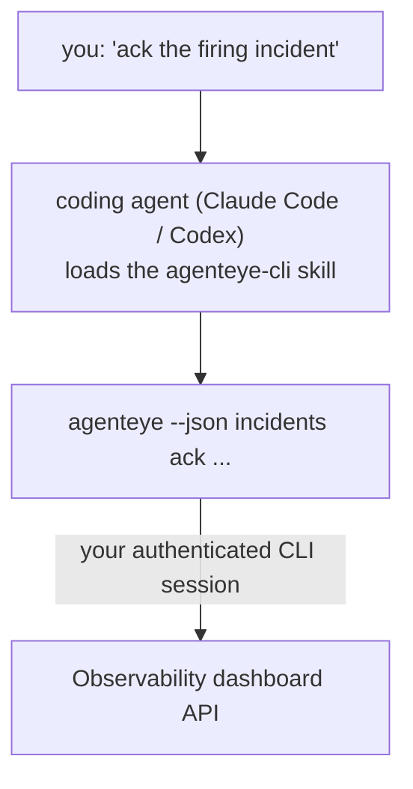

Kodlama aracınıza *"bugün arızalanan bir şey var mı?"* sorusunu sorun ve canlı FailproofAI Observability verilerinizden yanıt alın, hiçbir komutu ezberlemeden. **FailproofAI Observability CLI skill** (`agenteye-cli`), bir *Agent Skill*'dir: Claude Code veya Codex gibi kodlama aracının talep üzerine yüklediği, küçük bir klasör ve talimatlar bütünü. Aracıya, FailproofAI Observability dağıtımınızı [`agenteye` CLI](/tr/agenteye/cli) aracılığıyla *"CI'ye sadece event gönderebilenaktar ver"* veya *"aktif incident'i onayla ve bana ata"* gibi açık İngilizce isteklerden yönetmesini öğretir.

Bu, bir hizmet veya ayrı bir binary **değildir**; dağıtılacak hiçbir şey yoktur. Zaten yüklü olduğunuz CLI'nin üzerine oturur: aracı `agenteye --json …` komutunu çalıştırır, temiz JSON'u ayrıştırır ve size düz yazı şeklinde yanıt verir. Yapabileceği her şey, aynı komutları yazarak siz de yapabilirsiniz.

---

## Diğer FailproofAI Observability arayüzleriyle ilişkisi

FailproofAI Observability, aynı verilere ve kontrollere ulaşmanın dört yolunu sunar. Bunlar birbirini tamamlar:

| Arayüz | Nedir | Nerede çalışır | Bunu kullan |
|---|---|---|---|
| **[CLI](/tr/agenteye/cli)** | `agenteye` için komut/bayrak referansı | Terminaliniz | Belirli bir komutu çalıştırmak veya komut dosyası yazmak istediğinizde |
| **[CLI recipes](/tr/agenteye/cli-recipes)** | Kopyala-yapıştır `jq`/pipeline desenleri | Terminaliniz / scriptler | CLI'yi otomasyon içine bağladığınızda |
| **CLI skill** (bu belge) | CLI üzerinde doğal dil arayüzü | Kodlama aracınız, iş istasyonunuzda | Sadece sormak ve aracının komutu seçmesine izin vermek istediğinizde |
| **[Pano içi AI asistanı](/tr/agenteye/assistant)** | Pano içine gömülü sohbet | Sunucu tarafı (pano içinde) | Verileriniz üzerinde pano içi Q&A istediğinizde |

Skill'in kendisinin hiçbir izni yoktur; sadece sizin söylediklerinizi siz olarak çalışan CLI çağrılarına dönüştürür:



### Pano içi AI asistanı ile karşılaştırma: önemli bir fark

Bunlar çok farklı etki alanlarına sahip iki farklı araçtır:

- **Pano içi AI asistanı** ([AI asistanı](/tr/agenteye/assistant)), panoya gömülü bir sohbet olup, aracı hizmetinin desteğiyle çalışır. **Salt okunur artı onay gerektiren yazma**: kayıtlı sorgular ve panolar taslağı oluşturabilir, ancak her yazma işlemi sizin açık tık-onayınızı bekler ve hiçbir zaman silmez. `agent:use` iznine tabidir ve yalnızca görüntülediğiniz organizasyonun verilerini görür.
- **CLI skill**, *sizin* iş istasyonunuzda *sizin* kodlama aracınız içinde çalışır ve `agenteye` CLI'sini **siz olarak** yönetir. **Tam mutasyonlar dahil** CLI'nin tam yüzeyini gerçekleştirebilir (API anahtarları oluştur/döndür/devre dışı bırak, org ayarlarını değiştir, incident'leri çöz, kaydedilmiş sorguları sil), sadece CLI girişinizin izinleriyle sınırlıdır. Bunu, bu komutları elle çalıştıracakmış gibi dikkatli bir şekilde ele alın.

---

## Önkoşullar

1. **`agenteye` CLI yüklü** ve `PATH`'de (bkz. [CLI](/tr/agenteye/cli) referansı: `pipx install agenteye`).
2. **Pano URL'niz ayarlanmış** (`AGENTEYE_DASHBOARD_URL` veya aracı `--base-url` iletir).
3. **Giriş yapılmış bir oturum**: önce `agenteye login` komutunu çalıştırın. Skill, **size** emaille gelen tek kullanımlık kod girişini tamamlayamaz; oturum eksikse veya süresi dolmuşsa sizi `agenteye login` çalıştırmaya yönlendirir (CLI çıkış kodu `4`).

---

## Skill'i yükleme

Agent Skills, `SKILL.md` (artı isteğe bağlı referanslar) içeren klasörlerdir. `agenteye-cli` skill'ini aracınızın skill'leri aradığı yere kopyalayarak yüklersiniz:

- **Claude Code**: `agenteye-cli/` klasörünü `~/.claude/skills/` (her projede mevcut) veya `<your-repo>/.claude/skills/` (o depoya özel) içine kopyalayın. Claude Code otomatik olarak bulur; `/skills` listesiyle doğrulayın veya açıklaması eşleşen bir soruyu sorun.
- **Codex (OpenAI)**: Codex aynı `SKILL.md`'yi okur. Paket edilen `agents/openai.yaml`, `allow_implicit_invocation: true` olarak ayarlanmıştır, bu nedenle bir görev eşleştiğinde Codex skill'i otomatik olarak seçer; aksi takdirde `$agenteye-cli` olarak açıkça çağırın.

Skill, `agenteye` CLI'yle birlikte yönetilir ancak **ayrı bir klasör** olarak gönderilir, `pipx install agenteye` paketi içinde değildir, bu nedenle orada arama yapmayın. FailproofAI Observability, `agenteye-cli/` klasörünü size kendi başına sunar; eğer sizde yoksa, FailproofAI temsilcinize sorun. Bunun hakkında hiçbir şey kısıtlanmamıştır: herhangi bir kimlik bilgisine ihtiyacı yoktur, çünkü sadece kendi panonuza karşı **genel** `agenteye` CLI'sini yönetir.

---

## Güvenlik: mutasyonlar aracı CLI çalıştırdığında komut istemi göstermez

> **Uyarı:** Aracıya değişiklik yapmasına izin vermeden önce bunu okuyun.

`agenteye` CLI normalde yıkıcı bir eylem öncesinde *"emin misiniz?"* sorusunu sorar. **Terminaline bağlı olmadığında (tam olarak bir kodlama aracının bunu çalıştırma şekli) bunu otomatik olarak atlar ve `--json` de atlar.** Bu nedenle güvenlik istemi aracı için çalışmayacaktır.

Skill bunu telafi etmek için yazılmıştır: çalıştıracağı tam komutu belirtmesi ve herhangi bir durum değişikliğinden önce sizin açık **TAMAM**'ınızı alması için talimattan geçer. Bu disiplini koruyun. FailproofAI Observability'yi bir aracı aracılığıyla yönettiğinizde, *siz* onaylama adımısınız. İzlenecek durum değiştiren komutlar:

- `keys create` / `update` / `disable` / `regenerate`
- `users create` / `update` / `disable` / `enable`
- `settings set`
- `alerts create` / `update` / `delete` / `test`
- yazma `incidents` alt komutları: `ack` / `assign` / `resolve` / `open` / `comment-add` / `comment-delete` / `subscribe` / `unsubscribe`
- `query create` / `update` / `delete`
- `agent rename` / `delete`
- `orgs switch`

**Observe** altındaki her şey (`events`, `sessions`, `evals`, `errors`, `list`, `whoami`, `orgs list/current/perms`) salt okunur ve hiçbir şeyi değiştirmez.

Aracı **siz** olarak hareket ettiğinden, girişinizin yapmasına izin verilen her şeyi yapabilir; izinler **org başına** çözümlenir (bkz. [API anahtarları](/tr/agenteye/api-keys)). Sizin izniniz olmayan bir komut, çıkış kodu `5` döndürür ve tam izni adlandırır, böylece aracı, opak bir şekilde başarısız olmak yerine, bir admin'den ne istemeleri gerektiğini size tam olarak söyleyebilir.

---

## Buna ne sorabileceğiniz

İşte gerçek bir tur-tur neye benziyor, bir okuma, sonra sizin OK'nızı bekleyen bir değişiklik:

```text
you   ▸ Son bir gün içinde arızalanan bir şey var mı?

agent ▸ Running: agenteye --json errors --since 24h --aggregate
        Son 24 saatte 3 hata türü. En büyüğü TimeoutError
        (18 kez, tümü checkout-agent'de), ardından RateLimited (5).
        TimeoutError için başarısız oturumlar ister misiniz?

you   ▸ CI'ye sadece event gönderebilenaktar ver.

agent ▸ This creates an API key. I'll run:
          agenteye keys create ci --add events:add
        OK to proceed?

you   ▸ yes

agent ▸ Bitti. "ci" anahtarı sadece events:add ile oluşturuldu.
        Gizli dizi yalnızca bir kez gösterilir, bu nedenle şimdi saklayın. Bunu yeniden yazdıramam.
```

Skill, her düz dil niyetini doğru `agenteye` komutuna eşler, önce geçerli değerleri bulur (`list <kind>`, `whoami`), tahmin etmez ve herhangi bir değişiklikten önce tam komutu belirtir. Daha fazla örnek:

- *"Bir gün içinde arızalanan / başarısız olan bir şey var mı?"* → `errors --since 24h --aggregate`, sonra bir breakdown.
- *"Oturum `run-001` neden başarısız oldu?"* → `events --session-id run-001 --all` + `evals --session-id run-001`.
- *"Bu hafta kalite nasıl trend gösteriyor?"* → `evals --aggregate --since 7d`, sonra düşük puanlı çalıştırmaları detaylandırın.
- *"CI'ye sadece event gönderebilenaktar ver."* → `keys create ci --add events:add` (komutu belirtir, sonra oluşturur ve tek seferlik gizli diziyi yakalar).
- *"Kimde erişim var? Dana'yı salt okumalı yap."* → `users list` → `users update dana@… --permission-set read-only` (sizle onaylamadan sonra).
- *"Aktif incident'i onayla ve bana ata."* → `incidents list --state firing` → `incidents ack <id>` / `incidents assign <id> you@…`.

Bu komutların arkasında tam komutlar, bayraklar ve JSON şekilleri için, [CLI](/tr/agenteye/cli) referansını ve [aracılar için CLI recipes](/tr/agenteye/cli-recipes)'ine bakın.

---

## Sonraki adımlar

- **[CLI](/tr/agenteye/cli)**: `agenteye` için tam komut ve bayrak referansı.
- **[Aracılar için CLI recipes](/tr/agenteye/cli-recipes)**: kopyala-yapıştır `jq` desenleri ve çıkış kodu işleme.
- **[AI asistanı](/tr/agenteye/assistant)**: pano içi asistan (bu terminal skill'iyle karıştırılmamalı).
- **[API anahtarları](/tr/agenteye/api-keys)**: skill'in yapabileceğini sınırlandıran org başına izin modeli.