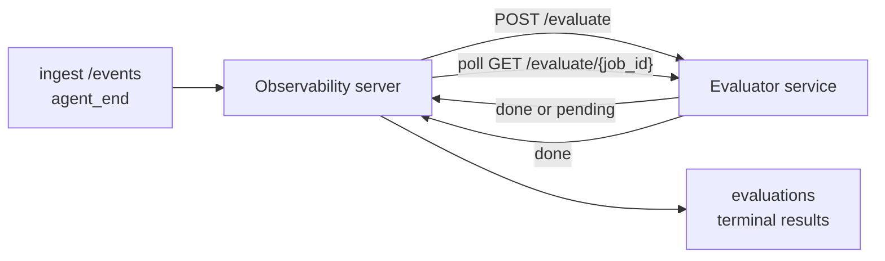

FailproofAI Observability, tamamlanan her agent çalışmasını kalite açısından otomatik olarak puanlandırabilir: küçük bir puanlama hizmeti sağlarsınız, Observability'de geri kalanı halleder. Önem verdiğiniz boyutları izlemek için kullanın (yardımcılık, araç verimliliği, faktuallik, güvenlik; siz seçersiniz), gerilemeyi erken yakalayın ve ajanları veya ortamları bir bakışta karşılaştırın. Puanlama isteğe bağlıdır: sunucu üzerinde `EVALUATOR_ENDPOINT` ayarlanana kadar işlem hattı hiçbir şey yapmaz.

> **Not:** Skor boyutlarını siz tanımlarsınız. Puanlandırıcınız istediği herhangi bir sayısal anahtarı döndürebilir; Observability, geri gönderdiğiniz her şeyi depolar, trendler ve görüntüler.

## Bir bakışta

1. **Bir puanlayıcı yazın.** Bir oturum transkriptini okuyan ve puanlar döndüren küçük bir HTTP hizmeti kurun. Observability, kopyalayabileceğiniz çalışan bir referans içerir. Bkz. [SDK ile puanlayıcı yazma](#sdk-ile-puanlayıcı-yazma).
2. **Observability'i ona yönlendirin.** Sunucu işlemi üzerinde `EVALUATOR_ENDPOINT` (ve paylaşılan `EVALUATOR_TOKEN`) ayarlayın.
3. **Puanların gelmesini izleyin.** Tamamlanan her oturum otomatik olarak puanlandırılır; sonuçlar oturum detay sayfasında, oturumlar ızgarasında ve kaydedilmiş panolarda görünür.


*Bir puanlayıcı yapılandırıldıktan sonra, tamamlanan her çalışma puanlandırılır ve sonuçlar oturumun sağ panelinde görünür: üstte özet, sonra boyut başına skor çubukları ve mantık.*

---

## Nasıl çalışır?



Observability SDK bir oturum için `agent_end` olayı yayınladığında, sunucu bir değerlendirme planlar. Daha sonra tam olay transkriptini puanlayıcı hizmetinize POST eder ve bu hizmet şunlardan birini yapabilir:

- **Sonucu satır içi döndürün** `{"status":"done", "scores":{...}, "reasoning":{...}, "summary":"..."}` ile. Sonuç, oturumun değerlendirme zaman çizelgesine eklenir. `reasoning` ve `summary` isteğe bağlıdır.
- **Erteleyin** `{"status":"pending", "job_id":"abc-123"}` ile. Observability daha sonra puanlayıcınız `{"status":"done", ...}` veya `{"status":"error", "error":"..."}` döndürünceye kadar `GET {EVALUATOR_ENDPOINT}/evaluate/abc-123` öğesini çağırır.

  Yoklama hızı iş başına yapılır: `pending` yanıt `next_poll_secs` içerebilir; aksi takdirde Observability `GET /config` öğesinden `default_poll_interval_secs` değerini kullanır; aksi takdirde sunucu `EVALUATOR_POLLING_INTERVAL_SECS` öğesine geri döner (varsayılan 10s). Tüm değerler [1s, 1h] ile sınırlanır.

`agent_end` hiç yayan olmayan oturumlar (örneğin, kilitlenmesi olan bir agent işlemi) da alınabilir: puanlayıcının `GET /config` öğesi `{"inactivity_timeout_secs": 1800}` döndürebilir ve Observability, bu kadar uzun boşta kalmış herhangi bir oturumu değerlendirecektir. Alanı `null` olarak ayarlayın veya bu geri döntüyü devre dışı bırakmak için atlayın.

İşlem hattı `EVALUATOR_ENDPOINT` ayarlanmadığında tamamen no-op'tir.

Bir oturum, zaman içinde **birden fazla terminal değerlendirme** biriktirebilir: her `agent_end` olayı (ve panodan her manuel yeniden değerlendirme) yeni bir değerlendirme satırı ekler. Bu, devam eden bir konuşmayı değerlendirmenin desteklenen yoludur: bir kullanıcı bir agent'ı sonlandırır, daha sonra geri gelir, daha fazla olay gönderir, agent'ı tekrar sonlandırır ve tam güncellenmiş transkript'e karşı ikinci bir değerlendirme çalışır. Pano, en son değerlendirmeyi başlık olarak ve önceki değerlendirmeleri daraltılabilir bir zaman çizelgesi olarak gösterir. Bir oturum için bir değerlendirme çalışırken, bu oturum için ek `agent_end` olayları yok sayılır; çalışan değerlendirme tamamlandıktan sonraki bir sonraki olay, her zamanki gibi yeni bir değerlendirmeyi sıraya alacaktır.

Etkinlik dışı geri dönüş, devam eden oturumları da yeniden çalıştırır: yeni olaylar önceki terminal değerlendirmeden sonra gelirse ve oturum daha sonra `inactivity_timeout_secs` geçerse, yeni bir değerlendirme sıraya alınır.

Geçici hatallar (5xx, 429, zaman aşımları, ağ hataları) `EVALUATOR_MAX_ATTEMPTS` kadar üstel geri alma ile yeniden deneniyorken, 4xx yanıtları terminaldir. Observability, birden fazla yatay ölçeklendirilen sunucu örneği ile çalıştırmak için güvenlidir; iş bölümlenir böylece aynı oturum hiçbir zaman eş zamanlı olarak iki kez gönderilmez.

---

## HTTP sözleşmesi

Her kimliğinin doğrulanmış rota **taşıyıcı token kimlik doğrulaması** kullanır. Aynı değer her iki tarafta da yapılandırılmalıdır:

- Observability sunucusu: env değişkeni `EVALUATOR_TOKEN`
- Puanlayıcı hizmeti: aynı şekilde yapılandırılmış (SDK `agenteye-evaluator`, kural gereği `EVALUATOR_TOKEN` okur)

`EVALUATOR_TOKEN` ayarlanmamışsa, sunucu `Authorization` başlığı göndermez; puanlayıcı daha sonra anonim istekleri kabul edebilir; bu, yalnızca iç ağ için uygun olsa da genel internet üzerinde önerilmez.

### Puanlayıcının hizmet vermesi gereken rotalar

| Rota | Gövde / parametreler | Yanıt |
|---|---|---|
| `GET /health` | yok | `{"status":"ok"}` (açık, auth yok) |
| `GET /config` | yok | `{"inactivity_timeout_secs": <int> \| null, "default_poll_interval_secs": <int> \| omitted}` |
| `POST /evaluate` | `EvalRequest` JSON | `{"status":"done", ...}` veya `{"status":"pending", "job_id":"..."}` |
| `GET /evaluate/{id}` | yok | `/evaluate` ile aynı yanıt şekli |

### Sunucu tarafından gönderilen `EvalRequest` gövdesi

```json
{
  "schema_version": "1",
  "session_id":     "session-abc123",
  "agent_id":       "planner",
  "environment":    "production",
  "started_at":     "2026-05-10T12:00:00Z",
  "ended_at":       "2026-05-10T12:05:00Z",
  "events": [
    { "id": 1234, "ts": "...", "event_type": "agent_start", "payload": { ... } },
    ...
  ]
}
```

### Yanıt şekilleri

**Eşzamanlı (tamamlandı):**

```json
{
  "status": "done",
  "scores": { "helpfulness": 0.85, "tool_efficiency": 0.6 },
  "reasoning": {
    "helpfulness": "answered the question directly with citations",
    "tool_efficiency": "called list_files three times when one would have done"
  },
  "summary": "strong answer quality, weak tool selection"
}
```

`reasoning` (puan başına gerekçelendirme haritası) ve `summary` (genel bir paragraf), her ikisi de isteğe bağlıdır. `reasoning` içindeki anahtarlar `scores` içindeki anahtarları yansıtmalıdır; pano her girdiye kendi skor çubuğunun altında satır içi olarak işler. Yalnızca `scores` döndüren eski puanlayıcılar değişmeden çalışmaya devam eder; `reasoning` ve `summary` basitçe null olarak okunur ve karşılık gelen UI özellikleri atlanır.

**Zaman uyumsuz (ertelendi):**

```json
{ "status": "pending", "job_id": "abc-123", "next_poll_secs": 30 }
```

`next_poll_secs` isteğe bağlıdır; atlanırsa sunucu `/config` öğesinden puanlayıcının `default_poll_interval_secs` öğesine ve ardından kendi `EVALUATOR_POLLING_INTERVAL_SECS` env değişkenine geri döner.

**Terminal puanlayıcı tarafı hatası:**

```json
{ "status": "error", "error": "model service unavailable" }
```

Sunucu, başka 2xx gövdesi protokol hatası olarak değerlendirir ve oturum için terminal `error` kaydeder.

---

## SDK ile puanlayıcı yazma

HTTP sözleşmesini el ile uygulamanız gerekmez. `agenteye-evaluator` Python paketi, auth, yönlendirme ve istek/yanıt şekillerini sizin için işleyen yazılı bir FastAPI sarıcı sağlar.

FailproofAI Observability ayrıca transkriptin şeklinden `helpfulness`, `tool_efficiency` ve `factuality` puanlandıran **çalışan bir referans puanlayıcı** ile birlikte gelir. Bunu bir başlangıç noktası olarak kopyalayın ve kendi mantığınızı değiştirin: bir LLM yargıcı, bir kural motoru, kalite şeridi uygun ne olursa olsun.

En az uygulanabilir puanlayıcı:

```python
import os
from agenteye_evaluator import Evaluator, EvalRequest, EvalResponse

app = Evaluator(token=os.environ["EVALUATOR_TOKEN"])

@app.evaluator
def run(req: EvalRequest) -> EvalResponse:
    # Inspect req.events (the full session transcript) and return scores.
    tool_calls = sum(1 for e in req.events if e.event_type == "tool_use")
    return EvalResponse(
        scores={"tool_calls": float(tool_calls)},
        reasoning={"tool_calls": f"{tool_calls} tool invocations in the transcript"},
        summary="tight tool loop" if tool_calls < 5 else "agent looped on tools",
    )
```

`app` örneği herhangi bir ASGI sunucusu altında çalışır, bu nedenle `uvicorn module:app` bunu başlatır.

Pahalı işi ertelenmesi gereken puanlayıcılar için, bunun yerine `JobPending` döndürün ve bir `@app.job_lookup` işleyicisini kaydedin; Observability sunucusu `GET /evaluate/{job_id}` öğesini siz terminal durumu döndürünceye kadar veya `EVALUATOR_MAX_POLL_DURATION_SECS` üst sınırı (varsayılan 1 s) gelene kadar yoklar.

Tam API referansı, zaman uyumsuz desen ve olay şeması `agenteye-evaluator` SDK'sının README'sinde belgelenmiştir.

---

## Puanlayıcınızı çalıştırma

Puanlayıcı **sizin hizmetinizdir** — FailproofAI Observability varsayılan bir puanlayıcı göndermiyor, bu nedenle kendi hizmetlerinizi çalıştırdığınız yerde bunu oluşturup çalıştırırsınız. Herhangi bir ASGI sunucusu altında çalışır (örneğin `uvicorn my_evaluator:app`); [HTTP sözleşmesinden](#http-sözleşmesi) `/health`, `/config` ve `/evaluate` rotalarını sunun, ardından sunucuyu buna yönlendirin (bkz. [Sunucuyu yapılandırma](#sunucuyu-yapılandırma)).

Puanlayıcı ulaşılabilir olduğunda, `GET /health` `{"status":"ok"}` döndürür. Bir agent uçtan uca çalıştıktan sonra, sunucuda `GET /evaluations` puanlayıcınızın ürettiği puanlarla `status: "done"` olan bir satır döndürür.

---

## Sunucuyu yapılandırma

Sunucu işleminde ayarlayın:

| Env değişkeni | Anlam |
|---|---|
| `EVALUATOR_ENDPOINT` | Puanlayıcınızın temel URL'si (`http://evaluator:9000`). Ayarlanmamış = işlem hattı devre dışı. |
| `EVALUATOR_TOKEN` | Taşıyıcı token. Puanlayıcı hizmetinin yapılandırıldığı değerle eşit olmalıdır. |
| `EVALUATOR_WORKERS` | Sunucu örneği başına çalışan görevler (varsayılan 2). |
| `EVALUATOR_CLAIM_BATCH` | Çalışan tik başına talep edilen satırlar (varsayılan 4). Partiler **eş zamanlı** olarak işlenir; puanlayıcı bitiş noktasında etkili eşzamanlılık `EVALUATOR_WORKERS × EVALUATOR_CLAIM_BATCH` olur. |
| `EVALUATOR_POLL_IDLE_SECS` | Hiçbir değerlendirme hesaplanmadığında bir çalışanın gönderme girişimleri arasında ne kadar uyuduğu (varsayılan 2s). |
| `EVALUATOR_POLLING_INTERVAL_SECS` | `GET /evaluate/{id}` hızı ne yapılırsa `next_poll_secs` yapar ne de puanlayıcının `default_poll_interval_secs` ayarlanırsa yapılacak son geri dönüş (varsayılan 10s). |
| `EVALUATOR_REQUEST_TIMEOUT_MS` | İstek başına zaman aşımı (varsayılan 30000). |
| `EVALUATOR_MAX_ATTEMPTS` | Bu kadar geçici başarısızlıktan sonra sonuç terminal `error` olarak kaydedilir (varsayılan 5). |
| `EVALUATOR_CONFIG_REFRESH_SECS` | `GET /config` hızı (varsayılan 300). |
| `EVALUATOR_MAX_POLL_DURATION_SECS` | Bir oturumun yoklama kuyruğunda kalabileceği maksimum duvar saati zamanı, bunu yapmazsa `timeout` olarak sonlandırılır (varsayılan 3600s). Bir puanlayıcıyı sonsuza kadar `pending` döndürmesine karşı koruma sağlar. |

Otomatik puanlamayı açmak için sunucuda hem `EVALUATOR_ENDPOINT` hem de `EVALUATOR_TOKEN` ayarlayın, ardından değişikliği alması için yeniden başlatın. `EVALUATOR_ENDPOINT` ayarlanmamışsa işlem hattı no-op olarak kalır.

Yukarıdaki tuning anahtarları isteğe bağlıdır; varsayılanları geçersiz kılmak için gerekiyorsa yalnızca sunucuda karşılık gelen ortam değişkenlerini ayarlayın.

---

## API referansı

| Yöntem | Yol | Gerekli izin | Amaç |
|---|---|---|---|
| `GET` | `/evaluations` | `evaluations:read` | Terminal sonuçlarını sorgulayın. `session_id`, `agent_id`, `environment`, `status` (`done`/`error`/`timeout`), `ts_from`, `ts_to`, `cursor`, `limit`, `score_filters`, `latest_per_session` destekler. `limit` 50 olarak varsayılan olur ve 200 ile başı (bu, 1000 ile başladığı `/events` öğesinden farklı olduğunu unutmayın). `environment` virgülle ayrılmış listeyi kabul eder (örneğin `environment=prod,staging`); tek değerler hala çalışır. `latest_per_session=true` ile yanıt en fazla `session_id` başına bir satır içerir (`completed_at` ile en son) oturum listesi sayfası tarafından bir oturumun değerlendirme zaman çizelgesini mevcut başlığına daraltmak için kullanılır. Varsayılan olarak yanlış (tam geçmişi döndürür). |
| `GET` | `/evaluations/aggregate` | `evaluations:read` | Filtrelenmiş bir dilim için toplandı eval sağlığı: toplam sayı, done/error/timeout döküm, puan anahtar başına istatistikler (keyfi `scores` anahtarları üzerinde sayı/ortalama/min/maks/p50) ve zaman-cumlı zaman çizelgesi. `/evaluations` **ile aynı filtre parametrelerini** artı `featured_keys` (trend etmek için skor anahtarlarının CSV'si) ve `latest_per_session` kabul eder. Panoları özelliğini güçlendirir; metrikler örneklenmemiş olarak eşleme yerine tam eşleme seti üzerinde tamamen doğru. |
| `GET` | `/evaluations/environments` | `evaluations:read` | `evaluations` tablosundan ayrı ortam değerleri. Filtre açılır menülerini değerlendirme tarafından okunabilir verilerle kapsamak için kullanılır. |
| `GET` | `/evaluation-jobs` | `evaluations:read` | Uçak içi değerlendirmelere görünürlük. `status` (`pending`/`polling`) ile filtreleyin. |
| `GET` | `/events` | `events:read` | Bir oturumun ham olaylarını akışı. `session_id`, `agent_id`, `event_type` (CSV), `environment` (CSV), `ts_from`, `ts_to`, `cursor`, `limit` ve `order` destekler. `order` `desc` (en yeni birinci, varsayılan) veya `asc` (en eski birinci); tanınmayan bir değer `desc` öğesine geri döner. Yanıtın `next_cursor` (olay kimliği) aracılığıyla imleç sayfası yapın: sonraki sayfayı almak için `cursor` olarak geri geçirin; `asc` ile sonraki sayfa bu kimlikten sonraki olaylar, `desc` ile ondan önceki olaylar. `limit` 50 olarak varsayılan olur ve 1000 ile başı. |
| `GET` | `/sessions/:session_id/export` | `events:read` | Puanlayıcının bu oturum için alacağı tam JSON gövdesini döndürür, `session-<id>.json` adlı indirilebilir bir ek olarak sunulur. Çevrimdışı test için `agenteye-evaluator` aracılığıyla üretim oturumlarını yeniden oynatmak için yararlı. Baytlar, puanlayıcı işlem hattının gönderdiği şeyle bayt-özdeş. |
| `POST` | `/sessions/:session_id/re-evaluate` | `evaluations:trigger` | Bir oturum için yeni bir değerlendirmeyi sıraya alın; önceki bir değerlendirmenin var olup olmadığından bağımsız olarak çalışır. Yeni sonuç, önceki değerlendirmeyi üzerine yazılmış yerine oturumun değerlendirme zaman çizelgesine **eklenir**, bu nedenle önceki puanlar tarih olarak görünür kalır. Sıraya alındığında `202`, bilinmeyen oturum için `404`, bir değerlendirme zaten uçakta ise `409` döndürür. Bunu yeni bir puanlayıcı dağıttıktan sonra veya `agent_end` hiç yaymayan oturumlar için kullanın. |

### Skor aralığına göre filtreleme: `score_filters`

`GET /evaluations` `scores` nesnesi içindeki sayısal değerlere göre sonuçları daraltmış bir isteğe bağlı `score_filters` parametresini kabul eder. Parametre, virgülle ayrılmış `key:min..max` girişlerin listesidir; her iki sınır atlanabilir. Birden fazla giriş mantıksal AND ile birleşir. Adlandırılmış anahtarın yokluğunda veya sayısal olmayan satırlar hariç tutulur. Bir istek en fazla 20 filtre girişi taşıyabilir; bu HTTP 400 aşıldığını aşılır.

Örnekler:
```text
# helpfulness in [0.5, 0.8]
GET /evaluations?score_filters=helpfulness:0.5..0.8

# tool_efficiency at most 0.3 (no lower bound)
GET /evaluations?score_filters=tool_efficiency:..0.3

# helpfulness >= 0.5 AND factuality >= 0.9
GET /evaluations?score_filters=helpfulness:0.5..,factuality:0.9..
```

Her `/evaluations` yanıt nesnesi bu alanları içerir:

| Alan | Tür | Notlar |
|---|---|---|
| `evaluation_id` | string (UUID) | Bu terminal değerlendirmesinin kanonik tanımlayıcısı. Her terminal değerlendirmesi yeni bir UUID alır; tek bir oturum birden fazla tutabilir. |
| `id` | string (UUID) | Aynı değeri taşıyan geriye dönüş uyumluluğu diğer adıdır. |
| `session_id` | string | Bu değerlendirmenin karşı çalıştığı oturum. Bir oturum zaman çizelgesinde birden fazla değerlendirme olabilir. |
| `agent_id` | string | Oturumu üreten ajanı tanımlar. |
| `environment` | string | Oturumdan kopyalanan ortam etiketi. |
| `status` | enum | `"done"`, `"error"`, `"timeout"` öğesinden biri. |
| `scores` | object \| null | Puanlayıcınız tarafından döndürülen puanlar. |
| `reasoning` | object \| null | Puanlayıcınız tarafından döndürülen isteğe bağlı puan başına gerekçelendirme haritası. Anahtarlar tipik olarak `scores` öğesindekini yansıtır. Pano, her girdiye kendi skor çubuğunun altında işler. |
| `summary` | string \| null | Puanlayıcınız tarafından döndürülen isteğe bağlı bir paragraf genel hikayesi. Pano bunu puan başına döküm üzerinde başlık olarak değerlendirmenin başlığı olarak işler. |
| `error` | string \| null | Yalnızca `"error"` / `"timeout"` üzerinde doldurulur. |
| `attempt_count` | integer | Gönderme denemesi sayısı (≥ 1). |
| `duration_ms` | integer \| null | Son denemesinin süresi. |
| `completed_at` | string (ISO 8601 UTC) | Terminal sonuç ne zaman kaydedildi. Sonuçlar `completed_at` ile sıralanır (en yeni birinci). |
| `created_at` | string (ISO 8601 UTC) | `completed_at` ile aynı zaman damgasını taşır (bir kez yazma semantiği). |

---

## İzinler

| İzin | Verir |
|---|---|
| `evaluations:read` | Değerlendirme sonuçlarını listeleyin, panodaki puanları görüntüleyin ve pano sağlık ölçütlerini yükleyin. |
| `evaluations:trigger` | `POST /sessions/:session_id/re-evaluate` aracılığıyla bir oturum için değerlendirmeyi el ile sıraya alın veya panonun yeniden değerlendirme düğmesini kullanın. |
| `dashboards:read` | Kaydedilmiş panoları görüntüleyin (ayrıca ölçütlerini yüklemek için `evaluations:read` gerekir). |
| `dashboards:write` | Panoları oluşturun ve düzenleyin. |
| `dashboards:delete` | Panoları silin. |

Bootstrap yöneticisi (`ADMIN_KEY`, `ADMIN_EMAIL`) otomatik olarak bunların tümünü alır.

---

## Sonuçları görüntüleme

- **`/sessions/<id>`**: olaylar zaman çizelgesi + oturumun puanlarını gösteren ve gönderme denemesinden herhangi bir hatayı gösteren sağ paneli. Anahtarınızda `evaluations:trigger` varsa, **yeniden değerlendirme** düğmesi dışa aktarma düğmesinin yanında görünür; `agent_end` hiç yayan oturumları veya yeni bir puanlayıcı dağıttıktan sonra puanları yenilemek için kullanışlıdır. Pano yeni sonuç için yoklama yapar ve indiğinde sağ paneli günceller.
- **`/sessions`**: filtrelenebilir oturum ızgarası; puan sütunu her oturumun değerlendirme durumunu ve puanlarını bir bakışta gösterir.
- **`/dashboards`**: kaydedilmiş eval sağlığı görünümleri (aşağıdaki [Panoları](#panoları) bkz.).


*Oturumlar ızgarası her çalışmanın değerlendirme durumunu ve puanlarını bir bakışta gösterir; kırmızı/kehribar/yeşil rozetler düşük puanları dışarı atlar.*

---

## Panoları

**Panoları** sayfası (`/dashboards`) değerlendirme filtrelerinin bir kombinasyonunu adlandırılmış, yeniden kullanılabilir bir görünüm olarak kaydetmenizi ve bu değerlendirme diliminin ne kadar iyi yaptığını bir bakışta izlemenizi sağlar. Panoları **tüm kuruluş genelinde paylaşılır**; `dashboards:read` sahip olan herkes aynı seti görür.

Her pano şu pinler:

- **Filtreler**: oturumlar sayfası olarak aynı denetimler: ortam, durum, agent, dönen bir zaman penceresi ve skor aralığı filtreleri (`key:min..max`).
- **Bir görüntü yapılandırması**: hangi skor anahtarlarının öne çıkacağı, yeşil/kehribar/kırmızı sağlık eşikleri, gösterilecek paneller ve oturum başına en son değerlendirmeye daraltılıp daraltılmayacağı.

Her kart eşleşen oturumların sayısını, done/error/timeout döküm, her yer alan puanın ortalamasını ve küçük bir trend sparkline'ını gösterir. Bir panoyu açmak tam boyutlu panelleri gösterir; **oturumlar içinde aç** sizi oturumlar sayfasına tam olarak bu dilime önceden filtrelenmiş olarak bırakır. Ölçütler sunucu tarafında tam eşleme seti üzerinde hesaplanır (`GET /evaluations/aggregate` aracılığıyla), bu nedenle sayılar örneklenmemiş yerine kesin.


**İzinler:** görüntüleme hem `dashboards:read` hem de `evaluations:read` gerektirir; oluşturma ve düzenleme `dashboards:write` gerektirir; silme `dashboards:delete` gerektirir. Bootstrap yöneticisi bunların tümünü otomatik olarak alır.

---

## Sorun giderme

**Oturumlar var ancak değerlendirme oluşturulmaz.** Sunucu işleminde `EVALUATOR_ENDPOINT` ayarlandığını, sunucu ve puanlayıcının aynı `EVALUATOR_TOKEN` değerini paylaştığını ve puanlayıcının `/health` bitiş noktasının sunucudan ulaşılabilir olduğunu doğrulayın. `EVALUATOR_ENDPOINT` ayarlanmamışsa işlem hattı no-op'tir.

**Uçak içi değerlendirmeler birikir.** İçeri değeri yoklama kuyruğunu görmek için `GET /evaluation-jobs` sorgulayın. Her satırda `attempt_count`, `next_attempt_at` ve `last_error` denetleyin. Yaygın nedenler: puanlayıcı hizmeti ulaşılamaz veya 5xx döndürüyor (geri alma ile yeniden deneme), yanlış `EVALUATOR_TOKEN` (401 terminaldir) veya `pending` sonsuza döndüren zaman uyumsuz puanlayıcı (aşağıya bakın).

**Oturumlar tamamlandı ancak terminal değerlendirme yok.** `GET /evaluation-jobs?status=polling` sorgulayın; sonuç hala uçakta olabilir. Bir iş `pending` öğesinde sıkışmışsa, sunucu puanlayıcıya ulaşmakta sorun yaşıyor; puanlayıcının çalışır durumda olduğunu ve `EVALUATOR_TOKEN` eşleşme olduğunu doğrulayın.

**Puanlayıcıdan `HTTP 401 from evaluator: invalid bearer token`.** Sunucudaki `EVALUATOR_TOKEN` puanlayıcı hizmetinin yapılandırıldığı değerle eşleşmez. Aynı olmalıdırlar.

**Zaman uyumsuz puanlayıcı `pending` sonsuza döndürür.** Sunucu puanlayıcı `done` veya `error` döndürünceye kadar `GET /evaluate/{job_id}` yoklaması yapar ya da `EVALUATOR_MAX_POLL_DURATION_SECS` (varsayılan 1 s) gelene kadar. Üst sınırdan sonra değerlendirme `timeout` olarak kaydedilir ve uçak içi kuyruktan kaldırılır. Puanlayıcınız varsayılandından daha uzun süre meşru bir şekilde gerekiyorsa `EVALUATOR_MAX_POLL_DURATION_SECS` yükseltin.

---

## Sonraki adımlar

- [Python SDK](/tr/agenteye/python-sdk): puanlamayı tetikleyen `agent_end` olayları yayın.
- [API anahtarları](/tr/agenteye/api-keys): `evaluations:read` ve `evaluations:trigger` izinleri.
- [Denetimler](/tr/agenteye/audits): Observability'nin diğer otomatikleştirilmiş kalite özelliği, politika tarafından inceleme için.