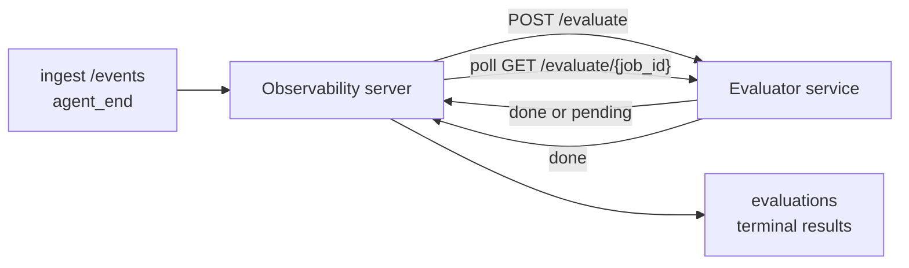

Failproof AI Observability, tamamlanan her agent çalışmasını otomatik olarak kalite için puanlandırabilir: küçük bir puanlama hizmeti sağlarsınız, Observability geri kalanını halleder. Önem verdiğiniz boyutları izlemek için kullanın (yardımcılık, araç verimliliği, gerçeklik, güvenlik; siz seçersiniz), gerilmeleri erkenden yakalayın ve ajanları ya da ortamları bir bakışta karşılaştırın. Puanlama isteğe bağlıdır: sunucu üzerinde `EVALUATOR_ENDPOINT` ayarlanana kadar işlem hattı hiçbir şey yapmaz.

> **Not:** Puan boyutlarını siz tanımlarsınız. Değerlendiricininiz istediği herhangi bir sayısal anahtarı döndürebilir; Observability geri gönderdiğiniz her şeyi depolar, eğilim gösterir ve görüntüler.

## Bir bakışta

1. **Bir puanlayıcı yazın.** Oturum transkriptini okuyan ve puanlar döndüren küçük bir HTTP hizmeti kurun. Observability, kopyalayabileceğiniz çalışan bir referans seviyesinde gönderilir. Bkz. [SDK ile değerlendiriciler yazma](#sdk-ile-değerlendiriciler-yazma).
2. **Observability'yi buna yönlendirin.** Sunucu işleminde `EVALUATOR_ENDPOINT` (ve paylaşılan `EVALUATOR_TOKEN`) ayarlayın.
3. **Puanların gelmesini izleyin.** Her tamamlanan oturum otomatik olarak puanlandırılır; sonuçlar oturum detay sayfasında, oturumlar ızgarasında ve kaydedilen panolarda görünür.


*Bir değerlendiricinin yapılandırılmasından sonra, tamamlanan her çalışma puanlandırılır ve sonuçlar oturumun sağ panelinde görünür: üstte özet, ardından boyut başına puan çubukları ve akıl yürütme.*

---

## Nasıl çalışır



Observability SDK bir oturum için `agent_end` olayı yayınladığında, sunucu bir değerlendirme planlar. Ardından tam olay transkriptini değerlendiricinin hizmetine POST eder, bu da şunlardan birini yapabilir:

- **Sonucu satır içinde döndür** `{"status":"done", "scores":{...}, "reasoning":{...}, "summary":"..."}` ile. Sonuç oturumun değerlendirme zaman çizelgesine eklenir. `reasoning` ve `summary` isteğe bağlıdır.
- **Ertele** `{"status":"pending", "job_id":"abc-123"}` ile. Observability daha sonra `GET {EVALUATOR_ENDPOINT}/evaluate/abc-123` öğesini çağırır; değerlendiricinin `{"status":"done", ...}` veya `{"status":"error", "error":"..."}` döndürüne kadar devam eder.

  Yoklama hızı iş başına yapılır: bir `pending` yanıtı `next_poll_secs` içerebilir; aksi takdirde Observability `GET /config` adresinden `default_poll_interval_secs` değerini kullanır; aksi takdirde sunucu `EVALUATOR_POLLING_INTERVAL_SECS` öğesine döner (varsayılan 10 saniye). Tüm değerler [1 saniye, 1 saat] olarak sınırlandırılır.

`agent_end` yayınlamayan oturumlar (örneğin, çökmüş bir agent işlemi) da alınabilir: değerlendiricinin `GET /config` öğesi `{"inactivity_timeout_secs": 1800}` döndürebilir ve Observability o kadar uzun süre boş kalmış herhangi bir oturumu değerlendirir. Bu geri dönüşü devre dışı bırakmak için alanı `null` olarak ayarlayın veya atlayın.

`EVALUATOR_ENDPOINT` ayarlanmadığında işlem hattı tamamen işlemsizdir.

Bir oturum zaman içinde **birden fazla terminal değerlendirme** biriktirebilir: her `agent_end` olayı (ve panodan her manuel yeniden değerlendirme) yeni bir değerlendirme satırı ekler. Bu, devam ettirilen bir konuşmayı değerlendirmenin desteklenen yoludur: bir kullanıcı bir agent'i sonlandırır, daha sonra geri döner, daha fazla olay gönderir, agent'i tekrar sonlandırır ve ikinci bir değerlendirme tam güncellenmiş transkript üzerinde çalışır. Pano en son değerlendirmeyi başlık olarak ve önceki değerlendirmeleri daraltılabilir zaman çizelgesi olarak gösterir. Bir oturum için bir değerlendirme çalışırken, o oturum için ek `agent_end` olayları yoksayılır; çalışan değerlendirme tamamlandıktan sonraki sonraki olay olağan şekilde yeni bir değerlendirmeyi kuyruğa alır.

Hareketsizlik geri dönüşü de devam ettirilen oturumlarda yeniden etkinleşir: yeni olaylar önceki bir terminal değerlendirmesinden sonra gelebilir ve oturum daha sonra `inactivity_timeout_secs` geçen boş kalırsa, yeni bir değerlendirme kuyruğa alınır.

Geçici hatalar (5xx, 429, zaman aşımları, ağ hataları) `EVALUATOR_MAX_ATTEMPTS` öğesine üstel geri alma ile yeniden denenebilir; 4xx yanıtları terminaldir. Observability, birden fazla yatay ölçekli sunucu örneğiyle çalıştırılması güvenlidir; iş bölümlenir, böylece aynı oturum hiçbir zaman eşzamanlı olarak iki kez gönderilmez.

---

## HTTP sözleşmesi

Kimlik doğrulaması yapılan her rota **taşıyıcı token auth** kullanır. Aynı değer her iki tarafta da yapılandırılmalıdır:

- Observability sunucusu: ortam değişkeni `EVALUATOR_TOKEN`
- Değerlendiricinin hizmeti: aynı şekilde yapılandırılmış (SDK `agenteye-evaluator` kural olarak `EVALUATOR_TOKEN` öğesini okur)

`EVALUATOR_TOKEN` ayarlanmadıysa, sunucu `Authorization` başlığı göndermez; değerlendiricinin daha sonra anonim istekleri kabul etmesi mümkündür; bu, yalnızca dahili ağ için iyidir ancak genel internette önerilmez.

### Değerlendiricinin hizmet vermesi gereken rotalar

| Rota | Gövde / parametreler | Yanıt |
|---|---|---|
| `GET /health` | hiçbiri | `{"status":"ok"}` (açık, kimlik doğrulaması yok) |
| `GET /config` | hiçbiri | `{"inactivity_timeout_secs": <int> \| null, "default_poll_interval_secs": <int> \| omitted}` |
| `POST /evaluate` | `EvalRequest` JSON | `{"status":"done", ...}` veya `{"status":"pending", "job_id":"..."}` |
| `GET /evaluate/{id}` | hiçbiri | `/evaluate` ile aynı yanıt şekli |

### Sunucu tarafından gönderilen `EvalRequest` gövdesi

```json
{
  "schema_version": "1",
  "session_id":     "session-abc123",
  "agent_id":       "planner",
  "environment":    "production",
  "started_at":     "2026-05-10T12:00:00Z",
  "ended_at":       "2026-05-10T12:05:00Z",
  "events": [
    { "id": 1234, "ts": "...", "event_type": "agent_start", "payload": { ... } },
    ...
  ]
}
```

### Yanıt şekilleri

**Senkron (yapılmış):**

```json
{
  "status": "done",
  "scores": { "helpfulness": 0.85, "tool_efficiency": 0.6 },
  "reasoning": {
    "helpfulness": "answered the question directly with citations",
    "tool_efficiency": "called list_files three times when one would have done"
  },
  "summary": "strong answer quality, weak tool selection"
}
```

`reasoning` (bir puan başına gerekçe haritası) ve `summary` (bir genel bir paragraf anlatı) ikisi de isteğe bağlıdır. `reasoning` içindeki anahtarlar `scores` içindeki anahtarları yansıtmalıdır; pano her girişi puan çubuğunun altında satır içi olarak gösterir. Yalnızca `scores` döndüren eski değerlendiriciler değişmeden çalışmaya devam eder; `reasoning` ve `summary` basitçe null olarak okunur ve karşılık gelen UI imkanları ihmal edilir.

**Zaman uyumsuz (ertele):**

```json
{ "status": "pending", "job_id": "abc-123", "next_poll_secs": 30 }
```

`next_poll_secs` isteğe bağlıdır; atlanırsa sunucu `/config` adresinden değerlendiricinin `default_poll_interval_secs` öğesine geri döner, ardından kendi `EVALUATOR_POLLING_INTERVAL_SECS` ortam değişkenine döner.

**Terminal değerlendiricin tarafı hata:**

```json
{ "status": "error", "error": "model service unavailable" }
```

Sunucu diğer herhangi bir 2xx gövdeyi protokol hatası olarak değerlendirir ve oturum için terminal `error` kaydeder.

---

## SDK ile değerlendiriciler yazma

HTTP sözleşmesini el ile uygulamanız gerekmez. `agenteye-evaluator` Python paketi, sizin için auth, yönlendirme ve istek/yanıt şekillerini işleyen yazılı bir FastAPI sarmalayıcısı sağlar.

Failproof AI Observability ayrıca transkript şeklinden `helpfulness`, `tool_efficiency` ve `factuality` puanlandıran **çalışan bir referans değerlendiricisi** gönderir. Bunu bir başlangıç noktası olarak kopyalayın ve kendi mantığınız ile değiştirin: bir LLM yargıcısı, bir kural motoru, kalite çubuğunuza uygun her şey.

Minimum yayın değerlendiricisi:

```python
import os
from agenteye_evaluator import Evaluator, EvalRequest, EvalResponse

app = Evaluator(token=os.environ["EVALUATOR_TOKEN"])

@app.evaluator
def run(req: EvalRequest) -> EvalResponse:
    # Inspect req.events (the full session transcript) and return scores.
    tool_calls = sum(1 for e in req.events if e.event_type == "tool_use")
    return EvalResponse(
        scores={"tool_calls": float(tool_calls)},
        reasoning={"tool_calls": f"{tool_calls} tool invocations in the transcript"},
        summary="tight tool loop" if tool_calls < 5 else "agent looped on tools",
    )
```

`app` örneği herhangi bir ASGI sunucusu altında çalışır; `uvicorn module:app` onu başlatır.

Pahalı işi ertelenmesi gereken değerlendiriciler için, bunun yerine `JobPending` döndürün ve bir `@app.job_lookup` işleyicisini kaydedin; Observability sunucusu `GET /evaluate/{job_id}` öğesini yoklar; `EVALUATOR_MAX_POLL_DURATION_SECS` sınırı (varsayılan 1 saat) geçene kadar terminal durumu döndürün veya geçin.

Tam API referansı, zaman uyumsuz desen ve olay şeması `agenteye-evaluator` SDK'nın README'sinde belgelenir.

---

## Değerlendiricini çalıştırma

Değerlendiricinin **hizmetinizdir** — Failproof AI Observability varsayılan bir değerlendiricinin gönderişi değildir; kendi hizmetlerinizi çalıştırdığınız her yerde oluşturur ve çalıştırırsınız. Herhangi bir ASGI sunucusu altında çalışır (örneğin `uvicorn my_evaluator:app`); [HTTP sözleşmesinden](#http-sözleşmesi) `/health`, `/config` ve `/evaluate` rotalarını hizmet edin, ardından sunucuyu buna yönlendirin (bkz. [Sunucu yapılandırması](#sunucu-yapılandırması)).

Değerlendiriciye erişilebilir olduğunda, `GET /health` `{"status":"ok"}` döner. Bir agent end-to-end çalıştırıldıktan sonra, sunucu üzerinde `GET /evaluations` öğesi `status: "done"` ve değerlendiricinin ürettiği puanları içeren bir satır döndürür.

---

## Sunucuyu yapılandırma

Sunucu işleminde ayarlayın:

| Ortam değişkeni | Anlamı |
|---|---|
| `EVALUATOR_ENDPOINT` | Değerlendiricinin temel URL'si (`http://evaluator:9000`). Ayarlanmadı = işlem hattı devre dışı. |
| `EVALUATOR_TOKEN` | Taşıyıcı token. Değerlendiricinin hizmetinin yapılandırıldığı değer ile eşleşmelidir. |
| `EVALUATOR_WORKERS` | Sunucu örneği başına çalışan görevleri (varsayılan 2). |
| `EVALUATOR_CLAIM_BATCH` | Çalışan tikleri başına talep edilen satırlar (varsayılan 4). Yığınlar **eşzamanlı olarak** işlenir; değerlendiricinin bitiş noktasındaki etkili eşzamanlılık `EVALUATOR_WORKERS × EVALUATOR_CLAIM_BATCH` öğesidir. |
| `EVALUATOR_POLL_IDLE_SECS` | Bir çalışanın değerlendirme yapılmadığında gönderim girişimleri arasında uyuduğu süre (varsayılan 2 saniye). |
| `EVALUATOR_POLLING_INTERVAL_SECS` | `GET /evaluate/{id}` hızı için son geri dönüş, `next_poll_secs` başına yanıt ne zaman da `default_poll_interval_secs` değerlendiricinin ayarlanmadığında (varsayılan 10 saniye). |
| `EVALUATOR_REQUEST_TIMEOUT_MS` | İstek başına zaman aşımı (varsayılan 30000). |
| `EVALUATOR_MAX_ATTEMPTS` | Bu kadar geçici hatadan sonra sonuç terminal `error` olarak kaydedilir (varsayılan 5). |
| `EVALUATOR_CONFIG_REFRESH_SECS` | `GET /config` hızı (varsayılan 300). |
| `EVALUATOR_MAX_POLL_DURATION_SECS` | Oturum yoklama sırasında kalabilecek maksimum duvar saati süresi, `timeout` olarak sonlandırılmadan önce (varsayılan 3600 saniye). Değerlendiricinin sonsuza kadar `pending` döndürmesi durumuna karşı koruma sağlar. |

Otomatik puanlamayı açmak için, sunucuda hem `EVALUATOR_ENDPOINT` hem de `EVALUATOR_TOKEN` ayarlayın, ardından değişikliği almak için yeniden başlatın. `EVALUATOR_ENDPOINT` ayarlanmadıysa işlem hattı işlemsiz kalır.

Yukarıdaki ayar düğmeleri isteğe bağlıdır; yalnızca varsayılanları geçersiz kılmanız gerekiyorsa karşılık gelen ortam değişkenlerini sunucuda ayarlayın.

---

## API referansı

| Yöntem | Yol | Gerekli izin | Amaç |
|---|---|---|---|
| `GET` | `/evaluations` | `evaluations:read` | Terminal sonuçlarını sorgula. `session_id`, `agent_id`, `environment`, `status` (`done`/`error`/`timeout`), `ts_from`, `ts_to`, `cursor`, `limit`, `score_filters`, `latest_per_session` öğesini destekler. `limit` varsayılan olarak 50 ve 200 ile sınırlıdır (bunu not edin; bu `/events` öğesinden farklıdır, bu da 1000 ile sınırlıdır). `environment` virgülle ayrılmış bir liste kabul eder (örneğin, `environment=prod,staging`); tek değerler yine de çalışır. `latest_per_session=true` ile yanıt `session_id` başına en fazla bir satır içerir (`completed_at` tarafından en son), oturum listesi sayfası tarafından oturumun değerlendirme zaman çizelgesinin mevcut başlığına daraltılması için kullanılır. Varsayılan olarak yanlış (tam geçmişi döndürür). |
| `GET` | `/evaluations/aggregate` | `evaluations:read` | Filtrelenmiş bir dilim üzerinde toplanmış değerlendirme sağlığı: toplam sayı, bir yapılmış/hata/zaman aşımı dökümü, puan başına anahtarlar istatistikleri (sayı/ort/dak/maks/p50 keyfi `scores` anahtarları üzerinde) ve zaman kovalanmış zaman çizelgesi. `/evaluations` ile **aynı filtre parametrelerine** artı `featured_keys` (eğilim göstermek için puan anahtarlarının CSV) ve `latest_per_session` öğesini kabul eder. Panoları özelliğini güçlendirir; metrikler, örnek alınmayan tüm eşleşen küme üzerinde kesindir. |
| `GET` | `/evaluations/environments` | `evaluations:read` | `evaluations` tablosundan farklı ortam değerleri. Filtre açılır listelerini değerlendirmeye okunan verilerle kapsamlı olarak doldurmak için kullanılır. |
| `GET` | `/evaluation-jobs` | `evaluations:read` | Uçuş halindeki değerlendirmelerin görünürlüğü. `status` (`pending`/`polling`) öğesine göre filtrele. |
| `GET` | `/events` | `events:read` | Oturumun ham olaylarını akışa geçirin. `session_id`, `agent_id`, `event_type` (CSV), `environment` (CSV), `ts_from`, `ts_to`, `cursor`, `limit` ve `order` öğesini destekler. `order` `desc` (en yeni birinci, varsayılan) veya `asc` (en eski birinci); tanınmayan bir değer `desc` öğesine geri döner. Yanıtın `next_cursor` (olay kimliği) aracılığıyla sayfa imleği aracılığıyla sayfa: sonraki sayfa almak için `cursor` olarak geri geçir; `asc` ile sonraki sayfa bu kimlikten sonraki olaylar olur; `desc` ile bu kimlikten önceki olaylar olur. `limit` varsayılan olarak 50 ve 1000 ile sınırlıdır. |
| `GET` | `/sessions/:session_id/export` | `events:read` | Değerlendiricinin bu oturum için alacağı tam JSON gövdesini döndür; `session-<id>.json` adlı indirebilir ek olarak sunulur. Çevrimdışı test için üretim oturumlarını `agenteye-evaluator` aracılığıyla yeniden oynatma işlemi için yararlıdır. Baytlar, değerlendiricinin işlem hattının gönderdiği şeyle byte-özdeş olur. |
| `POST` | `/sessions/:session_id/re-evaluate` | `evaluations:trigger` | Oturum için yeni bir değerlendirme kuyruğa alın; önceki bir değerlendirmenin var olup olmadığı fark etmeksizin çalışır. Yeni sonuç, önceki değerlendirmenin üzerine yazılmak yerine oturumun değerlendirme zaman çizelgesine **eklenir**, bu nedenle önceki puanlar geçmiş olarak görünür kalır. Kuyruğa ekleme sırasında `202` döner, bilinmeyen oturum için `404`, bir değerlendirme zaten uçuş halindeyse `409`. Yeni bir değerlendiricinin dağıtılmasından sonra ya da `agent_end` yayınlamayan oturumlar için kullanın. |

### Puan aralığına göre filtreleme: `score_filters`

`GET /evaluations`, `scores` nesnesinin içindeki sayısal değerlere göre sonuçları daraltmak için isteğe bağlı bir `score_filters` parametresi kabul eder. Parametresi, virgülle ayrılmış bir `key:min..max` girişleri listesidir; bir bağlama atlanabilir. Birden fazla girişler mantıksal AND ile birleşir. Adlandırılmış anahtarın bulunmadığı veya sayısal olmayan satırlar hariç tutulur. Bir istek en fazla 20 filtre girişi taşıyabilir; aşarsa HTTP 400 döner.

Örnekler:
```text
# helpfulness in [0.5, 0.8]
GET /evaluations?score_filters=helpfulness:0.5..0.8

# tool_efficiency at most 0.3 (no lower bound)
GET /evaluations?score_filters=tool_efficiency:..0.3

# helpfulness >= 0.5 AND factuality >= 0.9
GET /evaluations?score_filters=helpfulness:0.5..,factuality:0.9..
```

Her `/evaluations` yanıt nesnesi bu alanlara sahiptir:

| Alan | Tür | Notlar |
|---|---|---|
| `evaluation_id` | string (UUID) | Bu terminal değerlendirmesinin kanonik tanımlayıcısı. Her terminal değerlendirme yeni bir UUID alır; bir oturum birden fazla tutabilir. |
| `id` | string (UUID) | `evaluation_id` ile aynı değeri taşıyan geriye dönük uyumluluk diğer adı. |
| `session_id` | string | Bu değerlendirmenin karşı çalıştırıldığı oturum. Bir oturum zaman çizelgede birden fazla değerlendirmeye sahip olabilir. |
| `agent_id` | string | Oturumu üreten ajanı tanımlar. |
| `environment` | string | Oturumdan kopyalanan ortam etiketi. |
| `status` | enum | `"done"`, `"error"`, `"timeout"` öğesinden biri. |
| `scores` | object \| null | Değerlendiricinin döndürdüğü puanlar. |
| `reasoning` | object \| null | Değerlendiricinin döndürdüğü isteğe bağlı puan başına gerekçe haritası. Anahtarlar tipik olarak `scores` içindekiler ile yansıtılır. Pano her girişi puan çubuğunun altında gösterir. |
| `summary` | string \| null | Değerlendiricinin döndürdüğü isteğe bağlı bir paragraf genel anlatı. Pano bunu puan başına dökümün üzerinde değerlendirmenin başlığı olarak gösterir. |
| `error` | string \| null | Yalnızca `"error"` / `"timeout"` üzerinde doldurulur. |
| `attempt_count` | integer | Gönderim denemeleri sayısı (≥ 1). |
| `duration_ms` | integer \| null | Son denemesinin süresi. |
| `completed_at` | string (ISO 8601 UTC) | Terminal sonucun kaydedildiğinde. Sonuçlar `completed_at` (en yeni ilk) tarafından sıralanır. |
| `created_at` | string (ISO 8601 UTC) | `completed_at` ile aynı zaman damgasını taşır (bir kez yazma semantiği). |

---

## İzinler

| İzin | Verir |
|---|---|
| `evaluations:read` | Değerlendirme sonuçlarını listele, panodaki puanları görüntüle ve pano sağlık metriklerini yükle. |
| `evaluations:trigger` | `POST /sessions/:session_id/re-evaluate` aracılığıyla veya panonun yeniden değerlendirme düğmesi aracılığıyla oturum için manuel olarak değerlendirme kuyruğa alın. |
| `dashboards:read` | Kaydedilen panoları görüntüle (metriklerini yüklemek için `evaluations:read` de gerekir). |
| `dashboards:write` | Panoları oluştur ve düzenle. |
| `dashboards:delete` | Panoları sil. |

Bootstrap yöneticisi (`ADMIN_KEY`, `ADMIN_EMAIL`) bunların tamamını otomatik olarak alır.

---

## Sonuçları görüntüleme

- **`/sessions/<id>`**: olaylar zaman çizelgesi + oturumun puanlarını ve gönderim denemesinden herhangi bir hatayı gösteren sağ panel. Anahtarınız `evaluations:trigger` öğesine sahipse, dışa aktarma düğmesinin yanında bir **yeniden değerlendirme** düğmesi görünür; `agent_end` yayınlamayan oturumlar veya yeni bir değerlendiricinin dağıtılmasından sonra puanları yenileme için yararlıdır. Pano yeni sonucu yoklar ve sağ panel iner inde güncelleştirir.
- **`/sessions`**: filtrelenebilir oturum ızgarası; puan sütunu her oturumun değerlendirme durumunu ve puanlarını bir bakışta gösterir.
- **`/dashboards`**: kaydedilen değerlendirme sağlığı görünümleri (aşağıdaki [Panolara](#panolar) bakın).


*Oturum ızgarası her çalışmanın değerlendirme durumunu ve puanlarını bir bakışta gösterir; kırmızı/kehribar/yeşil rozetler düşük puanlar çıkarır.*

---

## Panolar

**Panolar** sayfası (`/dashboards`) değerlendirme filtrelerinin bir kombinasyonunu adlandırılmış, yeniden kullanılabilir bir görünüm olarak kaydetmenize ve o değerlendirmelerin diliminin durumunu bir bakışta izlemenize olanak tanır. Panolar **tüm kuruluşunuz arasında paylaşılır**; `dashboards:read` öğesine sahip herkes aynı seti görür.

Her pano sabitler:

- **Filtreler**: oturumlar sayfası ile aynı denetimler: ortam, durum, ajan, kaydırma yapan zaman penceresi ve puan aralığı filtreleri (`key:min..max`).
- **Görüntü yapılandırması**: öne çıkması gereken puan anahtarları, yeşil/kehribar/kırmızı sağlık eşikleri, gösterilecek paneller ve oturum başına son değerlendirmeye daraltmak olup olmadığı.

Her kart eşleşen oturum sayısını, bir yapılmış/hata/zaman aşımı dökümü, her öne çıkması gereken puanın ortalamasını ve küçük bir eğilim kıvılcımı gösterir. Bir pano açmak tam boyutlu panelleri gösterir; **"oturumlarda aç"** sizi tam olarak bu dilimle önceden filtrelenmiş oturum sayfasına bırakır. Metrikler sunucu tarafından tüm eşleşen küme üzerinde hesaplanır (`GET /evaluations/aggregate` aracılığıyla), bu nedenle sayılar örnek alınmayan yerine kesindir.


**İzinler:** görüntüleme hem `dashboards:read` hem de `evaluations:read` gerektirir; oluşturma ve düzenleme `dashboards:write` gerektirir; silme `dashboards:delete` gerektirir. Bootstrap yöneticisi bunların tamamını otomatik olarak alır.

---

## Sorun giderme

**Oturumlar vardır ancak değerlendirmeler oluşturulmaz.** `EVALUATOR_ENDPOINT` öğesinin sunucu işleminde ayarlandığını, sunucu ve değerlendiricinin aynı `EVALUATOR_TOKEN` değerini paylaştığını ve değerlendiricinin `/health` bitiş noktasına sunucudan erişilebildiğini doğrulayın. `EVALUATOR_ENDPOINT` ayarlanmadıysa işlem hattı bir işlemsizdir.

**Uçuş halindeki değerlendirmeler birikir.** `GET /evaluation-jobs` öğesini sorgulayarak uçuş halindeki kuyruğu görün. Her satırda `attempt_count`, `next_attempt_at` ve `last_error` öğesini inceleyin. Yaygın nedenler: değerlendiricinin hizmeti ulaşılamaz veya 5xx döndürüyor (geri alma ile yeniden deneniyor), yanlış `EVALUATOR_TOKEN` (401 terminaldir) veya sonsuza kadar `pending` döndüren zaman uyumsuz bir değerlendiricı (aşağıya bakın).

**Oturumlar tamamlandı ancak terminal değerlendirme yok.** `GET /evaluation-jobs?status=polling` öğesini sorgula; sonuç hala uçuş halinde olabilir. Bir iş `pending` içinde sıkışırsa, sunucu değerlendiriciye ulaşmakta sorun yaşıyor; değerlendiricinin aktif olup olmadığını ve `EVALUATOR_TOKEN` eşleşip eşleşmediğini kontrol edin.

**`HTTP 401 from evaluator: invalid bearer token`.** Sunucudaki `EVALUATOR_TOKEN` değerlendiricinin hizmetinin yapılandırıldığı değer ile eşleşmez. Aynı olmalıdır.

**Zaman uyumsuz değerlendiricinin sonsuza kadar `pending` dönmesi.** Sunucu `GET /evaluate/{job_id}` öğesini yoklar; değerlendiricinin `done` veya `error` dönmesine veya `EVALUATOR_MAX_POLL_DURATION_SECS` (varsayılan 1 saat) geçene kadar. Sınırndan sonra değerlendirme `timeout` olarak kaydedilir ve uçuş halindeki kuyruktan kaldırılır. Değerlendiricinin yasal olarak varsayılan değerden daha uzun süreye ihtiyacı varsa `EVALUATOR_MAX_POLL_DURATION_SECS` öğesini yükseltin.

---

## Sonraki adımlar

- [Değerlendiricinin ajanı becerisi](/tr/agenteye/evaluator-skill): boyutlarınızı tasarlamak için gerçek oturumlara karşı kodlama ajanının bu hizmeti oluşturmasını sağlayın.
- [Python SDK](/tr/agenteye/python-sdk): puanlamayı tetikleyen `agent_end` olaylarını yayınla.
- [API anahtarları](/tr/agenteye/api-keys): `evaluations:read` ve `evaluations:trigger` izinleri.
- [Denetimler](/tr/agenteye/audits): Observability'nin diğer otomatik kalite özelliği, politika tabanlı inceleme için.