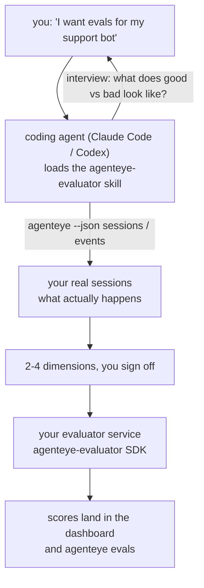

*"Ajanımız bazen kötü çalışıyor sanırım"* durumundan dağıtılmış bir puanlama hizmetine geçin; kodlama ajanınız hem kararı hem de yapılandırmayı gerçekleştirir. **Failproof AI Observability evaluator skill** (`agenteye-evaluator`) bir *Agent Skill*'tir: kodlama ajanı olan Claude Code veya Codex gibi araçların talep üzerine yüklediği küçük bir klasör. Ajanı, *sizin* ajanınız için izlenmeye değer olan kalite boyutlarını belirlemek, ardından [evaluator hizmetini](/tr/agenteye/evaluation-suite) yazıp, test edip ve dağıtmak için öğretir.

Bu, barındırılan bir puanlayıcı, yükleyeceğiniz bir kayıt defteri veya eklenti sistemi **değildir**. Evaluator'ünüz, [Evaluation suite](/tr/agenteye/evaluation-suite) kılavuzunda tam olarak açıklandığı gibi, kendi altyapınızda kendi HTTP hizmetiniz olarak kalır. Skill, ajanınızın bunu iyi yapması için onu öğretir; dolayısıyla yaptığı her şey, aynı kodu yazarak siz de yapabilirsiniz.

---

## Zor kısım neyi puanlamak istediğine karar vermek

SDK yüzeyi küçüktür — bir dekoratör ve iki model — ve ajan bunu sadece [sözleşmeden](/tr/agenteye/evaluation-suite#http-contract) yazabilir. Evaluator'ler burada başarısız olmaz. Yanlış şeyi puanladıkları için başarısız olurlar; yanlış şeyi puanlayan bir evaluator hiç olmamasından daha kötüdür: herkesin görmezden gelmeyi öğrendiği bir dashboard üretir.

Dolayısıyla skill'in çoğunluğu, herhangi bir kod var olmadan önceki kısımdır. Ajan size sorular sorar (*"iyi giden bir çalışmayı tanımla; şimdi kötü giden birini"*), ardından [`agenteye` CLI](/tr/agenteye/cli) üzerinden gerçek oturumlarınızı çeker ve baştan sona okur. Bu iki yarı genellikle uyuşmaz ve boşluk önemlidir: ölçmek istediğiniz şey ile transkriptlerinizin aslında destekleyebileceği şey. Bir boyut, yalnızca olaylardan **hesaplanabilirse** ve **ayırt edici** ise hayatta kalır — eğer hem iyi çalışmanızda hem de kötü çalışmanızda 0,9 puan alırsa, hiçbir şey öğretmez ve silinir.

Geri gelen şey, herhangi bir satır yazılmadan önce sizin onay vermeniz için gerekçesi eklenmiş 2-4 boyutluk bir tekliftir.



---

## Diğer değerlendirme parçalarıyla ilişkisi

Dört doküman puanlamayı kapsar ve birbiri ardına iletilir:

| Sayfa | Ne olduğu | Şu durumda kullanın |
|---|---|---|
| **[Evaluations](/tr/agenteye/evaluations)** | Özellik: oturumlar ızgarasında puanlar, panolar, yeniden değerlendirme | Otomatik puanlamanın size ne getireceğini bilmek istediğinizde |
| **[Evaluation suite](/tr/agenteye/evaluation-suite)** | HTTP sözleşmesi, SDK, sunucu ortam değişkenleri | Evaluator'ü kendiniz uygularken veya hata ayıklarken |
| **Evaluator skill** (bu doküman) | Puanlayıcıyı tasarlamak *ve* yazmak için doğal dil ön kapısı | "Evals istiyorum" noktasından çalışan bir hizmete geçmek istediğinizde |
| **[CLI skill](/tr/agenteye/cli-skill)** | `agenteye` CLI'ında doğal dil ön kapısı | Zaten sahip olduğunuz puanları *okumak* istediğinizde |
| **[Python SDK skill](/tr/agenteye/python-sdk-skill)** | Ajanınızı enstrüman etmek için doğal dil ön kapısı | Ajanınız henüz oturumlar yayınlamıyor — puanlanacak bir şey yok |

### CLI skill'e karşı: yapı versus okuma

İki skill bilinçli olarak çakışmaz ve her ikisini yüklemek normal kurulumudur — ajan ne istediğinize göre aralarında seçim yapar:

- **`agenteye-evaluator`** (bu doküman) puanları *üretecek* şeyi yapar. Puanlar ilk kez geldikçe işi biter.
- **[`agenteye-cli`](/tr/agenteye/cli-skill)** zaten var olan puanları okur (`agenteye evals`). "Bu hafta kalite düştü mü?" onun sorusudur, bu skill'in değil.

---

## Ön koşullar

1. **`agenteye` CLI yüklü ve oturum açmış** (`pipx install agenteye`, ardından `agenteye login`). Skill bunu iki kez kullanır: tasarladığı gerçek oturumları çekmek için ve sonunda puanlarınızın geldiğini doğrulamak için. Login'inizin `events:read` ve son kontrol için `evaluations:read` izni olması gerekir. CLI skill'te olduğu gibi, size gönderilen tek seferlik kod login'ini tamamlayamaz.
2. **Evaluator'ün yaşayabileceği bir yer.** Bir imaja yerleştirilir ve uzun süreli bir hizmet olarak çalışır, bu nedenle gerçek bir repo'ya ihtiyaç vardır, geçici dosya değil. Evaluator'ler sık sık kendi repo'larında, puanlanan ajanın ayrı olarak yer alırlar — skill var olan birini arar ve yeni bir tane oluşturmadan önce sorar.
3. **`agenteye-evaluator` SDK wheel** — ajanınız `pip` komutları yazmaya başlamadan önce sonraki bölümü okuyun.

---

## Nereden bulacaksınız

Skill, Failproof AI'ın genel skills koleksiyonunda yayınlanmıştır:

**[github.com/FailproofAI/skills](https://github.com/FailproofAI/skills)** → [`skills/agenteye-evaluator/`](https://github.com/FailproofAI/skills/tree/main/skills/agenteye-evaluator)

Depo herkese açıktır ve skill'in kendisine ait bir kimlik bilgisine ihtiyacı yoktur — sadece `agenteye` CLI'yı *sizin* oturum açtığınız oturumla çalıştırır ve *sizin* repo'nuzda kod yazar. Kendi klasörü olarak gönderildiğini ve `pipx install agenteye` paketinin içinde **olmadığını** unutmayın; bu nedenle orada aramayın.

## Skill'i yükleme

En hızlı yol [`skills`](https://skills.sh) CLI'ıdır; bu klasörü alır ve ajanınızın baktığı yere koyar:

```bash
# Claude Code, sadece bu proje
npx skills add FailproofAI/skills --skill agenteye-evaluator -a claude-code

# her proje (~/.claude/skills/ içine yükler)
npx skills add FailproofAI/skills --skill agenteye-evaluator -a claude-code -g --copy

# Codex yerine
npx skills add FailproofAI/skills --skill agenteye-evaluator -a codex
```

Diğer herhangi bir skill gibi yönetin:

```bash
npx skills list -a claude-code           # ne yüklü
npx skills update agenteye-evaluator     # en yeni sürümü çek
npx skills remove agenteye-evaluator     # kaldır
```

Elle yüklemeyi tercih ediyor musunuz? Agent Skill sadece `SKILL.md` (artı isteğe bağlı referanslar) içeren bir klasördür, bu nedenle kopyalamak da çalışır:

- **Claude Code**: `agenteye-evaluator/` klasörünü `~/.claude/skills/` (her proje) veya `<your-repo>/.claude/skills/` (sadece o repo) içine koyun. Claude Code otomatik olarak keşfeder — `/skills` listesiyle doğrulayın veya sadece evals isteyin.
- **Codex (OpenAI)**: Codex aynı `SKILL.md`'yi okur. Paket içindeki `agents/openai.yaml`, `allow_implicit_invocation: true` olarak ayarlar; bu nedenle görev eşleştiğinde Codex otomatik olarak skill'i seçer; aksi takdirde `$agenteye-evaluator` olarak açıkça çağırın.

---

## SDK genel PyPI'da değil

> **Uyarı:** Ajan'ın SDK'yı yüklemesine izin vermeden önce bunu okuyun.

Skill herkese açıktır; onu çalıştırması SDK değildir. `agenteye-evaluator` sadece özel bir sürüm yapıtı olarak gönderilir ve `agenteye` aksine, ad genel PyPI'da **talep edilmemiş** — bu nedenle bare `pip install agenteye-evaluator` üretim transkriptlerinizi okuyan hizmete bir yabancının paketini çekebilir. Bu yazım hatası değil, bir tedarik zinciri sorunudur.

Skill bunu bilir ve bunun yerine bir yükleme merdivenine göre iner, ilk geçerli basamakta durur: AgentEye repo'sunun içindeyseniz monorepo kaynağı, aksi takdirde GitHub Releases'den (erişim gerekir) özel sürüm wheel'i ve ne biri ne diğeri ulaşılamıyorsa, bare PyPI'dan `agenteye-evaluator` yazmak yerine **durur ve Failproof AI iletişim kişinizden wheel istemenizi söyler**.

Eğer ajanınız genel PyPI'dan bare `pip install agenteye-evaluator` önerirse, bu skill'in hiç yüklenmediğinin işaretidir. Orada durun ve yüklü olup olmadığını kontrol edin.

---

## Ne isteyebilirsiniz

Gerçek bir gidiş-dönüş, belirsiz bir istekle başlar ve kodla değil, imzalı bir tasarımla biter:

```text
you   ▸ I want evals for our support bot. I think it's sometimes bad.

agent ▸ Before I write anything: describe a run that went well,
        and one that went badly.

you   ▸ Good: it answers from the docs. Bad: it makes stuff up,
        or gives up and says "contact support".

agent ▸ Running: agenteye --json sessions --status error --since 7d
        Reading 5 sessions, including two you'd call bad.

        Your words say factuality and deflection. The transcripts
        agree on deflection (2 of 5 end with a support hand-off,
        and it's plain in model_response.content), but factuality
        needs a ground truth your events don't carry.

        So I'd score three things:
          - deflection      rules, cheap, separates your two runs
          - tool_efficiency rules, catches the retry loop in run-004
          - groundedness    LLM judge: is every claim in the docs it retrieved?

        "factuality" would need ground truth we don't have; groundedness
        is the closest thing your transcripts can actually support.
        OK with those three names? Renaming later splits the history.

you   ▸ yes

agent ▸ No evaluator in this repo. Should I scaffold one here, or do
        you have one elsewhere?
```

Oradan, kural tabanlı boyutları ilk yazmasını yapar (ücretsiz, anında, belirleyici), gerçek yakalanan oturuma karşı test eder (bunu çöken ayak izleri ve asla bitmeyenleri içeren), ve yalnızca öznel boyut üzerinde LLM hakim'e ulaşır. [Dispatcher'ın limitlerini](/tr/agenteye/evaluation-suite#configuring-the-server) bilir — 30s istek zaman aşımı ve dağıtım genelinde 8 eşzamanlı çağrı — eğer hakim güvenilir bir şekilde uymazsa, beş kez beş kez maliyete göre iptal edilip yeniden denenmek yerine `JobPending` ile eşzamansız gider.

Sonra dağıtır, iki sunucu ortam değişkenini ayarlar ve `agenteye --json evals --session-id <id>` ile puanların aslında geldiğini doğrular. Puanları gelmesi tek kanıttır.

---

## Neleri izlemeli

- **Boyut adları neredeyse kalıcıdır.** Puan anahtarları keyfi dizelerdir ve platform ne gönderirseniz trendi belirler; bu, hiçbir şeyin aşağı akışta hatalı seçimi düzeltmeyeceği anlamına gelir. Sonra yeniden adlandırın ve tarih bölünür: eski oturumlar eski anahtarı tutar ve trend kırılır. Bu, skill'in kod yazmadan önce açık onay almasının nedenidir — bu soruya ciddiyetle yaklaşın.
- **Fixture'lar gerçek üretim transkriptleridir.** Gerçek oturumları tasarlamak onları diske çekmek anlamına gelir ve müşteri verisi içerebilirler. Skill commit etmeden önce sorar; şüphe durumunda `fixtures/`'ı repo'dan uzak tutun ve her geliştirici kendi oturumunu çeksin.
- **Ajan, her transkripti okuyan bir hizmet yazar ve dağıtır.** Sizin CLI login'iniz tarafından sınırlanan sizin adınıza hareket eder, ama evaluator'ü, üretim verilerine dokunan diğer herhangi bir kod gibi inceleyin.

---

## Sonraki adımlar

- **[Evaluation suite](/tr/agenteye/evaluation-suite)**: HTTP sözleşmesi, SDK ve skill'in yapılandırdığı sunucu ortam değişkenleri.
- **[Evaluations](/tr/agenteye/evaluations)**: puanlar geldikçe nereye görünürler.
- **[CLI skill](/tr/agenteye/cli-skill)**: puanlayıcıyı yazmak yerine sonuçları okuyan kardeş skill.
- **[CLI](/tr/agenteye/cli)**: skill'in tasarladığı oturum verilerinin arkasındaki komut referansı.