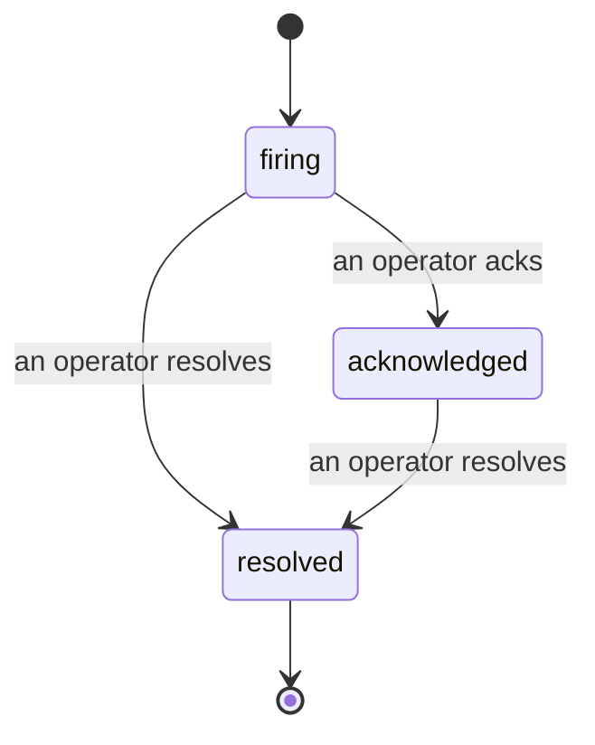

Bir uyarı tetiklendiğinde, ilk soru her zaman "kim bununla ilgileniyor?" Olaylar buna cevap verir: bir şey ihlal ettiği anda, herkes olayın açık olduğunu, kimin sorumlu olduğunu ve tam olarak ne olduğunu görebilir; temiz, atfedilen bir kaydınız vardır ve bunu doğrudan bir post-mortem'e iletebilirsiniz.

*Gelen kutusu açık olayları duruma göre gruplandırır ve önem ve atanan kişiye göre filtreler, böylece şu anda insanî müdahaleye ihtiyaç duyan şeyleri görürsünüz.*

## Kim bununla ilgileniyor, bir bakışta bilin

Artık bir sohbet dizisinde "birisi buna bakıyor mu?" diye sormayın. Bir ihlal otomatik olarak bir olay açar ve onu paylaşılan gelen kutusuna bırakır, duruma göre gruplandırılmış. Bunu kabul edin ve adınız üzerine yazılır, böylece takımın geri kalanı bunun halledildiğini bilir. Onay paylaşılır: birkaç operatör aynı olayı onaylayabilir ve her biri kendi başına kaydedilir, böylece tam bir savaş odası adlarla görünür, birbirlerinin üzerine basmaz. Triaj için bir sahip atayın ve gelen kutuyu önem veya atanan kişiye göre filtreleyerek sadeceye dönüştürün.

## Bütün hikaye, bir zaman çizelgesinde

Olay bittiğinde, zaten yazıyı hazırlayıp bitirmişsinizdir. Herhangi bir olayı açın ve ihlal kanıtını, atananlarını ve abone olanlarını, koordinasyon için bir yorum dizisini ve ekle-yalnızca bir etkinlik zaman çizelgesini görürsünüz.

*Her şey olduğu gibi, sırasıyla, her satır onu yapan kişi tarafından imzalanmış.*

Her eylem (açıldı, kabul edildi, çözüldü vb.) o zaman çizelgesine yazılır ve asla silinmez. Her giriş atfedilir: onu yapan operatöre, e-posta yoluyla veya oluşturduğu her şey için Failproof AI Observability tarafından, olay ihlale göre açıldı. Hiçbir şey anonim değildir ve hiçbir şey kaybolmaz, bu nedenle post-mortem kendisi yazılmaktadır.

## Bir olay nasıl ilerler

- **Açık (tetikleniyor):** ihlal olayı açar ve kanallarınız bir kez sayfalanır. Tekrarlanan ihlaller aynı olaya katlanır ve kanıtını yeniler, bunun yerine sizi tekrar tekrar sayfalamaz.
- **Kabul edildi:** bir operatör alır. Açık kalır ve daha sonraki ihlaller kanıtı sessizce güncelleştirir.
- **Çözüldü:** bir operatör kapatır. Durum temizlendiğinde otomatik çözüm planlanmıştır, ancak henüz etkinleştirilmemiştir, bu nedenle bir olay bir insan bunu çözene kadar açık kalır ve bu herkesin gerçekte neyin temizlendiği hakkında dürüst olmasını sağlar. Aynı uyarı üzerinde daha sonra yeni bir olay açılabilir.

Bir uyarı aynı anda en fazla bir açık olayı tutar, bu nedenle flaplanan bir kural sizi tekrarlarla boğamaz. Ayrıca bir olayı el ile açabilirsiniz: hiçbir uyarının yakalamadığı bir şey için bağımsız olan veya `incidents:write` izinleriniz varsa mevcut bir uyarıya bağlı olan.

## Nerede bulunur

Olaylar `/<org-slug>/incidents` konumunda bulunur. Görüntüleme **`incidents:read`** gerektirir; manuel bir olay açmak **`incidents:write`** gerektirir; onaylama, atama, yorum yapma ve çözme **`incidents:ack`** gerektirir. Emekli `alerts:ack` verilen eski anahtarlar çalışmaya devam eder, çünkü `incidents:ack` olarak onurlandırılır, bu nedenle on-call rotasyonunuzun yeniden verilmesi gerekmez.

## İlişkili

- [Uyarılar](/tr/agenteye/alerts): bir eşik ihlal edildiğinde bu olayları açan kurallar.
- [Hata izleme](/tr/agenteye/error-tracking): her hatayı bir yerde görün ve birini bir uyarıya yükseltin.
- [Denetimler](/tr/agenteye/audits): hiçbir kuralın izlemediği hataları bulan zamanlanan analist.