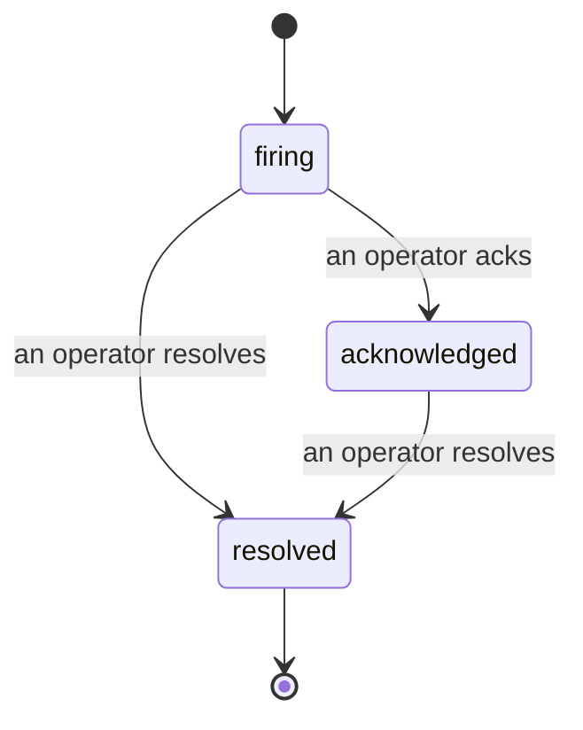

Bir uyarı tetiklendiğinde, ilk soru her zaman "bunu kim halletme işinde?" şeklindedir. Olaylar buna cevap verir: bir şey ihlal ettiği anda, herkes açık olan olayı, kimin sahip olduğunu ve şimdiye kadar tam olarak ne olduğunu görebilir. Temiz, atfedilmiş bir kayıtla hemen post-mortem'e verebilirsiniz.

*Gelen kutusu, açık olayları duruma göre gruplandırır ve ciddiyet ve atanan kişiye göre filtreler, böylece artık insan yardımına ihtiyaç duyulan şeyler görürsünüz.*

## Kimin üzerinde olduğunu bir bakışta bilin

Artık chat başlığında "biri bunu inceliyor mu?" diye sormanıza gerek yok. Bir ihlal bir olayı otomatik olarak açar ve bunu paylaşılan gelen kutusuna düşürür, duruma göre gruplandırılmış. Bunu kabul edin ve adınız üzerine yazılır, böylece ekip kalanı bunun halledildiğini bilir. Kabul paylaşılmıştır: birden fazla operatör aynı olayı onaylayabilir ve her biri kendi başına kaydedilir, böylece tam bir savaş odası adla gösterilir ve birbirinin üzerine basılmaz. Önceliklendirme için bir sahip atayın ve gelen kutuyu ciddiyet veya atanan kişiye göre filtreleyerek sadece sizin olanları görmek için azaltın.

## Tüm hikaye, bir zaman çizelgesinde

Olay bittikten sonra, yazıyı zaten hazırlayız. Herhangi bir olayı açın ve ihlal kanıtını, atanan kişilerini ve abone olanları, koordinasyon için yerinde bir yorum başlığını ve ek-only etkinlik zaman çizelgesini göreceksiniz.

*Olmuş her şey, sırayla, her satır onu yapan kişi tarafından imzalanmış.*

Her eylem (açıldı, kabul edildi, çözüldü, vb.) bu zaman çizelgesine yazılır ve asla düzenlenmez. Her giriş atfedilmiştir: bunu yapan operatöre, e-postayla veya FailproofAI Observability'nin kendi başına yaptığı herhangi bir şey için **otomatik**'e, örneğin olayı ihlalde açma gibi. Hiçbir şey anonim değildir ve hiçbir şey kaybolmaz, bu nedenle post-mortem kendini yazmaya başlar.

## Bir olay nasıl hareket eder

- **Açık (tetiklenmiş):** ihlal olayı açar ve kanallarınızı bir kez çağırır. Tekrarlanan ihlaller aynı olaya katlanır ve kanıtlarını yeniler, sizi tekrar tekrar çağırmaz.
- **Kabul edildi:** bir operatör bunu alır. Açık kalır ve sonraki ihlaller kanıtları sessizce günceller.
- **Çözüldü:** bir operatör bunu kapatır. Koşul temizlendiğinde otomatik çözüm planlanmaktadır ancak henüz etkinleştirilmemiştir, bu nedenle bir olay insan tarafından çözüle kadar açık kalır, bu herkesin gerçekten ne temizlendiği hakkında dürüst olmasını sağlar. Daha sonra aynı uyarıya bağlı olarak yeni bir olay açılabilir.

Bir uyarı aynı anda en fazla bir açık olayı barındırır, bu nedenle salınım yapan bir kural sizi yinelenenlerle gömemez. Ayrıca bir olayı manuel olarak açabilirsiniz: bir uyarının yakalamadığı bir şey için tek başına bir tane veya var olan bir uyarıya bağlı bir tane, eğer `incidents:write` varsa.

## Nerede bulunur

Olaylar `/<org-slug>/incidents` adresinde bulunur. Görüntüleme **`incidents:read`** gerektirir; manuel olay açma **`incidents:write`** gerektirir; onaylama, atama, yorum yapma ve çözme **`incidents:ack`** gerektirir. Emekli `alerts:ack` tuşu verilen eski anahtarlar çalışmaya devam eder, çünkü `incidents:ack` olarak kabul edilir, bu nedenle nöbet rotasyon yeniden verilmesi gerekmez.

## İlişkili

- [Uyarılar](/tr/agenteye/alerts): bir eşik ihlal olduğunda bu olayları açan kurallar.
- [Hata izleme](/tr/agenteye/error-tracking): her hatayı tek bir yerde görmek ve birini uyarıya yükseltmek.
- [Denetimler](/tr/agenteye/audits): hiçbir kuralın izlemediği hataları bulan planlanan analist.