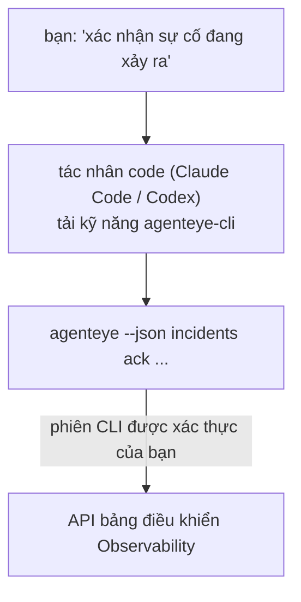

Hỏi tác nhân code của bạn *"có gì bị hỏng hôm nay không?"* và để nó trả lời từ dữ liệu FailproofAI Observability trực tiếp của bạn, mà không cần ghi nhớ bất kỳ lệnh nào. **Kỹ năng CLI FailproofAI Observability** (`agenteye-cli`) là một *Agent Skill*: một thư mục nhỏ chứa hướng dẫn mà một tác nhân code như Claude Code hoặc Codex có thể tải theo yêu cầu. Nó dạy cho tác nhân cách vận hành triển khai Observability của bạn thông qua [`agenteye` CLI](/vi/agenteye/cli) từ các yêu cầu bằng tiếng Anh đơn giản như *"cấp cho CI một khóa chỉ có thể push events"* hoặc *"xác nhận sự cố đang xảy ra và gán cho tôi."*

Nó **không phải** là một dịch vụ hay một nhị phân riêng biệt; không có gì để triển khai. Nó chạy trên CLI mà bạn đã cài đặt: tác nhân shell ra `agenteye --json …`, phân tích cú pháp JSON sạch, và trả lời bạn bằng văn bản. Mọi thứ nó có thể làm, bạn có thể tự làm bằng cách gõ những lệnh tương tự.

---

## Mối liên hệ với các giao diện FailproofAI Observability khác

FailproofAI Observability cung cấp cho bạn bốn cách để truy cập dữ liệu và điều khiển tương tự. Chúng bổ sung cho nhau:

| Giao diện | Nó là gì | Nơi nó chạy | Dùng khi |
|---|---|---|---|
| **[CLI](/vi/agenteye/cli)** | Tham chiếu lệnh/cờ cho `agenteye` | Terminal của bạn | Bạn muốn chạy hoặc viết script một lệnh cụ thể |
| **[CLI recipes](/vi/agenteye/cli-recipes)** | Mẫu `jq`/pipeline sẵn sàng copy-paste | Terminal / scripts của bạn | Bạn đang tích hợp CLI vào tự động hóa |
| **CLI skill** (tài liệu này) | Một cửa trước bằng ngôn ngữ tự nhiên trên CLI | Tác nhân code của bạn, trên máy trạm | Bạn muốn chỉ cần hỏi và để tác nhân chọn lệnh |
| **[Trợ lý AI trong bảng điều khiển](/vi/agenteye/assistant)** | Một trò chuyện nhúng trong bảng điều khiển | Phía máy chủ (trong bảng điều khiển) | Bạn muốn Q&A trong bảng điều khiển trên dữ liệu của bạn |

Kỹ năng này không có quyền riêng của nó; nó chỉ biến lời nói của bạn thành các lệnh CLI chạy dưới tư cách là bạn:



### so với trợ lý AI trong bảng điều khiển: một phân biệt quan trọng

Đây là hai công cụ khác nhau với phạm vi ảnh hưởng rất khác nhau:

- **Trợ lý AI trong bảng điều khiển** ([Trợ lý AI](/vi/agenteye/assistant)) là một trò chuyện nhúng trong bảng điều khiển, được hỗ trợ bởi dịch vụ tác nhân. Nó **chỉ đọc cộng với việc tạo được gated bởi phê duyệt**: nó có thể tạo dự thảo các truy vấn đã lưu và bảng điều khiển, nhưng mỗi lần ghi tạm dừng để chờ lần bấm phê duyệt rõ ràng của bạn, và nó không bao giờ xóa. Nó được gated bởi quyền `agent:use` và chỉ bao giờ xem dữ liệu cho tổ chức bạn đang xem.
- **Kỹ năng CLI** chạy trên *máy trạm của bạn* bên trong *tác nhân code của bạn* và điều khiển CLI `agenteye` như **bạn**. Nó có thể thực hiện **toàn bộ bề mặt CLI, bao gồm các phép biến đổi** (tạo/xoay vòng/vô hiệu hóa khóa API, thay đổi cài đặt tổ chức, giải quyết sự cố, xóa truy vấn đã lưu), chỉ bị giới hạn bởi các quyền của đăng nhập CLI của bạn. Xem xét nó chính xác như bạn sẽ xem xét khi chạy những lệnh đó bằng tay.

---

## Điều kiện tiên quyết

1. **CLI `agenteye` đã cài đặt** và trên `PATH` (xem tham chiếu [CLI](/vi/agenteye/cli): `pipx install agenteye`).
2. **URL bảng điều khiển của bạn** được đặt (`AGENTEYE_DASHBOARD_URL`, hoặc tác nhân truyền `--base-url`).
3. **Phiên đã đăng nhập**: trước tiên hãy chạy `agenteye login` yourself. Kỹ năng **không thể** hoàn thành đăng nhập mã dùng một lần được gửi qua email cho bạn; nó sẽ bảo bạn chạy `agenteye login` nếu phiên bị thiếu hoặc hết hạn (mã thoát CLI `4`).

---

## Cài đặt kỹ năng

Agent Skills là các thư mục chứa `SKILL.md` (cộng với các tham chiếu tùy chọn). Bạn cài đặt kỹ năng `agenteye-cli` bằng cách đặt thư mục của nó vào nơi tác nhân tìm kiếm kỹ năng:

- **Claude Code**: sao chép thư mục `agenteye-cli/` vào `~/.claude/skills/` (có sẵn trong mọi dự án) hoặc vào `<your-repo>/.claude/skills/` (phạm vi dự án đó). Claude Code tự động khám phá nó; xác minh bằng danh sách `/skills`, hoặc chỉ cần hỏi một câu hỏi phù hợp với mô tả của nó.
- **Codex (OpenAI)**: Codex đọc `SKILL.md` tương tự. `agents/openai.yaml` đi kèm đặt `allow_implicit_invocation: true`, vì vậy Codex tự động chọn kỹ năng khi một tác vụ phù hợp; nếu không, hãy gọi nó rõ ràng dưới dạng `$agenteye-cli`.

Kỹ năng được duy trì cùng với CLI `agenteye` nhưng được giao dưới dạng **thư mục riêng biệt**, không bên trong gói `pipx install agenteye`, vì vậy đừng tìm kiếm nó ở đó. FailproofAI Observability gửi thư mục `agenteye-cli/` cho bạn riêng; nếu bạn không có nó, hãy liên hệ với liên lạc FailproofAI của bạn. Không có gì về nó bị gated: nó không cần bất kỳ thông tin xác thực nào, vì nó chỉ điều khiển **công khai** CLI `agenteye` chống lại bảng điều khiển của riêng bạn.

---

## Bảo mật: các phép biến đổi KHÔNG nhắc khi tác nhân chạy CLI

> **Cảnh báo:** Hãy đọc điều này trước khi để tác nhân thực hiện thay đổi.

CLI `agenteye` thường hỏi *"bạn có chắc không?"* trước một hành động có tính phá hủy. Nó **tự động bỏ qua xác nhận đó bất cứ khi nào nó không được kết nối với terminal (đó chính xác là cách tác nhân code chạy nó), và `--json` cũng bỏ qua nó.** Vì vậy, lời nhắc bảo mật sẽ **không** kích hoạt cho tác nhân.

Kỹ năng được viết để bù đắp: nó được hướng dẫn để nêu lệnh chính xác nó sẽ chạy và nhận **OK rõ ràng của bạn trước bất kỳ thay đổi trạng thái nào**. Giữ kỷ luật đó. Khi bạn điều khiển FailproofAI Observability thông qua tác nhân, *bạn* là bước xác nhận. Các lệnh thay đổi trạng thái để theo dõi:

- `keys create` / `update` / `disable` / `regenerate`
- `users create` / `update` / `disable` / `enable`
- `settings set`
- `alerts create` / `update` / `delete` / `test`
- các lệnh con `incidents` ghi: `ack` / `assign` / `resolve` / `open` / `comment-add` / `comment-delete` / `subscribe` / `unsubscribe`
- `query create` / `update` / `delete`
- `agent rename` / `delete`
- `orgs switch`

Mọi thứ dưới **Observe** (`events`, `sessions`, `evals`, `errors`, `list`, `whoami`, `orgs list/current/perms`) chỉ đọc và không thay đổi gì.

Vì tác nhân hoạt động như **bạn**, nó chỉ có thể làm những gì đăng nhập của bạn được phép làm; quyền được giải quyết **trên mỗi tổ chức** (xem [Khóa API](/vi/agenteye/api-keys)). Một lệnh bạn không có quyền trả về mã thoát `5` với quyền chính xác được đặt tên, vì vậy tác nhân có thể cho bạn biết chính xác những gì cần yêu cầu admin làm thay vì thất bại một cách mơ hồ.

---

## Những gì bạn có thể hỏi

Đây là những gì một chuyến đi thực tế trông như thế nào, một lần đọc, sau đó là một thay đổi chờ OK của bạn:

```text
bạn   ▸ Có gì bị hỏng trong ngày hôm nay không?

tác nhân ▸ Chạy: agenteye --json errors --since 24h --aggregate
        3 loại lỗi trong 24 giờ qua. Cái lớn nhất là TimeoutError
        (18 lần hit, tất cả trên checkout-agent), sau đó là RateLimited (5).
        Bạn muốn các phiên thất bại cho TimeoutError không?

bạn   ▸ Cấp cho CI một khóa chỉ có thể push events.

tác nhân ▸ Điều này tạo một khóa API. Tôi sẽ chạy:
          agenteye keys create ci --add events:add
        OK để tiếp tục?

bạn   ▸ có

tác nhân ▸ Xong. Khóa "ci" được tạo chỉ với events:add.
        Bí mật chỉ được hiển thị một lần, vì vậy hãy lưu trữ nó ngay bây giờ. Tôi không thể in lại nó.
```

Kỹ năng ánh xạ mỗi ý định bằng tiếng Anh đơn giản thành lệnh `agenteye` đúng, khám phá các giá trị hợp lệ trước (`list <kind>`, `whoami`) vì vậy nó không đoán, và nêu lệnh chính xác trước bất kỳ thay đổi nào. Thêm ví dụ:

- *"Có gì bị hỏng / thất bại trong 24 giờ qua không?"* → `errors --since 24h --aggregate`, sau đó là một phân tích chi tiết.
- *"Tại sao phiên `run-001` lại thất bại?"* → `events --session-id run-001 --all` + `evals --session-id run-001`.
- *"Chất lượng đang xu hướng như thế nào trong tuần này?"* → `evals --aggregate --since 7d`, sau đó xem chi tiết vào các chạy có điểm thấp.
- *"Cấp cho CI một khóa chỉ có thể push events."* → `keys create ci --add events:add` (nó nêu lệnh, sau đó tạo nó và nắm bắt bí mật dùng một lần).
- *"Ai có quyền truy cập? Làm cho Dana chỉ đọc."* → `users list` → `users update dana@… --permission-set read-only` (sau khi xác nhận với bạn).
- *"Xác nhận sự cố đang xảy ra và gán cho tôi."* → `incidents list --state firing` → `incidents ack <id>` / `incidents assign <id> you@…`.

Để biết các lệnh, cờ và hình dạng JSON chính xác đằng sau những thứ này, hãy xem tham chiếu [CLI](/vi/agenteye/cli) và [CLI recipes cho tác nhân](/vi/agenteye/cli-recipes).

---

## Bước tiếp theo

- **[CLI](/vi/agenteye/cli)**: tham chiếu lệnh và cờ đầy đủ cho `agenteye`.
- **[CLI recipes cho tác nhân](/vi/agenteye/cli-recipes)**: các mẫu `jq` sẵn sàng copy-paste và xử lý mã thoát.
- **[Trợ lý AI](/vi/agenteye/assistant)**: trợ lý trong bảng điều khiển (không được nhầm lẫn với kỹ năng terminal này).
- **[Khóa API](/vi/agenteye/api-keys)**: mô hình quyền trên mỗi tổ chức giới hạn những gì kỹ năng có thể làm.