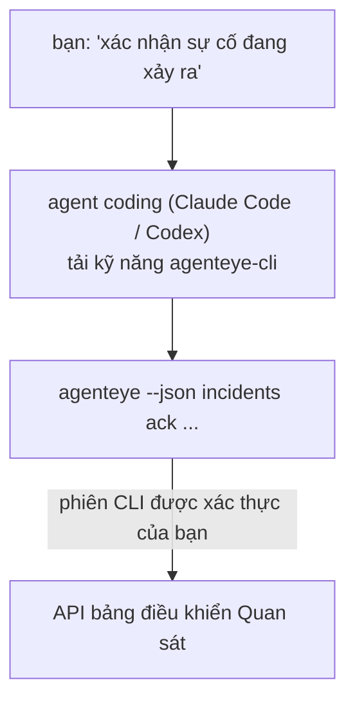

Hỏi agent coding của bạn *"có gì bị hỏng hôm nay không?"* và để nó trả lời từ dữ liệu Quan sát Failproof AI trực tiếp của bạn, mà không cần nhớ lệnh nào. **Kỹ năng CLI Quan sát Failproof AI** (`agenteye-cli`) là một *Agent Skill*: một thư mục nhỏ chứa các hướng dẫn mà một agent coding như Claude Code hoặc Codex có thể tải theo yêu cầu. Nó dạy agent cách vận hành triển khai Quan sát của bạn thông qua CLI [`agenteye`](/vi/agenteye/cli) từ các yêu cầu bằng tiếng Anh thông thường như *"cấp cho CI một khóa chỉ có thể đẩy sự kiện"* hoặc *"xác nhận sự cố đang xảy ra và gán cho tôi."*

Đây **không phải** là một dịch vụ hoặc một tệp nhị phân riêng biệt; không có gì để triển khai. Nó hoạt động trên nền tảng của CLI mà bạn đã cài đặt: agent sẽ gọi lệnh `agenteye --json …`, phân tích cú pháp JSON sạch sẽ, và trả lời bạn bằng văn bản. Mọi thứ nó có thể làm, bạn cũng có thể làm bằng cách gõ các lệnh tương tự.

---

## Mối quan hệ với các giao diện Quan sát Failproof AI khác

Quan sát Failproof AI cung cấp cho bạn bốn cách để truy cập cùng một dữ liệu và điều khiển. Chúng bổ sung cho nhau:

| Giao diện | Nó là gì | Chạy ở đâu | Sử dụng khi |
|---|---|---|---|
| **[CLI](/vi/agenteye/cli)** | Tham chiếu lệnh/cờ cho `agenteye` | Terminal của bạn | Bạn muốn chạy hoặc viết kịch bản cho một lệnh cụ thể |
| **[Công thức CLI](/vi/agenteye/cli-recipes)** | Mẫu `jq`/pipeline sao chép dán | Terminal / kịch bản của bạn | Bạn đang kết nối CLI vào tự động hóa |
| **Kỹ năng CLI** (tài liệu này) | Cửa trước ngôn ngữ tự nhiên trên CLI | Agent coding của bạn, trên trạm làm việc | Bạn chỉ muốn hỏi và để agent chọn lệnh |
| **[Kỹ năng Evaluator](/vi/agenteye/evaluator-skill)** | Một kỹ năng anh chị em thiết kế và xây dựng dịch vụ tính điểm của bạn | Agent coding của bạn, trên trạm làm việc | Bạn muốn tạo ra điểm đánh giá thay vì đọc chúng |
| **[Kỹ năng Python SDK](/vi/agenteye/python-sdk-skill)** | Một kỹ năng anh chị em cung cấp dụng cụ agent để nó phát ra telemetry | Agent coding của bạn, trên trạm làm việc | Bạn muốn agent của mình phát ra các sự kiện mà kỹ năng này đọc |
| **[Trợ lý AI trong bảng điều khiển](/vi/agenteye/assistant)** | Trò chuyện được nhúng trong bảng điều khiển | Phía máy chủ (trong bảng điều khiển) | Bạn muốn hỏi đáp trong bảng điều khiển về dữ liệu của bạn |

Chính kỹ năng này không có quyền riêng nào; nó chỉ chuyển đổi lời nói của bạn thành các lệnh CLI chạy dưới quyền của bạn:



### so với trợ lý AI trong bảng điều khiển: một sự phân biệt quan trọng

Đây là hai công cụ khác nhau có phạm vi ảnh hưởng rất khác nhau:

- **Trợ lý AI trong bảng điều khiển** ([Trợ lý AI](/vi/agenteye/assistant)) là trò chuyện được nhúng trong bảng điều khiển, được hỗ trợ bởi dịch vụ agent. Nó **chỉ đọc cộng với tác giả được phê duyệt**: nó có thể nháp các truy vấn và bảng điều khiển đã lưu, nhưng mọi lần ghi đều tạm dừng để chờ sự phê duyệt rõ ràng của bạn, và nó không bao giờ xóa. Nó được giới hạn bởi quyền `agent:use` và chỉ khi nào cũng chỉ thấy dữ liệu cho tổ chức bạn đang xem.
- **Kỹ năng CLI** chạy trên *trạm làm việc của bạn* bên trong *agent coding của bạn* và điều khiển CLI `agenteye` như **bạn**. Nó có thể thực hiện **toàn bộ bề mặt của CLI, bao gồm các thay đổi** (tạo/xoay vòng/vô hiệu hóa khóa API, thay đổi cài đặt tổ chức, giải quyết sự cố, xóa truy vấn đã lưu), chỉ bị giới hạn bởi quyền của đăng nhập CLI của bạn. Hãy xử lý nó một cách cẩn thận như bạn sẽ xử lý việc chạy các lệnh đó bằng tay.

---

## Điều kiện tiên quyết

1. **`agenteye` CLI được cài đặt** và trong `PATH` (xem tham chiếu [CLI](/vi/agenteye/cli): `pipx install agenteye`).
2. **URL bảng điều khiển của bạn được đặt** (`AGENTEYE_DASHBOARD_URL`, hoặc agent chuyển `--base-url`).
3. **Phiên đăng nhập**: chạy `agenteye login` trước tiên. Kỹ năng **không thể** hoàn thành đăng nhập mã một lần được gửi qua email cho bạn; nó sẽ yêu cầu bạn chạy `agenteye login` nếu phiên bị thiếu hoặc hết hạn (mã thoát CLI `4`).

---

## Nơi lấy nó

Kỹ năng được xuất bản trong bộ kỹ năng công cộng của Failproof AI:

**[github.com/FailproofAI/skills](https://github.com/FailproofAI/skills)** → [`skills/agenteye-cli/`](https://github.com/FailproofAI/skills/tree/main/skills/agenteye-cli)

Không có gì về nó bị giới hạn — kho lưu trữ là công cộng và kỹ năng không cần bất kỳ thông tin xác thực nào của riêng nó, bởi vì nó chỉ điều khiển CLI `agenteye` **công cộng** với *bảng điều khiển của bạn*, sử dụng phiên *bạn* đã đăng nhập. Bạn không cần phải yêu cầu bất cứ ai.

Lưu ý rằng nó được gửi dưới dạng thư mục của riêng nó và **không** nằm trong gói `pipx install agenteye`, vì vậy đừng tìm nó ở đó.

## Cài đặt kỹ năng

Con đường nhanh nhất là CLI [`skills`](https://skills.sh), nó sẽ lấy thư mục và đặt nó nơi agent của bạn tìm kiếm:

```bash
# Claude Code, chỉ dự án này
npx skills add FailproofAI/skills --skill agenteye-cli -a claude-code

# mọi dự án (cài đặt vào ~/.claude/skills/)
npx skills add FailproofAI/skills --skill agenteye-cli -a claude-code -g --copy

# Codex thay thế
npx skills add FailproofAI/skills --skill agenteye-cli -a codex
```

Sau đó quản lý nó như bất kỳ kỹ năng khác:

```bash
npx skills list -a claude-code      # những gì được cài đặt
npx skills update agenteye-cli      # kéo phiên bản mới nhất
npx skills remove agenteye-cli      # xóa nó
```

Thích cài đặt bằng tay? Agent Skill chỉ là thư mục chứa `SKILL.md` (cộng với các tham chiếu tùy chọn), vì vậy sao chép nó cũng hoạt động:

- **Claude Code**: đặt thư mục `agenteye-cli/` vào `~/.claude/skills/` (mọi dự án) hoặc `<your-repo>/.claude/skills/` (chỉ kho lưu trữ đó). Claude Code tự động khám phá nó — xác minh bằng danh sách `/skills`, hoặc đơn giản là hỏi một câu hỏi phù hợp với mô tả của nó.
- **Codex (OpenAI)**: Codex đọc `SKILL.md` tương tự. `agents/openai.yaml` được đi kèm đặt `allow_implicit_invocation: true`, vì vậy Codex tự động chọn kỹ năng khi một tác vụ khớp; nếu không, gọi nó một cách rõ ràng là `$agenteye-cli`.

---

## An toàn: các thay đổi KHÔNG nhắc khi agent chạy CLI

> **Cảnh báo:** Đọc cái này trước khi để agent thực hiện thay đổi.

CLI `agenteye` thường hỏi *"bạn có chắc chắn không?"* trước khi thực hiện một hành động có nguy hiểm. Nó **tự động bỏ qua xác nhận đó bất cứ khi nào nó không được gắn vào terminal (đó chính xác là cách agent coding chạy nó), và `--json` cũng bỏ qua nó.** Vì vậy lời nhắc an toàn sẽ **không** kích hoạt cho agent.

Kỹ năng được viết để bù đắp: nó được hướng dẫn nêu ra lệnh chính xác mà nó sẽ chạy và nhận **OK rõ ràng từ bạn trước bất kỳ thay đổi trạng thái nào**. Giữ kỷ luật đó. Khi bạn điều khiển Quan sát Failproof AI thông qua agent, *bạn* là bước xác nhận. Các lệnh thay đổi trạng thái cần lưu ý:

- `keys create` / `update` / `disable` / `regenerate`
- `users create` / `update` / `disable` / `enable`
- `settings set`
- `alerts create` / `update` / `delete` / `test`
- các lệnh con `incidents` ghi: `ack` / `assign` / `resolve` / `open` / `comment-add` / `comment-delete` / `subscribe` / `unsubscribe`
- `query create` / `update` / `delete`
- `agent rename` / `delete`
- `orgs switch`

Mọi thứ trong **Quan sát** (`events`, `sessions`, `evals`, `errors`, `list`, `whoami`, `orgs list/current/perms`) chỉ đọc và không thay đổi bất cứ điều gì.

Bởi vì agent hoạt động như **bạn**, nó chỉ có thể làm những gì đăng nhập của bạn được phép làm; quyền được giải quyết **cho mỗi tổ chức** (xem [Khóa API](/vi/agenteye/api-keys)). Một lệnh mà bạn thiếu quyền trả về mã thoát `5` với quyền chính xác được đặt tên, vì vậy agent có thể nói với bạn chính xác những gì cần yêu cầu quản trị viên thay vì thất bại mù mờ.

---

## Bạn có thể hỏi nó gì

Đây là cách một vòng tròp trực tiếp thực tế trông như thế nào, một lần đọc, sau đó là một thay đổi chờ OK của bạn:

```text
bạn   ▸ Có gì bị hỏng trong ngày vừa rồi không?

agent ▸ Chạy: agenteye --json errors --since 24h --aggregate
        3 kiểu lỗi trong 24 giờ qua. Cái lớn nhất là TimeoutError
        (18 lần, tất cả trên checkout-agent), sau đó là RateLimited (5).
        Bạn muốn các phiên bị lỗi cho TimeoutError không?

bạn   ▸ Cấp cho CI một khóa chỉ có thể đẩy sự kiện.

agent ▸ Cái này tạo một khóa API. Tôi sẽ chạy:
          agenteye keys create ci --add events:add
        OK để tiếp tục?

bạn   ▸ có

agent ▸ Xong. Khóa "ci" được tạo chỉ với events:add.
        Bí mật chỉ được hiển thị một lần, vì vậy hãy lưu trữ nó ngay bây giờ. Tôi không thể in lại nó.
```

Kỹ năng ánh xạ mỗi ý định ngôn ngữ tự nhiên đến lệnh `agenteye` đúng, khám phá các giá trị hợp lệ trước tiên (`list <kind>`, `whoami`) vì vậy nó không đoán, và nêu ra lệnh chính xác trước bất kỳ thay đổi nào. Thêm ví dụ:

- *"Có gì bị hỏng / thất bại trong 24 giờ qua không?"* → `errors --since 24h --aggregate`, sau đó là phân tích chi tiết.
- *"Tại sao phiên `run-001` thất bại?"* → `events --session-id run-001 --all` + `evals --session-id run-001`.
- *"Chất lượng đang xu hướng như thế nào tuần này?"* → `evals --aggregate --since 7d`, sau đó đi sâu vào các lần chạy có điểm thấp.
- *"Cấp cho CI một khóa chỉ có thể đẩy sự kiện."* → `keys create ci --add events:add` (nó nêu ra lệnh, sau đó tạo nó và ghi lấy bí mật một lần).
- *"Ai có quyền truy cập? Làm cho Dana chỉ đọc."* → `users list` → `users update dana@… --permission-set read-only` (sau khi xác nhận với bạn).
- *"Xác nhận sự cố đang xảy ra và gán cho tôi."* → `incidents list --state firing` → `incidents ack <id>` / `incidents assign <id> you@…`.

Để biết các lệnh, cờ, và hình dạng JSON chính xác phía sau những cái này, xem tham chiếu [CLI](/vi/agenteye/cli) và [Công thức CLI cho agent](/vi/agenteye/cli-recipes).

---

## Các bước tiếp theo

- **[CLI](/vi/agenteye/cli)**: tham chiếu lệnh và cờ đầy đủ cho `agenteye`.
- **[Công thức CLI cho agent](/vi/agenteye/cli-recipes)**: mẫu `jq` sao chép dán và xử lý mã thoát.
- **[Kỹ năng agent Evaluator](/vi/agenteye/evaluator-skill)**: kỹ năng anh chị em, để xây dựng evaluator mà `agenteye evals` đọc điểm của nó.
- **[Kỹ năng agent Python SDK](/vi/agenteye/python-sdk-skill)**: kỹ năng anh chị em, để cung cấp dụng cụ agent để nó phát ra telemetry mà `agenteye` đọc.
- **[Trợ lý AI](/vi/agenteye/assistant)**: trợ lý trong bảng điều khiển (không nên nhầm lẫn với kỹ năng terminal này).
- **[Khóa API](/vi/agenteye/api-keys)**: mô hình quyền hạn cho mỗi tổ chức ràng buộc những gì kỹ năng có thể làm.