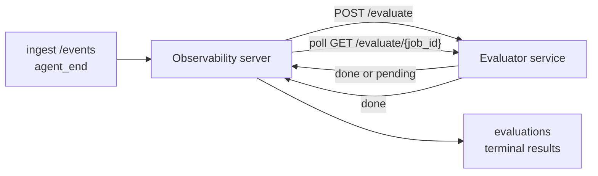

FailproofAI Observability có thể tự động chấm điểm mỗi lần chạy agent hoàn tất để đánh giá chất lượng: bạn cung cấp một dịch vụ chấm điểm nhỏ, và Observability xử lý phần còn lại. Sử dụng nó để theo dõi các chiều kích bạn quan tâm (hữu ích, hiệu quả công cụ, độ chính xác, an toàn; bạn chọn), phát hiện hồi quy sớm và so sánh các agent hoặc môi trường một cách nhanh chóng. Chấm điểm là tùy chọn: pipeline không làm gì cho đến khi bạn đặt `EVALUATOR_ENDPOINT` trên máy chủ.

> **Lưu ý:** Bạn định nghĩa các chiều chấm điểm. Evaluator của bạn có thể trả về bất kỳ khóa số nào mà nó muốn; Observability lưu trữ, theo dõi xu hướng và hiển thị bất cứ thứ gì bạn gửi lại.

## Tổng quan

1. **Viết một scorer.** Thiết lập một dịch vụ HTTP nhỏ đọc phiên bản ghi nội dung và trả về các điểm số. Observability có kèm một tham chiếu làm việc mà bạn có thể sao chép. Xem [Viết một evaluator với SDK](#writing-an-evaluator-with-the-sdk).
2. **Chỉ Observability đến nó.** Đặt `EVALUATOR_ENDPOINT` (và một `EVALUATOR_TOKEN` được chia sẻ) trên quy trình máy chủ.
3. **Xem các điểm số đến.** Mỗi phiên hoàn tất sẽ được chấm điểm tự động; kết quả xuất hiện trên trang chi tiết phiên, lưới phiên và các bảng điều khiển đã lưu.


*Khi một evaluator được định cấu hình, mỗi lần chạy hoàn tất sẽ được chấm điểm và kết quả xuất hiện trong phần rail bên phải của phiên: bản tóm tắt ở trên cùng, sau đó là các thanh điểm số theo chiều kích với lý do.*

---

## Cách hoạt động



Khi FailproofAI Observability SDK phát ra sự kiện `agent_end` cho một phiên, máy chủ lên lịch một đánh giá. Sau đó, nó POST toàn bộ phiên ghi nội dung sự kiện đến dịch vụ evaluator của bạn, dịch vụ này có thể:

- **Trả về kết quả inline** với `{"status":"done", "scores":{...}, "reasoning":{...}, "summary":"..."}`. Kết quả được thêm vào dòng thời gian đánh giá của phiên. `reasoning` và `summary` là tùy chọn.
- **Hoãn lại** với `{"status":"pending", "job_id":"abc-123"}`. Observability sau đó gọi `GET {EVALUATOR_ENDPOINT}/evaluate/abc-123` cho đến khi evaluator của bạn trả về `{"status":"done", ...}` hoặc `{"status":"error", "error":"..."}`.

  Tần suất polling là từng công việc: phản hồi `pending` có thể bao gồm `next_poll_secs` để ghi đè; nếu không, Observability sử dụng giá trị `default_poll_interval_secs` từ `GET /config`; nếu không, máy chủ quay lại `EVALUATOR_POLLING_INTERVAL_SECS` (mặc định 10s). Tất cả các giá trị được giới hạn trong [1s, 1h].

Các phiên không bao giờ phát ra `agent_end` (ví dụ, một quy trình agent bị sập) cũng có thể được nhận: `GET /config` của evaluator có thể trả về `{"inactivity_timeout_secs": 1800}`, và Observability sẽ đánh giá bất kỳ phiên nào không hoạt động lâu hơn thế. Đặt trường thành `null` hoặc bỏ qua nó để vô hiệu hóa fallback này.

Pipeline hoàn toàn là no-op khi `EVALUATOR_ENDPOINT` không được đặt.

Một phiên có thể tích lũy **nhiều đánh giá terminal theo thời gian**: mỗi sự kiện `agent_end` (và mỗi re-eval thủ công từ bảng điều khiển) thêm một hàng đánh giá mới. Đây là cách được hỗ trợ để đánh giá một cuộc trò chuyện được tiếp tục: người dùng kết thúc một agent, quay lại sau đó, gửi thêm sự kiện, kết thúc agent lần nữa, và một đánh giá thứ hai chạy dựa trên phiên ghi nội dung toàn bộ đã cập nhật. Bảng điều khiển hiển thị đánh giá gần đây nhất dưới dạng tiêu đề chính và các đánh giá trước đó dưới dạng dòng thời gian có thể thu gọn. Trong khi một đánh giá đang chạy cho một phiên, các sự kiện `agent_end` bổ sung cho phiên đó bị bỏ qua; cái tiếp theo sau khi đánh giá đang chạy hoàn tất sẽ xếp hàng một đánh giá mới như bình thường.

Fallback không hoạt động lại khi các phiên được tiếp tục: nếu các sự kiện mới đến sau một đánh giá terminal trước đó và phiên sau đó lại không hoạt động vượt quá `inactivity_timeout_secs`, một đánh giá mới sẽ được xếp hàng.

Các lỗi tạm thời (5xx, 429, timeout, lỗi mạng) được thử lại với backoff theo cấp số nhân lên tới `EVALUATOR_MAX_ATTEMPTS`; phản hồi 4xx là terminal. Observability an toàn để chạy với nhiều phiên bản máy chủ được mở rộng theo chiều ngang; công việc được phân vùng sao cho phiên được gửi không bao giờ xảy ra hai lần đồng thời.

---

## Hợp đồng HTTP

Mỗi tuyến được xác thực sử dụng **xác thực mã thông báo bearer**. Cùng một giá trị phải được định cấu hình trên cả hai bên:

- Máy chủ Observability: biến env `EVALUATOR_TOKEN`
- Dịch vụ evaluator: được định cấu hình theo cách tương tự (SDK `agenteye-evaluator` đọc `EVALUATOR_TOKEN` theo quy ước)

Nếu `EVALUATOR_TOKEN` không được đặt, máy chủ không gửi tiêu đề `Authorization`; evaluator sau đó có thể chấp nhận các yêu cầu ẩn danh, điều này là tốt cho một mạng chỉ nội bộ nhưng không được khuyến khích trên internet công khai.

### Các tuyến mà evaluator phải phục vụ

| Tuyến | Nội dung / tham số | Phản hồi |
|---|---|---|
| `GET /health` | none | `{"status":"ok"}` (mở, không có xác thực) |
| `GET /config` | none | `{"inactivity_timeout_secs": <int> \| null, "default_poll_interval_secs": <int> \| omitted}` |
| `POST /evaluate` | `EvalRequest` JSON | `{"status":"done", ...}` hoặc `{"status":"pending", "job_id":"..."}` |
| `GET /evaluate/{id}` | none | hình dạng phản hồi giống như `/evaluate` |

### Nội dung `EvalRequest` được gửi bởi máy chủ

```json
{
  "schema_version": "1",
  "session_id":     "session-abc123",
  "agent_id":       "planner",
  "environment":    "production",
  "started_at":     "2026-05-10T12:00:00Z",
  "ended_at":       "2026-05-10T12:05:00Z",
  "events": [
    { "id": 1234, "ts": "...", "event_type": "agent_start", "payload": { ... } },
    ...
  ]
}
```

### Hình dạng phản hồi

**Đồng bộ (done):**

```json
{
  "status": "done",
  "scores": { "helpfulness": 0.85, "tool_efficiency": 0.6 },
  "reasoning": {
    "helpfulness": "answered the question directly with citations",
    "tool_efficiency": "called list_files three times when one would have done"
  },
  "summary": "strong answer quality, weak tool selection"
}
```

`reasoning` (một bản đồ lý giải cho mỗi điểm số) và `summary` (một bản tóm tắt tổng thể một đoạn) đều là tùy chọn. Các khóa trong `reasoning` phải phản ánh các khóa trong `scores`; bảng điều khiển hiển thị từng mục inline dưới thanh điểm của nó. Các evaluator cũ chỉ trả về `scores` tiếp tục hoạt động không thay đổi; `reasoning` và `summary` chỉ đơn giản là đọc là null và các affordance giao diện người dùng tương ứng bị bỏ qua.

**Không đồng bộ (hoãn lại):**

```json
{ "status": "pending", "job_id": "abc-123", "next_poll_secs": 30 }
```

`next_poll_secs` là tùy chọn; nếu bỏ qua, máy chủ quay lại `default_poll_interval_secs` của evaluator từ `/config`, sau đó đến biến env `EVALUATOR_POLLING_INTERVAL_SECS` của chính nó.

**Lỗi terminal phía evaluator:**

```json
{ "status": "error", "error": "model service unavailable" }
```

Máy chủ coi bất kỳ nội dung 2xx khác là lỗi giao thức và ghi một `error` terminal cho phiên.

---

## Viết một evaluator với SDK

Bạn không phải triển khai hợp đồng HTTP bằng tay. Gói Python `agenteye-evaluator` cung cấp một trình bao lọc FastAPI được gõ xử lý xác thực, định tuyến và các hình dạng yêu cầu/phản hồi cho bạn.

FailproofAI Observability cũng có kèm **một evaluator tham chiếu làm việc** chấm điểm `helpfulness`, `tool_efficiency` và `factuality` từ hình dạng của phiên ghi nội dung. Sao chép nó làm điểm bắt đầu và hoán đổi logic của riêng bạn: một thẩm phán LLM, một công cụ quy tắc, bất cứ điều gì phù hợp với thanh chất lượng của bạn.

Evaluator tối thiểu khả thi:

```python
import os
from agenteye_evaluator import Evaluator, EvalRequest, EvalResponse

app = Evaluator(token=os.environ["EVALUATOR_TOKEN"])

@app.evaluator
def run(req: EvalRequest) -> EvalResponse:
    # Inspect req.events (the full session transcript) and return scores.
    tool_calls = sum(1 for e in req.events if e.event_type == "tool_use")
    return EvalResponse(
        scores={"tool_calls": float(tool_calls)},
        reasoning={"tool_calls": f"{tool_calls} tool invocations in the transcript"},
        summary="tight tool loop" if tool_calls < 5 else "agent looped on tools",
    )
```

Phiên bản `app` chạy dưới bất kỳ máy chủ ASGI nào, vì vậy `uvicorn module:app` khởi động nó.

Đối với các evaluator cần hoãn lại công việc tốn kém, hãy trả về `JobPending` thay thế và đăng ký trình xử lý `@app.job_lookup`; máy chủ Observability thăm dò `GET /evaluate/{job_id}` cho đến khi bạn trả về trạng thái terminal hoặc mũ `EVALUATOR_MAX_POLL_DURATION_SECS` (mặc định 1 h) hết.

Tham chiếu API đầy đủ, mô hình không đồng bộ và sơ đồ sự kiện được ghi lại trong README của SDK `agenteye-evaluator`.

---

## Chạy evaluator của bạn

Evaluator là **dịch vụ của bạn** — FailproofAI Observability không có kèm một evaluator mặc định, vì vậy bạn xây dựng và chạy nó ở bất kỳ nơi nào bạn chạy các dịch vụ của riêng bạn. Nó chạy dưới bất kỳ máy chủ ASGI nào (ví dụ `uvicorn my_evaluator:app`); phục vụ các tuyến `/health`, `/config` và `/evaluate` từ [hợp đồng HTTP](#http-contract), sau đó chỉ máy chủ vào nó (xem [Định cấu hình máy chủ](#configuring-the-server)).

Khi evaluator có thể truy cập được, `GET /health` trả về `{"status":"ok"}`. Sau khi một agent chạy end-to-end, `GET /evaluations` trên máy chủ trả về một hàng có `status: "done"` và các điểm số mà evaluator của bạn tạo ra.

---

## Định cấu hình máy chủ

Đặt trên quy trình máy chủ:

| Biến env | Ý nghĩa |
|---|---|
| `EVALUATOR_ENDPOINT` | URL cơ sở của evaluator của bạn (`http://evaluator:9000`). Không được đặt = pipeline bị tắt. |
| `EVALUATOR_TOKEN` | Mã thông báo bearer. Phải bằng giá trị mà dịch vụ evaluator được định cấu hình với. |
| `EVALUATOR_WORKERS` | Tác vụ worker cho mỗi phiên bản máy chủ (mặc định 2). |
| `EVALUATOR_CLAIM_BATCH` | Hàng được yêu cầu cho mỗi tick worker (mặc định 4). Các batch được xử lý **đồng thời**; đồng thời hiệu quả trên điểm cuối evaluator của bạn là `EVALUATOR_WORKERS × EVALUATOR_CLAIM_BATCH`. |
| `EVALUATOR_POLL_IDLE_SECS` | Thời gian worker ngủ giữa các nỗ lực gửi khi không có đánh giá nào đến hạn (mặc định 2s). |
| `EVALUATOR_POLLING_INTERVAL_SECS` | Fallback cuối cùng cho tần suất `GET /evaluate/{id}` khi cả `next_poll_secs` trên mỗi phản hồi và `default_poll_interval_secs` của evaluator đều không được đặt (mặc định 10s). |
| `EVALUATOR_REQUEST_TIMEOUT_MS` | Timeout cho mỗi yêu cầu (mặc định 30000). |
| `EVALUATOR_MAX_ATTEMPTS` | Sau nhiều lỗi tạm thời này, kết quả được ghi lại dưới dạng terminal `error` (mặc định 5). |
| `EVALUATOR_CONFIG_REFRESH_SECS` | Tần suất `GET /config` (mặc định 300). |
| `EVALUATOR_MAX_POLL_DURATION_SECS` | Thời gian tối đa một phiên có thể ở trong hàng đợi polling trước khi nó bị chấm dứt dưới dạng `timeout` (mặc định 3600s). Bảo vệ chống lại một evaluator liên tục trả về `pending` mãi mãi. |

Để bật chấm điểm tự động, hãy đặt cả `EVALUATOR_ENDPOINT` và `EVALUATOR_TOKEN` trên máy chủ, sau đó khởi động lại để áp dụng thay đổi. Với `EVALUATOR_ENDPOINT` không được đặt, pipeline vẫn là no-op.

Các nút điều chỉnh ở trên là tùy chọn; chỉ đặt các biến môi trường tương ứng trên máy chủ nếu bạn cần ghi đè các giá trị mặc định.

---

## Tham chiếu API

| Phương thức | Đường dẫn | Quyền bắt buộc | Mục đích |
|---|---|---|---|
| `GET` | `/evaluations` | `evaluations:read` | Kết quả terminal truy vấn. Hỗ trợ `session_id`, `agent_id`, `environment`, `status` (`done`/`error`/`timeout`), `ts_from`, `ts_to`, `cursor`, `limit`, `score_filters`, `latest_per_session`. `limit` mặc định là 50 và được giới hạn ở 200 (lưu ý điều này khác với `/events`, được giới hạn ở 1000). `environment` chấp nhận danh sách được phân cách bằng dấu phẩy (ví dụ: `environment=prod,staging`); các giá trị đơn vẫn hoạt động. Với `latest_per_session=true` phản hồi chứa nhiều nhất một hàng cho mỗi `session_id` (cái gần đây nhất theo `completed_at`) được sử dụng bởi trang danh sách phiên để thu gọn dòng thời gian đánh giá của phiên thành tiêu đề hiện tại của nó. Mặc định là false (trả về lịch sử đầy đủ). |
| `GET` | `/evaluations/aggregate` | `evaluations:read` | Sức khỏe eval cuộn lên cho một lát được lọc: tổng số, đột ngột/lỗi/timeout, thống kê cho mỗi khóa điểm số (đếm/trung bình/tối thiểu/tối đa/p50 trên các khóa `scores` tùy ý) và dòng thời gian được chia theo khoảng thời gian. Chấp nhận **các tham số bộ lọc giống như `/evaluations`** cộng với `featured_keys` (CSV của các khóa điểm số để xu hướng) và `latest_per_session`. Quyền lực tính năng Dashboards; các số liệu là chính xác trên toàn bộ tập hợp phù hợp, không được lấy mẫu. |
| `GET` | `/evaluations/environments` | `evaluations:read` | Giá trị môi trường riêng biệt từ bảng `evaluations`. Được sử dụng để điền các danh sách thả xuống được phạm vi đến dữ liệu đọc được từ đánh giá. |
| `GET` | `/evaluation-jobs` | `evaluations:read` | Khả năng hiển thị các đánh giá đang bay. Lọc theo `status` (`pending`/`polling`). |
| `GET` | `/events` | `events:read` | Luồng các sự kiện thô của phiên. Hỗ trợ `session_id`, `agent_id`, `event_type` (CSV), `environment` (CSV), `ts_from`, `ts_to`, `cursor`, `limit` và `order`. `order` là `desc` (mới nhất trước, mặc định) hoặc `asc` (cũ nhất trước); một giá trị không được công nhận quay lại `desc`. Con trỏ phân trang qua `next_cursor` của phản hồi (một id sự kiện): chuyển nó trở lại như `cursor` để nhận trang tiếp theo; với `asc` trang tiếp theo là các sự kiện sau id đó, với `desc` các sự kiện trước nó. `limit` mặc định là 50 và được giới hạn ở 1000. |
| `GET` | `/sessions/:session_id/export` | `events:read` | Trả về nội dung JSON chính xác mà evaluator sẽ nhận được cho phiên này, được phục vụ dưới dạng tệp đính kèm có thể tải xuống được đặt tên `session-<id>.json`. Hữu ích để phát lại các phiên sản xuất thông qua `agenteye-evaluator` để kiểm tra ngoại tuyến. Các byte giống hệt với những gì đường ống evaluator gửi đi. |
| `POST` | `/sessions/:session_id/re-evaluate` | `evaluations:trigger` | Xếp hàng một đánh giá mới cho một phiên; chạy dù có hay không có một đánh giá trước đó. Kết quả mới được **thêm vào** dòng thời gian đánh giá của phiên thay vì ghi đè cái trước, vì vậy các điểm số trước vẫn hiển thị dưới dạng lịch sử. Trả về `202` khi xếp hàng, `404` cho một phiên không xác định, `409` nếu một đánh giá đã đang bay. Sử dụng điều này sau khi triển khai một evaluator mới, hoặc cho các phiên không bao giờ phát ra `agent_end`. |

### Lọc theo phạm vi điểm số: `score_filters`

`GET /evaluations` chấp nhận một tham số `score_filters` tùy chọn mà thu hẹp kết quả theo các giá trị số bên trong đối tượng `scores`. Tham số là danh sách được phân cách bằng dấu phẩy của các mục `key:min..max`; bất kỳ ràng buộc nào cũng có thể bị bỏ qua. Các mục multiple kết hợp với AND logic. Các hàng trong đó khóa được đặt tên không có hoặc không phải là số bị loại trừ. Yêu cầu có thể mang theo nhiều nhất 20 mục bộ lọc; vượt quá điều đó trả về HTTP 400.

Ví dụ:
```text
# helpfulness in [0.5, 0.8]
GET /evaluations?score_filters=helpfulness:0.5..0.8

# tool_efficiency at most 0.3 (no lower bound)
GET /evaluations?score_filters=tool_efficiency:..0.3

# helpfulness >= 0.5 AND factuality >= 0.9
GET /evaluations?score_filters=helpfulness:0.5..,factuality:0.9..
```

Mỗi đối tượng phản hồi `/evaluations` có các trường này:

| Trường | Kiểu | Ghi chú |
|---|---|---|
| `evaluation_id` | string (UUID) | Định danh chính tắc cho đánh giá terminal này. Mỗi đánh giá terminal nhận được một UUID mới; một phiên duy nhất có thể chứa nhiều. |
| `id` | string (UUID) | Bí danh tương thích ngược mang cùng giá trị như `evaluation_id`. |
| `session_id` | string | Phiên này đánh giá chạy dựa trên. Một phiên có thể có nhiều đánh giá trong dòng thời gian. |
| `agent_id` | string | Xác định agent đã tạo ra phiên. |
| `environment` | string | Nhãn môi trường được sao chép từ phiên. |
| `status` | enum | Một trong `"done"`, `"error"`, `"timeout"`. |
| `scores` | object \| null | Điểm số được trả về bởi evaluator của bạn. |
| `reasoning` | object \| null | Bản đồ lý giải tùy chọn cho mỗi điểm số được trả về bởi evaluator của bạn. Các khóa thường phản ánh những cái trong `scores`. Bảng điều khiển hiển thị từng mục dưới thanh điểm của nó. |
| `summary` | string \| null | Câu chuyện tổng thể tùy chọn một đoạn được trả về bởi evaluator của bạn. Bảng điều khiển hiển thị cái này ở trên phần đột phá theo chiều kích như tiêu đề của đánh giá. |
| `error` | string \| null | Điền trên `"error"` / `"timeout"` chỉ. |
| `attempt_count` | integer | Số lần cố gắng gửi (≥ 1). |
| `duration_ms` | integer \| null | Thời lượng của nỗ lực cuối cùng. |
| `completed_at` | string (ISO 8601 UTC) | Khi kết quả terminal được ghi lại. Kết quả được sắp xếp theo `completed_at` (mới nhất trước). |
| `created_at` | string (ISO 8601 UTC) | Mang cùng dấu thời gian như `completed_at` (ngữ nghĩa viết một lần). |

---

## Quyền

| Quyền | Cấp |
|---|---|
| `evaluations:read` | Liệt kê kết quả đánh giá, xem điểm số trong bảng điều khiển và tải các số liệu sức khỏe bảng điều khiển. |
| `evaluations:trigger` | Thủ công xếp hàng một đánh giá cho một phiên qua `POST /sessions/:session_id/re-evaluate` hoặc nút re-evaluate của bảng điều khiển. |
| `dashboards:read` | Xem các bảng điều khiển được lưu (cũng cần `evaluations:read` để tải các số liệu của họ). |
| `dashboards:write` | Tạo và chỉnh sửa bảng điều khiển. |
| `dashboards:delete` | Xóa bảng điều khiển. |

Bootstrap admin (`ADMIN_KEY`, `ADMIN_EMAIL`) tự động nhận các cái này.

---

## Xem kết quả

- **`/sessions/<id>`**: dòng thời gian sự kiện + phần rail bên phải hiển thị điểm số của phiên và bất kỳ lỗi nào từ nỗ lực gửi. Nếu khóa của bạn có `evaluations:trigger`, nút **re-evaluate** xuất hiện bên cạnh nút xuất, hữu ích cho các phiên không bao giờ phát ra `agent_end`, hoặc để làm mới điểm số sau khi triển khai một evaluator mới. Bảng điều khiển thăm dò kết quả mới và cập nhật phần rail bên phải khi nó đến.
- **`/sessions`**: lưới phiên có thể lọc được; cột điểm số hiển thị trạng thái đánh giá và điểm số của mỗi phiên một cái nhìn. 
- **`/dashboards`**: chế độ xem sức khỏe eval được lưu (xem [Dashboards](#dashboards) dưới đây).


*Lưới phiên hiển thị trạng thái đánh giá và điểm số của mỗi lần chạy một cái nhìn; các badge đỏ/hổ phách/xanh làm cho các điểm số thấp nổi bật.*

---

## Bảng điều khiển

Trang **Dashboards** (`/dashboards`) cho phép bạn lưu một sự kết hợp của các bộ lọc đánh giá dưới dạng chế độ xem có tên, có thể tái sử dụng và xem cách mà lát cắt đánh giá đó đang làm một cái nhìn. Dashboards được **chia sẻ trên toàn bộ tổ chức của bạn**; mọi người có `dashboards:read` thấy cùng một bộ.

Mỗi bảng điều khiển ghim:

- **Bộ lọc**: các điều khiển giống như trang phiên: môi trường, trạng thái, agent, một cửa sổ thời gian lăn và bộ lọc phạm vi điểm số (`key:min..max`).
- **Một cấu hình hiển thị**: các khóa điểm số nào để đặc trưng, ngưỡng sức khỏe xanh/hổ phách/đỏ, bảng nào để hiển thị và có nên thu gọn thành đánh giá mới nhất cho mỗi phiên hay không.

Mỗi thẻ hiển thị số phiên phù hợp, đột ngột/lỗi/timeout, trung bình của mỗi điểm số đặc trưng và một sparkline xu hướng nhỏ. Mở một bảng điều khiển hiển thị các bảng điều khiển kích thước đầy đủ; **mở trong phiên** thả bạn vào trang phiên được lọc trước đó thành chính xác lát cắt đó. Các số liệu được tính toán phía máy chủ trên toàn bộ tập hợp phù hợp (qua `GET /evaluations/aggregate`), vì vậy các số là chính xác hơn là được lấy mẫu.


**Quyền:** xem cần cả `dashboards:read` và `evaluations:read`; tạo và chỉnh sửa cần `dashboards:write`; xóa cần `dashboards:delete`. Bootstrap admin tự động nhận toàn bộ những cái này.

---

## Khắc phục sự cố

**Phiên tồn tại nhưng không có đánh giá nào được tạo.** Xác nhận `EVALUATOR_ENDPOINT` được đặt trên quy trình máy chủ, rằng máy chủ và evaluator chia sẻ cùng một giá trị `EVALUATOR_TOKEN` và rằng điểm cuối `/health` của evaluator có thể truy cập được từ máy chủ. Với `EVALUATOR_ENDPOINT` không được đặt, pipeline là no-op.

**Các đánh giá đang bay chất đống. ** Truy vấn `GET /evaluation-jobs` để xem hàng đợi đang bay. Kiểm tra `attempt_count`, `next_attempt_at` và `last_error` trên mỗi hàng. Nguyên nhân phổ biến: dịch vụ evaluator không thể tiếp cận hoặc trả về 5xx (được thử lại với backoff), sai `EVALUATOR_TOKEN` (401 là terminal) hoặc một evaluator không đồng bộ trả về `pending` mãi mãi (xem bên dưới).

**Phiên hoàn tất nhưng không có đánh giá terminal.** Truy vấn `GET /evaluation-jobs?status=polling`; kết quả có thể vẫn đang bay. Nếu một công việc bị kẹt trong `pending`, máy chủ gặp vấn đề khi tiếp cận evaluator; kiểm tra rằng evaluator đang hoạt động và `EVALUATOR_TOKEN` phù hợp.

**`HTTP 401 from evaluator: invalid bearer token`.** `EVALUATOR_TOKEN` trên máy chủ không khớp với giá trị mà dịch vụ evaluator được định cấu hình với. Chúng phải giống hệt nhau.

**Async evaluator trả về `pending` mãi mãi.** Máy chủ thăm dò `GET /evaluate/{job_id}` cho đến khi evaluator trả về `done` hoặc `error`, hoặc cho đến khi `EVALUATOR_MAX_POLL_DURATION_SECS` (mặc định 1 h) hết. Sau mũ, đánh giá được ghi lại là `timeout` và bị xóa khỏi hàng đợi đang bay. Tăng `EVALUATOR_MAX_POLL_DURATION_SECS` nếu evaluator của bạn hợp pháp cần lâu hơn mặc định.

---

## Các bước tiếp theo

- [Python SDK](/vi/agenteye/python-sdk): phát ra các sự kiện `agent_end` kích hoạt chấm điểm.
- [API keys](/vi/agenteye/api-keys): các quyền `evaluations:read` và `evaluations:trigger`.
- [Audits](/vi/agenteye/audits): tính năng chất lượng tự động khác của Observability, để xem xét dựa trên chính sách.