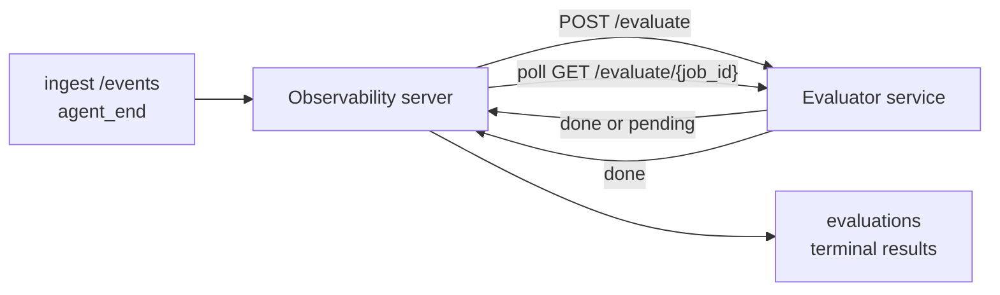

Failproof AI Observability có thể tự động chấm điểm mọi lần chạy agent hoàn thành theo chất lượng: bạn cung cấp một dịch vụ chấm điểm nhỏ, và Observability sẽ xử lý phần còn lại. Sử dụng nó để theo dõi các chiều mà bạn quan tâm (khả năng giúp đỡ, hiệu quả công cụ, độ chính xác, an toàn; bạn chọn), phát hiện các vấn đề suy giảm sớm và so sánh các agent hoặc môi trường một cách nhanh chóng. Chấm điểm là tùy chọn: pipeline không làm gì cho đến khi bạn đặt `EVALUATOR_ENDPOINT` trên máy chủ.

> **Lưu ý:** Bạn xác định các chiều chấm điểm. Evaluator của bạn có thể trả về bất kỳ khóa số nào mà nó muốn; Observability sẽ lưu trữ, xu hướng và hiển thị bất kỳ thứ gì bạn gửi lại.

## Tổng quan

1. **Viết một bộ chấm điểm.** Thiết lập một dịch vụ HTTP nhỏ đọc bản ghi phiên làm việc và trả về điểm số. Observability cung cấp một tài liệu tham khảo hoạt động mà bạn có thể sao chép. Xem [Viết một evaluator với SDK](#writing-an-evaluator-with-the-sdk).
2. **Hướng Observability đến nó.** Đặt `EVALUATOR_ENDPOINT` (và một `EVALUATOR_TOKEN` được chia sẻ) trên quá trình máy chủ.
3. **Theo dõi điểm số.** Mọi phiên hoàn thành được chấm điểm tự động; kết quả xuất hiện trên trang chi tiết phiên, lưới phiên và các bảng điều khiển đã lưu.


*Sau khi một evaluator được cấu hình, mỗi lần chạy hoàn thành được chấm điểm và kết quả xuất hiện trong thanh bên phải của phiên: tóm tắt ở trên cùng, sau đó là thanh điểm số từng chiều với lập luận.*

---

## Cách hoạt động



Khi Observability SDK phát ra một sự kiện `agent_end` cho một phiên, máy chủ sẽ lên lịch một đánh giá. Sau đó, nó POSTs bản ghi sự kiện đầy đủ cho dịch vụ evaluator của bạn, có thể:

- **Trả về kết quả ngay lập tức** với `{"status":"done", "scores":{...}, "reasoning":{...}, "summary":"..."}`. Kết quả được thêm vào dòng thời gian đánh giá của phiên. `reasoning` và `summary` là tùy chọn.
- **Hoãn lại** với `{"status":"pending", "job_id":"abc-123"}`. Observability sau đó gọi `GET {EVALUATOR_ENDPOINT}/evaluate/abc-123` cho đến khi evaluator của bạn trả về `{"status":"done", ...}` hoặc `{"status":"error", "error":"..."}`.

  Tần suất thăm dò là dựa trên từng công việc: phản hồi `pending` có thể bao gồm `next_poll_secs` để ghi đè; nếu không Observability sử dụng giá trị `default_poll_interval_secs` từ `GET /config`; nếu không máy chủ sẽ quay lại `EVALUATOR_POLLING_INTERVAL_SECS` (mặc định 10 giây). Tất cả giá trị được giới hạn trong [1 giây, 1 giờ].

Các phiên không bao giờ phát ra `agent_end` (ví dụ: quá trình agent bị sự cố) cũng có thể được nhặt lên: `GET /config` của evaluator có thể trả về `{"inactivity_timeout_secs": 1800}`, và Observability sẽ đánh giá bất kỳ phiên nào đã không hoạt động lâu như vậy. Đặt trường thành `null` hoặc bỏ nó để tắt dự phòng này.

Pipeline hoàn toàn vô dụng khi `EVALUATOR_ENDPOINT` không được đặt.

Một phiên có thể tích lũy **nhiều đánh giá cuối cùng theo thời gian**: mỗi sự kiện `agent_end` (và mỗi lần đánh giá lại thủ công từ bảng điều khiển) thêm một hàng đánh giá mới. Đây là cách được hỗ trợ để đánh giá một cuộc trò chuyện được tiếp tục: người dùng kết thúc một agent, quay lại sau đó, gửi thêm sự kiện, kết thúc agent một lần nữa và một đánh giá thứ hai chạy so với bản ghi đầy đủ được cập nhật. Bảng điều khiển hiển thị đánh giá gần đây nhất là tiêu đề và các đánh giá trước đó dưới dạng một dòng thời gian có thể thu gọn. Trong khi một đánh giá đang chạy cho một phiên, các sự kiện `agent_end` bổ sung cho phiên đó sẽ bị bỏ qua; sự kiện tiếp theo sau khi đánh giá đang chạy hoàn thành sẽ xếp hàng một đánh giá mới như thường lệ.

Dự phòng không hoạt động sẽ tái tích hợp trong các phiên được tiếp tục: nếu các sự kiện mới đến sau một đánh giá cuối cùng trước đó và phiên sau đó không hoạt động vượt quá `inactivity_timeout_secs`, một đánh giá mới sẽ được xếp hàng.

Các lỗi tạm thời (5xx, 429, timeout, lỗi mạng) sẽ được thử lại với exponential backoff lên tới `EVALUATOR_MAX_ATTEMPTS`; các phản hồi 4xx là cuối cùng. Observability an toàn để chạy với nhiều instance máy chủ được mở rộng theo chiều ngang; công việc được phân vùng để cùng một phiên không bao giờ được gửi hai lần đồng thời.

---

## Hợp đồng HTTP

Mọi tuyến đường xác thực sử dụng **xác thực mã token Bearer**. Cùng một giá trị phải được cấu hình trên cả hai bên:

- Máy chủ Observability: biến env `EVALUATOR_TOKEN`
- Dịch vụ Evaluator: được cấu hình cùng cách (SDK `agenteye-evaluator` đọc `EVALUATOR_TOKEN` theo quy ước)

Nếu `EVALUATOR_TOKEN` không được đặt, máy chủ không gửi tiêu đề `Authorization`; evaluator sau đó có thể chấp nhận các yêu cầu ẩn danh, điều này không sao đối với mạng chỉ nội bộ nhưng không được khuyến khích trên internet công cộng.

### Các tuyến đường mà evaluator phải phục vụ

| Tuyến đường | Nội dung / tham số | Phản hồi |
|---|---|---|
| `GET /health` | không có | `{"status":"ok"}` (mở, không xác thực) |
| `GET /config` | không có | `{"inactivity_timeout_secs": <int> \| null, "default_poll_interval_secs": <int> \| omitted}` |
| `POST /evaluate` | JSON `EvalRequest` | `{"status":"done", ...}` hoặc `{"status":"pending", "job_id":"..."}` |
| `GET /evaluate/{id}` | không có | hình dạng phản hồi giống như `/evaluate` |

### Nội dung `EvalRequest` được gửi bởi máy chủ

```json
{
  "schema_version": "1",
  "session_id":     "session-abc123",
  "agent_id":       "planner",
  "environment":    "production",
  "started_at":     "2026-05-10T12:00:00Z",
  "ended_at":       "2026-05-10T12:05:00Z",
  "events": [
    { "id": 1234, "ts": "...", "event_type": "agent_start", "payload": { ... } },
    ...
  ]
}
```

### Hình dạng phản hồi

**Đồng bộ (hoàn thành):**

```json
{
  "status": "done",
  "scores": { "helpfulness": 0.85, "tool_efficiency": 0.6 },
  "reasoning": {
    "helpfulness": "answered the question directly with citations",
    "tool_efficiency": "called list_files three times when one would have done"
  },
  "summary": "strong answer quality, weak tool selection"
}
```

`reasoning` (bản đồ lập luận cho từng điểm) và `summary` (một câu chuyện một đoạn tổng thể) đều là tùy chọn. Các khóa trong `reasoning` phải phản ánh các khóa trong `scores`; bảng điều khiển hiển thị mỗi mục ngay bên dưới thanh điểm của nó. Các evaluator cũ hơn chỉ trả về `scores` tiếp tục hoạt động không thay đổi; `reasoning` và `summary` chỉ đơn giản đọc là null và các yếu tố UI tương ứng bị bỏ qua.

**Không đồng bộ (hoãn lại):**

```json
{ "status": "pending", "job_id": "abc-123", "next_poll_secs": 30 }
```

`next_poll_secs` là tùy chọn; nếu bỏ qua máy chủ sẽ quay lại `default_poll_interval_secs` của evaluator từ `/config`, sau đó đến biến env `EVALUATOR_POLLING_INTERVAL_SECS` của nó.

**Lỗi cuối cùng phía evaluator:**

```json
{ "status": "error", "error": "model service unavailable" }
```

Máy chủ coi bất kỳ nội dung 2xx khác là lỗi giao thức và ghi lại `error` cuối cùng cho phiên.

---

## Viết một evaluator với SDK

Bạn không phải tự tay triển khai hợp đồng HTTP. Gói Python `agenteye-evaluator` cung cấp cho bạn một wrapper FastAPI được gõ xử lý xác thực, định tuyến và các hình dạng yêu cầu/phản hồi cho bạn.

Failproof AI Observability cũng cung cấp một **evaluator tham chiếu hoạt động** chấm điểm `helpfulness`, `tool_efficiency` và `factuality` từ hình dạng của bản ghi. Sao chép nó làm điểm xuất phát và thay thế logic của riêng bạn: một bộ phán xét LLM, một engine quy tắc, bất kỳ thứ gì phù hợp với tiêu chuẩn chất lượng của bạn.

Evaluator tối thiểu:

```python
import os
from agenteye_evaluator import Evaluator, EvalRequest, EvalResponse

app = Evaluator(token=os.environ["EVALUATOR_TOKEN"])

@app.evaluator
def run(req: EvalRequest) -> EvalResponse:
    # Inspect req.events (the full session transcript) and return scores.
    tool_calls = sum(1 for e in req.events if e.event_type == "tool_use")
    return EvalResponse(
        scores={"tool_calls": float(tool_calls)},
        reasoning={"tool_calls": f"{tool_calls} tool invocations in the transcript"},
        summary="tight tool loop" if tool_calls < 5 else "agent looped on tools",
    )
```

Instance `app` chạy dưới bất kỳ máy chủ ASGI nào, vì vậy `uvicorn module:app` khởi động nó.

Đối với các evaluator cần hoãn công việc đắt tiền, trả về `JobPending` thay thế và đăng ký một trình xử lý `@app.job_lookup`; máy chủ Observability thăm dò `GET /evaluate/{job_id}` cho đến khi bạn trả về trạng thái cuối cùng hoặc nắp `EVALUATOR_MAX_POLL_DURATION_SECS` (mặc định 1 giờ) hết hiệu lực.

Tài liệu tham khảo API đầy đủ, mô hình không đồng bộ và lược đồ sự kiện được ghi lại trong README của SDK `agenteye-evaluator`.

---

## Chạy evaluator của bạn

Evaluator là **dịch vụ của bạn** — Failproof AI Observability không cung cấp một evaluator mặc định, vì vậy bạn xây dựng và chạy nó ở bất kỳ nơi nào bạn chạy các dịch vụ của riêng mình. Nó chạy dưới bất kỳ máy chủ ASGI nào (ví dụ `uvicorn my_evaluator:app`); phục vụ các tuyến đường `/health`, `/config` và `/evaluate` từ [Hợp đồng HTTP](#http-contract), sau đó hướng máy chủ đến nó (xem [Cấu hình máy chủ](#configuring-the-server)).

Sau khi evaluator có thể truy cập được, `GET /health` trả về `{"status":"ok"}`. Sau khi một agent chạy kết thúc, `GET /evaluations` trên máy chủ trả về một hàng với `status: "done"` và các điểm số mà evaluator của bạn tạo ra.

---

## Cấu hình máy chủ

Đặt trên quá trình máy chủ:

| Biến env | Ý nghĩa |
|---|---|
| `EVALUATOR_ENDPOINT` | URL cơ sở của evaluator (`http://evaluator:9000`). Không được đặt = pipeline bị vô hiệu hóa. |
| `EVALUATOR_TOKEN` | Mã token Bearer. Phải bằng giá trị mà dịch vụ evaluator được cấu hình với. |
| `EVALUATOR_WORKERS` | Tác vụ công nhân trên mỗi instance máy chủ (mặc định 2). |
| `EVALUATOR_CLAIM_BATCH` | Hàng được yêu cầu trên mỗi lần tick công nhân (mặc định 4). Các batch được xử lý **đồng thời**; đồng thời hiệu quả trên điểm cuối evaluator của bạn là `EVALUATOR_WORKERS × EVALUATOR_CLAIM_BATCH`. |
| `EVALUATOR_POLL_IDLE_SECS` | Thời gian một công nhân ngủ giữa các lần cố gắng gửi khi không có đánh giá nào đến hạn (mặc định 2 giây). |
| `EVALUATOR_POLLING_INTERVAL_SECS` | Fallback cuối cùng cho tần suất `GET /evaluate/{id}` khi cả `next_poll_secs` mỗi phản hồi và `default_poll_interval_secs` của evaluator đều không được đặt (mặc định 10 giây). |
| `EVALUATOR_REQUEST_TIMEOUT_MS` | Timeout mỗi yêu cầu (mặc định 30000). |
| `EVALUATOR_MAX_ATTEMPTS` | Sau nhiều lỗi tạm thời này, kết quả được ghi lại dưới dạng `error` cuối cùng (mặc định 5). |
| `EVALUATOR_CONFIG_REFRESH_SECS` | Tần suất `GET /config` (mặc định 300). |
| `EVALUATOR_MAX_POLL_DURATION_SECS` | Thời gian tối đa một phiên có thể ở trong hàng polling trước khi nó bị kết thúc dưới dạng `timeout` (mặc định 3600 giây). Bảo vệ chống lại một evaluator tiếp tục trả về `pending` mãi mãi. |

Để bật chấm điểm tự động, đặt cả `EVALUATOR_ENDPOINT` và `EVALUATOR_TOKEN` trên máy chủ, sau đó khởi động lại để áp dụng thay đổi. Với `EVALUATOR_ENDPOINT` không được đặt pipeline vẫn là một no-op.

Các nút điều chỉnh ở trên là tùy chọn; chỉ đặt các biến môi trường tương ứng trên máy chủ nếu bạn cần ghi đè các giá trị mặc định.

---

## Tham chiếu API

| Phương thức | Đường dẫn | Quyền hạn bắt buộc | Mục đích |
|---|---|---|---|
| `GET` | `/evaluations` | `evaluations:read` | Kết quả cuối cùng truy vấn. Hỗ trợ `session_id`, `agent_id`, `environment`, `status` (`done`/`error`/`timeout`), `ts_from`, `ts_to`, `cursor`, `limit`, `score_filters`, `latest_per_session`. `limit` mặc định là 50 và được giới hạn ở 200 (lưu ý điều này khác với `/events`, giới hạn ở 1000). `environment` chấp nhận danh sách được phân tách bằng dấu phẩy (ví dụ `environment=prod,staging`); các giá trị duy nhất vẫn hoạt động. Với `latest_per_session=true` phản hồi chứa nhiều nhất một hàng trên mỗi `session_id` (gần đây nhất tính theo `completed_at`) được sử dụng bởi trang danh sách phiên để thu gọn dòng thời gian đánh giá của một phiên thành tiêu đề hiện tại của nó. Mặc định là false (trả về lịch sử đầy đủ). |
| `GET` | `/evaluations/aggregate` | `evaluations:read` | Sức khỏe đánh giá được tổng hợp cho một lát được lọc: tổng số, phân tích done/error/timeout, thống kê mỗi khóa điểm (đếm/trung bình/min/max/p50 trên các khóa `scores` tùy ý) và dòng thời gian được phân thùng. Chấp nhận **các tham số bộ lọc giống như `/evaluations`** cộng với `featured_keys` (CSV của các khóa điểm để xu hướng) và `latest_per_session`. Powers the Dashboards feature; các chỉ số chính xác trên toàn bộ tập hợp khớp, không được lấy mẫu. |
| `GET` | `/evaluations/environments` | `evaluations:read` | Các giá trị môi trường riêng biệt từ bảng `evaluations`. Được sử dụng để điền vào các thả xuống bộ lọc được phạm vi trong dữ liệu có thể đọc đánh giá. |
| `GET` | `/evaluation-jobs` | `evaluations:read` | Khả năng hiển thị các đánh giá trong chuyến bay. Lọc theo `status` (`pending`/`polling`). |
| `GET` | `/events` | `events:read` | Truyền phát các sự kiện thô của phiên. Hỗ trợ `session_id`, `agent_id`, `event_type` (CSV), `environment` (CSV), `ts_from`, `ts_to`, `cursor`, `limit` và `order`. `order` là `desc` (mới nhất trước, mặc định) hoặc `asc` (cũ nhất trước); một giá trị không được nhận dạng quay lại `desc`. Cursor-paginate thông qua `next_cursor` của phản hồi (một id sự kiện): truyền nó lại dưới dạng `cursor` để nhận trang tiếp theo; với `asc` trang tiếp theo là các sự kiện sau id đó, với `desc` là các sự kiện trước nó. `limit` mặc định là 50 và được giới hạn ở 1000. |
| `GET` | `/sessions/:session_id/export` | `events:read` | Trả về nội dung JSON chính xác mà evaluator sẽ nhận được cho phiên này, phục vụ dưới dạng một tệp đính kèm có tên `session-<id>.json`. Hữu ích để phát lại các phiên sản xuất thông qua `agenteye-evaluator` để kiểm tra ngoại tuyến. Các byte giống hệt với những gì pipeline evaluator gửi. |
| `POST` | `/sessions/:session_id/re-evaluate` | `evaluations:trigger` | Xếp hàng một đánh giá mới cho một phiên; chạy cho dù có hoặc không có đánh giá trước đó. Kết quả mới **được thêm** vào dòng thời gian đánh giá của phiên thay vì ghi đè cái trước đó, vì vậy các điểm trước vẫn hiển thị dưới dạng lịch sử. Trả về `202` khi xếp hàng, `404` cho một phiên không xác định, `409` nếu một đánh giá đã đang trong chuyến bay. Sử dụng điều này sau khi triển khai một evaluator mới hoặc cho các phiên chưa bao giờ phát ra `agent_end`. |

### Lọc theo phạm vi điểm: `score_filters`

`GET /evaluations` chấp nhận một tham số `score_filters` tùy chọn thu hẹp kết quả theo giá trị số trong đối tượng `scores`. Tham số là danh sách được phân tách bằng dấu phẩy của các mục `key:min..max`; cả hai ràng buộc có thể được bỏ qua. Nhiều mục kết hợp với AND logic. Các hàng trong đó khóa được đặt tên vắng mặt hoặc không phải số được loại trừ. Một yêu cầu có thể mang tối đa 20 mục bộ lọc; vượt quá điều đó trả về HTTP 400.

Ví dụ:
```text
# helpfulness in [0.5, 0.8]
GET /evaluations?score_filters=helpfulness:0.5..0.8

# tool_efficiency at most 0.3 (no lower bound)
GET /evaluations?score_filters=tool_efficiency:..0.3

# helpfulness >= 0.5 AND factuality >= 0.9
GET /evaluations?score_filters=helpfulness:0.5..,factuality:0.9..
```

Mỗi đối tượng phản hồi `/evaluations` có các trường này:

| Trường | Kiểu | Ghi chú |
|---|---|---|
| `evaluation_id` | chuỗi (UUID) | Định danh chính tắc cho đánh giá cuối cùng này. Mỗi đánh giá cuối cùng nhận được một UUID mới; một phiên duy nhất có thể giữ nhiều. |
| `id` | chuỗi (UUID) | Bí danh tương thích ngược mang cùng giá trị với `evaluation_id`. |
| `session_id` | chuỗi | Phiên mà đánh giá này chạy so với. Một phiên có thể có nhiều đánh giá trong dòng thời gian. |
| `agent_id` | chuỗi | Xác định agent tạo ra phiên. |
| `environment` | chuỗi | Nhãn môi trường được sao chép từ phiên. |
| `status` | enum | Một trong `"done"`, `"error"`, `"timeout"`. |
| `scores` | object \| null | Điểm được trả về bởi evaluator của bạn. |
| `reasoning` | object \| null | Bản đồ lập luận tùy chọn mỗi điểm được trả về bởi evaluator của bạn. Các khóa thường phản ánh các khóa trong `scores`. Bảng điều khiển hiển thị mỗi mục dưới thanh điểm của nó. |
| `summary` | chuỗi \| null | Tùy chọn một đoạn tổng thể được trả về bởi evaluator của bạn. Bảng điều khiển hiển thị điều này ở trên phân tích mỗi điểm làm tiêu đề của đánh giá. |
| `error` | chuỗi \| null | Được điền trên `"error"` / `"timeout"` chỉ. |
| `attempt_count` | số nguyên | Số nỗ lực gửi (≥ 1). |
| `duration_ms` | số nguyên \| null | Thời lượng của nỗ lực cuối cùng. |
| `completed_at` | chuỗi (ISO 8601 UTC) | Khi kết quả cuối cùng được ghi lại. Kết quả được sắp xếp theo `completed_at` (mới nhất trước). |
| `created_at` | chuỗi (ISO 8601 UTC) | Mang cùng dấu thời gian với `completed_at` (ngữ pháp ghi một lần). |

---

## Quyền hạn

| Quyền hạn | Cấp | 
|---|---|
| `evaluations:read` | Liệt kê kết quả đánh giá, xem điểm trong bảng điều khiển và tải các chỉ số sức khỏe bảng điều khiển. |
| `evaluations:trigger` | Xếp hàng thủ công một đánh giá cho một phiên thông qua `POST /sessions/:session_id/re-evaluate` hoặc nút đánh giá lại của bảng điều khiển. |
| `dashboards:read` | Xem bảng điều khiển đã lưu (cũng cần `evaluations:read` để tải các chỉ số của họ). |
| `dashboards:write` | Tạo và chỉnh sửa bảng điều khiển. |
| `dashboards:delete` | Xóa bảng điều khiển. |

Admin bootstrap (`ADMIN_KEY`, `ADMIN_EMAIL`) tự động nhận những cái này.

---

## Xem kết quả

- **`/sessions/<id>`**: dòng thời gian sự kiện + thanh bên phải hiển thị điểm của phiên và bất kỳ lỗi nào từ lần cố gắng gửi. Nếu khóa của bạn có `evaluations:trigger`, nút **re-evaluate** sẽ xuất hiện cạnh nút xuất, hữu ích cho các phiên chưa bao giờ phát ra `agent_end` hoặc để làm mới các điểm sau khi triển khai một evaluator mới. Bảng điều khiển thăm dò kết quả mới và cập nhật thanh bên phải khi nó đến.
- **`/sessions`**: lưới phiên có thể lọc; cột điểm hiển thị trạng thái đánh giá và điểm của mỗi phiên một cách nhanh chóng.
- **`/dashboards`**: các chế độ xem sức khỏe đánh giá đã lưu (xem [Bảng điều khiển](#dashboards) bên dưới).


*Lưới phiên hiển thị trạng thái đánh giá và điểm của mỗi lần chạy một cách nhanh chóng; huy hiệu đỏ/hổ phách/xanh lá cây làm cho các điểm thấp nổi bật.*

---

## Bảng điều khiển

Trang **Bảng điều khiển** (`/dashboards`) cho phép bạn lưu một sự kết hợp các bộ lọc đánh giá dưới dạng một chế độ xem có tên, có thể tái sử dụng và theo dõi cách lát đánh giá đó đang hoạt động một cách nhanh chóng. **Bảng điều khiển được chia sẻ trên toàn bộ tổ chức của bạn**; mọi người có `dashboards:read` thấy cùng một bộ.

Mỗi bảng điều khiển ghim:

- **Bộ lọc**: các điều khiển giống như trang phiên: môi trường, trạng thái, agent, cửa sổ thời gian rolling và các bộ lọc phạm vi điểm (`key:min..max`).
- **Cấu hình hiển thị**: các khóa điểm nào để tính năng, ngưỡng sức khỏe xanh lá cây/hổ phách/đỏ, bảng nào để hiển thị và có nên thu gọn đến đánh giá mới nhất trên mỗi phiên.

Mỗi thẻ hiển thị số phiên khớp, phân tích done/error/timeout, trung bình của mỗi điểm tính năng và một đường sparkline nhỏ. Mở bảng điều khiển hiển thị các bảng kích thước đầy đủ; **open in sessions** thả bạn vào trang phiên được lọc trước để chính xác lát đó. Các chỉ số được tính toán phía máy chủ trên toàn bộ tập hợp khớp (thông qua `GET /evaluations/aggregate`), vì vậy các số chính xác hơn được lấy mẫu.


**Quyền hạn:** xem yêu cầu cả `dashboards:read` và `evaluations:read`; tạo và chỉnh sửa yêu cầu `dashboards:write`; xóa yêu cầu `dashboards:delete`. Admin bootstrap nhận tất cả những cái này tự động.

---

## Khắc phục sự cố

**Phiên tồn tại nhưng không có đánh giá nào được tạo.** Xác nhận `EVALUATOR_ENDPOINT` được đặt trên quá trình máy chủ, máy chủ và evaluator chia sẻ cùng giá trị `EVALUATOR_TOKEN` và điểm cuối `/health` của evaluator có thể truy cập được từ máy chủ. Với `EVALUATOR_ENDPOINT` không được đặt pipeline là một no-op.

**Các đánh giá trong chuyến bay tích tụ.** Truy vấn `GET /evaluation-jobs` để xem hàng trong chuyến bay. Kiểm tra `attempt_count`, `next_attempt_at` và `last_error` trên mỗi hàng. Nguyên nhân phổ biến: dịch vụ evaluator không thể truy cập hoặc trả về 5xx (được thử lại với backoff), `EVALUATOR_TOKEN` sai (401 là cuối cùng) hoặc một evaluator không đồng bộ trả về `pending` vô hạn (xem bên dưới).

**Phiên hoàn thành nhưng không có đánh giá cuối cùng.** Truy vấn `GET /evaluation-jobs?status=polling`; kết quả có thể vẫn đang trong chuyến bay. Nếu một công việc bị kẹt trong `pending`, máy chủ gặp sự cố khi tiếp cận evaluator; hãy kiểm tra rằng evaluator hoạt động và `EVALUATOR_TOKEN` khớp.

**`HTTP 401 from evaluator: invalid bearer token`.** `EVALUATOR_TOKEN` trên máy chủ không khớp với giá trị mà dịch vụ evaluator được cấu hình với. Chúng phải giống hệt.

**Evaluator không đồng bộ trả về `pending` mãi mãi.** Máy chủ thăm dò `GET /evaluate/{job_id}` cho đến khi evaluator trả về `done` hoặc `error` hoặc cho đến khi `EVALUATOR_MAX_POLL_DURATION_SECS` (mặc định 1 giờ) hết hiệu lực. Sau nắp đánh giá được ghi lại là `timeout` và xóa khỏi hàng trong chuyến bay. Tăng `EVALUATOR_MAX_POLL_DURATION_SECS` nếu evaluator của bạn hợp pháp cần lâu hơn mặc định.

---

## Các bước tiếp theo

- [Evaluator agent skill](/vi/agenteye/evaluator-skill): có một coding agent thiết kế các chiều của bạn so với các phiên thực tế và xây dựng dịch vụ này cho bạn.
- [Python SDK](/vi/agenteye/python-sdk): phát ra các sự kiện `agent_end` kích hoạt chấm điểm.
- [Khóa API](/vi/agenteye/api-keys): các quyền `evaluations:read` và `evaluations:trigger`.
- [Kiểm toán](/vi/agenteye/audits): tính năng chất lượng tự động khác của Observability, để xem xét dựa trên chính sách.