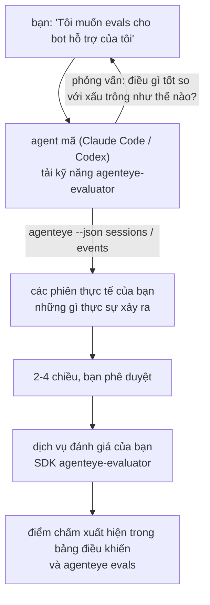

Từ *"Tôi nghĩ agent của chúng tôi đôi khi có vấn đề"* đến một dịch vụ chấm điểm được triển khai, với agent mã của bạn vừa quyết định vừa xây dựng. **Kỹ năng đánh giá Failproof AI Observability** (`agenteye-evaluator`) là một *Agent Skill*: một thư mục nhỏ chứa hướng dẫn mà một agent mã như Claude Code hoặc Codex tải theo yêu cầu. Nó dạy agent cách xác định những chiều độ chất lượng nào đáng theo dõi cho *agent của bạn*, rồi viết, kiểm tra và triển khai [dịch vụ đánh giá](/vi/agenteye/evaluation-suite) để chấm điểm chúng.

Nó **không phải** là một bộ chấm điểm được lưu trữ, một sổ đăng ký bạn tải lên, hay một hệ thống plugin. Bộ đánh giá của bạn vẫn là dịch vụ HTTP riêng của bạn trên cơ sở hạ tầng của bạn, chính xác như được mô tả trong hướng dẫn [Bộ đánh giá](/vi/agenteye/evaluation-suite). Kỹ năng chỉ dạy agent của bạn cách xây dựng nó tốt, vì vậy mọi thứ nó làm, bạn có thể làm được bằng cách viết cùng một mã.

---

## Phần khó là quyết định những gì cần chấm điểm

Bề mặt SDK nhỏ — một decorator và hai mô hình — và một agent có thể viết từ [hợp đồng](/vi/agenteye/evaluation-suite#http-contract) một mình. Đó không phải nơi các bộ đánh giá thất bại. Chúng thất bại vì chúng chấm điểm những thứ sai, và một bộ đánh giá chấm điểm những thứ sai còn tệ hơn không có: nó tạo ra một bảng điều khiển mà mọi người học cách bỏ qua.

Vì vậy hầu hết kỹ năng là phần trước khi bất kỳ mã nào tồn tại. Nó có agent phỏng vấn bạn (*"mô tả một lần chạy diễn ra tốt; bây giờ một lần chạy diễn ra tệ"*), sau đó kéo các phiên thực tế của bạn qua [`agenteye` CLI](/vi/agenteye/cli) và đọc chúng từ đầu đến cuối. Hai nửa này thường không đồng ý, và khoảng cách là điểm quan trọng: những gì bạn dự định đo lường so với những gì các bản ghi của bạn thực sự có thể hỗ trợ. Một chiều chỉ tồn tại nếu nó **có thể tính toán** từ các sự kiện và **phân biệt** — nếu nó chấm 0.9 trên cả lần chạy tốt và lần chạy tệ của bạn, nó không dạy gì và bị loại bỏ.

Kết quả trả lại là một đề xuất gồm 2-4 chiều với lý do đi kèm, để bạn phê duyệt trước khi viết một dòng nào.



---

## Nó liên quan như thế nào đến các phần đánh giá khác

Bốn tài liệu bao gồm chấm điểm, và chúng chuyển giao cho nhau theo thứ tự:

| Trang | Nó là gì | Hãy sử dụng nó khi |
|---|---|---|
| **[Evaluations](/vi/agenteye/evaluations)** | Tính năng: điểm chấm trên lưới phiên, bảng điều khiển, đánh giá lại | Bạn muốn biết chấm điểm tự động mang lại được gì |
| **[Evaluation suite](/vi/agenteye/evaluation-suite)** | Hợp đồng HTTP, SDK, các biến env máy chủ | Bạn đang triển khai hoặc gỡ lỗi bộ đánh giá tự mình |
| **Evaluator skill** (tài liệu này) | Một cửa ngôn ngữ tự nhiên về thiết kế *và* xây dựng bộ chấm điểm | Bạn muốn đi từ "Tôi muốn evals" đến một dịch vụ chạy |
| **[CLI skill](/vi/agenteye/cli-skill)** | Một cửa ngôn ngữ tự nhiên trên `agenteye` CLI | Bạn muốn *đọc* các điểm chấm bạn đã có |
| **[Python SDK skill](/vi/agenteye/python-sdk-skill)** | Một cửa ngôn ngữ tự nhiên trên công cụ máy của agent | Agent của bạn chưa phát hành phiên — không có gì để chấm điểm |

### vs. kỹ năng CLI: xây dựng so với đọc

Hai kỹ năng cố ý không trùng lặp, và cài đặt cả hai là thiết lập bình thường — agent chọn giữa chúng dựa trên những gì bạn yêu cầu:

- **`agenteye-evaluator`** (tài liệu này) xây dựng thứ *tạo ra* các điểm chấm. Công việc của nó kết thúc khi các điểm chấm hạ cánh lần đầu tiên.
- **[`agenteye-cli`](/vi/agenteye/cli-skill)** đọc các điểm chấm đã tồn tại (`agenteye evals`). *"Chất lượng có giảm tuần này không?"* là câu hỏi của nó, không phải của kỹ năng này.

---

## Điều kiện tiên quyết

1. **`agenteye` CLI được cài đặt và đăng nhập** (`pipx install agenteye`, rồi `agenteye login`). Kỹ năng dựa vào nó hai lần: để kéo các phiên thực tế nó thiết kế từ đó, và để xác nhận các điểm chấm của bạn hạ cánh ở cuối. Đăng nhập của bạn cần `events:read`, cộng với `evaluations:read` cho lần kiểm tra cuối cùng đó. Giống như kỹ năng CLI, nó **không thể** hoàn thành đăng nhập mã một lần qua email cho bạn.
2. **Nơi để bộ đánh giá được lưu trữ.** Nó được xây dựng thành một hình ảnh và chạy dưới dạng một dịch vụ chạy lâu dài, vì vậy nó cần một kho thực tế, không phải một tệp tạm thời. Các bộ đánh giá thường sống trong kho riêng của chúng, tách biệt với agent đang được chấm điểm — kỹ năng tìm kiếm một cái hiện có và hỏi trước khi xây dựng một cái mới.
3. **Bánh xe SDK `agenteye-evaluator`** — hãy đọc phần tiếp theo trước khi agent của bạn bắt đầu gõ các lệnh `pip`.

---

## Nơi để lấy nó

Kỹ năng được xuất bản trong bộ sưu tập kỹ năng công khai của Failproof AI:

**[github.com/FailproofAI/skills](https://github.com/FailproofAI/skills)** → [`skills/agenteye-evaluator/`](https://github.com/FailproofAI/skills/tree/main/skills/agenteye-evaluator)

Kho lưu trữ là công khai và kỹ năng không cần bất kỳ thông tin xác thực nào của riêng nó — nó chỉ điều khiển `agenteye` CLI với phiên *bạn* đã đăng nhập, và viết mã trong *kho* của bạn. Lưu ý nó được phát hành dưới dạng thư mục riêng của nó và **không** nằm trong gói `pipx install agenteye`, vì vậy đừng tìm kiếm nó ở đó.

## Cài đặt kỹ năng

Con đường nhanh nhất là CLI [`skills`](https://skills.sh), nó tìm nạp thư mục và thả nó nơi agent của bạn tìm kiếm:

```bash
# Claude Code, chỉ dự án này
npx skills add FailproofAI/skills --skill agenteye-evaluator -a claude-code

# mọi dự án (cài đặt vào ~/.claude/skills/)
npx skills add FailproofAI/skills --skill agenteye-evaluator -a claude-code -g --copy

# Codex thay thế
npx skills add FailproofAI/skills --skill agenteye-evaluator -a codex
```

Rồi quản lý nó như bất kỳ kỹ năng nào khác:

```bash
npx skills list -a claude-code           # cái nào được cài đặt
npx skills update agenteye-evaluator     # kéo phiên bản mới nhất
npx skills remove agenteye-evaluator     # gỡ bỏ nó
```

Thích cài đặt bằng tay? Một Agent Skill chỉ là một thư mục chứa một `SKILL.md` (cộng với các tham chiếu tùy chọn), vì vậy sao chép nó cũng hoạt động:

- **Claude Code**: đặt thư mục `agenteye-evaluator/` trong `~/.claude/skills/` (mọi dự án) hoặc `<kho-của-bạn>/.claude/skills/` (chỉ kho đó). Claude Code tự động khám phá nó — xác minh với danh sách `/skills`, hoặc chỉ cần hỏi về evals.
- **Codex (OpenAI)**: Codex đọc cùng một `SKILL.md`. `agents/openai.yaml` đi kèm đặt `allow_implicit_invocation: true`, vì vậy Codex tự động chọn kỹ năng khi một tác vụ khớp; nếu không hãy gọi nó rõ ràng là `$agenteye-evaluator`.

---

## SDK không có trên PyPI công khai

> **Cảnh báo:** Hãy đọc điều này trước khi để agent cài đặt SDK.

Kỹ năng là công khai; SDK nó điều khiển không phải. `agenteye-evaluator` chỉ được phát hành dưới dạng artefact phát hành riêng, và không giống `agenteye`, tên **chưa được yêu cầu trên PyPI công khai** — vì vậy một `pip install agenteye-evaluator` trực tiếp có thể kéo gói của người lạ vào dịch vụ đọc bản ghi của bạn. Đó là một vấn đề chuỗi cung ứng, không phải một lỗi đánh máy.

Kỹ năng biết điều này và hoạt động xuống một bậc cài đặt thay thế, dừng lại ở bậc đầu tiên áp dụng: mã nguồn monorepo nếu bạn ở trong kho AgentEye, nếu không thì bánh xe phát hành riêng từ GitHub Releases (cần quyền truy cập), và nếu không thể truy cập được cả hai thì nó **dừng lại và bảo bạn hỏi liên hệ Failproof AI của bạn để lấy bánh xe** thay vì tự ứng phó.

Vì vậy nếu agent của bạn đề xuất một `pip install agenteye-evaluator` trực tiếp từ PyPI công khai, đó là dấu hiệu cho thấy kỹ năng không bao giờ được tải. Dừng lại ở đó và kiểm tra nó được cài đặt.

---

## Những gì bạn có thể hỏi nó

Một chuyến đi thực tế bắt đầu với một yêu cầu mơ hồ và kết thúc bằng một thiết kế được ký phê duyệt, không phải mã:

```text
bạn   ▸ Tôi muốn evals cho bot hỗ trợ của chúng tôi. Tôi nghĩ nó đôi khi có vấn đề.

agent ▸ Trước khi tôi viết bất cứ điều gì: mô tả một lần chạy diễn ra tốt,
        và một lần chạy diễn ra tệ.

bạn   ▸ Tốt: nó trả lời từ các tài liệu. Tệ: nó bịa ra,
        hoặc từ bỏ và nói "liên hệ hỗ trợ".

agent ▸ Chạy: agenteye --json sessions --status error --since 7d
        Đang đọc 5 phiên, bao gồm hai cái bạn gọi là tệ.

        Những lời của bạn nói về tính thực tế và tránh né. Các bản ghi
        đồng ý về tránh né (2 trong 5 kết thúc bằng chuyển giao hỗ trợ,
        và nó rõ ràng trong model_response.content), nhưng tính thực tế
        cần một sự thật cơ bản mà các sự kiện của bạn không mang.

        Vì vậy tôi sẽ chấm ba điều:
          - deflection      các quy tắc, rẻ, phân tách hai lần chạy của bạn
          - tool_efficiency các quy tắc, bắt vòng lặp thử lại trong chạy-004
          - groundedness    thẩm phán LLM: mỗi yêu cầu trong tài liệu nó truy xuất có đúng không?

        "tính thực tế" sẽ cần sự thật cơ bản mà chúng tôi không có; groundedness
        là thứ gần nhất mà các bản ghi của bạn thực sự có thể hỗ trợ.
        OK với ba tên đó? Đổi tên sau này sẽ chia cắt lịch sử.

bạn   ▸ có

agent ▸ Không có bộ đánh giá trong kho này. Tôi có nên xây dựng một ở đây, hay
        bạn có một cái khác?
```

Từ đó nó viết các chiều dựa trên quy tắc trước tiên (miễn phí, tức thì, xác định), kiểm tra chúng so với một phiên thực tế được chụp bao gồm những cái rỗng và không bao giờ kết thúc những cái làm sụp đổ các bộ đánh giá ngây thơ, và chỉ tiếp cận một thẩm phán LLM trên chiều chủ quan. Nó biết [giới hạn của bộ phân phối](/vi/agenteye/evaluation-suite#configuring-the-server) — thời gian chờ yêu cầu 30 giây và 8 cuộc gọi đồng thời trên toàn bộ triển khai — vì vậy nếu thẩm phán không chắc chắn sẽ phù hợp, nó sẽ chạy không đồng bộ với `JobPending` thay vì để thẩm phán của bạn bị hủy và thử lại năm lần với chi phí năm lần cao hơn.

Rồi nó triển khai, đặt hai biến env máy chủ, và xác nhận bằng `agenteye --json evals --session-id <id>` rằng các điểm chấm thực sự hạ cánh. Các điểm chấm hạ cánh là bằng chứng duy nhất.

---

## Những gì cần chú ý

- **Tên chiều gần như vĩnh viễn.** Các khóa chấm điểm là những chuỗi tùy ý và nền tảng xu hướng bất kỳ cái nào bạn gửi, điều này có nghĩa là không có gì phía sau sửa một lựa chọn xấu. Đổi tên sau này và lịch sử bị chia cắt: các phiên cũ giữ khóa cũ và xu hướng bị phá vỡ. Đây là lý do tại sao kỹ năng nhận được phê duyệt rõ ràng trước khi viết mã — hãy xem xét lời nhắc đó một cách nghiêm túc.
- **Fixtures là các bản ghi sản xuất thực tế.** Thiết kế so với các phiên thực tế có nghĩa là kéo chúng xuống đĩa, và chúng có thể chứa dữ liệu khách hàng. Kỹ năng hỏi trước khi cam kết chúng vào git; nếu không chắc chắn, hãy giữ `fixtures/` ngoài kho và để từng nhà phát triển kéo của riêng họ.
- **Agent viết và triển khai một dịch vụ đọc mọi bản ghi.** Nó hoạt động như bạn, bị giới hạn bởi các quyền đăng nhập CLI của bạn, nhưng hãy xem xét bộ đánh giá như bất kỳ mã nào khác chạm vào dữ liệu sản xuất.

---

## Bước tiếp theo

- **[Evaluation suite](/vi/agenteye/evaluation-suite)**: hợp đồng HTTP, SDK, và các biến env máy chủ mà kỹ năng cấu hình.
- **[Evaluations](/vi/agenteye/evaluations)**: nơi các điểm chấm xuất hiện một khi chúng hạ cánh.
- **[CLI skill](/vi/agenteye/cli-skill)**: kỹ năng anh em, để đọc kết quả thay vì xây dựng bộ chấm điểm.
- **[CLI](/vi/agenteye/cli)**: tham chiếu lệnh phía sau dữ liệu phiên mà kỹ năng thiết kế từ đó.