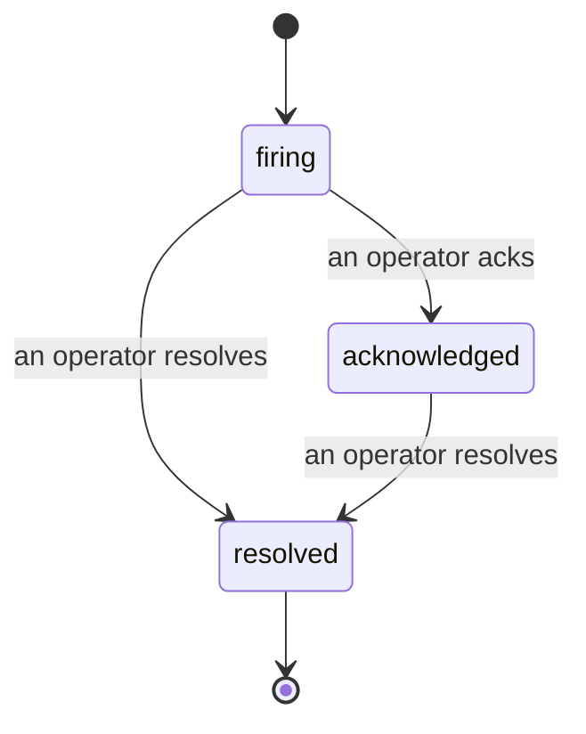

Khi một cảnh báo phát động, câu hỏi đầu tiên luôn là "ai đang xử lý nó?". Sự cố trả lời điều đó: ngay khi có gì đó vi phạm, mọi người đều có thể thấy sự cố đã mở, ai sở hữu nó, và chính xác những gì đã xảy ra cho đến nay, với một bản ghi sạch sẽ có người chịu trách nhiệm mà bạn có thể đưa thẳng vào bản phân tích hậu sự cố.

*Inbox nhóm các sự cố mở theo trạng thái và lọc theo mức độ nghiêm trọng và người chỉ định, vì vậy bạn sẽ thấy những gì cần một người xử lý ngay bây giờ.*

## Biết ai sở hữu nó, một cách nhanh chóng

Không còn "có ai đang xem cái này không?" trong một luồng chat. Một vi phạm sẽ tự động mở một sự cố và đưa nó vào hộp inbox được chia sẻ, được nhóm theo trạng thái. Thừa nhận nó và tên của bạn sẽ nằm trên đó, vì vậy phần còn lại của nhóm sẽ biết nó đã được xử lý. Thừa nhận là được chia sẻ: một số nhà khai thác có thể thừa nhận cùng một sự cố và mỗi cái được ghi lại riêng, vì vậy một phòng chiến tranh đầy đủ hiển thị theo tên thay vì xung đột lẫn nhau. Chỉ định một chủ sở hữu cho việc phân loại, và lọc inbox theo mức độ nghiêm trọng hoặc người chỉ định để giảm xuống những gì là của bạn.

## Toàn bộ câu chuyện, trong một dòng thời gian

Khi sự cố kết thúc, bạn đã có bản viết. Mở bất kỳ sự cố nào và bạn sẽ nhận được bằng chứng vi phạm, những người chỉ định và người đăng ký của nó, một luồng nhận xét để phối hợp tại chỗ, và một dòng thời gian hoạt động chỉ nối thêm.

*Mọi thứ đã xảy ra, theo thứ tự, mỗi dòng được ký bởi người đã làm nó.*

Mọi hành động (mở, thừa nhận, giải quyết, v.v.) được ghi vào dòng thời gian đó và không bao giờ được chỉnh sửa. Mỗi mục được ghi danh: cho nhà khai thác đã thực hiện nó, theo email, hoặc cho **automated** cho bất cứ điều gì FailproofAI Observability tự làm, như mở sự cố trên vi phạm. Không có gì là ẩn danh và không có gì bị mất, vì vậy bản phân tích hậu sự cố phần lớn tự viết.

## Sự cố di chuyển như thế nào

- **Mở (phát động):** vi phạm mở sự cố và page kênh của bạn một lần. Các vi phạm lặp lại gập vào cùng một sự cố và làm tươi bằng chứng của nó thay vì page bạn lặp đi lặp lại.
- **Đã thừa nhận:** một nhà khai thác nhận nó. Nó vẫn mở, và các vi phạm sau cập nhật bằng chứng một cách yên tĩnh.
- **Đã giải quyết:** một nhà khai thác đóng nó. Giải quyết tự động khi điều kiện được xóa được lên kế hoạch nhưng chưa được bật, vì vậy một sự cố vẫn mở cho đến khi một người xử lý giải quyết nó, điều này giữ cho mọi người trung thực về những gì thực sự đã được xóa. Một sự cố mới có thể mở trên cùng một cảnh báo sau.

Một cảnh báo chứa tối đa một sự cố mở tại một thời điểm, vì vậy một quy tắc flapping không thể chôn bạn trong các bản sao. Bạn cũng có thể mở một sự cố bằng tay: một sự cố độc lập cho thứ gì đó mà không có cảnh báo nào bắt được, hoặc một sự cố gắn với một cảnh báo hiện có, nếu bạn có `incidents:write`.

## Nơi tìm kiếm nó

Sự cố sống tại `/<org-slug>/incidents`. Xem cần **`incidents:read`**; mở một sự cố thủ công cần **`incidents:write`**; thừa nhận, chỉ định, bình luận, và giải quyết cần **`incidents:ack`**. Các khóa cũ hơn được cấp `alerts:ack` đã loại bỏ vẫn hoạt động, vì nó được coi là `incidents:ack`, vì vậy ca trực của bạn không cần phát hành lại.

## Liên quan

- [Cảnh báo](/vi/agenteye/alerts): các quy tắc mở các sự cố này khi một ngưỡng bị vi phạm.
- [Theo dõi lỗi](/vi/agenteye/error-tracking): xem mọi lỗi ở một nơi và nâng cao một cái lên cảnh báo.
- [Kiểm toán](/vi/agenteye/audits): nhà phân tích được lên lịch tìm thấy những lỗi mà không có quy tắc nào đang theo dõi.