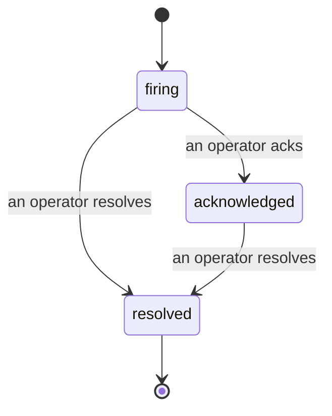

Khi một cảnh báo phát động, câu hỏi đầu tiên luôn là "ai đang xử lý?" Sự cố trả lời nó: ngay khi có vi phạm, mọi người có thể thấy sự cố đã mở, ai đang sở hữu nó, và chính xác những gì đã xảy ra cho đến nay, với một hồ sơ sạch sẽ và được ghi chú mà bạn có thể đưa thẳng vào phân tích hậu sự cố.

*Hộp thư nhóm các sự cố mở theo trạng thái và lọc theo mức độ nghiêm trọng và người được giao, vì vậy bạn chỉ thấy những gì cần sự can thiệp của con người ngay bây giờ.*

## Biết ai đang xử lý, một cách nhanh chóng

Không còn "có ai đang xem cái này không?" trong một luồng trò chuyện. Vi phạm sẽ tự động mở một sự cố và đặt nó vào hộp thư được chia sẻ, được nhóm theo trạng thái. Xác nhận nó và tên bạn sẽ được ghi lại, vì vậy phần còn lại của đội biết nó đang được xử lý. Xác nhận được chia sẻ: một số nhà khai thác có thể xác nhận cùng một sự cố và mỗi bản được ghi lại riêng biệt, vì vậy một phòng chiến đấu đầy đủ sẽ hiển thị theo tên thay vì ghi đè lên nhau. Giao một chủ sở hữu để phân loại, và lọc hộp thư theo mức độ nghiêm trọng hoặc người được giao để giảm xuống những gì là của bạn.

## Toàn bộ câu chuyện, trong một dòng thời gian

Khi sự cố kết thúc, bạn đã có bài viết. Mở bất kỳ sự cố nào và bạn sẽ nhận được bằng chứng vi phạm, những người được giao và những người đăng ký của nó, một luồng bình luận để phối hợp tại chỗ, và một dòng thời gian hoạt động chỉ được thêm vào.

*Mọi thứ đã xảy ra, theo thứ tự, mỗi dòng được ký bởi người đã thực hiện nó.*

Mỗi hành động (mở, xác nhận, giải quyết, v.v.) được ghi vào dòng thời gian đó và không bao giờ được chỉnh sửa. Mỗi mục được ghi chú: cho nhà khai thác đã thực hiện nó, theo email, hoặc cho **automated** cho bất kỳ điều gì Failproof AI Observability tự thực hiện, như mở sự cố khi có vi phạm. Không có gì là ẩn danh và không có gì bị mất, vì vậy phân tích hậu sự cố gần như tự viết được.

## Cách một sự cố tiến triển

- **Mở (firing):** vi phạm mở sự cố và phát trang trên các kênh của bạn một lần. Những vi phạm lặp lại sẽ được gộp vào cùng một sự cố và làm mới bằng chứng của nó thay vì phát trang cho bạn nhiều lần.
- **Xác nhận (acknowledged):** một nhà khai thác nhận nó. Nó vẫn mở, và các vi phạm sau đó sẽ cập nhật bằng chứng một cách yên tĩnh.
- **Giải quyết (resolved):** một nhà khai thác đóng nó. Giải quyết tự động khi điều kiện được xóa được lên kế hoạch nhưng chưa được bật, vì vậy một sự cố vẫn mở cho đến khi con người giải quyết nó, điều này giữ cho mọi người trung thực về những gì thực sự đã được xóa. Một sự cố mới có thể mở trên cùng một cảnh báo sau đó.

Một cảnh báo chứa tối đa một sự cố mở tại một thời điểm, vì vậy một quy tắc lên xuống không thể chôn vào các bản sao. Bạn cũng có thể mở một sự cố thủ công: một sự cố độc lập cho thứ gì đó không có cảnh báo nào bắt được, hoặc một sự cố được đính kèm vào một cảnh báo hiện có, nếu bạn có `incidents:write`.

## Tìm nó ở đâu

Các sự cố nằm ở `/<org-slug>/incidents`. Xem yêu cầu **`incidents:read`**; mở một sự cố thủ công yêu cầu **`incidents:write`**; xác nhận, giao, bình luận, và giải quyết yêu cầu **`incidents:ack`**. Những khóa cũ hơn được cấp `alerts:ack` đã ngưng dùng vẫn hoạt động, vì nó được tôn trọng là `incidents:ack`, vì vậy vòng xoay trong ca không cần phát hành lại.

## Liên quan

- [Cảnh báo](/vi/agenteye/alerts): các quy tắc mở những sự cố này khi ngưỡng bị vi phạm.
- [Theo dõi lỗi](/vi/agenteye/error-tracking): xem mọi lỗi ở một nơi và nâng cao một cảnh báo.
- [Kiểm toán](/vi/agenteye/audits): nhà phân tích theo lịch trình tìm những lỗi không có quy tắc nào đang theo dõi.