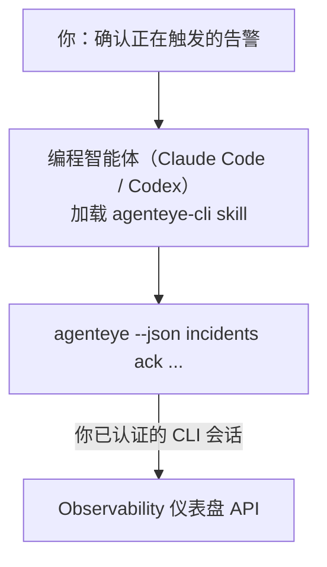

向你的编程智能体提问*"今天有什么异常吗？"*，让它直接从你的实时 FailproofAI Observability 数据中给出答案，无需记忆任何命令。**FailproofAI Observability CLI skill**（`agenteye-cli`）是一个 *Agent Skill*：一个小型指令文件夹，供 Claude Code 或 Codex 等编程智能体按需加载。它让智能体能够通过 [`agenteye` CLI](/zh/agenteye/cli) 响应自然语言请求来操作你的 Observability 部署，例如*"给 CI 创建一个只能推送事件的密钥"*或*"确认正在触发的告警并分配给我。"*

它**不是**一个服务或独立的二进制文件，无需任何部署。它运行在你已安装的 CLI 之上：智能体调用 `agenteye --json …`，解析整洁的 JSON，并以自然语言回答你。它能做的一切，你自己输入相同的命令同样可以完成。

---

## 与其他 FailproofAI Observability 界面的关系

FailproofAI Observability 提供四种方式访问相同的数据和控制功能，它们相互补充：

| 界面 | 说明 | 运行环境 | 适用场景 |
|---|---|---|---|
| **[CLI](/zh/agenteye/cli)** | `agenteye` 的命令与参数参考 | 你的终端 | 需要执行或脚本化某个具体命令时 |
| **[CLI 使用示例](/zh/agenteye/cli-recipes)** | 可直接复制的 `jq`/管道模式 | 终端 / 脚本 | 将 CLI 接入自动化流程时 |
| **CLI skill**（本文档） | 基于 CLI 的自然语言入口 | 你工作站上的编程智能体 | 想直接提问、让智能体选择命令时 |
| **[仪表盘内置 AI 助手](/zh/agenteye/assistant)** | 嵌入仪表盘的对话界面 | 服务端（仪表盘内） | 想在仪表盘中对数据进行问答时 |

skill 本身没有任何独立权限，它只是将你的语言转换为以你的身份运行的 CLI 调用：



### 与仪表盘内置 AI 助手的重要区别

这是两个影响范围截然不同的工具：

- **仪表盘内置 AI 助手**（[AI 助手](/zh/agenteye/assistant)）是嵌入仪表盘的对话界面，由智能体服务提供支持。它**只读，且写操作需要审批**：可以草拟已保存的查询和仪表盘，但每次写操作都会暂停并等待你明确点击确认，且永远不会执行删除操作。它受 `agent:use` 权限控制，且只能访问你当前查看的组织数据。
- **CLI skill** 在*你的*工作站上、*你的*编程智能体内运行，以**你的身份**驱动 `agenteye` CLI。它可以执行 CLI 的**全部功能，包括变更操作**（创建/轮换/停用 API 密钥、修改组织设置、解决告警、删除已保存的查询），仅受你 CLI 登录权限的约束。请像对待手动执行这些命令一样谨慎对待它。

---

## 前提条件

1. 已安装 **`agenteye` CLI** 并加入 `PATH`（参见 [CLI](/zh/agenteye/cli) 参考：`pipx install agenteye`）。
2. 已设置**仪表盘 URL**（`AGENTEYE_DASHBOARD_URL`，或由智能体传入 `--base-url`）。
3. 已**登录会话**：请先自行运行 `agenteye login`。skill **无法**代你完成邮件一次性验证码登录；若会话缺失或已过期（CLI 退出码 `4`），它会提示你运行 `agenteye login`。

---

## 安装 skill

Agent Skill 是包含 `SKILL.md`（及可选引用文件）的文件夹。通过将 `agenteye-cli` skill 文件夹放置到智能体查找 skill 的位置来完成安装：

- **Claude Code**：将 `agenteye-cli/` 文件夹复制到 `~/.claude/skills/`（在所有项目中可用）或 `<your-repo>/.claude/skills/`（仅限该仓库）。Claude Code 会自动发现它；可通过 `/skills` 列表验证，或直接提一个与其描述匹配的问题。
- **Codex（OpenAI）**：Codex 读取同一个 `SKILL.md`。随附的 `agents/openai.yaml` 设置了 `allow_implicit_invocation: true`，因此当任务匹配时 Codex 会自动选择该 skill；否则可通过 `$agenteye-cli` 显式调用。

该 skill 与 `agenteye` CLI 一起维护，但以**独立文件夹**的形式交付，不包含在 `pipx install agenteye` 包内，请勿在那里查找。FailproofAI Observability 会单独向你提供 `agenteye-cli/` 文件夹；如果你没有，请联系你的 FailproofAI 对接人。它完全不受访问限制：无需任何凭据，因为它只是驱动**公开的** `agenteye` CLI 访问你自己的仪表盘。

---

## 安全须知：智能体运行 CLI 时，变更操作不会弹出确认提示

> **警告：** 在让智能体执行变更之前，请先阅读本节。

`agenteye` CLI 通常在执行破坏性操作前会询问*"确定吗？"*。但**当它未附加到终端时（编程智能体正是以这种方式运行它的），以及使用 `--json` 时，该确认会被自动跳过。** 因此，安全提示对智能体**不会触发**。

skill 的设计已考虑到这一点：它被指示在执行任何状态变更前，先说明将要运行的确切命令，并征得你明确的**同意**。请保持这一习惯。通过智能体操作 FailproofAI Observability 时，*你*就是确认环节。需要重点关注的变更命令包括：

- `keys create` / `update` / `disable` / `regenerate`
- `users create` / `update` / `disable` / `enable`
- `settings set`
- `alerts create` / `update` / `delete` / `test`
- `incidents` 的写操作子命令：`ack` / `assign` / `resolve` / `open` / `comment-add` / `comment-delete` / `subscribe` / `unsubscribe`
- `query create` / `update` / `delete`
- `agent rename` / `delete`
- `orgs switch`

**Observe** 下的所有内容（`events`、`sessions`、`evals`、`errors`、`list`、`whoami`、`orgs list/current/perms`）均为只读，不会修改任何数据。

由于智能体以**你的身份**行事，它只能执行你的登录所允许的操作；权限按**组织**解析（参见 [API 密钥](/zh/agenteye/api-keys)）。如果某个命令超出你的权限，将返回退出码 `5` 并明确指出所需权限名称，智能体可以准确告知你需要向管理员申请什么，而不会模糊地报错。

---

## 你可以询问的内容

以下是一个完整交互示例——先查询，再执行一个等待你确认的变更：

```text
你    ▸ 最近一天有什么异常吗？

智能体 ▸ 正在运行：agenteye --json errors --since 24h --aggregate
         过去 24 小时内有 3 种错误类型。最多的是 TimeoutError
         （18 次，全部发生在 checkout-agent），其次是 RateLimited（5 次）。
         需要查看 TimeoutError 的失败会话吗？

你    ▸ 给 CI 创建一个只能推送事件的密钥。

智能体 ▸ 这将创建一个 API 密钥。我将运行：
           agenteye keys create ci --add events:add
         确认执行吗？

你    ▸ 是

智能体 ▸ 完成。已创建密钥 "ci"，仅具有 events:add 权限。
         该密钥只会显示一次，请立即保存。我无法再次展示它。
```

skill 将每个自然语言意图映射到正确的 `agenteye` 命令，先通过 `list <kind>`、`whoami` 等发现有效值，而不是猜测，并在执行任何变更前说明确切命令。更多示例：

- *"最近 24 小时有什么异常/报错？"* → `errors --since 24h --aggregate`，然后给出详细分解。
- *"会话 `run-001` 为什么失败？"* → `events --session-id run-001 --all` + `evals --session-id run-001`。
- *"本周质量趋势如何？"* → `evals --aggregate --since 7d`，然后深入分析低分运行。
- *"给 CI 创建一个只能推送事件的密钥。"* → `keys create ci --add events:add`（先说明命令，确认后创建并捕获一次性密钥）。
- *"谁有访问权限？将 Dana 设为只读。"* → `users list` → `users update dana@… --permission-set read-only`（在向你确认后执行）。
- *"确认正在触发的告警并分配给我。"* → `incidents list --state firing` → `incidents ack <id>` / `incidents assign <id> you@…`。

有关这些操作背后的确切命令、参数和 JSON 格式，请参阅 [CLI](/zh/agenteye/cli) 参考和[智能体 CLI 使用示例](/zh/agenteye/cli-recipes)。

---

## 后续步骤

- **[CLI](/zh/agenteye/cli)**：`agenteye` 的完整命令和参数参考。
- **[智能体 CLI 使用示例](/zh/agenteye/cli-recipes)**：可直接复制的 `jq` 模式和退出码处理方法。
- **[AI 助手](/zh/agenteye/assistant)**：仪表盘内置助手（与本终端 skill 不同）。
- **[API 密钥](/zh/agenteye/api-keys)**：限定 skill 能力范围的按组织权限模型。