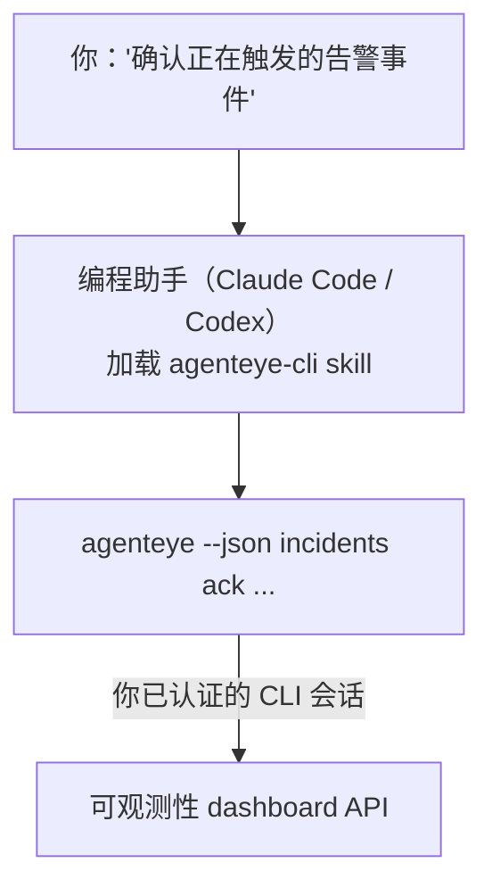

向你的编程助手问一句*「今天有什么问题吗？」*，让它直接从你的 Failproof AI 可观测性实时数据中给出答案，无需记忆任何命令。**Failproof AI 可观测性 CLI skill**（`agenteye-cli`）是一个 *Agent Skill*：一个小型指令文件夹，编程助手（如 Claude Code 或 Codex）可按需加载。它让助手能够通过 [`agenteye` CLI](/zh/agenteye/cli) 响应自然语言请求，例如*「给 CI 创建一个只能推送事件的密钥」*或*「确认正在触发的告警事件并将其分配给我」*。

它**不是**服务，也不是独立的可执行文件，无需任何部署。它运行在你已安装的 CLI 之上：助手调用 `agenteye --json …`，解析干净的 JSON，然后以自然语言回答你。它能做的一切，你自己敲同样的命令也能完成。

---

## 与其他 Failproof AI 可观测性接口的关系

Failproof AI 可观测性提供四种访问相同数据和控制项的方式，它们互为补充：

| 接口 | 说明 | 运行环境 | 适用场景 |
|---|---|---|---|
| **[CLI](/zh/agenteye/cli)** | `agenteye` 的命令/标志参考手册 | 你的终端 | 需要执行或脚本化某个具体命令时 |
| **[CLI 使用示例](/zh/agenteye/cli-recipes)** | 可直接复制的 `jq`/管道模式 | 你的终端 / 脚本 | 将 CLI 接入自动化流程时 |
| **CLI skill**（本文档） | CLI 的自然语言入口 | 你工作站上的编程助手 | 只想直接提问，让助手选择命令时 |
| **[Evaluator skill](/zh/agenteye/evaluator-skill)** | 用于设计和构建评分服务的同类 skill | 你工作站上的编程助手 | 需要*生成*评估分数而非读取时 |
| **[Python SDK skill](/zh/agenteye/python-sdk-skill)** | 用于为你的 agent 添加遥测埋点的同类 skill | 你工作站上的编程助手 | 需要让你的 agent *生成*本 skill 所读取的事件时 |
| **[Dashboard 内置 AI 助手](/zh/agenteye/assistant)** | 嵌入 dashboard 的对话界面 | 服务端（在 dashboard 中） | 需要在 dashboard 内对数据进行问答时 |

该 skill 本身没有任何特权，它只是将你的语言转换为以你的身份运行的 CLI 调用：



### 与 dashboard 内置 AI 助手的重要区别

这是两个不同的工具，影响范围差异显著：

- **Dashboard 内置 AI 助手**（[AI 助手](/zh/agenteye/assistant)）是嵌入 dashboard 的对话界面，由 agent 服务提供支持。它是**只读加审批式创作**模式：可以起草已保存的查询和 dashboard，但每次写入操作都会暂停并等待你明确点击确认，且不会执行删除操作。它受 `agent:use` 权限控制，只能访问你当前查看的组织数据。
- **CLI skill** 在*你的*工作站上，在*你的*编程助手内运行，以**你**的身份驱动 `agenteye` CLI。它可以执行 CLI 的**全部功能，包括变更操作**（创建/轮换/禁用 API 密钥、修改组织设置、解决告警事件、删除已保存查询），仅受你 CLI 登录权限的限制。请以与手动执行这些命令同等的谨慎程度来对待它。

---

## 前置条件

1. 已安装 **`agenteye` CLI** 并加入 `PATH`（参见 [CLI](/zh/agenteye/cli) 参考手册：`pipx install agenteye`）。
2. 已设置 **Dashboard URL**（`AGENTEYE_DASHBOARD_URL`，或由助手传入 `--base-url`）。
3. 已有**登录会话**：请先自行运行 `agenteye login`。该 skill **无法**代你完成邮件一次性验证码的登录流程；如果会话缺失或已过期（CLI 退出码 `4`），它会提示你运行 `agenteye login`。

---

## 获取途径

该 skill 已发布在 Failproof AI 的公开 skills 集合中：

**[github.com/FailproofAI/skills](https://github.com/FailproofAI/skills)** → [`skills/agenteye-cli/`](https://github.com/FailproofAI/skills/tree/main/skills/agenteye-cli)

无任何访问限制——该仓库是公开的，skill 本身也不需要任何凭证，因为它只是通过*你*登录的会话，驱动**公开**的 `agenteye` CLI 访问*你的* dashboard。你无需向任何人申请。

注意该 skill 作为独立文件夹发布，**不**包含在 `pipx install agenteye` 包中，请不要在那里寻找。

## 安装 skill

最快捷的方式是使用 [`skills`](https://skills.sh) CLI，它会自动拉取文件夹并放置到助手的查找路径中：

```bash
# Claude Code，仅限当前项目
npx skills add FailproofAI/skills --skill agenteye-cli -a claude-code

# 所有项目（安装到 ~/.claude/skills/）
npx skills add FailproofAI/skills --skill agenteye-cli -a claude-code -g --copy

# 改用 Codex
npx skills add FailproofAI/skills --skill agenteye-cli -a codex
```

然后像管理其他 skill 一样进行维护：

```bash
npx skills list -a claude-code      # 查看已安装的 skill
npx skills update agenteye-cli      # 拉取最新版本
npx skills remove agenteye-cli      # 移除
```

更倾向于手动安装？Agent Skill 本质上只是一个包含 `SKILL.md`（及可选参考文件）的文件夹，直接复制同样有效：

- **Claude Code**：将 `agenteye-cli/` 文件夹放入 `~/.claude/skills/`（所有项目）或 `<your-repo>/.claude/skills/`（仅该仓库）。Claude Code 会自动发现它——通过 `/skills` 列表确认，或直接提问匹配其描述的问题即可。
- **Codex（OpenAI）**：Codex 读取相同的 `SKILL.md`。随附的 `agents/openai.yaml` 设置了 `allow_implicit_invocation: true`，因此当任务匹配时 Codex 会自动选择该 skill；否则可通过 `$agenteye-cli` 显式调用。

---

## 安全提示：助手运行 CLI 时变更操作不会弹出确认提示

> **警告：** 允许助手执行变更操作前，请务必阅读本节。

`agenteye` CLI 通常在执行破坏性操作前会询问*「确认吗？」*。但**当它未连接到终端时（编程助手的运行方式正是如此），该确认步骤会被自动跳过，`--json` 标志也会跳过它。** 因此，安全确认提示**不会**在助手调用时触发。

该 skill 在编写时已对此进行了补偿：它被要求在执行任何状态变更前，明确说明将要运行的命令并获得你的明确**确认**。请保持这一习惯。当你通过助手操作 Failproof AI 可观测性时，*你*就是那个确认步骤。需要重点关注的变更类命令：

- `keys create` / `update` / `disable` / `regenerate`
- `users create` / `update` / `disable` / `enable`
- `settings set`
- `alerts create` / `update` / `delete` / `test`
- 写入类 `incidents` 子命令：`ack` / `assign` / `resolve` / `open` / `comment-add` / `comment-delete` / `subscribe` / `unsubscribe`
- `query create` / `update` / `delete`
- `agent rename` / `delete`
- `orgs switch`

**Observe** 下的所有命令（`events`、`sessions`、`evals`、`errors`、`list`、`whoami`、`orgs list/current/perms`）均为只读操作，不会产生任何变更。

由于助手以**你**的身份行事，它只能执行你的登录账号有权限执行的操作；权限按**组织**维度解析（参见 [API 密钥](/zh/agenteye/api-keys)）。若某条命令超出你的权限范围，将返回退出码 `5` 并说明所需的具体权限名称，助手可以精确告知你需要向管理员申请什么，而不是模糊报错。

---

## 可以向它提问什么

以下是一次真实交互的完整示例——先读取数据，再执行一个等待你确认的变更操作：

```text
you   ▸ 过去一天有什么问题吗？

agent ▸ 正在运行：agenteye --json errors --since 24h --aggregate
        过去 24 小时内共有 3 种错误类型。最多的是 TimeoutError
        （18 次，全部来自 checkout-agent），其次是 RateLimited（5 次）。
        需要查看 TimeoutError 的失败会话吗？

you   ▸ 给 CI 创建一个只能推送事件的密钥。

agent ▸ 这将创建一个 API 密钥。我将运行：
          agenteye keys create ci --add events:add
        确认继续吗？

you   ▸ 是的

agent ▸ 完成。密钥 "ci" 已创建，权限仅为 events:add。
        密钥内容只显示一次，请立即保存。我无法再次打印。
```

该 skill 将每种自然语言意图映射到正确的 `agenteye` 命令，先发现有效值（`list <kind>`、`whoami`）避免猜测，并在任何变更前说明确切命令。更多示例：

- *「过去 24 小时内有什么问题/失败吗？」* → `errors --since 24h --aggregate`，然后给出详细分解。
- *「会话 `run-001` 为什么失败？」* → `events --session-id run-001 --all` + `evals --session-id run-001`。
- *「本周质量趋势如何？」* → `evals --aggregate --since 7d`，然后深入分析低分运行记录。
- *「给 CI 创建一个只能推送事件的密钥。」* → `keys create ci --add events:add`（先说明命令，确认后创建并捕获一次性密钥）。
- *「谁有访问权限？将 Dana 设为只读。」* → `users list` → `users update dana@… --permission-set read-only`（与你确认后执行）。
- *「确认正在触发的告警事件并分配给我。」* → `incidents list --state firing` → `incidents ack <id>` / `incidents assign <id> you@…`。

有关这些操作背后的确切命令、标志和 JSON 结构，请参阅 [CLI](/zh/agenteye/cli) 参考手册和 [CLI 使用示例（面向 agent）](/zh/agenteye/cli-recipes)。

---

## 后续步骤

- **[CLI](/zh/agenteye/cli)**：`agenteye` 的完整命令和标志参考手册。
- **[CLI 使用示例（面向 agent）](/zh/agenteye/cli-recipes)**：可直接复制的 `jq` 模式及退出码处理方式。
- **[Evaluator agent skill](/zh/agenteye/evaluator-skill)**：同类 skill，用于构建 `agenteye evals` 所读取评分的评估器。
- **[Python SDK agent skill](/zh/agenteye/python-sdk-skill)**：同类 skill，用于为 agent 添加遥测埋点，使其发送 `agenteye` 读取的遥测数据。
- **[AI 助手](/zh/agenteye/assistant)**：Dashboard 内置助手（请勿与本终端 skill 混淆）。
- **[API 密钥](/zh/agenteye/api-keys)**：按组织划分的权限模型，限定该 skill 的操作范围。