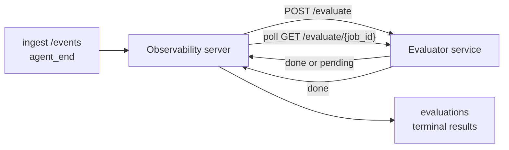

Failproof AI Observability 可以自动为每次完成的 Agent 运行评分：您只需提供一个小型评分服务，Observability 负责其余一切。使用它来追踪您关心的维度（帮助性、工具效率、事实准确性、安全性；由您选择），尽早发现回归问题，并一目了然地比较不同 Agent 或环境。评分功能为可选项：在服务器上设置 `EVALUATOR_ENDPOINT` 之前，流水线不会执行任何操作。

> **注意：** 评分维度由您自行定义。您的评估器可以返回任意数值键；Observability 会存储、趋势化并展示您返回的所有内容。

## 概览

1. **编写评分器。** 搭建一个小型 HTTP 服务，读取会话记录并返回评分。Observability 附带一个可直接复用的参考实现。参见[使用 SDK 编写评估器](#writing-an-evaluator-with-the-sdk)。
2. **将 Observability 指向该服务。** 在服务器进程上设置 `EVALUATOR_ENDPOINT`（以及共享的 `EVALUATOR_TOKEN`）。
3. **查看评分结果。** 每个已完成的会话都会被自动评分；结果显示在会话详情页、会话列表网格以及已保存的仪表盘中。


*配置评估器后，每次完成的运行都会被评分，结果显示在会话右侧边栏：顶部为摘要，下方为各维度评分条及推理说明。*

---

## 工作原理



当 Observability SDK 为某个会话发出 `agent_end` 事件时，服务器会安排一次评估。随后它向您的评估器服务发送 POST 请求，包含完整的事件记录，评估器可以：

- **内联返回结果**，格式为 `{"status":"done", "scores":{...}, "reasoning":{...}, "summary":"..."}`。结果将追加到该会话的评估时间线中。`reasoning` 和 `summary` 为可选项。
- **延迟处理**，返回 `{"status":"pending", "job_id":"abc-123"}`。Observability 随后会调用 `GET {EVALUATOR_ENDPOINT}/evaluate/abc-123`，直到评估器返回 `{"status":"done", ...}` 或 `{"status":"error", "error":"..."}`。

  轮询节奏按任务设定：`pending` 响应中可包含 `next_poll_secs` 来覆盖默认值；否则 Observability 使用 `GET /config` 返回的 `default_poll_interval_secs`；再否则服务器回退到 `EVALUATOR_POLLING_INTERVAL_SECS`（默认 10 秒）。所有值均被限制在 [1s, 1h] 范围内。

从未发出 `agent_end` 的会话（例如 Agent 进程崩溃）也可被处理：评估器的 `GET /config` 可返回 `{"inactivity_timeout_secs": 1800}`，Observability 将对空闲时间超过该值的会话进行评估。将该字段设为 `null` 或省略则禁用此回退机制。

当 `EVALUATOR_ENDPOINT` 未设置时，流水线完全不执行任何操作。

一个会话可以随时间**累积多个终态评估**：每个 `agent_end` 事件（以及每次从仪表盘手动触发的重新评估）都会追加一条新的评估记录。这是评估续话会话的标准方式：用户结束 Agent，稍后返回，发送更多事件，再次结束 Agent，第二次评估将针对完整更新后的记录运行。仪表盘将最新评估作为主显示，将之前的评估以可折叠时间线展示。当一个会话正在进行评估时，该会话的其他 `agent_end` 事件将被忽略；正在运行的评估完成后，下一个事件将按常规触发新的评估入队。

空闲回退机制在续话会话上同样生效：如果在某次终态评估之后有新事件到来，且会话随后空闲时间超过 `inactivity_timeout_secs`，将触发新的评估入队。

暂时性失败（5xx、429、超时、网络错误）会以指数退避方式重试，最多重试 `EVALUATOR_MAX_ATTEMPTS` 次；4xx 响应为终态错误。Observability 可安全地以多个水平扩展的服务器实例运行；工作会被分区，确保同一会话不会被并发分配两次。

---

## HTTP 协议规范

每个需要鉴权的路由均使用 **Bearer Token 认证**。两端必须配置相同的值：

- Observability 服务器：环境变量 `EVALUATOR_TOKEN`
- 评估器服务：以相同方式配置（`agenteye-evaluator` SDK 按惯例读取 `EVALUATOR_TOKEN`）

若 `EVALUATOR_TOKEN` 未设置，服务器发送请求时不携带 `Authorization` 头；评估器可接受匿名请求，这在仅内部网络使用时没有问题，但不建议在公网上使用。

### 评估器必须提供的路由

| 路由 | 请求体 / 参数 | 响应 |
|---|---|---|
| `GET /health` | 无 | `{"status":"ok"}`（公开，无需鉴权） |
| `GET /config` | 无 | `{"inactivity_timeout_secs": <int> \| null, "default_poll_interval_secs": <int> \| omitted}` |
| `POST /evaluate` | `EvalRequest` JSON | `{"status":"done", ...}` 或 `{"status":"pending", "job_id":"..."}` |
| `GET /evaluate/{id}` | 无 | 与 `/evaluate` 相同的响应结构 |

### 服务器发送的 `EvalRequest` 请求体

```json
{
  "schema_version": "1",
  "session_id":     "session-abc123",
  "agent_id":       "planner",
  "environment":    "production",
  "started_at":     "2026-05-10T12:00:00Z",
  "ended_at":       "2026-05-10T12:05:00Z",
  "events": [
    { "id": 1234, "ts": "...", "event_type": "agent_start", "payload": { ... } },
    ...
  ]
}
```

### 响应格式

**同步（完成）：**

```json
{
  "status": "done",
  "scores": { "helpfulness": 0.85, "tool_efficiency": 0.6 },
  "reasoning": {
    "helpfulness": "answered the question directly with citations",
    "tool_efficiency": "called list_files three times when one would have done"
  },
  "summary": "strong answer quality, weak tool selection"
}
```

`reasoning`（各评分的理由说明映射）和 `summary`（整体一段式叙述）均为可选项。`reasoning` 中的键应与 `scores` 中的键对应；仪表盘会在每个评分条下方内联展示各条目。只返回 `scores` 的旧版评估器无需任何修改仍可正常工作；`reasoning` 和 `summary` 读取为 null，对应的界面元素将被隐藏。

**异步（延迟）：**

```json
{ "status": "pending", "job_id": "abc-123", "next_poll_secs": 30 }
```

`next_poll_secs` 为可选项；若省略，服务器回退到评估器 `/config` 中的 `default_poll_interval_secs`，再回退到自身的 `EVALUATOR_POLLING_INTERVAL_SECS` 环境变量。

**评估器侧终态错误：**

```json
{ "status": "error", "error": "model service unavailable" }
```

服务器将任何其他 2xx 响应体视为协议错误，并为该会话记录一个终态 `error`。

---

## 使用 SDK 编写评估器

您无需手动实现 HTTP 协议规范。`agenteye-evaluator` Python 包提供了一个带类型的 FastAPI 封装，为您处理鉴权、路由以及请求/响应格式。

Failproof AI Observability 还附带一个**可运行的参考评估器**，它根据记录的结构评分 `helpfulness`、`tool_efficiency` 和 `factuality`。将其作为起点复制，换入您自己的逻辑：LLM 裁判、规则引擎，或任何符合您质量标准的方案。

最简评估器示例：

```python
import os
from agenteye_evaluator import Evaluator, EvalRequest, EvalResponse

app = Evaluator(token=os.environ["EVALUATOR_TOKEN"])

@app.evaluator
def run(req: EvalRequest) -> EvalResponse:
    # Inspect req.events (the full session transcript) and return scores.
    tool_calls = sum(1 for e in req.events if e.event_type == "tool_use")
    return EvalResponse(
        scores={"tool_calls": float(tool_calls)},
        reasoning={"tool_calls": f"{tool_calls} tool invocations in the transcript"},
        summary="tight tool loop" if tool_calls < 5 else "agent looped on tools",
    )
```

`app` 实例可在任意 ASGI 服务器下运行，使用 `uvicorn module:app` 即可启动。

对于需要延迟处理耗时任务的评估器，可返回 `JobPending` 并注册 `@app.job_lookup` 处理器；Observability 服务器将轮询 `GET /evaluate/{job_id}`，直到您返回终态状态或达到 `EVALUATOR_MAX_POLL_DURATION_SECS` 上限（默认 1 小时）。

完整 API 参考、异步模式及事件模式均记录在 `agenteye-evaluator` SDK 的 README 中。

---

## 运行您的评估器

评估器是**您自己的服务** —— Failproof AI Observability 不提供默认评估器，因此您需要在自己的服务环境中构建和运行它。它可在任意 ASGI 服务器下运行（例如 `uvicorn my_evaluator:app`）；根据 [HTTP 协议规范](#http-contract) 提供 `/health`、`/config` 和 `/evaluate` 路由，然后将服务器指向它（参见[配置服务器](#configuring-the-server)）。

评估器可达后，`GET /health` 将返回 `{"status":"ok"}`。Agent 完成端到端运行后，在服务器上调用 `GET /evaluations` 将返回一条 `status: "done"` 的记录，以及您的评估器生成的评分。

---

## 配置服务器

在服务器进程上设置以下环境变量：

| 环境变量 | 说明 |
|---|---|
| `EVALUATOR_ENDPOINT` | 评估器的基础 URL（如 `http://evaluator:9000`）。未设置 = 流水线禁用。 |
| `EVALUATOR_TOKEN` | Bearer token。必须与评估器服务配置的值一致。 |
| `EVALUATOR_WORKERS` | 每个服务器实例的工作任务数（默认 2）。 |
| `EVALUATOR_CLAIM_BATCH` | 每个工作任务每次获取的行数（默认 4）。批次**并发**处理；评估器端点的实际并发量为 `EVALUATOR_WORKERS × EVALUATOR_CLAIM_BATCH`。 |
| `EVALUATOR_POLL_IDLE_SECS` | 无待处理评估时，工作任务两次调度尝试之间的休眠时长（默认 2 秒）。 |
| `EVALUATOR_POLLING_INTERVAL_SECS` | 当响应中的 `next_poll_secs` 和评估器的 `default_poll_interval_secs` 均未设置时，`GET /evaluate/{id}` 的最终回退轮询间隔（默认 10 秒）。 |
| `EVALUATOR_REQUEST_TIMEOUT_MS` | 单次请求超时时间（默认 30000 毫秒）。 |
| `EVALUATOR_MAX_ATTEMPTS` | 暂时性失败达到此次数后，结果将被记录为终态 `error`（默认 5）。 |
| `EVALUATOR_CONFIG_REFRESH_SECS` | `GET /config` 的刷新间隔（默认 300 秒）。 |
| `EVALUATOR_MAX_POLL_DURATION_SECS` | 会话在轮询队列中允许停留的最长挂钟时间，超出后将被标记为 `timeout`（默认 3600 秒）。防止评估器持续返回 `pending`。 |

要开启自动评分，在服务器上同时设置 `EVALUATOR_ENDPOINT` 和 `EVALUATOR_TOKEN`，然后重启服务器使配置生效。`EVALUATOR_ENDPOINT` 未设置时，流水线保持空操作状态。

上述调优参数均为可选项；仅在需要覆盖默认值时，才在服务器上设置对应的环境变量。

---

## API 参考

| 方法 | 路径 | 所需权限 | 用途 |
|---|---|---|---|
| `GET` | `/evaluations` | `evaluations:read` | 查询终态结果。支持 `session_id`、`agent_id`、`environment`、`status`（`done`/`error`/`timeout`）、`ts_from`、`ts_to`、`cursor`、`limit`、`score_filters`、`latest_per_session`。`limit` 默认为 50，上限为 200（注意与 `/events` 不同，`/events` 上限为 1000）。`environment` 接受逗号分隔的列表（如 `environment=prod,staging`）；单个值同样有效。设置 `latest_per_session=true` 时，每个 `session_id` 最多返回一条记录（按 `completed_at` 最新的），会话列表页用此功能将评估时间线折叠为当前主显示。默认为 false（返回完整历史）。 |
| `GET` | `/evaluations/aggregate` | `evaluations:read` | 对筛选范围的评估健康状况进行汇总：总数、done/error/timeout 分布、各评分键的统计数据（对任意 `scores` 键的 count/avg/min/max/p50），以及按时间分桶的趋势图。接受与 `/evaluations` **相同的筛选参数**，另加 `featured_keys`（要趋势化的评分键，逗号分隔）和 `latest_per_session`。为仪表盘功能提供支持；指标对全量匹配集精确计算，不进行抽样。 |
| `GET` | `/evaluations/environments` | `evaluations:read` | 返回 `evaluations` 表中的不同 environment 值。用于填充评估数据范围的筛选下拉框。 |
| `GET` | `/evaluation-jobs` | `evaluations:read` | 查看进行中的评估。支持按 `status`（`pending`/`polling`）筛选。 |
| `GET` | `/events` | `events:read` | 流式获取会话的原始事件。支持 `session_id`、`agent_id`、`event_type`（逗号分隔）、`environment`（逗号分隔）、`ts_from`、`ts_to`、`cursor`、`limit` 和 `order`。`order` 为 `desc`（最新在前，默认）或 `asc`（最早在前）；无法识别的值回退为 `desc`。通过响应中的 `next_cursor`（事件 id）进行游标分页：将其作为 `cursor` 传回以获取下一页；`asc` 模式下下一页为该 id 之后的事件，`desc` 模式下为该 id 之前的事件。`limit` 默认为 50，上限为 1000。 |
| `GET` | `/sessions/:session_id/export` | `events:read` | 返回评估器将为该会话接收的完整 JSON 请求体，作为名为 `session-<id>.json` 的可下载附件提供。适用于将生产会话通过 `agenteye-evaluator` 进行离线回放测试。字节内容与评估流水线发送的完全一致。 |
| `POST` | `/sessions/:session_id/re-evaluate` | `evaluations:trigger` | 为会话入队一次新的评估；无论之前是否存在评估均可触发。新结果将**追加**到会话的评估时间线中，而非覆盖之前的记录，因此历史评分仍可查看。入队成功返回 `202`，未知会话返回 `404`，已有评估正在进行返回 `409`。适用于部署新评估器后，或针对从未发出 `agent_end` 的会话。 |

### 按评分范围筛选：`score_filters`

`GET /evaluations` 接受可选的 `score_filters` 参数，根据 `scores` 对象中的数值缩小结果范围。该参数为逗号分隔的 `key:min..max` 条目列表；两端边界均可省略。多个条目以逻辑 AND 组合。指定键不存在或非数值的行将被排除。单次请求最多允许 20 个筛选条目；超出将返回 HTTP 400。

示例：
```text
# helpfulness 在 [0.5, 0.8] 范围内
GET /evaluations?score_filters=helpfulness:0.5..0.8

# tool_efficiency 至多 0.3（无下限）
GET /evaluations?score_filters=tool_efficiency:..0.3

# helpfulness >= 0.5 且 factuality >= 0.9
GET /evaluations?score_filters=helpfulness:0.5..,factuality:0.9..
```

每条 `/evaluations` 响应对象包含以下字段：

| 字段 | 类型 | 说明 |
|---|---|---|
| `evaluation_id` | string (UUID) | 该终态评估的唯一标识符。每次终态评估获得一个新 UUID；单个会话可拥有多个。 |
| `id` | string (UUID) | 向后兼容的别名，与 `evaluation_id` 值相同。 |
| `session_id` | string | 该评估运行所针对的会话。一个会话可在时间线中拥有多个评估。 |
| `agent_id` | string | 标识生成该会话的 Agent。 |
| `environment` | string | 从会话复制的环境标签。 |
| `status` | enum | `"done"`、`"error"`、`"timeout"` 之一。 |
| `scores` | object \| null | 评估器返回的评分。 |
| `reasoning` | object \| null | 评估器返回的可选各评分理由映射。键通常与 `scores` 中的键对应。仪表盘在每个评分条下方展示各条目。 |
| `summary` | string \| null | 评估器返回的可选整体一段式叙述。仪表盘在各评分分项之上将其作为评估标题展示。 |
| `error` | string \| null | 仅在 `"error"` / `"timeout"` 时填充。 |
| `attempt_count` | integer | 调度尝试次数（≥ 1）。 |
| `duration_ms` | integer \| null | 最后一次尝试的持续时长。 |
| `completed_at` | string (ISO 8601 UTC) | 终态结果记录的时间。结果按 `completed_at` 排序（最新在前）。 |
| `created_at` | string (ISO 8601 UTC) | 与 `completed_at` 时间戳相同（一次写入语义）。 |

---

## 权限

| 权限 | 授予内容 |
|---|---|
| `evaluations:read` | 列出评估结果、在仪表盘中查看评分，以及加载仪表盘健康指标。 |
| `evaluations:trigger` | 通过 `POST /sessions/:session_id/re-evaluate` 或仪表盘的重新评估按钮手动为会话触发评估。 |
| `dashboards:read` | 查看已保存的仪表盘（还需要 `evaluations:read` 才能加载其指标）。 |
| `dashboards:write` | 创建和编辑仪表盘。 |
| `dashboards:delete` | 删除仪表盘。 |

引导管理员（`ADMIN_KEY`、`ADMIN_EMAIL`）自动获得上述所有权限。

---

## 查看结果

- **`/sessions/<id>`**：事件时间线 + 右侧边栏，展示会话的评分及调度尝试中的任何错误。若您的密钥具有 `evaluations:trigger` 权限，导出按钮旁边会出现**重新评估**按钮，适用于从未发出 `agent_end` 的会话，或在部署新评估器后刷新评分。仪表盘会轮询新结果，并在结果到达时更新右侧边栏。
- **`/sessions`**：可筛选的会话网格；评分列一目了然地展示每个会话的评估状态和评分。
- **`/dashboards`**：已保存的评估健康视图（参见下方[仪表盘](#dashboards)）。


*会话列表网格一目了然地展示每次运行的评估状态和评分；红/橙/绿徽章让低分一眼可辨。*

---

## 仪表盘

**仪表盘**页面（`/dashboards`）允许您将一组评估筛选条件保存为命名的可复用视图，并一目了然地监控该评估切片的状态。仪表盘在**整个组织范围内共享**；所有具有 `dashboards:read` 权限的用户看到相同的仪表盘集合。

每个仪表盘固定以下配置：

- **筛选条件**：与会话页面相同的控件：环境、状态、Agent、滚动时间窗口以及评分范围筛选（`key:min..max`）。
- **展示配置**：要突出显示的评分键、绿/橙/红健康阈值、要显示的面板，以及是否按每个会话的最新评估折叠显示。

每张卡片展示匹配会话数、done/error/timeout 分布、每个特色评分的平均值，以及小型趋势迷你图。打开仪表盘可查看全尺寸面板；**"在会话中打开"**会跳转到已按该切片预设筛选的会话页面。指标通过 `GET /evaluations/aggregate` 在服务器端对全量匹配集精确计算，而非抽样估算。


**权限：** 查看需要同时具有 `dashboards:read` 和 `evaluations:read`；创建和编辑需要 `dashboards:write`；删除需要 `dashboards:delete`。引导管理员自动获得所有这些权限。

---

## 故障排查

**会话存在但未创建任何评估。** 确认服务器进程上已设置 `EVALUATOR_ENDPOINT`，服务器和评估器共享相同的 `EVALUATOR_TOKEN` 值，以及评估器的 `/health` 端点可从服务器访问。`EVALUATOR_ENDPOINT` 未设置时，流水线为空操作。

**进行中的评估积压。** 查询 `GET /evaluation-jobs` 查看进行中的队列。检查每条记录的 `attempt_count`、`next_attempt_at` 和 `last_error`。常见原因：评估器服务不可达或返回 5xx（将以退避方式重试）、`EVALUATOR_TOKEN` 错误（401 为终态错误），或异步评估器持续返回 `pending`（见下文）。

**会话已完成但无终态评估。** 查询 `GET /evaluation-jobs?status=polling`；结果可能仍在进行中。若某个任务卡在 `pending`，说明服务器无法访问评估器；请检查评估器是否正常运行以及 `EVALUATOR_TOKEN` 是否匹配。

**`HTTP 401 from evaluator: invalid bearer token`。** 服务器上的 `EVALUATOR_TOKEN` 与评估器服务配置的值不匹配。两者必须完全一致。

**异步评估器持续返回 `pending`。** 服务器会轮询 `GET /evaluate/{job_id}`，直到评估器返回 `done` 或 `error`，或达到 `EVALUATOR_MAX_POLL_DURATION_SECS` 上限（默认 1 小时）。超过上限后，评估将被记录为 `timeout` 并从进行中队列中移除。若您的评估器合理地需要超过默认时长，请调高 `EVALUATOR_MAX_POLL_DURATION_SECS`。

---

## 下一步

- [评估器 Agent 技能](/zh/agenteye/evaluator-skill)：让编码 Agent 针对真实会话设计您的评估维度并构建该服务。
- [Python SDK](/zh/agenteye/python-sdk)：发出触发评分的 `agent_end` 事件。
- [API 密钥](/zh/agenteye/api-keys)：`evaluations:read` 和 `evaluations:trigger` 权限。
- [审计](/zh/agenteye/audits)：Observability 的另一个自动化质量功能，用于基于策略的审查。