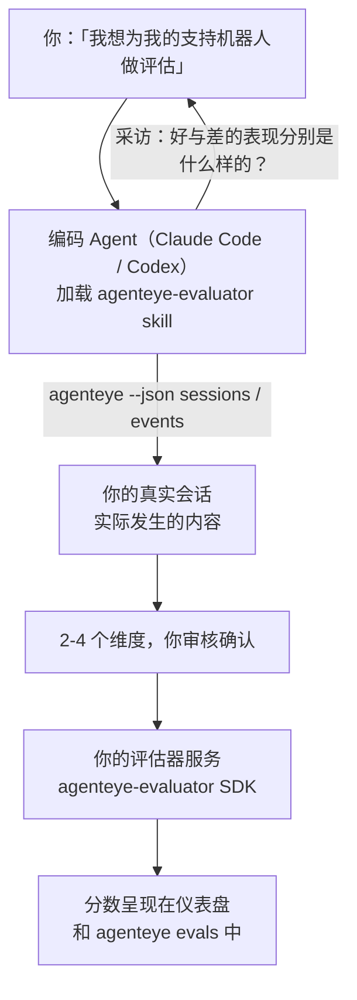

让你的编码 Agent 既负责决策又负责构建，从*「我感觉我们的 Agent 有时表现很差」*到部署一个打分服务。**Failproof AI 可观测性评估器 Skill**（`agenteye-evaluator`）是一种 *Agent Skill*：一个小型指令文件夹，可供 Claude Code 或 Codex 等编码 Agent 按需加载。它指导 Agent 找出哪些质量维度值得为*你的* Agent 追踪，然后编写、测试并部署对这些维度进行打分的[评估器服务](/zh/agenteye/evaluation-suite)。

它**不是**托管评分器、你上传内容的注册中心，也不是插件系统。你的评估器始终是运行在你自己基础设施上的 HTTP 服务，完全按照[评估套件](/zh/agenteye/evaluation-suite)指南所述。该 Skill 只是教你的 Agent 如何把它构建好——因此它所做的一切，你自己写同样的代码也完全可以实现。

---

## 难点在于决定要评分什么

SDK 接口很简单——一个装饰器和两个模型——Agent 仅凭[契约](/zh/agenteye/evaluation-suite#http-contract)就能写出来。评估器失败的根源不在这里。它们失败，是因为评错了对象；而一个评错对象的评估器比没有更糟：它产出的仪表盘让所有人都学会了忽略它。

因此，该 Skill 的大部分工作发生在任何代码存在之前。它让 Agent 对你进行采访（*「描述一次进展顺利的运行；再描述一次出问题的」*），然后通过 [`agenteye` CLI](/zh/agenteye/cli) 拉取你的真实会话并从头到尾读完。这两部分通常会产生分歧，而分歧恰恰是关键：你打算测量什么，与你的会话记录实际上能支撑什么，往往并不一致。一个维度只有在**可从事件中计算**且**具有区分度**时才能保留——如果它在你的好运行和坏运行上都打出 0.9，那它什么也说明不了，会被直接删掉。

最终输出的是一份包含 2-4 个维度及其推理依据的提案，供你在编写任何代码之前审核确认。



---

## 它与其他评估组件的关系

四份文档涵盖了打分的各个方面，它们按顺序相互衔接：

| 页面 | 内容 | 适用场景 |
|---|---|---|
| **[评估（Evaluations）](/zh/agenteye/evaluations)** | 功能介绍：会话网格上的分数、仪表盘、重新评估 | 你想了解自动打分能带来什么 |
| **[评估套件（Evaluation suite）](/zh/agenteye/evaluation-suite)** | HTTP 契约、SDK、服务器环境变量 | 你正在自己实现或调试评估器 |
| **评估器 Skill**（本文档） | 设计*并*构建评分器的自然语言入口 | 你想从「我要做评估」直接到一个运行中的服务 |
| **[CLI Skill](/zh/agenteye/cli-skill)** | `agenteye` CLI 的自然语言入口 | 你想*读取*已有的分数 |
| **[Python SDK Skill](/zh/agenteye/python-sdk-skill)** | 为你的 Agent 进行插桩的自然语言入口 | 你的 Agent 尚未产生会话数据——还没有东西可以评分 |

### 与 CLI Skill 的区别：构建 vs 读取

这两个 Skill 有意设计为互不重叠，同时安装两者是常规做法——Agent 会根据你的请求在它们之间进行选择：

- **`agenteye-evaluator`**（本文档）构建*产生*分数的东西。它的任务在分数首次落地时就完成了。
- **[`agenteye-cli`](/zh/agenteye/cli-skill)** 读取已经存在的分数（`agenteye evals`）。「这周质量有没有下降？」是它回答的问题，不是本 Skill 的。

---

## 前提条件

1. **已安装并登录 `agenteye` CLI**（`pipx install agenteye`，然后 `agenteye login`）。该 Skill 在两个环节依赖它：拉取用于设计的真实会话，以及最后确认分数是否成功落地。你的登录账号需要 `events:read` 权限，最终检查还需要 `evaluations:read`。与 CLI Skill 一样，它**无法**替你完成邮件一次性验证码的登录流程。
2. **评估器的宿主环境。** 它会被构建成镜像并作为长期运行的服务运行，因此需要一个真实的代码仓库，而非临时文件。评估器通常有自己独立的仓库，与被评分的 Agent 分开——该 Skill 会查找现有仓库，并在创建新仓库前向你确认。
3. **`agenteye-evaluator` SDK wheel**——在让 Agent 开始输入 `pip` 命令之前，请先阅读下一节。

---

## 获取方式

该 Skill 发布在 Failproof AI 的公开 Skill 集合中：

**[github.com/FailproofAI/skills](https://github.com/FailproofAI/skills)** → [`skills/agenteye-evaluator/`](https://github.com/FailproofAI/skills/tree/main/skills/agenteye-evaluator)

该仓库是公开的，Skill 本身不需要任何凭证——它只是使用*你*登录的 `agenteye` CLI 来驱动操作，并在*你的*仓库中编写代码。注意它作为独立文件夹发布，**不包含**在 `pipx install agenteye` 包中，因此不要去那里查找。

## 安装 Skill

最快捷的方式是使用 [`skills`](https://skills.sh) CLI，它会拉取文件夹并放置到 Agent 查找的位置：

```bash
# Claude Code，仅限本项目
npx skills add FailproofAI/skills --skill agenteye-evaluator -a claude-code

# 所有项目（安装到 ~/.claude/skills/）
npx skills add FailproofAI/skills --skill agenteye-evaluator -a claude-code -g --copy

# 使用 Codex 的情况
npx skills add FailproofAI/skills --skill agenteye-evaluator -a codex
```

然后像管理其他 Skill 一样管理它：

```bash
npx skills list -a claude-code           # 查看已安装的内容
npx skills update agenteye-evaluator     # 拉取最新版本
npx skills remove agenteye-evaluator     # 移除
```

想手动安装？Agent Skill 只是一个包含 `SKILL.md` 文件（以及可选引用文件）的文件夹，直接复制也可以：

- **Claude Code**：将 `agenteye-evaluator/` 文件夹放入 `~/.claude/skills/`（所有项目）或 `<你的仓库>/.claude/skills/`（仅限该仓库）。Claude Code 会自动发现它——通过 `/skills` 列表验证，或者直接要求做评估即可。
- **Codex（OpenAI）**：Codex 读取同一个 `SKILL.md`。内置的 `agents/openai.yaml` 设置了 `allow_implicit_invocation: true`，因此当任务匹配时 Codex 会自动选择该 Skill；否则可以通过 `$agenteye-evaluator` 显式调用。

---

## SDK 不在公开的 PyPI 上

> **警告：** 在让 Agent 安装 SDK 之前，请先阅读本节。

该 Skill 是公开的，但它驱动的 SDK 不是。`agenteye-evaluator` 仅作为私有发布产物提供，与 `agenteye` 不同，该名称在公开 PyPI 上**未被注册**——因此直接执行 `pip install agenteye-evaluator` 可能会将陌生人的包安装到读取你生产环境会话记录的服务中。这是供应链安全问题，不是手误打错字。

该 Skill 知晓这一点，因此会依次尝试一套安装方案，在第一个可用的选项处停下：如果你在 AgentEye 仓库内，则使用 monorepo 源码；否则使用 GitHub Releases 上的私有发布 wheel（需要访问权限）；如果两者都不可达，它会**停下来告诉你联系 Failproof AI 联系人获取 wheel**，而不是自行处置。

因此，如果你的 Agent 提议从公开 PyPI 直接执行 `pip install agenteye-evaluator`，这就说明 Skill 根本没有加载。立即停下来检查它是否已安装。

---

## 你可以向它提出什么请求

一次完整的交互从模糊的请求开始，以确认好的设计方案结束，而不是以代码结束：

```text
你    ▸ 我想为我们的支持机器人做评估。我觉得它有时候表现很差。

Agent ▸ 在我写任何东西之前：请描述一次进展顺利的运行，
        以及一次出问题的运行。

你    ▸ 好的情况：它从文档中给出答案。差的情况：它编造内容，
        或者放弃并说「请联系支持团队」。

Agent ▸ 正在执行：agenteye --json sessions --status error --since 7d
        读取 5 个会话，包括两个你认为有问题的。

        你的描述提到了事实准确性和转移问题。转录记录
        与转移问题吻合（5 个中有 2 个以转接支持结束，
        在 model_response.content 中清晰可见），但事实准确性
        需要一个你的事件中不存在的标准答案。

        因此我会评估以下三项：
          - deflection      基于规则，低成本，能区分你的两种运行
          - tool_efficiency 基于规则，能捕捉 run-004 中的重试循环
          - groundedness    LLM 裁判：每个声明是否都来自它检索到的文档？

        「事实准确性」需要我们没有的标准答案；groundedness
        是你的转录记录实际上能支撑的最接近的替代方案。
        这三个名称可以吗？之后重命名会导致历史记录断裂。

你    ▸ 可以

Agent ▸ 这个仓库中没有评估器。要在这里创建一个，还是
        你在别处有现成的？
```

从那里开始，它首先编写基于规则的维度（免费、即时、确定性），针对真实捕获的会话（包括那些会让简单评估器崩溃的空会话和未完成会话）进行测试，只在处理主观维度时才引入 LLM 裁判。它了解[调度器的限制](/zh/agenteye/evaluation-suite#configuring-the-server)——30 秒请求超时和全局 8 个并发调用——因此如果裁判无法可靠地在时限内完成，它会使用 `JobPending` 进行异步处理，而不是让你的裁判被取消后以五倍代价重试五次。

然后它进行部署，设置两个服务器环境变量，并通过 `agenteye --json evals --session-id <id>` 确认分数确实落地。分数落地是唯一的证明。

---

## 需要注意的事项

- **维度名称几乎是永久性的。** 分数键是任意字符串，平台会对你发送的任何内容进行趋势分析，这意味着下游没有任何机制能纠正一个错误的选择。之后重命名会导致历史记录断裂：旧会话保留旧键，趋势就此中断。这就是为什么 Skill 在编写代码之前要求明确签字确认——请认真对待这个提示。
- **测试夹具是真实的生产转录记录。** 针对真实会话进行设计意味着要将它们拉取到磁盘上，而其中可能包含客户数据。Skill 在将它们提交到 git 之前会询问你；如有疑虑，请将 `fixtures/` 排除在仓库之外，让每位开发者自行拉取。
- **Agent 编写并部署一个读取所有转录记录的服务。** 它以你的身份行事，受你的 CLI 登录权限约束，但请像对待任何接触生产数据的代码一样审查评估器。

---

## 后续步骤

- **[评估套件（Evaluation suite）](/zh/agenteye/evaluation-suite)**：HTTP 契约、SDK 以及 Skill 所配置的服务器环境变量。
- **[评估（Evaluations）](/zh/agenteye/evaluations)**：分数落地后的呈现位置。
- **[CLI Skill](/zh/agenteye/cli-skill)**：姊妹 Skill，用于读取结果而非构建评分器。
- **[CLI](/zh/agenteye/cli)**：Skill 设计所依赖的会话数据背后的命令参考。