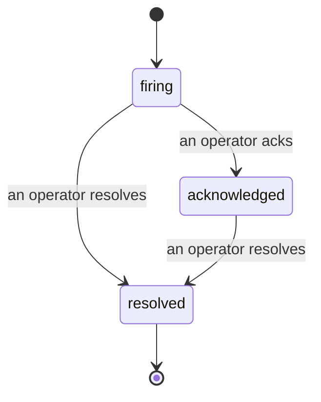

告警触发后，第一个问题永远是"谁在处理？"事件功能给出了答案：一旦出现违规，所有人都能立即看到事件已开启、由谁负责，以及目前发生了什么——并留有清晰的归属记录，可直接用于事后复盘。

*收件箱按状态对未解决事件进行分组，并支持按严重性和负责人筛选，让你第一时间看到需要人工介入的内容。*

## 一眼看清谁在处理

不再需要在聊天群里问"有人在看吗？"违规发生时，系统会自动创建事件并将其投入共享收件箱，按状态分组显示。认领事件后，你的名字就会出现在上面，团队其他成员就知道有人在跟进了。认领是共享的：多位操作者可以同时认领同一事件，每次认领都会独立记录，这样整个作战室的成员都能按名字显示，互不干扰。为事件指定一名负责人进行分诊，并按严重性或负责人筛选收件箱，快速锁定属于你的内容。

## 完整经过，尽在一条时间线

事件结束后，复盘材料已经准备好了。打开任意事件，你会看到违规证据、负责人与订阅者列表、用于协调沟通的评论区，以及一条只可追加的活动时间线。

*所有发生的事情，按时间顺序排列，每一行都标注了操作者。*

每个操作（已开启、已认领、已解决等）都会写入该时间线，且永不删改。每条记录都有归属：人工操作的归属到对应操作者的邮箱，Failproof AI Observability 自动执行的操作（例如在违规时自动开启事件）则归属为 **automated**。没有匿名，没有遗漏，事后复盘几乎可以自动完成。

## 事件的流转方式

- **开启中（firing）：** 违规触发事件并向你的渠道发送一次通知。后续重复违规会合并到同一事件中并更新其证据，而不会反复发送通知。
- **已认领（acknowledged）：** 操作者接手处理。事件保持开启状态，后续违规会静默更新证据。
- **已解决（resolved）：** 操作者将其关闭。条件恢复后自动解决的功能尚在规划中，暂未启用，因此事件会一直保持开启，直到有人主动解决——这确保了大家对真正已恢复的情况保持诚实。同一告警后续可以重新开启新的事件。

同一告警同时最多只能有一个开启状态的事件，因此反复抖动的规则不会让你淹没在重复事件中。你也可以手动创建事件：可以是与任何告警无关的独立事件（用于告警未捕获的情况），也可以关联到现有告警，前提是你拥有 `incidents:write` 权限。

## 在哪里找到它

事件功能位于 `/<org-slug>/incidents`。查看需要 **`incidents:read`** 权限；手动创建事件需要 **`incidents:write`** 权限；认领、分配、评论和解决需要 **`incidents:ack`** 权限。已授予已停用的 `alerts:ack` 的旧密钥仍然有效，因为系统会将其识别为 `incidents:ack`，无需重新为值班轮换重新颁发密钥。

## 相关内容

- [告警](/zh/agenteye/alerts)：在阈值触发时开启事件的规则。
- [错误追踪](/zh/agenteye/error-tracking)：在一处查看所有故障，并将其中一个提升为告警。
- [审计](/zh/agenteye/audits)：定期运行的分析工具，用于发现没有规则在监控的故障。